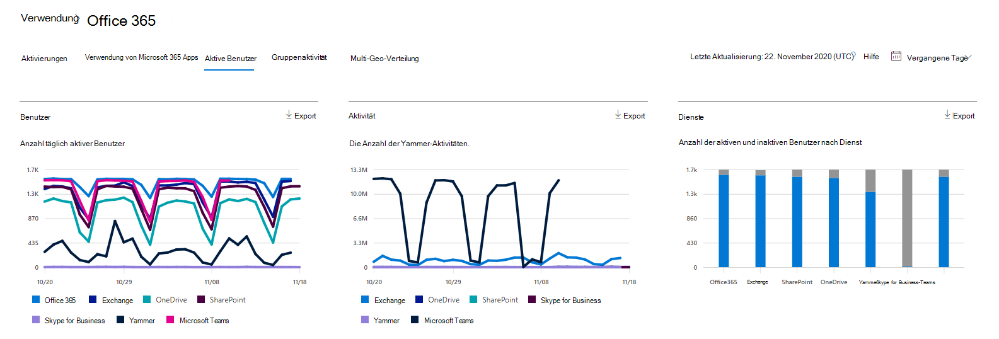

# Bewerten des Berichts Microsoft 365 aktive BenutzerAssess the Microsoft 365 Active Users report

Das Dashboard Microsoft 365 **Berichte** zeigt Ihnen die Aktivitätsübersicht für alle Produkte in Ihrer Organisation.The Microsoft 365 **Reports** dashboard shows you the activity overview across the products in your organization. Sie können Drilldowns zu Einzelberichten auf Produktebene ausführen und auf diese Weise genauere Einblicke in die Aktivitäten innerhalb der einzelnen Produkte erhalten.It enables you to drill in to individual product level reports to give you more granular insight about the activities within each product. Sehen Sie sich die [Übersicht über Berichte](activity-reports.md) an.Check out [the Reports overview topic](activity-reports.md).
  
Sie können beispielsweise den Bericht **Aktive Benutzer** verwenden, um herauszufinden, wie viele Produktlizenzen von einzelnen Personen in Ihrem Unternehmen verwendet werden, und einen Drilldown zu Informationen darüber ausführen, welche Produkte von den jeweiligen Benutzern verwendet werden. Dieser Bericht kann Administratoren beim Ermitteln von unzureichend genutzten Produkten oder nicht ausgelasteten Benutzern helfen, die möglicherweise zusätzliche Schulungen oder Informationen benötigen.For example, you can use the **Active Users** report to find out how many product licenses are being used by individuals in your organization, and drill down for information about which users are using what products. This report can help administrators identify underutilized products or users that might need additional training or information. 
  
> [!NOTE]
> Sie müssen ein globaler Administrator, globaler Leser oder Berichtsleser in Microsoft 365 oder Exchange, SharePoint, Teams Dienst, Teams Kommunikation oder Skype for Business Administrator sein, um Berichte anzeigen zu können.You must be a global administrator, global reader or reports reader in Microsoft 365 or an Exchange, SharePoint, Teams Service, Teams Communications, or Skype for Business administrator to see reports.  

## Informationen zum Abrufen des Berichts für aktive BenutzerHow to get to the Active Users report

1. Wechseln Sie im Admin Center zur Seite **Berichte** \> <a href="https://go.microsoft.com/fwlink/p/?linkid=2074756" target="_blank">Verwendung</a>.In the admin center, go to the **Reports** \> <a href="https://go.microsoft.com/fwlink/p/?linkid=2074756" target="_blank">Usage</a> page. 
2. Klicken Sie auf der Dashboard-Startseite auf die Schaltfläche **"Weitere Anzeigen"** auf der Karte "Aktive Benutzer – Microsoft 365 Dienste".From the dashboard homepage, click on the **View more** button on the Active users - Microsoft 365 Services card.

## Interpretieren des Berichts für aktive BenutzerInterpret the Active Users report

Sie können aktive Benutzer im bericht Office 365 anzeigen, indem Sie die Registerkarte **"Aktive Benutzer"** auswählen.You can view active users in the Office 365 report by choosing the **Active users** tab. 

- Im Bericht Aktive Benutzer werden die Trends über die letzten 7 Tage, 30 Tage, 90 Tage oder 180 Tage angezeigt.The Active Users report can be viewed for trends over the last 7 days, 30 days, 90 days, or 180 days. Wenn Sie im Bericht jedoch einen bestimmten Tag anzeigen, werden in der Tabelle (7) Daten für bis zu 28 Tage ab dem aktuellen Datum angezeigt (nicht ab dem Datum, an dem der Bericht generiert wurde).However, if you view a particular day in the report, the table (7) will show data for up to 28 days from the current date (not the date the report was generated).

- Die Daten in den einzelnen Berichten decken in der Regel die letzten 24 bis 48 Stunden ab.The data in each report usually covers up to the last 24 to 48 hours.

- Im Diagramm "Benutzer" werden täglich aktive Benutzer im Berichtszeitraum nach Produkt getrennt angezeigt.The Users chart shows you daily active users in the reporting period separated by product.
Das Diagramm "Aktivität" zeigt die Anzahl der täglichen Aktivitäten im Berichtszeitraum nach Produkt getrennt an.The Activity chart shows you daily activity count in the reporting period separated by product.
Das Diagramm Dienste zeigt Ihnen die Anzahl der Benutzer nach Aktivitätstyp und Dienst an.The Services chart shows you count of users by activity type and Service.

- Im Diagramm Benutzer zeigt die X-Achse den ausgewählten Berichtszeitraum und auf der Y-Achse werden die täglich aktiven Benutzer getrennt und nach Lizenztyp codiert angezeigt.On the Users chart, the x axis shows the selected reporting time period and the y axis displays the daily active users separated and color coded by license type.
Im Diagramm Aktivität zeigt die X-Achse den ausgewählten Berichtszeitraum an, und auf der y-Achse wird die Anzahl der täglichen Aktivitäten getrennt und die Farbe nach Lizenztyp codiert angezeigt.On the Activity chart, the x axis shows the selected reporting time period and the y axis displays the daily activity count separated and color coded by license type.
Im Aktivitätsdiagramm Dienste zeigt die X-Achse die einzelnen Dienste an, für die Ihre Benutzer im festgelegten Zeitraum aktiviert sind, während die Y-Achse die Anzahl der Benutzer nach farblich gekennzeichnetem Aktivitätsstatus angibt.On the Services activity chart, the X axis displays the individual services your users are enabled for in the given time period and the Y axis is the Count of users by activity status, color coded by activity status.

- Sie können die im Diagramm angezeigte Datenreihe filtern, indem Sie in der Legende ein Element auswählen.You can filter the series you see on the chart by selecting an item in the legend. Durch das Ändern dieser Auswahl werden die Informationen in der Gitternetztabelle nicht geändert.Changing this selection doesn't change the info in the grid table.

- Sie können die Berichtsdaten auch in eine Excel .csv Datei exportieren, indem Sie den Link "Exportieren" auswählen.You can also export the report data into an Excel .csv file, by selecting the Export link. Dadurch werden Daten aller Benutzer exportiert, und Sie können einfache Sortier- und Filtervorgänge zur weiteren Analyse ausführen.This exports data of all users and enables you to do simple sorting and filtering for further analysis. Bei weniger als 2.000 Benutzern können Sie innerhalb der Tabelle im Bericht selbst sortieren und filtern.If you have less than 2000 users, you can sort and filter within the table in the report itself. Bei mehr als 2.000 Benutzern müssen Sie die Daten zum Filtern und Sortieren exportieren.If you have more than 2000 users, in order to filter and sort, you will need to export the data.

- Mithilfe von Spaltensteuerelementen können Sie ändern, welche Informationen im Raster angezeigt werden.You can change what information is displayed in the grid table with column controls.
Wenn Ihr Abonnement von 21Vianet betrieben wird, wird Yammer nicht angezeigt.If your subscription is operated by 21Vianet, then you will not see Yammer.

Wenn die Richtlinien Ihrer Organisation eine Anzeige von Berichten verhindern, in denen Benutzerinformationen identifizierbar sind, können Sie die Datenschutzeinstellung für alle diese Berichte ändern.If your organization's policies prevents you from viewing reports where user information is identifiable, you can change the privacy setting for all these reports. Lesen Sie den Abschnitt **Ausblenden von Details auf Benutzerebene** in [Aktivitätsberichte im Microsoft 365 Admin Center](activity-reports.md).Check out the **How do I hide user level details?** section in [Activity Reports in the Microsoft 365 admin center](activity-reports.md).  
