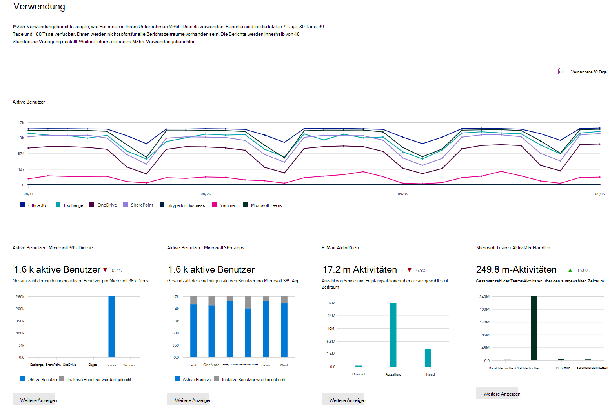
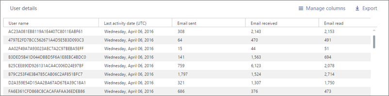

# Microsoft 365-Berichte im Admin Center

Sie können ganz einfach sehen, wie Personen in Ihrem Unternehmen die Microsoft 365-Dienste nutzen. So können Sie beispielsweise erkennen, wer einen Dienst häufig nutzt und die Kontingente ausschöpft, oder wer möglicherweise gar keine Microsoft 365-Lizenz benötigt.
  
Berichte sind für die letzten 7 Tage, 30 Tage, 90 Tage und 180 Tage verfügbar.  Es stehen nicht sofort Daten für alle Berichtszeiträume zur Verfügung. Die Berichte sind erst nach 48 Stunden verfügbar.
  
Sehen Sie sich dieses Video an, um eine Übersicht darüber zu erhalten, wie Sie die Berichte verwenden können:
  
> [!VIDEO https://www.microsoft.com/videoplayer/embed/fb726f8e-aead-43b2-ba0f-53ba5b886bf7?autoplay=false]
  
## Abrufen des Dashboards "Berichte"

::: moniker range="o365-worldwide"

1. Wechseln Sie im Admin Center zur Seite **Berichte** \> <a href="https://go.microsoft.com/fwlink/p/?linkid=2074756" target="_blank">Verwendung</a>.

::: moniker-end

::: moniker range="o365-germany"

1. Wechseln Sie im <a href="https://go.microsoft.com/fwlink/p/?linkid=848041" target="_blank">Admin Center</a> zur Seite **Berichte** \> **Verwendung**.

::: moniker-end

::: moniker range="o365-21vianet"

1. Wechseln Sie im <a href="https://go.microsoft.com/fwlink/p/?linkid=850627" target="_blank">Admin Center</a> zur Seite **Berichte** \> **Verwendung**.

::: moniker-end

2. Klicken Sie auf die Schaltfläche **Mehr anzeigen** auf der Aktivitätskarte "Auf-einen-Blick" für einen Dienst (z. B. E-Mail oder OneDrive), um die Berichtsdetailseite anzuzeigen. Dort werden verschiedene Berichte für den Dienst auf Registerkarten bereitgestellt.   

## Wer kann Berichte sehen

Personen, die über die folgenden Berechtigungen verfügen: 
  
- Globale Administratoren: Es wird empfohlen, diese Rolle nur ausgewählten Personen im Unternehmen zuzuweisen. Dadurch wird das Sicherheitsrisiko reduziert.
    
- Exchange-Administratoren
    
- SharePoint-Administratoren
    
- Skype for Business-Administratoren

- Globaler Leser
    
- Berichtleseberechtigter

- Teams-Dienstadministrator

- Teams-Kommunikationsadministrator
    
Weitere Informationen finden Sie unter [Informationen zu Administratorrollen](../add-users/about-admin-roles.md) und [Zuweisen von Administratorrollen](../add-users/assign-admin-roles.md).
  
## Aktivitätsberichte, die im Admin Center zur Verfügung stehen

Je nach Abonnement stehen die folgenden Berichte zur Verfügung.

- [Microsoft-Browserverwendung](browser-usage-report.md) 
  
- [E-Mail-Aktivitäten](email-activity-ww.md)

- [E-Mail-Aktivität für US-Regierungsbehörden](email-activity.md)
    
- [Postfachnutzung](mailbox-usage.md)
    
- [Office-Aktivierungen](microsoft-office-activations-ww.md)

- [Office-Aktivierungen für US-Regierungsbehörden](microsoft-office-activations.md)

- [Aktive Benutzer](active-users-ww.md)

- [Aktive Benutzer für US-Regierungsbehörden](active-users.md)
  
- [Nutzung der E-Mail-Apps](email-apps-usage-ww.md)

- [Verwendung von E-Mail-Apps für US-Regierungsbehörden](email-apps-usage.md)

- [Forms-Aktivitäten](forms-activity-ww.md)

- [Forms-Aktivität für die US-Regierung](forms-activity.md)

- [Dynamics 365 Customer Voice-Aktivität](forms-pro-activity-ww.md)
  
- [Dynamics 365 Customer Voice-Aktivität für die US-Regierung](forms-pro-activity.md)

- [Microsoft 365-Gruppen](office-365-groups-ww.md)

- [Microsoft 365-Gruppen für US-Regierungsbehörden](office-365-groups.md)
  
- [OneDrive for Business-Benutzeraktivität](onedrive-for-business-activity-ww.md)

- [OneDrive for Business-Benutzeraktivitäten für US-Regierungsbehörden](onedrive-for-business-activity.md)

- [Nutzung von OneDrive for Business](onedrive-for-business-usage-ww.md)

- [Nutzung von OneDrive for Business für US-Regierungsbehörden](onedrive-for-business-usage.md)

- [Verwendung von Microsoft 365 Apps](microsoft365-apps-usage-ww.md)
  
- [Nutzung der SharePoint-Website](sharepoint-site-usage-ww.md)

- [SharePoint-Websitenutzung für US-Regierungsbehörden](sharepoint-site-usage.md)
  
- [SharePoint-Aktivität](sharepoint-activity-ww.md)

- [SharePoint-Aktivitäten für US-Regierungsbehörden](sharepoint-activity.md)
  
- [Skype for Business Online-Aktivitäten](https://docs.microsoft.com/SkypeForBusiness/skype-for-business-online-reporting/activity-report)
  
- [Skype for Business Online – Aktivitäten zum Organisieren von Konferenzen](https://docs.microsoft.com/SkypeForBusiness/skype-for-business-online-reporting/conference-organizer-activity-report)
  
- [Skype for Business Online – Aktivitäten von Konferenzteilnehmern](https://docs.microsoft.com/SkypeForBusiness/skype-for-business-online-reporting/conference-participant-activity-report)
  
- [Skype for Business Online – Peer-to Peer-Aktivitäten](https://docs.microsoft.com/SkypeForBusiness/skype-for-business-online-reporting/peer-to-peer-activity-report)
  
::: moniker range="o365-worldwide"

- [Yammer-Aktivitäten](yammer-activity-report-ww.md)

::: moniker-end

::: moniker range="o365-worldwide"

- [Yammer-Aktivitäten für US Government](yammer-activity-report.md)

::: moniker-end

::: moniker range="o365-worldwide"

- [Yammer-Gerätenutzung](yammer-device-usage-report-ww.md)

::: moniker-end

::: moniker range="o365-worldwide"

- [Yammer-Gerätenutzung für US Government](yammer-device-usage-report.md)

::: moniker-end

::: moniker range="o365-worldwide"

- [Yammer-Gruppenaktivitätsbericht](yammer-groups-activity-report-ww.md)

::: moniker-end

::: moniker range="o365-worldwide"

- [Yammer-Gruppenaktivitätsbericht für US Government](yammer-groups-activity-report.md)

::: moniker-end

::: moniker range="o365-worldwide"

- [Microsoft Teams-Benutzeraktivität](microsoft-teams-user-activity-preview.md)

::: moniker-end

::: moniker range="o365-worldwide"

- [Microsoft Teams-Benutzeraktivität für "US Government"](microsoft-teams-user-activity.md)

::: moniker-end

::: moniker range="o365-worldwide"

- [Microsoft Teams-Gerätenutzung](microsoft-teams-device-usage-preview.md)

::: moniker-end

::: moniker range="o365-worldwide"

- [Microsoft Teams-Geräteverwendung für "US Government"](microsoft-teams-device-usage.md)

::: moniker-end

## Anzeigen von Lizenzierungsinformationen

- Wenn Sie anzeigen möchten, wie viele Lizenzen zugewiesen und wie viele noch nicht zugewiesen wurden, wechseln Sie im Admin Center zur Seite **Abrechnung** \> <a href="https://go.microsoft.com/fwlink/p/?linkid=842264" target="_blank">Lizenzen</a>. 
    
- Wenn Sie anzeigen möchten, wer über eine Lizenz verfügt, wer nicht über eine Lizenz verfügt oder wer Gast ist, wechseln Sie im Admin Center zu **Benutzer** \> <a href="https://go.microsoft.com/fwlink/p/?linkid=834822" target="_blank">Aktive Benutzer</a>. 
  
## Anzeigen von Verwendungsinformationen für einen bestimmten Benutzer

Verwenden Sie die Dienstberichte, um zu untersuchen, wie häufig ein bestimmter Benutzer den Dienst nutzt. Wenn Sie beispielsweise herausfinden möchten, wie viel Postfachspeicher ein bestimmter Benutzer in Anspruch genommen hat, öffnen Sie den Bericht "Postfachspeichernutzung", und sortieren Sie die Benutzer nach Name. Wenn Sie mehrere tausend Benutzer verwalten müssen, exportieren Sie den Bericht nach Excel, damit Sie die Liste schnell filtern können.
  
Sie können keinen Bericht generieren, indem Sie ein Benutzerkonto eingeben und dann eine Liste dazu anzeigen, welche Dienste wie häufig genutzt werden.

Unter gewissen Umständen scheinen neue Benutzer als **unbekannt** auf. Ursache dafür sind in der Regel gelegentlich auftretende Verzögerungen bei der Erstellung von Benutzerprofilen.  
  
## Ausblenden von Benutzerdetails in den Berichten

Wenn Sie beim Generieren von Berichten Benutzerinformationen ausblenden möchten, können Sie diese Änderung im Admin Center schnell vornehmen.
  
1. Wechseln Sie im Admin Center zur Seite **Einstellungen** \> <a href="https://go.microsoft.com/fwlink/p/?linkid=2053743" target="_blank">Dienste &amp; Add-Ins</a>.

2. Wählen Sie **Berichte** aus. 
  
3. Wählen Sie im Bereich **Berichte** die gewünschten Optionen aus, und speichern Sie die Änderungen.
  
Die Benutzerliste sieht wie folgt aus:
  

  
Es dauert ein paar Minuten, bis diese Änderungen für die Berichte im Dashboard wirksam werden. Diese Einstellung gilt auch für die Berichte-API.
  
## Was geschieht mit Nutzungsdaten, wenn ein Benutzerkonto geschlossen wird?

Immer dann, wenn das Konto eines Benutzers geschlossen wird, löscht Microsoft die Nutzungsdaten des Benutzers innerhalb von 30 Tagen. Dieser Benutzer wird für seinen aktiven Zeitraum weiterhin in die Gesamtsummen des Aktivitätsdiagramms einbezogen (siehe Zahl 1), wird aber nicht in der Tabelle mit den Benutzerdetails angezeigt (siehe Zahl 2).
  
Wenn Sie jedoch einen bestimmten Tag auswählen (siehe Nummer 3), wird in dem Bericht bis zu 28 Tage ab dem aktuellen Datum die Verwendung des Benutzers für diesen Tag in der Tabelle mit den Benutzerdetails angezeigt (siehe Zahl 2).
  
## Verwandte Artikel

[Berichte im Security &amp; Compliance Center](https://docs.microsoft.com/microsoft-365/compliance/reports-in-security-and-compliance)
  
