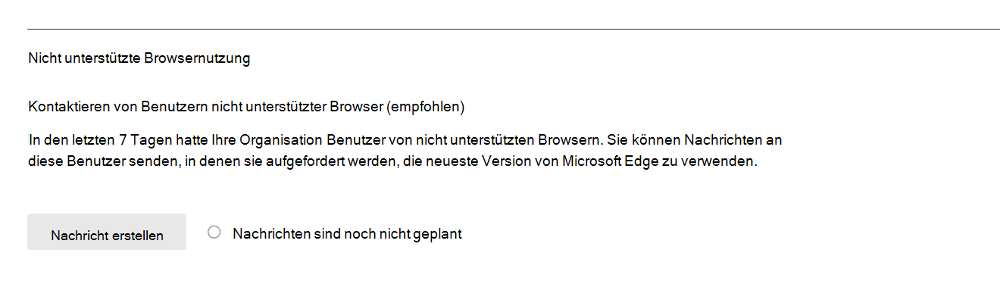

# Microsoft 365 Berichte im Admin Center – Microsoft-BrowsernutzungMicrosoft 365 Reports in the admin center - Microsoft browser usage

Das Dashboard Microsoft 365 **Berichte** zeigt Ihnen eine Aktivitätsübersicht über alle Produkte in Ihrer Organisation.The Microsoft 365 **Reports** dashboard shows you an activity overview across the products in your organization. Sie können einen Drilldown in einzelne Berichte auf Produktebene ausführen, um Ihnen detailliertere Einblicke in die Aktivitäten in den einzelnen Produkten zu geben.It enables you to drill into individual product level reports to give you more granular insight about the activities within each product. Sehen Sie sich die [Übersicht über Berichte](activity-reports.md) an.Check out [the Reports overview topic](activity-reports.md). Im Microsoft-Browsernutzungsbericht erhalten Sie Einblicke in Internet Explorer, Vorgängerversion von Microsoft Edge und neue Microsoft Edge Nutzung.In the Microsoft browser usage report, you can gain insights on Internet Explorer, Microsoft Edge Legacy, and new Microsoft Edge usage. Die Nutzungsberichterstellung basiert auf Microsoft 365 Onlinediensten, auf die mithilfe eines Microsoft-Browsers zugegriffen wird.Usage reporting is based on Microsoft 365 online services accessed by using a Microsoft browser.

 > [!NOTE]
 > Sie müssen ein globaler Administrator, globaler Leser oder Berichtsleser in Microsoft 365 oder ein Exchange-, SharePoint- oder Skype for Business-Administrator sein, um Berichte anzeigen zu können.You must be a global administrator, global reader or reports reader in Microsoft 365 or an Exchange, SharePoint, or Skype for Business administrator to see reports.

## So gelangen Sie zum Microsoft Browser-NutzungsberichtHow to get to the Microsoft browser usage report

1. Wechseln Sie im Admin Center zur Seite **Berichte** \> <a href="https://go.microsoft.com/fwlink/p/?linkid=2074756" target="_blank">Verwendung</a>.In the admin center, go to the **Reports** \> <a href="https://go.microsoft.com/fwlink/p/?linkid=2074756" target="_blank">Usage</a> page. 
2. Klicken Sie auf der Dashboard-Startseite auf die Schaltfläche **"Weitere Anzeigen"** auf der Microsoft Browser-Nutzungskarte.From the dashboard homepage, click on the **View more** button on the Microsoft browser usage card.

## So benachrichtigen Sie Benutzer, ihren Browser zu aktualisierenHow to notify users to upgrade their browser

Globale Administratoren können sich für das Senden von Nachrichten an Benutzer anmelden, die Microsoft 365 Dienste in Edge Legacy (nicht unterstützt) und Internet Explorer (bald nicht unterstützt) verwenden.Global admins can opt-in to sending messages to users using Microsoft 365 services on Edge Legacy (unsupported) and Internet Explorer (soon to be unsupported). Diese Zielnachricht benachrichtigt Benutzer, dass die Unterstützung für diese Browser bald beendet wird, und sie enthält Links zu einem Supportartikel mit Informationen zu Microsoft Edge und einfachen Schritten zum Wechseln von Browsern.This targeted message notifies users that support for these browsers will end soon, and it links to a support article with information on Microsoft Edge and simple steps to follow to switch browsers. 

Dieses Feature finden Sie auf der Berichtsseite.You can find this feature on the report page. Nachdem die Nachricht erstellt wurde, werden die Benutzer mit der bis zum 17. August 2021 angegebenen Häufigkeit benachrichtigt.Once the message is created, users are notified at the frequency specified until August 17, 2021. Sie können dieses Feature jederzeit deaktivieren, um das Senden von Benachrichtigungen an Benutzer zu beenden.You can turn off this feature at any time to stop sending notifications to users. Um erneut mit dem Senden von Benachrichtigungen zu beginnen, aktivieren Sie das Feature wieder.To begin sending notifications again, turn the feature back on.

Weitere Informationen finden Sie unter [Microsoft Edge Hilfe & Lernens.](https://support.microsoft.com/microsoft-edge)For more information, see [Microsoft Edge help & learning](https://support.microsoft.com/microsoft-edge).

## Interpretieren des Microsoft-BrowsernutzungsberichtsInterpret the Microsoft browser usage report

|ElementItem|BeschreibungDescription|
 |:-----|:-----|
 |1.1.   |Der **Microsoft-Browsernutzungsbericht** kann für Trends der letzten 7 Tage, 30 Tage, 90 Tage oder 180 Tage angezeigt werden.The **Microsoft browser usage** report can be viewed for trends over the last 7 days, 30 days, 90 days, or 180 days.    |
 |2.2.   |Die Daten in den einzelnen Berichten umfassen in der Regel bis zu den letzten sieben Tagen.The data in each report usually covers up to the last seven days.   |
 |3.3.   |Im Diagramm **Täglich aktive** Benutzer wird die anzahl der täglichen Benutzer für Microsoft Edge, Vorgängerversion von Microsoft Edge und Internet Explorer angezeigt, wenn sie für den Zugriff auf Microsoft 365 Dienste verwendet wird.The **Daily active users** chart shows you the daily user count for Microsoft Edge, Microsoft Edge Legacy and Internet Explorer when used to access to Microsoft 365 services.   |
 |4.4. |Das Diagramm **"Aktive Benutzer"** zeigt die Gesamtanzahl der Benutzer an, die Microsoft Edge, Vorgängerversion von Microsoft Edge und Internet Explorer verwenden, wenn sie für den Zugriff auf Microsoft 365 Dienste über den ausgewählten Zeitraum verwendet werden.The **Active Users** chart shows you the total number of users using Microsoft Edge, Microsoft Edge Legacy and Internet Explorer when used to access to Microsoft 365 services over the selected time period. |
 |5.5. |Die Tabelle zeigt eine Auflistung der Daten nach Benutzerebene. Sie können Spalten zur Tabelle hinzufügen oder aus der Tabelle entfernen.  The table shows you a breakdown of data at the per-user level. You can add or remove columns from the table.   **Der Benutzername** ist die E-Mail-Adresse des Benutzers, der über Microsoft-Browser mit Microsoft 365 Diensten verbunden ist.**Username** is the email address of the user who connected to Microsoft 365 services using Microsoft browsers.  **Wird Microsoft Edge verwendet,** wird ein Teilstrich angezeigt, wenn der Benutzer Microsoft Edge zum Herstellen einer Verbindung mit Microsoft 365 Diensten verwendet hat.**Used Microsoft Edge** shows a tick mark if the user used Microsoft Edge to connect to Microsoft 365 services.  **Wird Vorgängerversion von Microsoft Edge verwendet,** wird eine Teilstrichmarkierung angezeigt, wenn der Benutzer Vorgängerversion von Microsoft Edge zum Herstellen einer Verbindung mit Microsoft 365 Diensten verwendet hat.**Used Microsoft Edge Legacy** shows a tick mark if the user used Microsoft Edge Legacy to connect to Microsoft 365 services.  **Der verwendete Internet Explorer** zeigt eine Teilstrichmarkierung an, wenn der Benutzer Internet Explorer zum Herstellen einer Verbindung mit Microsoft 365 Diensten verwendet hat.**Used Internet Explorer** shows a tick mark if the user used Internet Explorer to connect to Microsoft 365 services. |
 |6.6. |Wählen Sie das Symbol **"Spalten auswählen"** aus, um Dem Bericht Spalten hinzuzufügen oder daraus zu entfernen.Select the **Choose columns** icon to add or remove columns from the report.|
 |7.7. |Sie können die Berichtsdaten auch im CSV-Format in eine Excel-Datei exportieren, indem Sie den Link **Exportieren** auswählen.You can also export the report data into an Excel .csv file by selecting the **Export** link. Dadurch werden Daten für alle Benutzer exportiert, und Sie können einfache Aggregations-, Sortier- und Filtervorgänge zur weiteren Analyse durchführen.This exports data for all users and enables you to do simple aggregation, sorting, and filtering for further analysis. Wenn Sie weniger als 100 Benutzer haben, können Sie innerhalb der Tabelle im Bericht selbst sortieren und filtern.If you have less than 100 users, you can sort and filter within the table in the report itself. Wenn Sie mehr als 100 Benutzer haben, müssen Sie zum Filtern und Sortieren die Daten exportieren.If you have more than 100 users, in order to filter and sort, you will need to export the data.|
