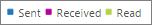

# Microsoft 365-Berichte im Admin Center-e-Mail-Aktivität

Im Microsoft 365 **Reports** -Dashboard wird die Aktivitätsübersicht für die Produkte in Ihrer Organisation angezeigt. Sie können Drilldowns zu Einzelberichten auf Produktebene ausführen und auf diese Weise genauere Einblicke in die Aktivitäten innerhalb der einzelnen Produkte erhalten. Sehen Sie sich die [Übersicht über Berichte](activity-reports.md) an.
  
Sie können beispielsweise eine allgemeine Übersicht über den E-Mail-Verkehr innerhalb Ihrer Organisation auf der Seite "Berichte" abrufen und dann einen Drilldown in das Widget für E-Mail-Aktivität ausführen, um die Trends und die Details auf Ebene der einzelnen Benutzer für die E-Mail-Aktivität in Ihrer Organisation zu verstehen.
  
> [!NOTE]
> Sie müssen ein globaler Administrator, ein globaler Leser oder ein berichtsleser in Microsoft 365 oder ein Exchange-, SharePoint-oder Skype for Business-Administrator sein, um Berichte anzuzeigen. 

## Aufrufen des E-Mail-Aktivitätsberichts

1. Wechseln Sie im Admin Center zur Seite **Berichte** \> <a href="https://go.microsoft.com/fwlink/p/?linkid=2074756" target="_blank">Verwendung</a>.

    
2. Wählen Sie in der Dropdownliste **Bericht auswählen** die Option **Exchange** \> **-e-Mail-Aktivität**aus.
  
## Interpretieren des E-Mail-Aktivitätsberichts

Sie erhalten einen Einblick in die E-Mail-Aktivitäten Ihrer Benutzer, indem Sie sich die Diagramme **Aktivität** und **Benutzer** ansehen. 
  

  
|||
|:-----|:-----|
|1.    |Im Bericht **E-Mail-Aktivität** werden die Trends über die letzten 7 Tage, 30 Tage, 90 Tage oder 180 Tage angezeigt. Wenn Sie im Bericht jedoch einen bestimmten Tag auswählen, werden in der Tabelle (7) Daten für bis zu 28 Tage ab dem aktuellen Datum angezeigt (nicht ab dem Datum, an dem der Bericht generiert wurde).    |
|2.    |Die Daten in den einzelnen Berichten decken in der Regel die letzten 24 bis 48 Stunden ab.    |
|3.    |Anhand des Diagramms **Aktivität** können Sie den Trend in Hinsicht auf die Menge von E-Mail-Aktivitäten in Ihrer Organisation erkennen. Sie können die Aufteilung von Aktivitäten zum Senden, Lesen oder Empfangen von E-Mails erkennen.    |
|4.    |Anhand des Diagramms **Benutzer** können Sie den Trend in Hinsicht auf die Anzahl eindeutiger Benutzer erkennen, die die E-Mail-Aktivitäten generieren. Sie können den Trend bei Benutzern sehen, die Aktivitäten zum Senden, Lesen oder Empfangen von E-Mails ausführen.    |
|5.    | Im Diagramm **Aktivität** bezeichnet die Y-Achse die Anzahl der Aktivität vom Typ "E-Mail gesendet", "E-Mail empfangen" und "E-Mail gelesen".     Im Diagramm **Benutzer** bezeichnet die Y-Achse die Benutzer, die eine Aktivität vom Typ "E-Mail gesendet", "E-Mail empfangen" und "E-Mail gelesen" ausführen.     Die X-Achse bezeichnet in beiden Diagrammen den ausgewählten Zeitraum für diesen bestimmten Bericht.    |
|6.    |Sie können die im Diagramm angezeigte Datenreihe filtern, indem Sie in der Legende ein Element auswählen. Wählen Sie beispielsweise im **Aktivitäts** Diagramm die Option **gesendet**, **empfangen**oder **Lesen**  Daten aus, um nur die zugehörigen Informationen anzuzeigen. Durch das Ändern dieser Auswahl werden die Informationen in der Gitternetztabelle nicht geändert.    |
|7.    | Die Tabelle zeigt eine Aufschlüsselung der E-Mail-Aktivitäten auf Ebene der einzelnen Benutzer. Hier werden alle Benutzer gezeigt, denen ein Exchange-Produkt zugewiesen ist, sowie deren E-Mail-Aktivitäten.     **Benutzername** ist die E-Mail-Adresse des Benutzers.    **Anzeigename** ist der vollständige Name, wenn der Benutzer.    **Gelöscht** bezieht sich auf den Benutzer, dessen aktueller Status gelöscht ist, der aber während eines Teils des Berichtszeitraums aktiv war.    **Gelöscht am** ist das Datum, an dem der Benutzer gelöscht wurde.    **Letzte Aktivität** bezieht sich auf das Datum, an dem der Benutzer zuletzt eine E-Mail-Aktivität vom Typ Lesen oder Senden ausgeführt hat.    **Sendeaktionen** gibt an, wie oft eine E-Mail-Sendeaktion für den Benutzer erfasst wurde.    **Empfangsaktionen** gibt an, wie oft eine E-Mail-Empfangsaktion für den Benutzer erfasst wurde.    **Leseaktionen** gibt an, wie oft eine E-Mail-Leseaktion für den Benutzer erfasst wurde.    **Zugewiesenes Produkt** bezeichnet die Produkte, die diesem Benutzer zugewiesen sind.     Wenn die Richtlinien Ihrer Organisation eine Anzeige von Berichten verhindern, in denen Benutzerinformationen identifizierbar sind, können Sie die Datenschutzeinstellung für alle diese Berichte ändern. Lesen Sie den Abschnitt zum **Ausblenden von Details auf Benutzerebene** in den [Aktivitätsberichten im Microsoft 365 Admin Center](activity-reports.md).    |
|8.    |Sie können die Berichtsdaten auch in eine Excel. CSV-Datei exportieren, indem Sie ****  Schaltfläche Exportieren auswählen. Dadurch werden Daten aller Benutzer exportiert, und Sie können einfache Sortier- und Filtervorgänge zur weiteren Analyse ausführen. Bei weniger als 2.000 Benutzern können Sie innerhalb der Tabelle im Bericht selbst sortieren und filtern. Bei mehr als 2.000 Benutzern müssen Sie die Daten zum Filtern und Sortieren exportieren.    |
|||
   
Hinweis: der Bericht über e-Mail-Aktivitäten steht nur für Postfächer zur Verfügung, die Benutzern mit Lizenzen zugeordnet sind.
