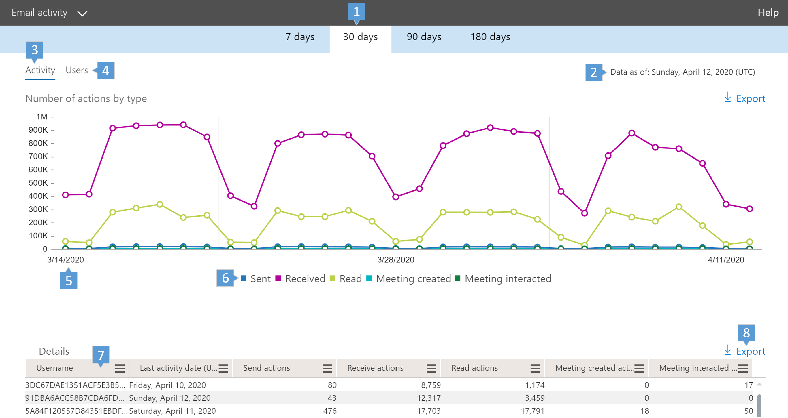

# Microsoft 365-Berichte im Admin Center-e-Mail-AktivitätMicrosoft 365 Reports in the admin center - Email activity

Im Microsoft 365 **Reports** -Dashboard wird die Aktivitätsübersicht für die Produkte in Ihrer Organisation angezeigt.The Microsoft 365 **Reports** dashboard shows you the activity overview across the products in your organization. Sie können Drilldowns zu Einzelberichten auf Produktebene ausführen und auf diese Weise genauere Einblicke in die Aktivitäten innerhalb der einzelnen Produkte erhalten.It enables you to drill in to individual product level reports to give you more granular insight about the activities within each product. Sehen Sie sich die [Übersicht über Berichte](activity-reports.md) an.Check out [the Reports overview topic](activity-reports.md).
  
Sie können beispielsweise eine allgemeine Übersicht über den E-Mail-Verkehr innerhalb Ihrer Organisation auf der Seite "Berichte" abrufen und dann einen Drilldown in das Widget für E-Mail-Aktivität ausführen, um die Trends und die Details auf Ebene der einzelnen Benutzer für die E-Mail-Aktivität in Ihrer Organisation zu verstehen.For example, you can get a high level view of email traffic within your organization from the Reports page, and then you can drill into the Email activity widget to understand the trends and per user level details of the email activity within your organization.
  
> [!NOTE]
> Sie müssen ein globaler Administrator, ein globaler Leser oder ein Leser von Berichten in Microsoft 365 oder einer Exchange-, SharePoint-, Teams-Dienst-, Microsoft Teams-oder Skype for Business-Administrator sein, um Berichte anzuzeigen.You must be a global administrator, global reader or reports reader in Microsoft 365 or an Exchange, SharePoint, Teams Service, Teams Communications, or Skype for Business administrator to see reports. 

## Aufrufen des E-Mail-AktivitätsberichtsHow to get to the email activity report

1. Wechseln Sie im Admin Center zur Seite **Berichte** \> <a href="https://go.microsoft.com/fwlink/p/?linkid=2074756" target="_blank">Verwendung</a>.In the admin center, go to the **Reports** \> <a href="https://go.microsoft.com/fwlink/p/?linkid=2074756" target="_blank">Usage</a> page.

    
2. Wählen Sie in der Dropdownliste **Bericht auswählen** die Option **Exchange** \> **-e-Mail-Aktivität**aus.From the **Select a report** drop-down, select **Exchange** \> **Email activity**.
  
## Interpretieren des E-Mail-AktivitätsberichtsInterpret the email activity report

Sie erhalten einen Einblick in die E-Mail-Aktivitäten Ihrer Benutzer, indem Sie sich die Diagramme **Aktivität** und **Benutzer** ansehen.You can get a view into your user's email activity by looking at the **Activity** and **Users** charts. 
  

  
|ElementItem|BeschreibungDescription|
|:-----|:-----|
|1.1.    |Im Bericht **E-Mail-Aktivität** werden die Trends über die letzten 7 Tage, 30 Tage, 90 Tage oder 180 Tage angezeigt.The **Email activity** report can be viewed for trends over the last 7 days, 30 days, 90 days, or 180 days. Wenn Sie im Bericht jedoch einen bestimmten Tag auswählen, werden in der Tabelle (7) Daten für bis zu 28 Tage ab dem aktuellen Datum angezeigt (nicht ab dem Datum, an dem der Bericht generiert wurde).However, if you select a particular day in the report, the table (7) will show data for up to 28 days from the current date (not the date the report was generated).    |
|2.2.    |Die Daten in den einzelnen Berichten decken in der Regel die letzten 24 bis 48 Stunden ab.The data in each report usually covers up to the last 24 to 48 hours.    |
|3.3.    |Anhand des Diagramms **Aktivität** können Sie den Trend in Hinsicht auf die Menge von E-Mail-Aktivitäten in Ihrer Organisation erkennen.The **Activity** chart enables you to understand the trend of the amount of email activity going on in your organization. Sie können die Aufteilung von e-Mail-Nachrichten, e-Mail-Lesevorgängen, empfangenen e-Mails, erstellten Besprechungen oder Aktivitäten mit Besprechungen verstehen.You can understand the split of email send, email read, email received, meeting created, or meeting interacted activities.    |
|4.4.    |Anhand des Diagramms **Benutzer** können Sie den Trend in Hinsicht auf die Anzahl eindeutiger Benutzer erkennen, die die E-Mail-Aktivitäten generieren.The **User** chart enables you to understand the trend of the amount of unique users who are generating the email activities. Sie können sich die Entwicklung von Benutzern ansehen, die e-Mail-senden, e-Mail-lesen, e-Mail-Empfang, Besprechungs Erstellung oder interaktive Besprechungs Aktivitäten durchführen.You can look at the trend of users performing email sending, email reading, email receiving, meeting creating, or meeting interacting activities.    |
|5.5.    | Im **Aktivitäts** Diagramm ist die Y-Achse die Anzahl der Aktivitäten des Typs "gesendete e-Mail", "empfangene e-Mail", "e-Mail-lesen", "erstellte Besprechungen" und "Besprechungs Interaktion".On the **Activity** chart, the Y axis is the count of activity of the type email sent, email received, email read, meeting created, and meeting interacted.     Im Diagramm **Benutzer** Aktivität ist die Y-Achse die Leistungsfähigkeit des Benutzers, der die Art von e-Mail-Nachrichten, empfangene e-Mails, e-Mail-Lesevorgänge, erstellte Besprechungen oder interaktive Besprechungen ausführt.On the **Users** activity chart, the Y axis is the user's performing activity of the type email sent, email received, email read, meeting created, or meeting interacted.     Die X-Achse bezeichnet in beiden Diagrammen den ausgewählten Zeitraum für diesen bestimmten Bericht.The X axis on both charts is the selected date range for this specific report.    |
|6.6.    |Sie können die im Diagramm angezeigte Datenreihe filtern, indem Sie in der Legende ein Element auswählen.You can filter the series you see on the chart by selecting an item in the legend. Wählen Sie beispielsweise im Diagramm " **Aktivität** " die Diagramme " **gesendet**", " **empfangen**", " **gelesen**", " **Besprechung erstellt**" oder "mit **Interaktion interagierender**  um nur die zugehörigen Informationen anzuzeigen.  For example, on the **Activity** chart, select **Sent**, **Received**, **Read**, **Meeting created**, or **Meeting interacted**   to see only the info related to each one. Durch das Ändern dieser Auswahl werden die Informationen in der Gitternetztabelle nicht geändert.Changing this selection doesn't change the info in the grid table.    |
|7.7.    | Die Tabelle zeigt eine Aufschlüsselung der E-Mail-Aktivitäten auf Ebene der einzelnen Benutzer.The table shows you a breakdown of the email activities at the per-user level. Hier werden alle Benutzer gezeigt, denen ein Exchange-Produkt zugewiesen ist, sowie deren E-Mail-Aktivitäten.This shows all users that have an Exchange product assigned to them and their email activities.     **Benutzername** ist die E-Mail-Adresse des Benutzers.**Username** is the email address of the user.    **Anzeigename** ist der vollständige Name, wenn der Benutzer.**Display name** is the full name if the user.    **Gelöscht** bezieht sich auf den Benutzer, dessen aktueller Status gelöscht ist, der aber während eines Teils des Berichtszeitraums aktiv war.**Deleted** refers to the user whose current state is deleted, but was active during some part of the reporting period of the report.    **Gelöscht am** ist das Datum, an dem der Benutzer gelöscht wurde.**Deleted date** is the date the user was deleted.    **Letzte Aktivität** bezieht sich auf das Datum, an dem der Benutzer zuletzt eine E-Mail-Aktivität vom Typ Lesen oder Senden ausgeführt hat.**Last activity date** refers to the last time the user performed a read or send email activity.    **Sendeaktionen** gibt an, wie oft eine E-Mail-Sendeaktion für den Benutzer erfasst wurde.**Send actions** is the number of times an email send action was recorded for the user.    **Empfangsaktionen** gibt an, wie oft eine E-Mail-Empfangsaktion für den Benutzer erfasst wurde.**Receive actions** is the number of times an email received action was recorded for the user.    **Leseaktionen** gibt an, wie oft eine E-Mail-Leseaktion für den Benutzer erfasst wurde.**Read actions** is the number of times an email read action was recorded for the user.    " **Besprechungs Erstellungsaktionen** " gibt an, wie oft eine Besprechungsanfrage-Sendeaktion für den Benutzer aufgezeichnet wurde.**Meeting created actions** is the number of times a meeting request send action was recorded for the user.    " **Interaktive Besprechungs Aktionen** " gibt an, wie oft eine Besprechungsanfrage akzeptieren, mit Vorbehalt, ablehnen oder Abbrechen Aktion für den Benutzer aufgezeichnet wurde.**Meeting interacted actions** is the number of times a meeting request accept, tentative, decline, or cancel action was recorded for the user.    **Zugewiesenes Produkt** bezeichnet die Produkte, die diesem Benutzer zugewiesen sind.**Product assigned** is the products that are assigned to this user.     Wenn die Richtlinien Ihrer Organisation eine Anzeige von Berichten verhindern, in denen Benutzerinformationen identifizierbar sind, können Sie die Datenschutzeinstellung für alle diese Berichte ändern.If your organization's policies prevents you from viewing reports where user information is identifiable, you can change the privacy setting for all these reports. Lesen Sie den Abschnitt zum **Ausblenden von Details auf Benutzerebene** in den [Aktivitätsberichten im Microsoft 365 Admin Center](activity-reports.md).Check out the **How do I hide user level details?** section in the [Activity Reports in the Microsoft 365 admin center](activity-reports.md).    |
|8.8.    |Sie können die Berichtsdaten auch in eine Excel. CSV-Datei exportieren, indem Sie den Link Exportschaltfläche **exportieren** auswählen  .You can also export the report data into an Excel .csv file, by selecting the **Export**  link. Dadurch werden Daten aller Benutzer exportiert, und Sie können einfache Sortier- und Filtervorgänge zur weiteren Analyse ausführen.This exports data of all users and enables you to do simple sorting and filtering for further analysis. Bei weniger als 2.000 Benutzern können Sie innerhalb der Tabelle im Bericht selbst sortieren und filtern.If you have less than 2000 users, you can sort and filter within the table in the report itself. Bei mehr als 2.000 Benutzern müssen Sie die Daten zum Filtern und Sortieren exportieren.If you have more than 2000 users, in order to filter and sort, you will need to export the data.    |
|||
   
Hinweis: der Bericht über e-Mail-Aktivitäten steht nur für Postfächer zur Verfügung, die Benutzern mit Lizenzen zugeordnet sind.Note: The Email activity report is only available for mailboxes that are associated with users who have licenses.
