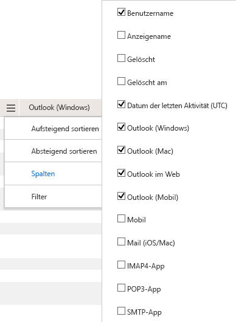

# Microsoft 365-Berichte im Admin Center-Nutzung von e-Mail-apps

Im Microsoft 365 **Reports** -Dashboard wird die Aktivitätsübersicht für die Produkte in Ihrer Organisation angezeigt. Sie können Drilldowns zu Einzelberichten auf Produktebene ausführen und auf diese Weise genauere Einblicke in die Aktivitäten innerhalb der einzelnen Produkte erhalten. Sehen Sie sich die [Übersicht über Berichte](activity-reports.md) an. Im Bericht über die Verwendung von e-Mail-Apps können Sie sehen, wie viele e-Mail-apps sich mit Exchange Online verbinden. Außerdem werden Versionsinformationen der von den Benutzern verwendeten Outlook-Apps angezeigt, sodass Sie die Benutzer, die nicht unterstützte Versionen verwenden, auffordern können, unterstützte Versionen von Outlook zu installieren.
  
> [!NOTE]
> Sie müssen ein globaler Administrator, ein globaler Leser oder ein Leser von Berichten in Microsoft 365 oder einer Exchange-, SharePoint-, Teams-Dienst-, Microsoft Teams-oder Skype for Business-Administrator sein, um Berichte anzuzeigen.  
 
## So gelangen Sie zum Bericht "e-Mail-Apps"

1. Wechseln Sie im Admin Center zur Seite **Berichte** \> <a href="https://go.microsoft.com/fwlink/p/?linkid=2074756" target="_blank">Verwendung</a>.

    
2. Wählen Sie in der Dropdownliste **Bericht auswählen** die Option **Exchange** \> **-e-Mail-App-Nutzung**aus.
  
## Interpretieren des Berichts über e-Mail-apps

Sie können eine Ansicht in die e-Mail-apps-Aktivität abrufen, indem Sie die Diagramme **Users** and **Clients** betrachten. 
  

  
|Element|Beschreibung|
|:-----|:-----|
|1.    |Der **Verwendungsbericht "e-Mail-apps** " kann für Trends in den letzten 7 Tagen, 30 Tagen, 90 Tagen oder 180 Tagen angezeigt werden. Wenn Sie im Bericht jedoch einen bestimmten Tag auswählen, werden in der Tabelle (7) Daten für bis zu 28 Tage ab dem aktuellen Datum angezeigt (nicht ab dem Datum, an dem der Bericht generiert wurde).    |
|2.    |Die Daten in den einzelnen Berichten decken in der Regel die letzten 24 bis 48 Stunden ab.    |
|3.    |In der Ansicht **Benutzer** wird die Anzahl der eindeutigen Benutzer angezeigt, die mit einer beliebigen E-Mail-App eine Verbindung mit Exchange Online hergestellt haben.    |
|4.    |In der Ansicht **Apps** wird die Anzahl der eindeutigen Benutzer im ausgewählten Zeitraum nach App angezeigt.    |
|5.    |In der Ansicht **Versionen** wird die Anzahl der eindeutigen Benutzer für jede Version von Outlook in Windows angezeigt.    |
|6.    | Im Diagramm **Benutzer** gibt die y-Achse die Gesamtanzahl der eindeutigen Benutzer an, die an einem beliebigen Tag innerhalb des Berichtszeitraums eine Verbindung mit einer App hergestellt haben.     Im Diagramm **Benutzer** gibt die x-Achse die Anzahl der eindeutigen Benutzer an, die die App in diesem Berichtszeitraum verwendet haben.     Im Diagramm **Apps** gibt die y-Achse die Gesamtanzahl der eindeutigen Benutzer an, die eine bestimmte App im Berichtszeitraum verwendet haben.     Im Diagramm **Apps** gibt die x-Achse die Liste der Apps in Ihrer Organisation an.     Im Diagramm **Versionen** gibt die y-Achse die Gesamtanzahl der eindeutigen Benutzer an, die eine bestimmte Version der Outlook-Desktop-App verwenden. Wenn der Bericht die Versionsnummer von Outlook nicht auflösen kann, wird die Menge als nicht **bestimmt**angezeigt.     Im Diagramm **Versionen** gibt die x-Achse die Liste der Apps in Ihrer Organisation an.    |
|7.    |Sie können die im Diagramm angezeigte Datenreihe filtern, indem Sie in der Legende ein Element auswählen. Wählen Sie beispielsweise im Diagramm **Benutzer** die Option **Mac Mail** oder **Outlook**  , um nur die Informationen anzuzeigen, die sich auf jede einzelne beziehen. Durch das Ändern dieser Auswahl werden die Informationen in der Gitternetztabelle nicht geändert. Mac Mail, Outlook für Mac, Outlook Mobile, Outlook Desktop und Outlook im Internet sind Beispiele für e-Mail-apps, die Sie möglicherweise in Ihrer Organisation haben.    |
|8.    | Möglicherweise werden alle Elemente in der nachstehenden Liste in den Spalten erst angezeigt, wenn Sie diese hinzugefügt haben.  **Username** ist der Name des Besitzers der e-Mail-app.    **Datum der letzten Aktivität** ist das letzte Datum, an dem der Benutzer eine e-Mail-Nachricht gelesen oder gesendet hat.    **Mac Mail**, **Outlook für Mac** sowie **Outlook**, **Outlook Mobile** und **Outlook im Web** sind Beispiele für E-Mail-Apps, die möglicherweise in Ihrer Organisation verwendet werden.     Wenn die Richtlinien Ihrer Organisation eine Anzeige von Berichten verhindern, in denen Benutzerinformationen identifizierbar sind, können Sie die Datenschutzeinstellung für alle diese Berichte ändern. Lesen Sie den Abschnitt zum **Ausblenden von Details auf Benutzerebene** in den [Aktivitätsberichten im Microsoft 365 Admin Center](activity-reports.md).    |
|9.    |Wählen Sie **Spalten verwalten** aus, um Spalten zum Bericht hinzuzufügen oder daraus zu entfernen.    |
|10.    |Sie können die Berichtsdaten auch im CSV-Format in eine Excel-Datei exportieren, indem Sie den Link **Exportieren** auswählen. Dadurch werden Daten aller Benutzer exportiert, und Sie können einfache Sortier- und Filtervorgänge zur weiteren Analyse ausführen. Bei weniger als 2.000 Benutzern können Sie innerhalb der Tabelle im Bericht selbst sortieren und filtern. Bei mehr als 2.000 Benutzern müssen Sie die Daten zum Filtern und Sortieren exportieren.    |
|||
   
