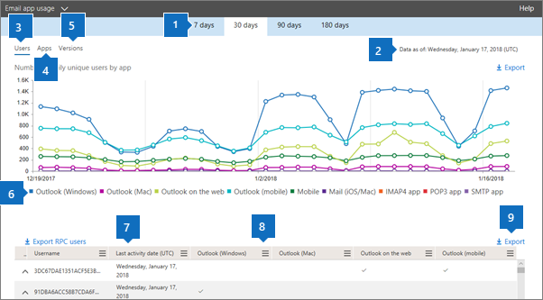

# Microsoft 365-Berichte im Admin Center-Nutzung von e-Mail-appsMicrosoft 365 Reports in the admin center - Email apps usage

Im Microsoft 365 **Reports** -Dashboard wird die Aktivitätsübersicht für die Produkte in Ihrer Organisation angezeigt.The Microsoft 365 **Reports** dashboard shows you the activity overview across the products in your organization. Sie können Drilldowns zu Einzelberichten auf Produktebene ausführen und auf diese Weise genauere Einblicke in die Aktivitäten innerhalb der einzelnen Produkte erhalten.It enables you to drill in to individual product level reports to give you more granular insight about the activities within each product. Sehen Sie sich die [Übersicht über Berichte](activity-reports.md) an.Check out [the Reports overview topic](activity-reports.md). Im Bericht über die Verwendung von e-Mail-Apps können Sie sehen, wie viele e-Mail-apps sich mit Exchange Online verbinden.In the email apps usage report, you can see how many email apps are connecting to Exchange Online. Außerdem werden Versionsinformationen der von den Benutzern verwendeten Outlook-Apps angezeigt, sodass Sie die Benutzer, die nicht unterstützte Versionen verwenden, auffordern können, unterstützte Versionen von Outlook zu installieren.You can also see the version information of Outlook apps that users are using, which will allow you to follow up with those who are using unsupported versions to install supported versions of Outlook.
  
> [!NOTE]
> Sie müssen ein globaler Administrator, ein globaler Leser oder ein Leser von Berichten in Microsoft 365 oder einer Exchange-, SharePoint-, Teams-Dienst-, Microsoft Teams-oder Skype for Business-Administrator sein, um Berichte anzuzeigen.You must be a global administrator, global reader or reports reader in Microsoft 365 or an Exchange, SharePoint, Teams Service, Teams Communications, or Skype for Business administrator to see reports.  
 
## So gelangen Sie zum Bericht "e-Mail-Apps"How to get to the email apps report

1. Wechseln Sie im Admin Center zur Seite **Berichte** \> <a href="https://go.microsoft.com/fwlink/p/?linkid=2074756" target="_blank">Verwendung</a>.In the admin center, go to the **Reports** \> <a href="https://go.microsoft.com/fwlink/p/?linkid=2074756" target="_blank">Usage</a> page.

    
2. Wählen Sie in der Dropdownliste **Bericht auswählen** die Option **Exchange** \> **-e-Mail-App-Nutzung**aus.From the **Select a report** drop-down, select **Exchange** \> **Email app usage**.
  
## Interpretieren des Berichts über e-Mail-appsInterpret the email apps report

Sie können eine Ansicht in die e-Mail-apps-Aktivität abrufen, indem Sie die Diagramme **Users** and **Clients** betrachten.You can get a view into email apps activity by looking at the **Users** and **Clients** charts. 
  

  
|||
|:-----|:-----|
|1.1.    |Der **Verwendungsbericht "e-Mail-apps** " kann für Trends in den letzten 7 Tagen, 30 Tagen, 90 Tagen oder 180 Tagen angezeigt werden.The **Email apps usage** report can be viewed for trends over the last 7 days, 30 days, 90 days, or 180 days. Wenn Sie im Bericht jedoch einen bestimmten Tag auswählen, werden in der Tabelle (7) Daten für bis zu 28 Tage ab dem aktuellen Datum angezeigt (nicht ab dem Datum, an dem der Bericht generiert wurde).However, if you select a particular day in the report, the table (7) will show data for up to 28 days from the current date (not the date the report was generated).    |
|2.2.    |Die Daten in den einzelnen Berichten decken in der Regel die letzten 24 bis 48 Stunden ab.The data in each report usually covers up to the last 24 to 48 hours.    |
|3.3.    |In der Ansicht **Benutzer** wird die Anzahl der eindeutigen Benutzer angezeigt, die mit einer beliebigen E-Mail-App eine Verbindung mit Exchange Online hergestellt haben.The **Users** view shows you the number of unique users that connected to Exchange Online using any email app.    |
|4.4.    |In der Ansicht **Apps** wird die Anzahl der eindeutigen Benutzer im ausgewählten Zeitraum nach App angezeigt.The **Apps** view shows you the number of unique users by app over the selected time period.    |
|5.5.    |In der Ansicht **Versionen** wird die Anzahl der eindeutigen Benutzer für jede Version von Outlook in Windows angezeigt.The **Versions** view shows you the number of unique users for each version of Outlook in Windows.    |
|6.6.    | Im Diagramm **Benutzer** gibt die y-Achse die Gesamtanzahl der eindeutigen Benutzer an, die an einem beliebigen Tag innerhalb des Berichtszeitraums eine Verbindung mit einer App hergestellt haben.On the **Users** chart, the Y axis is the total count of unique users that connected to an app on any day of the reporting period.     Im Diagramm **Benutzer** gibt die x-Achse die Anzahl der eindeutigen Benutzer an, die die App in diesem Berichtszeitraum verwendet haben.On the **Users** chart, the X axis is number of unique users that used the app for that reporting period.     Im Diagramm **Apps** gibt die y-Achse die Gesamtanzahl der eindeutigen Benutzer an, die eine bestimmte App im Berichtszeitraum verwendet haben.On the **Apps** chart, the Y axis is the total count of unique users who used a specific app during the reporting period.     Im Diagramm **Apps** gibt die x-Achse die Liste der Apps in Ihrer Organisation an.On the **Apps** chart, the X axis is the list of apps in your organization.     Im Diagramm **Versionen** gibt die y-Achse die Gesamtanzahl der eindeutigen Benutzer an, die eine bestimmte Version der Outlook-Desktop-App verwenden. Wenn der Bericht die Versionsnummer von Outlook nicht ermitteln kann, wird die Menge als "Unbestimmt" angezeigt.  On the **Versions** chart, the Y axis is the total count of unique users using a specific version of Outlook desktop. If the report can't resolve the version number of Outlook, the quantity will show as Undetermined.     Im Diagramm **Versionen** gibt die x-Achse die Liste der Apps in Ihrer Organisation an.On the **Versions** chart, the X axis is the list of apps in your organization.    |
|7.7.    |Sie können die Datenreihe filtern, die im Diagramm nach selectingan-Element in der Legende angezeigt wird.You can filter the series you see on the chart by selectingan item in the legend. Wählen Sie beispielsweise im Diagramm **Benutzer** die Option **Mac Mail** oder **Outlook**  , um nur die Informationen anzuzeigen, die sich auf jede einzelne beziehen.to see only the info related to each one. Durch das Ändern dieser Auswahl werden die Informationen in der Gitternetztabelle nicht geändert.Changing this selection doesn't change the info in the grid table. Mac Mail, Outlook für Mac, Outlook Mobile, Outlook Desktop und Outlook im Internet sind Beispiele für e-Mail-apps, die Sie möglicherweise in Ihrer Organisation haben.Mac mail, Outlook for Mac, Outlook mobile, Outlook desktop, and Outlook on the web are examples of email apps you may have in your organization.    |
|8.8.    | Möglicherweise werden alle Elemente in der nachstehenden Liste in den Spalten erst angezeigt, wenn Sie diese hinzugefügt haben.You might not see all the items in the list below in the columns until you add them.  **Username** ist der Name des Besitzers der e-Mail-app.**Username** is the name of the email app's owner.    **Datum der letzten Aktivität** ist das letzte Datum, an dem der Benutzer eine e-Mail-Nachricht gelesen oder gesendet hat.**Last activity date** is the latest date the user read or sent an email message.    **Mac Mail**, **Outlook für Mac** sowie **Outlook**, **Outlook Mobile** und **Outlook im Web** sind Beispiele für E-Mail-Apps, die möglicherweise in Ihrer Organisation verwendet werden.**Mac mail**, **Mac Outlook** and **Outlook**, **Outlook mobile** and **Outlook on the web** are examples of email apps you may have in your organization.     Wenn die Richtlinien Ihrer Organisation eine Anzeige von Berichten verhindern, in denen Benutzerinformationen identifizierbar sind, können Sie die Datenschutzeinstellung für alle diese Berichte ändern.If your organization's policies prevents you from viewing reports where user information is identifiable, you can change the privacy setting for all these reports. Lesen Sie den Abschnitt zum **Ausblenden von Details auf Benutzerebene** in den [Aktivitätsberichten im Microsoft 365 Admin Center](activity-reports.md).Check out the **How do I hide user level details?** section in the [Activity Reports in the Microsoft 365 admin center](activity-reports.md).    |
|9.9.    |Wählen Sie **Spalten verwalten** aus, um Spalten zum Bericht hinzuzufügen oder daraus zu entfernen.Select **Manage columns** to add or remove columns from the report.    |
|10.10.    |Sie können die Berichtsdaten auch im CSV-Format in eine Excel-Datei exportieren, indem Sie den Link **Exportieren** auswählen.You can also export the report data into an Excel .csv file, by selecting the **Export** link. Dadurch werden Daten aller Benutzer exportiert, und Sie können einfache Sortier- und Filtervorgänge zur weiteren Analyse ausführen.This exports data of all users and enables you to do simple sorting and filtering for further analysis. Bei weniger als 2.000 Benutzern können Sie innerhalb der Tabelle im Bericht selbst sortieren und filtern.If you have less than 2000 users, you can sort and filter within the table in the report itself. Bei mehr als 2.000 Benutzern müssen Sie die Daten zum Filtern und Sortieren exportieren.If you have more than 2000 users, in order to filter and sort, you will need to export the data.    |
|||
   

