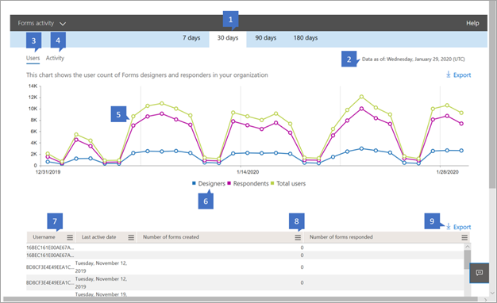

# Microsoft 365-Berichte in der Admin Center-Formular AktivitätMicrosoft 365 Reports in the admin center - Forms activity

Im Microsoft 365 **Reports** -Dashboard wird die Aktivitätsübersicht für die Produkte in Ihrer Organisation angezeigt.The Microsoft 365 **Reports** dashboard shows you the activity overview across the products in your organization. Sie können Drilldowns zu Einzelberichten auf Produktebene ausführen und auf diese Weise genauere Einblicke in die Aktivitäten innerhalb der einzelnen Produkte erhalten.It enables you to drill in to individual product level reports to give you more granular insight about the activities within each product. Sehen Sie sich die [Übersicht über Berichte](activity-reports.md) an.Check out [the Reports overview topic](activity-reports.md).
  
Sie können beispielsweise die Aktivität jedes Benutzers verstehen, der für die Verwendung von Microsoft Forms autorisiert ist, indem Sie sich Ihre Interaktion mit Formularen ansehen.For example, you can understand the activity of every user licensed to use Microsoft Forms by looking at their interaction with forms. Außerdem können Sie die Ebene der Zusammenarbeit verstehen, indem Sie die Anzahl der erstellten Formulare und Formulare betrachten, auf die der Benutzer geantwortet hat.It also helps you to understand the level of collaboration going on by looking at the number of forms created and forms the user responded to.
  
> [!NOTE]
> Sie müssen ein globaler Administrator, ein globaler Leser oder ein Leser von Berichten in Microsoft 365 oder einer Exchange-, SharePoint-, Teams-Dienst-, Microsoft Teams-oder Skype for Business-Administrator sein, um Berichte anzuzeigen.You must be a global administrator, global reader or reports reader in Microsoft 365 or an Exchange, SharePoint, Teams Service, Teams Communications, or Skype for Business administrator to see reports. 

## So gelangen Sie zum Formular AktivitätsberichtHow to get to the Forms activity report

1. Wechseln Sie im Admin Center zur Seite **Berichte** \> <a href="https://go.microsoft.com/fwlink/p/?linkid=2074756" target="_blank">Verwendung</a>.In the admin center, go to the **Reports** \> <a href="https://go.microsoft.com/fwlink/p/?linkid=2074756" target="_blank">Usage</a> page.

    
2. Wählen Sie in der Dropdownliste **Bericht auswählen** die Option **Formular** \> **Aktivität**aus.From the **Select a report** drop-down, select **Forms** \> **activity**.

## Interpretieren des E-Mail-AktivitätsberichtsInterpret the email activity report

Sie erhalten einen Einblick in die E-Mail-Aktivitäten Ihrer Benutzer, indem Sie sich die Diagramme **Aktivität** und **Benutzer** ansehen.You can get a view into your user's email activity by looking at the **Activity** and **Users** charts. 

|||
|:-----|:-----|
|1.1.    |Der **Formular Aktivitäts** Bericht kann für Trends in den letzten 7 Tagen, 30 Tagen, 90 Tagen oder 180 Tagen angezeigt werden.The **Forms activity** report can be viewed for trends over the last 7 days, 30 days, 90 days, or 180 days. Wenn Sie im Bericht jedoch einen bestimmten Tag auswählen, werden in der Tabelle (7) Daten für bis zu 28 Tage ab dem aktuellen Datum angezeigt (nicht ab dem Datum, an dem der Bericht generiert wurde).However, if you select a particular day in the report, the table (7) will show data for up to 28 days from the current date (not the date the report was generated).    |
|2.2.    |Die Daten in den einzelnen Berichten decken in der Regel die letzten 24 bis 48 Stunden ab.The data in each report usually covers up to the last 24 to 48 hours.    |
|3.3.    |In der Ansicht **Benutzer** können Sie den Trend bei der Anzahl aktiver Formular Benutzer verstehen.The **Users** view helps you to understand the trend in the number of active forms users. Ein Benutzer wird als "aktiv" betrachtet, wenn er eine Aktivität um ein Formular (erstellen, bearbeiten, Anzeigen usw.) oder ein Formular innerhalb eines bestimmten Zeitraums geantwortet hat.A user is considered active if he or she has executed a activity around a form (create, edit, view, etc.) or responded to a form within the specific time period.    |
|4.4.    |Die **Aktivitäts** Ansicht hilft Ihnen, den Trend bei der Anzahl aktiver Benutzer zu verstehen.The **Activity** view helps you to understand the trend in the number of active users. Ein Benutzer wird als "aktiv" betrachtet, wenn er innerhalb eines bestimmten Zeitraums eine Dateiaktivität (Speichern, Synchronisieren, Ändern oder Freigeben) ausgeführt oder eine Seite besucht hat.A user is considered active if he or she has executed a file activity (save, sync, modify, or share) or visited a page within the specific time period.  Hinweis: eine Aktivität kann mehrere Male für ein einzelnes Formular auftreten, wird aber nur als ein aktives Formular gezählt.NOTE: An activity can occur multiple times for a single form, but will count only as one active form. Sie können beispielsweise ein Formular erstellen und das gleiche Formular mehrmals in einem bestimmten Zeitraum bearbeiten, aber es wird nur als ein einzelnes Formular gezählt.For example, you can create a form and continue to edit the same form multiple times over a specified time period, but it will count only as one single form. Wenn ein Benutzer jedoch mehrere Antworten für dasselbe Formular übermittelt hat, wäre jede Antwort immer noch eine individuelle Antwort und wird daher mehrmals gezählt.However if a user submitted multiple responses for the same form, each response would still be an individual response and thus be counted multiple times.   |
|5.5. |Im Diagramm **Benutzer** ist die Y-Achse die Anzahl der eindeutigen Benutzer.On the **Users** chart, the Y axis is the number of unique users. X-Achse ist das Datum, an dem die eindeutigen Benutzer aktiv sind.X axis is the date that the unique users are active on. Die Legenden sind:The legends are:  **Designer** bedeutet, dass der Benutzer ein Formular erstellt oder bearbeitet hat.**Designers** means the user has created or edited a form. **Responder** bedeutet, dass der Benutzer eine Antwort (en) an ein Formular übermittelt hat.**Responders** means that the user has submitted response(s) to a form.  " **Total Users** " bedeutet, dass jeder Benutzer im Unternehmen, der ein Designer oder Responder war.**Total users** means anyone in the company who has been a designer or responder.   Im **Aktivitäts** Diagramm ist die Y-Achse die Anzahl der eindeutigen Formulare oder Antworten.On the **Activity** chart, the Y axis is the count of unique forms or responses. X-Achse ist das Datum, an dem das Formular oder die Antwort Aktivität aufgetreten ist.X axis is the date that the form or response activity occurred. Die Legenden sind:The legends are:  " **Erstellte Formulare** " ist die Anzahl der eindeutigen Formulare, die von den Benutzern erstellt wurden.**Forms created** is the count of unique forms that the users have created.  **In Antworten angemeldet** die Anzahl der angemeldeten Antworten, die die Benutzer in der Organisation erhalten haben.**Signed in responses** the count of signed in responses the users in the organization have received.  **Anonyme Antworten** ist die Anzahl der anonymen Antworten, die die Benutzer in der Organisation erhalten haben.**Anonymous responses** is the count of anonymous responses the users in the organization have received.  |
|6.6. |Sie können die im Diagramm angezeigte Datenreihe filtern, indem Sie in der Legende ein Element auswählen.You can filter the series you see on the chart by selecting an item in the legend. Wählen Sie beispielsweise im Diagramm Benutzer die Option Designer, Responder oder Gesamtbenutzer aus, um nur die zugehörigen Informationen anzuzeigen.For example, on the Users chart, select designers, responders, or total users to see only the info related to each one. Wenn Sie diese Auswahl ändern, werden die Informationen in der Raster Tabelle darunter nicht geändert.Changing this selection doesn't change the info in the grid table below it.|
|7.7. |Die Tabelle zeigt eine Aufschlüsselung der Aktivitäten auf Einzelbenutzerebene. Die Legenden sind:The table shows you a breakdown of the activities at the per-user level.The legends are:  **Username** ist die e-Mail-Adresse des Benutzers, der die Aktivität in Microsoft Forms ausgeführt hat.**Username** is the email address of the user who performed the activity on Microsoft Forms. **Datum der letzten Aktivität (UTC)** ist das letzte Datum, an dem eine Formular Aktivität vom Benutzer für den ausgewählten Datumsbereich ausgeführt wurde.**Last activity date (UTC)** is the latest date a form activity was performed by the user for the selected date range. Um Aktivitäten anzuzeigen, die an einem bestimmten Datum stattfanden, wählen Sie das Datum direkt im Diagramm aus.To see activity that occurred on a specific date, select the date directly in the chart.  Dadurch wird die Tabelle so gefiltert, dass Datei Aktivitätsdaten nur für Benutzer angezeigt werden, die die Aktivität an diesem bestimmten Tag ausgeführt haben.This will filter the table to display file activity data only for users who performed the activity on that specific day.  " **Anzahl der erstellten Formulare** " ist die Anzahl der vom Benutzer erstellten Formulare.**Number of forms created** is the number of forms that the user created.  " **Anzahl der geantwortten Formulare** " ist die Anzahl der Formulare, an die der Benutzer Antworten gesendet hat.**Number of forms responded** is the number of forms that the user has submitted responses to.|
|8.8. |Wählen Sie das Symbol " **Spalten verwalten** " aus, um Spalten zum Bericht hinzuzufügen oder daraus zu entfernen.Select the **Manage columns** icon to add or remove columns from the report.|
|9.9. |Sie können die Berichtsdaten auch im CSV-Format in eine Excel-Datei exportieren, indem Sie den Link **Exportieren** auswählen.You can also export the report data into an Excel .csv file by selecting the **Export** link. Dadurch werden Daten für alle Benutzer exportiert, und Sie können einfache Aggregation, Sortierung und Filterung für weitere Analysen durchführen.This exports data for all users and enables you to do simple aggregation, sorting and filtering for further analysis. Wenn Sie über weniger als 100 Benutzer verfügen, können Sie innerhalb der Tabelle im Bericht selbst sortieren und filtern.If you have less than 100 users, you can sort and filter within the table in the report itself. Wenn Sie über mehr als 100 Benutzer verfügen, müssen Sie die Daten exportieren, um Sie zu filtern und zu sortieren.If you have more than 100 users, in order to filter and sort, you will need to export the data.|