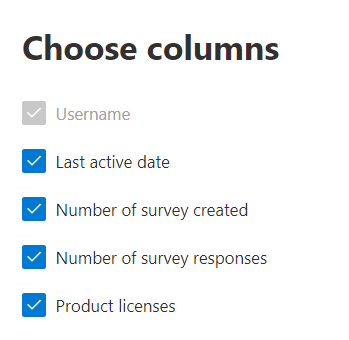

# Microsoft 365-Berichte im Admin Center – Dynamics 365 Customer Voice-AktivitätMicrosoft 365 Reports in the admin center - Dynamics 365 Customer Voice activity

Das Microsoft 365 **Reports-Dashboard** zeigt Ihnen die Übersicht über die Aktivitäten in den Produkten in Ihrer Organisation.The Microsoft 365 **Reports** dashboard shows you the activity overview across the products in your organization. Sie können Drilldowns zu Einzelberichten auf Produktebene ausführen und auf diese Weise genauere Einblicke in die Aktivitäten innerhalb der einzelnen Produkte erhalten.It lets you drill in to individual product level reports to give you more granular insight about the activities within each product. Sehen Sie sich die [Übersicht zu Berichten](activity-reports.md) an.Check out [the Reports overview topic](activity-reports.md).
  
Sie können beispielsweise die Aktivität jedes Benutzers verstehen, der für die Verwendung von Microsoft Dynamics 365 Customer Voice lizenziert ist, indem Sie sich deren Interaktionen mit Dynamics 365 Customer Voice anschauen.For example, you can understand the activity of every user licensed to use Microsoft Dynamics 365 Customer Voice by looking at their interactions with Dynamics 365 Customer Voice. Es hilft Ihnen auch, den Grad der Zusammenarbeit zu verstehen, indem Sie sich die Anzahl der erstellten Pro-Umfragen und Pro-Umfragen anschaut, auf die die Benutzer geantwortet haben.It also helps you to understand the level of collaboration going on by looking at the number of Pro Surveys created and Pro Surveys to which the users responded to. 
  
> [!NOTE]
> Sie müssen ein globaler Administrator, globaler Leser oder Berichtleser in Microsoft 365 oder ein Exchange-, SharePoint-, Teams-Dienst-, Teams Communications- oder Skype for Business-Administrator sein, um Berichte anzeigen zu können.You must be a global administrator, global reader or reports reader in Microsoft 365 or an Exchange, SharePoint, Teams Service, Teams Communications, or Skype for Business administrator to see reports.  
 
## So erhalten Sie den Dynamics 365 Customer Voice Activity ReportHow to get to the Dynamics 365 Customer Voice activity report

1. Wechseln Sie im Admin Center zur Seite **Berichte** \> <a href="https://go.microsoft.com/fwlink/p/?linkid=2074756" target="_blank">Verwendung</a>.In the admin center, go to the **Reports** \> <a href="https://go.microsoft.com/fwlink/p/?linkid=2074756" target="_blank">Usage</a> page. 
2. Klicken Sie auf der Startseite des Dashboards auf **die** Schaltfläche Weitere Anzeigen auf der Dynamics 365 Customer Voice Card.From the dashboard homepage, click on the **View more** button on the Dynamics 365 Customer Voice card.
  
## Interpretieren des Dynamics 365 Customer Voice-AktivitätsberichtsInterpret the Dynamics 365 Customer Voice activity report

Sie können die Aktivitäten im Dynamics 365 Customer Voice-Bericht anzeigen, indem Sie die Registerkarte **Aktivität** auswählen.You can view the activities in the Dynamics 365 Customer Voice report by choosing the **Activity** tab. 

Wählen **Sie Spalten auswählen** aus, um Spalten aus dem Bericht hinzuzufügen oder zu entfernen.Select **Choose columns** to add or remove columns from the report.    

Sie können die Berichtsdaten auch im CSV-Format in eine Excel-Datei exportieren, indem Sie den Link **Exportieren** auswählen.You can also export the report data into an Excel .csv file by selecting the **Export** link. Dadurch werden Daten aller Benutzer exportiert, und Sie können einfache Sortier- und Filtervorgänge zur weiteren Analyse ausführen.This exports data of all users and enables you to do simple sorting and filtering for further analysis. Bei weniger als 2.000 Benutzern können Sie innerhalb der Tabelle im Bericht selbst sortieren und filtern.If you have less than 2000 users, you can sort and filter within the table in the report itself. Bei mehr als 2.000 Benutzern müssen Sie die Daten zum Filtern und Sortieren exportieren.If you have more than 2000 users, in order to filter and sort, you will need to export the data. 
  
|ElementItem|BeschreibungDescription|
|:-----|:-----|
|**Metrik****Metric**|**Definition****Definition**|
|UsernameUsername    |Die E-Mail-Adresse des Benutzers, der die Aktivität in Microsoft Forms ausgeführt hat.The email address of the user who performed the activity on Microsoft Forms.    |
|Datum der letzten Aktivität (UTC)Last activity date (UTC)    |Das letzte Datum, an dem eine Formularaktivität vom Benutzer für den ausgewählten Datumsbereich ausgeführt wurde.The latest date a form activity was performed by the user for the selected date range. Um Aktivitäten anzuzeigen, die an einem bestimmten Datum stattfanden, wählen Sie das Datum direkt im Diagramm aus.To see activity that occurred on a specific date, select the date directly in the chart. Dadurch wird die Tabelle so gefiltert, dass Dateiaktivitätsdaten nur für Benutzer angezeigt werden, die die Aktivität an diesem bestimmten Tag ausgeführt haben.This will filter the table to display file activity data only for users who performed the activity on that specific day.    |
|Anzahl der erstellten UmfragenNumber of surveys created    |Die Anzahl der Umfragen, die der Benutzer erstellt hat.The number of surveys that the user created.     |
|Anzahl der UmfrageantwortenNumber of survey responses    |Die Anzahl der Antworten von Antwortenden, an die die Umfrage verteilt wurde.The number of responses from responders to whom the survey was distributed to.|
|||