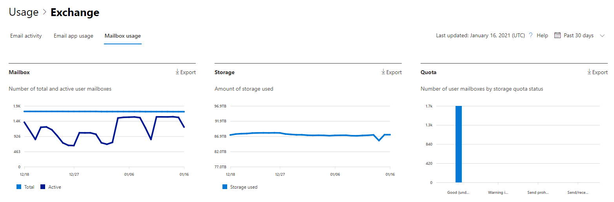

# Microsoft 365 Berichte im Admin Center – PostfachverwendungMicrosoft 365 Reports in the admin center - Mailbox usage

Der **Bericht** über die Postfachverwendung enthält Informationen zu Benutzern mit einem Benutzerpostfach und zum Aktivitätsgrad der einzelnen Benutzer basierend auf der E-Mail-Nachricht senden, lesen, Termin erstellen, Besprechung senden, Besprechung annehmen, Besprechung ablehnen und Besprechungsaktivitäten abbrechen.The **Mailbox usage report** provides information about users with a user mailbox and the level of activity by each based on the email send, read, create appointment, send meeting, accept meeting, decline meeting and cancel meeting activity. Er enthält außerdem Informationen zu dem belegten Speicher jedes Benutzerpostfachs und der Anzahl der Postfächer, die sich ihren Speicherkontingenten nähern.It also provides information about how much storage has been consumed by each user mailbox, and how many of them are approaching storage quotas. 
  
> [!NOTE]
> Sie müssen ein globaler Administrator, globaler Leser oder Berichtleser in Microsoft 365 oder ein Exchange-, SharePoint-, Teams-Dienst-, Teams-Kommunikations- oder Skype for Business-Administrator sein, um Berichte anzeigen zu können.You must be a global administrator, global reader or reports reader in Microsoft 365 or an Exchange, SharePoint, Teams Service, Teams Communications, or Skype for Business administrator to see reports. 
 
## So gelangen Sie zum Bericht zur PostfachnutzungHow to get to the mailbox usage report

1. Wechseln Sie im Admin Center zur Seite **Berichte** \> <a href="https://go.microsoft.com/fwlink/p/?linkid=2074756" target="_blank">Verwendung</a>.In the admin center, go to the **Reports** \> <a href="https://go.microsoft.com/fwlink/p/?linkid=2074756" target="_blank">Usage</a> page.
2. Wählen **Sie Weitere Anzeigen** unter **E-Mail-Aktivität aus.**Select **View More** under **Email activity**. 
3. Wählen Sie **in der** Dropdownliste E-Mail-Aktivität **Exchange** \> **Postfachverwendung aus.**From the **Email activity** drop-down list, select **Exchange** \> **Mailbox usage**.

## Interpretieren des Berichts zur PostfachnutzungInterpret the mailbox usage report

Sie können die **Postfachnutzung** in Ihrer Organisation anzeigen, indem Sie sich die Diagramme **Postfach**, **Speicher** und **Kontingent** anschauen.You can get a view into your organization's **Mailbox usage** by looking at the **Mailbox**, **Storage** and **Quota** charts. 
  

|ElementItem|BeschreibungDescription|
|:-----|:-----|
|1.1.    |Im Bericht **Postfachnutzung** werden die Trends über die letzten 7 Tage, 30 Tage, 90 Tage oder 180 Tage angezeigt.The **Mailbox usage** report can be viewed for trends over the last 7 days, 30 days, 90 days, or 180 days. Wenn Sie im Bericht jedoch einen bestimmten Tag auswählen, werden in der Tabelle Daten für bis zu 28 Tage ab dem aktuellen Datum angezeigt (nicht ab dem Datum, an dem der Bericht generiert wurde).However, if you select a particular day in the report, the table will show data for up to 28 days from the current date (not the date the report was generated).    |
|2.2.    |Die Daten in den einzelnen Berichten decken in der Regel die letzten 24 bis 48 Stunden ab.The data in each report usually covers up to the last 24 to 48 hours.    |
|3.3.    |Das Diagramm "Postfach" zeigt die Gesamtzahl der Benutzerpostfächer in Ihrer Organisation an, sowie die Gesamtzahl der aktiven Postfächer an einem gegebenen Tag des Berichtszeitraums.The Mailbox chart shows you the total number of user mailbox in your organization, and the total number that are active on any given day of the reporting period. Ein Benutzerpostfach wird als aktiv betrachtet, wenn eine E-Mail gesendet, gelesen, termin erstellt, Besprechung gesendet, Besprechung akzeptiert, Besprechungsaktivitäten ablehnen und Besprechungsaktivitäten abgebrochen wurden.A user mailbox is considered active if it had an email send, read, create appointment, send meeting, accept meeting, decline meeting and cancel meeting activity.    |
|4.4.    |Das Diagramm **Speicher** zeigt die Menge des Speicherplatzes an, der von Ihrer Organisation verwendet wird.The **Storage** chart shows you amount of storage used in your organization. Storage Das Diagramm enthält keine Archivpostfächer.Storage Chart doesn't include archive mailboxes. Weitere Informationen zur automatischen Erweiterung der Archivierung finden Sie [unter Overview of unlimited archiving in Microsoft 365](../../compliance/unlimited-archiving.md).For more information about auto-expanding archiving, see [Overview of unlimited archiving in Microsoft 365](../../compliance/unlimited-archiving.md).  |
|5.5.    | Das Diagramm **Kontingent** zeigt die Anzahl der Benutzerpostfächer in jeder Kontingentkategorie an. Es gibt vier Kontingentkategorien:  The **Quota** chart shows you the number of user mailboxes in each quota category. There are four quota categories:     "Gut" - Anzahl der Benutzer, deren verwendeter Speicher unterhalb der Kontingentwarnungsschwelle liegt.Good - number of users whose storage used is below the issue warning quota.     "Warnung" - Anzahl der Benutzer, deren verwendeter Speicher an der oder über der Warnungsschwelle liegt, deren Sendekontingent jedoch noch nicht überschritten ist.Warning - number of users whose storage used is at or above issue warning, but below prohibit send quota     "Senden nicht möglich" - Anzahl der Benutzer, deren verwendeter Speicher das Sendekontingent erreicht oder überschritten hat, die jedoch noch nicht das Sende-/Empfangskontingent überschritten haben.Can't send - number of users whose storage used is at or above the prohibit send quota, but below prohibit send/receive quota     "Senden/Empfangen nicht möglich" - Anzahl der Benutzer, deren verwendeter Speicher das Sende-/Empfangskontingent überschritten hat.Can't send/receive - number of users whose storage used is at or above prohibit send/receive quota    |
|6.6.    | Im Diagramm **Postfach** gibt die Y-Achse die Anzahl der Benutzerpostfächer an.On the **Mailbox** chart, the Y axis is the count of user mailboxes.     Im Diagramm **Speicher** gibt die Y-Achse die von den Benutzerpostfächern in Ihrer Organisation belegten Speicher an.On the **Storage** chart, the Y axis is the amount of storage being used by user mailboxes in your organization.     Im Diagramm **Kontingent** gibt die Y-Achse die Anzahl der Benutzerpostfächer in jeder Kontingentkategorie an.On the **Quota** chart, the Y axis is the number of user mailboxes in each storage quota.     Die X-Achse in den Diagrammen "Postfach" und "Speicher" entspricht dem ausgewählten Zeitraum für diesen bestimmten Bericht.The X axis on the Mailbox and Storage charts is the selected date range for this specific report.     Die X-Achse in den Kontingentdiagrammen gibt die Kontingentkategorie an.The X axis on the Quota charts is the quota category.    |
|7.7.    |Sie können die angezeigten Diagramme filtern, indem Sie ein Element in der Legende auswählen.You can filter charts you see by selecting an item in the legend.    |
|8.8.    | Die Tabelle zeigt eine Aufschlüsselung der Postfachnutzung auf Ebene der einzelnen Benutzer. Sie können weitere Spalten zur Tabelle hinzufügen.  The table shows you a breakdown of mailbox usage at the per-user level. You can add additional columns to the table.    **Benutzername** ist die E-Mail-Adresse des Benutzers.**User name** is the email address of the user.    **Anzeigename** ist der vollständige Name des Benutzers.**Display Name** is the full name if the user.    **Gelöscht** bezieht sich auf das Postfach, dessen aktueller Status "Gelöscht" ist, das aber während eines Teils des Berichtszeitraums aktiv war.**Deleted** refers to the mailbox whose current state is deleted, but was active during some part of the reporting period of the report.    **Gelöscht am** ist das Datum, an dem das Postfach gelöscht wurde.**Deleted date** is the date the mailbox was deleted.    **Erstellt am** ist das Datum, an dem das Postfach erstellt wurde.**Create date** is the date the mailbox was created.    **Datum der letzten Aktivität** ist das Datum, an dem von diesem Postfach eine E-Mail gesendet oder empfangen wurde.**Last activity date** refers to the date the mailbox had an email send or read activity.    **Anzahl Elemente** gibt die Gesamtzahl der Elemente in Postfach an.**Item count** refers to the total number of items in the mailbox.    **Verwendeter Speicher (MB)** gibt den insgesamt verwendeten Speicher an.**Storage used (MB)** refers to the total storage used.    **Anzahl gelöschter** Elemente bezieht sich auf die Gesamtanzahl der gelöschten Elemente im Postfach.**Deleted Item Count** refers to the total number of deleted items in the mailbox.   **Deleted Item Size (MB)** bezieht sich auf die Gesamtgröße aller gelöschten Elemente im Postfach.**Deleted Item Size (MB)** refers to the total size of all deleted items in the mailbox.   **Kontingent für Problemwarnung (MB)** bezieht sich auf das Speicherkontingent, ab dem der Postfachbesitzer eine Warnung erhält, dass er demnächst sein Speicherkontingent überschreitet.**Issue warning quota (MB)** refers to the storage limit when the mailbox owner will receive a warning that it's about to hit the storage quota.    **Kontingent für Senden verbieten (MB)** bezieht sich auf das Speicherkontingent, ab dem über das Postfach keine E-Mails mehr gesendet werden können.**Prohibit send quota (MB)** refers to the storage limit when the mailbox can no longer send emails.    **Kontingent für Empfangen verbieten (MB)** bezieht sich auf das Speicherkontingent, ab dem über das Postfach keine E-Mails mehr gesendet oder empfangen werden können.**Prohibit send receive quota (MB)** refers to the storage limit when the mailbox can no longer send or receive emails.     Wenn die Richtlinien Ihrer Organisation eine Anzeige von Berichten verhindern, in denen Benutzerinformationen identifizierbar sind, können Sie die Datenschutzeinstellung für alle diese Berichte ändern.If your organization's policies prevents you from viewing reports where user information is identifiable, you can change the privacy setting for all these reports. Weitere Informationen finden Sie **im Abschnitt Benutzerdetails ausblenden** im Abschnitt Aktivitätsberichte im Microsoft 365 Admin [Center](activity-reports.md).Check out the **Hide user details in the reports** section in the [Activity Reports in the Microsoft 365 admin center](activity-reports.md).    |
|9.9.    |Wählen **Sie Spalten auswählen** aus, um Spalten aus dem Bericht hinzuzufügen oder zu entfernen.Select **Choose columns** to add or remove columns from the report.    |
|10.10.    |Sie können die Berichtsdaten auch im CSV-Format in eine Excel-Datei exportieren, indem Sie den Link **Exportieren** auswählen.You can also export the report data into an Excel .csv file, by selecting the **Export** link.    |
|||
