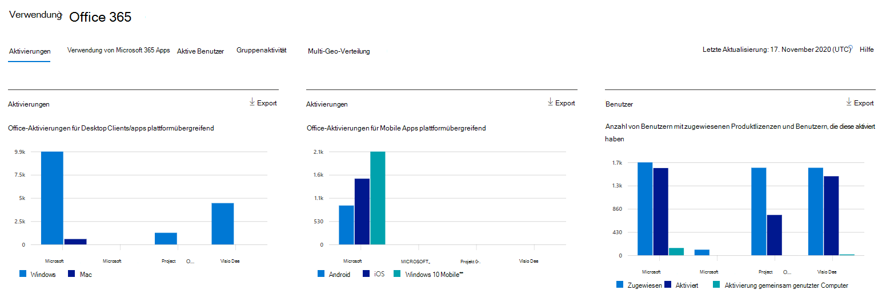
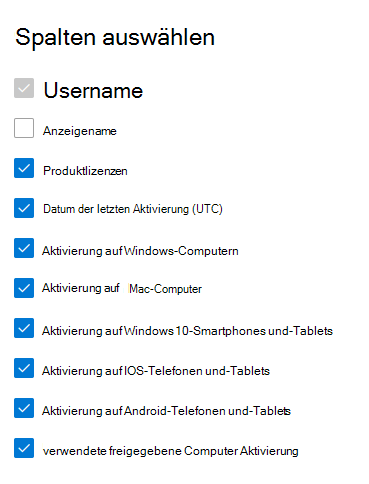

# Microsoft 365-Berichte im Admin Center – Microsoft Office Aktivierungen

Im Microsoft 365 **Reports** -Dashboard wird die Aktivitätsübersicht für die Produkte in Ihrer Organisation angezeigt. Sie können Drilldowns zu Einzelberichten auf Produktebene ausführen und auf diese Weise genauere Einblicke in die Aktivitäten innerhalb der einzelnen Produkte erhalten. Sehen Sie sich die [Übersicht über Berichte](activity-reports.md) an.
  
Im Bericht zu den Office-Aktivierungen wird angezeigt, welche Benutzer ihr Office-Abonnement auf mindestens einem Gerät aktiviert haben. Es enthält eine Aufschlüsselung der Microsoft 365-Apps für Enterprise, Project und Visio pro für Office 365 Abonnement Aktivierungen sowie die Aufteilung von Aktivierungen auf Desktops und Geräte. Dieser Bericht kann hilfreich sein, wenn Sie Benutzer identifizieren möchten, die möglicherweise zusätzliche Hilfe und Unterstützung beim Aktivieren ihres Office-Abonnements benötigen.
  
> [!NOTE]
> Sie müssen ein globaler Administrator, ein globaler Leser oder ein Leser von Berichten in Microsoft 365 oder einer Exchange-, SharePoint-, Teams-Dienst-, Microsoft Teams-oder Skype for Business-Administrator sein, um Berichte anzuzeigen.  
  
## Aufrufen des Berichts zu den Office-Aktivierungen

1. Wechseln Sie im Admin Center zur Seite **Berichte** \> <a href="https://go.microsoft.com/fwlink/p/?linkid=2074756" target="_blank">Verwendung</a>. 
2. Klicken Sie auf der Dashboard-Startseite auf der Office-Aktivierungskarte auf die Schaltfläche **mehr anzeigen** .
  
## Auslegen des Berichts zu den Office-Aktivierungen
  
Sie können die Aktivierungen im Bericht Office 365 anzeigen, indem Sie auf die Registerkarte **Aktivierungen** wählen. 

Wählen Sie **Spalten auswählen** aus, um Spalten zum Bericht hinzuzufügen oder daraus zu entfernen.    

Sie können die Berichtsdaten auch im CSV-Format in eine Excel-Datei exportieren, indem Sie den Link **Exportieren** auswählen. Dadurch werden Daten aller Benutzer exportiert, und Sie können einfache Sortier- und Filtervorgänge zur weiteren Analyse ausführen. Bei weniger als 2.000 Benutzern können Sie innerhalb der Tabelle im Bericht selbst sortieren und filtern. Bei mehr als 2.000 Benutzern müssen Sie die Daten zum Filtern und Sortieren exportieren. 

|Element|Beschreibung|
|:-----|:-----|
|**Metrik**|**Definition**|
|Username    |Die E-Mail-Adresse des Benutzers.    |
|Anzeigename    |Der vollständige Name des Benutzers.    |
|Produktlizenzen    |Die Produkte, die diesem Benutzer zugewiesen sind.    |
|Datum der letzten Aktivierung (UTC)    |Das Datum, an dem der Benutzer Office auf einem Desktop oder auf einem Gerät aktiviert hat.    |
|Aktivierung auf Windows-Computern    |Die Anzahl der Windows-Desktops, auf denen ein Benutzer Office aktiviert hat.    |
|Aktivierung auf Mac-Computern   |Die Anzahl von Mac-Desktops, auf denen ein Benutzer Office aktiviert hat.|
|Aktivierung auf Windows 10-Smartphones und-Tablets    |Die Anzahl der mobilen Windows 10-Geräte, auf denen ein Benutzer Office aktiviert hat.    |
|Aktivierung auf IOS-Telefonen und-Tablets    |Die Anzahl von IOS-Geräten, auf denen ein Benutzer Office aktiviert hat.|
|Aktivierung auf Android-Telefonen und-Tablets    |Die Anzahl der Android-Geräte, auf denen ein Benutzer Office aktiviert hat.    |
|Verwendete freigegebene Computer Aktivierung |Dies gilt, wenn der Benutzer Office über die Aktivierung freigegebener Computer verwendet hat.|
|||
   