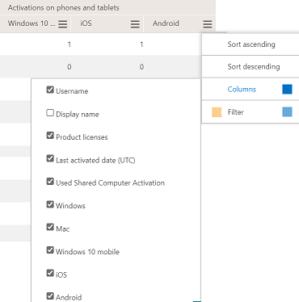

# Microsoft 365-Berichte im Admin Center – Microsoft Office AktivierungenMicrosoft 365 Reports in the admin center - Microsoft Office activations

Das Microsoft 365 **Reports-Dashboard** zeigt Ihnen die Übersicht über die Aktivitäten in den Produkten in Ihrer Organisation.The Microsoft 365 **Reports** dashboard shows you the activity overview across the products in your organization. Sie können Drilldowns zu Einzelberichten auf Produktebene ausführen und auf diese Weise genauere Einblicke in die Aktivitäten innerhalb der einzelnen Produkte erhalten.It enables you to drill in to individual product level reports to give you more granular insight about the activities within each product. Sehen Sie sich die [Übersicht über Berichte](activity-reports.md) an.Check out [the Reports overview topic](activity-reports.md).
  
Im Bericht zu den Office-Aktivierungen wird angezeigt, welche Benutzer ihr Office-Abonnement auf mindestens einem Gerät aktiviert haben.The Office Activation report gives you a view of which users have activated their Office subscription on at least one device. Es enthält eine Aufschlüsselung der Microsoft 365 Apps for Enterprise, Project und Visio Pro für Office 365-Abonnementaktivierungen sowie die Aufschlüsselung der Aktivierungen auf desktop- und geräteübergreifend.It provides a breakdown of the Microsoft 365 Apps for enterprise, Project, and Visio Pro for Office 365 subscription activations, as well as the breakdown of activations across desktop and devices. Dieser Bericht kann hilfreich sein, wenn Sie Benutzer identifizieren möchten, die möglicherweise zusätzliche Hilfe und Unterstützung beim Aktivieren ihres Office-Abonnements benötigen.This report could be useful in helping you identify users that might need additional help and support to activate their Office subscription.
  
> [!NOTE]
> Sie müssen ein globaler Administrator, globaler Leser oder Berichtleser in Microsoft 365 oder ein Exchange-, SharePoint-, Teams-Dienst-, Teams Communications- oder Skype for Business-Administrator sein, um Berichte anzeigen zu können.You must be a global administrator, global reader or reports reader in Microsoft 365 or an Exchange, SharePoint, Teams Service, Teams Communications, or Skype for Business administrator to see reports.  
  
## Aufrufen des Berichts zu den Office-AktivierungenHow to get to the Office activations report

1. Wechseln Sie im Admin Center zur Seite **Berichte** \> <a href="https://admin.microsoft.com/Adminportal/Home?source=applauncher#/reportsUsage" target="_blank">Verwendung</a>.In the admin center, go to the **Reports** \> <a href="https://admin.microsoft.com/Adminportal/Home?source=applauncher#/reportsUsage" target="_blank">Usage</a> page.

    
2. Wählen Sie **in der Dropdownliste** Bericht auswählen die Option **Office 365-Aktivierungen** \> **aus.**From the **Select a report** drop-down, select **Office 365** \> **Activations**. 
  
## Auslegen des Berichts zu den Office-AktivierungenInterpret the Office activations report

Sie erhalten einen Überblick über die Office-Aktivierungen Ihrer Organisation, wenn Sie sich die Diagramme **Aktivierungen** und **Benutzer** ansehen.You can get a view into your organization's Office activations by looking at the **Activations** and **Users** charts. 
  

  
|ElementItem|BeschreibungDescription|
|:-----|:-----|
|11    |Der Bericht "Office-Aktivierungen" enthält den aktuellen Status der Office-Lizenzaktivierungsdaten [zum Datum der Erstellung des Berichts, wie oben rechts im Diagramm angegeben].The Office Activations report presents the current state of the office license activations data [as of the date of the report presented on the top right of the chart].    |
|22    |Die Daten in den einzelnen Berichten decken in der Regel die letzten 24 bis 48 Stunden ab.The data in each report usually covers up to the last 24 to 48 hours.    |
|33    |Im Diagramm **Aktivierungen** wird die Anzahl der Office-Aktivierungen auf Desktops und mobilen Geräten angezeigt.The **Activations** chart shows you the count of Office activations on desktops and devices.    |
|4 4    |Im Diagramm **Benutzer** werden die Anzahl der aktivierten Benutzer und die Benutzer angezeigt, die das Office-Abonnement auf ihren Desktops oder mobilen Geräten aktiviert haben.The **Users** chart shows you the count of users that are enabled, and users that have activated the Office subscription on desktop or devices..    |
|5 5    | Im Diagramm **Aktivierungen** wird auf der Y-Achse die Anzahl der Office-Aktivierungen dargestellt.On the **Activations** chart, the Y axis is the count of Office activations.     Im Diagramm **Benutzer** wird auf der Y-Achse die vom Benutzer ausgeführte Aktivität der Aktivierung von Office dargestellt.On the **Users** chart, the Y axis is the user's performing activity of activating Office.     Die X-Achse bezeichnet in beiden Diagrammen den ausgewählten Zeitraum für diesen bestimmten Bericht.The X axis on both charts is the selected date range for this specific report.    |
|6 6    |Sie können die angezeigten Diagramme filtern, indem Sie ein Element in der Legende auswählen.You can filter charts you see by selecting an item in the legend. Wählen Sie im Diagramm **Aktivierungen** beispielsweise **Windows OS,** **Mac OS,** **Windows 10 mobile,** **iOS** oder **Android** aus, um nur die informationen zu den einzelnen Zust nen zu sehen.For example, on the **Activations** chart, select **Windows OS**, **Mac OS**, **Windows 10 mobile**, **iOS** or **Android** to see only the info related to each one. Durch das Ändern dieser Auswahl werden die Informationen in der Gitternetztabelle nicht geändert.Changing this selection doesn't change the info in the grid table.       |
|7 7    | In der Tabelle wird eine Aufschlüsselung der Office-Aktivierungen auf Benutzerebene angezeigt. Dabei handelt es sich um die Liste aller Benutzer, denen die jeweiligen Office-Produkte zugewiesen sind. Sie können der Tabelle weitere Spalten hinzufügen.  The table shows you a breakdown of Office activations at the user level. This is the list of all user's with the Office product assigned to them. You can add the additional columns to the table.      **Benutzername** ist die E-Mail-Adresse des Benutzers.**Username** is the email address of the user.    **Anzeigename** ist der vollständige Name des Benutzers.**Display name** is the full name of the user.    **Produktlizenzen** sind die Produkte, die diesem Benutzer zugewiesen sind.**Product licenses** is the products that are assigned to this user.    **Datum der letzten Aktivierung** bezieht sich auf das Datum, an dem der Benutzer Office auf einem Desktop oder mobilen Gerät aktiviert hat.**Last activated date** refers to the date the user activated Office on a desktop or a device.    **Die Aktivierung freigegebener Computer** ist true, wenn der Benutzer Office über die Aktivierung freigegebener Computer verwendet hat.**Used Shared Computer Activation** is true if the user used Office through shared computer activation.   **Windows** bezieht sich auf die Anzahl der Windows-Desktops, auf die ein Benutzer Office aktiviert hat.**Windows** refers to the number of Windows desktops a user activated Office on.    **Mac** bezieht sich auf die Anzahl der Mac-Desktops, auf die ein Benutzer Office aktiviert hat.**Mac** refers to the number of Mac desktops a user activated Office on.    **Windows 10 mobile** bezieht sich auf die Anzahl der mobilen Windows 10-Geräte, auf die ein Benutzer Office aktiviert hat.**Windows 10 mobile** refers to the number of Windows 10 mobile devices a user activated Office on.    **iOS** bezieht sich auf die Anzahl der iOS-Geräte, auf die ein Benutzer Office aktiviert hat.**iOS** refers to the number of iOS devices a user activated Office on.    **Android** bezieht sich auf die Anzahl der Android-Geräte, auf die ein Benutzer Office aktiviert hat.**Android** refers to the number of Android devices a user activated Office on.     Wenn die Richtlinien Ihrer Organisation eine Anzeige von Berichten verhindern, in denen Benutzerinformationen identifizierbar sind, können Sie die Datenschutzeinstellung für alle diese Berichte ändern.If your organization's policies prevents you from viewing reports where user information is identifiable, you can change the privacy setting for all these reports. Weitere Informationen finden Sie unter Ausblenden von **Benutzerdetails** im Abschnitt Berichte in [den Aktivitätsberichten im Microsoft 365 Admin Center](activity-reports.md).Check out the **Hide user details in the reports** section in the [Activity Reports in the Microsoft 365 admin center](activity-reports.md).    |
|||
   

