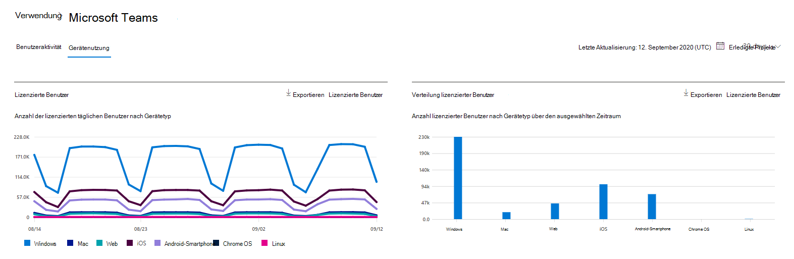
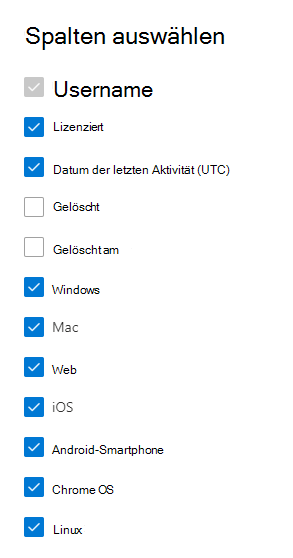

# Microsoft 365-Berichte im Admin Center-Microsoft Teams-Geräteverwendung

Im Microsoft 365 **Reports** -Dashboard wird die Aktivitätsübersicht für die Produkte in Ihrer Organisation angezeigt. Sie können Drilldowns zu Einzelberichten auf Produktebene ausführen und auf diese Weise genauere Einblicke in die Aktivitäten innerhalb der einzelnen Produkte erhalten. Sehen Sie sich die [Übersicht über Berichte](activity-reports.md) an. Der Bericht "Microsoft Teams-App-Verwendung" bietet Ihnen Einblicke in die Microsoft Teams-Apps, die in Ihrer Organisation verwendet werden.
  
> [!NOTE]
> Sie müssen ein globaler Administrator, ein globaler Leser oder ein Leser von Berichten in Microsoft 365 oder einer Exchange-, SharePoint-, Teams-Dienst-, Microsoft Teams-oder Skype for Business-Administrator sein, um Berichte anzuzeigen.  
 
## Abrufen des Berichts "Microsoft Teams-App-Verwendung"

1. Wechseln Sie im Admin Center zur Seite **Berichte** \> <a href="https://go.microsoft.com/fwlink/p/?linkid=2074756" target="_blank">Verwendung</a>. 
2. Klicken Sie auf der Dashboard-Startseite auf die Schaltfläche **mehr anzeigen** auf der Microsoft Teams-Aktivitäts Karte.
  
## Interpretieren des Berichts "Microsoft Teams-App-Verwendung"

Sie können die Verwendung des Geräts im Bericht "Teams" anzeigen, indem Sie die Registerkarte " **Gerätenutzung** " auswählen. 

Wählen Sie **Spalten auswählen** aus, um Spalten zum Bericht hinzuzufügen oder daraus zu entfernen.    

Sie können die Berichtsdaten auch im CSV-Format in eine Excel-Datei exportieren, indem Sie den Link **Exportieren** auswählen. Dadurch werden Daten aller Benutzer exportiert, und Sie können einfache Sortier- und Filtervorgänge zur weiteren Analyse ausführen. Bei weniger als 2.000 Benutzern können Sie innerhalb der Tabelle im Bericht selbst sortieren und filtern. Bei mehr als 2.000 Benutzern müssen Sie die Daten zum Filtern und Sortieren exportieren. 
  
|Element|Beschreibung|
|:-----|:-----|
|**Metrik**|**Definition**|
|Benutzername    |Der Anzeigename des Benutzers. Sie können auf den Anzeigenamen klicken, um zur Seite Einstellungen des Benutzers im Microsoft Teams Admin Center zu wechseln.    |
|Windows    |Ausgewählt, wenn der Benutzer im Microsoft Teams-Desktop Client auf einem Windows-basierten Computer aktiv war.    |
|Mac    |Ausgewählt, wenn der Benutzer auf einem macOS-Computer im Microsoft Teams-Desktop Client aktiv war.    |
|iOS    |Ausgewählt, wenn der Benutzer auf dem mobilen Microsoft Teams-Client für IOS aktiv war.    |
|Android-Smartphone    | Ausgewählt, wenn der Benutzer auf dem mobilen Microsoft Teams-Client für Android aktiv war.    |
|Chrome OS    |Ausgewählt, wenn der Benutzer im Microsoft Teams-Desktop Client auf einem Computer mit Chrome aktiv war.|
|Linux    | Ausgewählt, wenn der Benutzer im Microsoft Teams-Desktop Client auf einem Linux-Computer aktiv war.    |
|Web    |Ausgewählt, wenn der Benutzer im Microsoft Teams-WebClient auf Geräten aktiv war.|
|Datum der letzten Aktivität (UTC)    |Das letzte Datum (UTC), an dem der Benutzer an einer Teams-Aktivität teilgenommen hat.    |
|Lizenziert|Ausgewählt, wenn der Benutzer für die Verwendung von Microsoft Teams lizenziert ist.|
|||