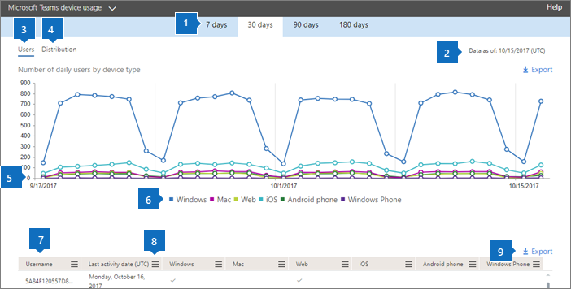

# Microsoft 365-Berichte im Admin Center – Geräteverwendung von Microsoft Teams

Das Microsoft 365 **Reports-Dashboard** zeigt Ihnen die Übersicht über die Aktivitäten in den Produkten in Ihrer Organisation. Sie können Drilldowns zu Einzelberichten auf Produktebene ausführen und auf diese Weise genauere Einblicke in die Aktivitäten innerhalb der einzelnen Produkte erhalten. Sehen Sie sich die [Übersicht über Berichte](activity-reports.md) an. Der Bericht "Microsoft Teams-App-Verwendung" bietet Ihnen Einblicke in die Microsoft Teams-Apps, die in Ihrer Organisation verwendet werden.
  
> [!NOTE]
> Sie müssen ein globaler Administrator, globaler Leser oder Berichtleser in Microsoft 365 oder ein Exchange-, SharePoint-, Teams-Dienst-, Teams Communications- oder Skype for Business-Administrator sein, um Berichte anzeigen zu können.  
 
## Abrufen des Berichts "Microsoft Teams-App-Verwendung"

1. Wechseln Sie im Admin Center zur Seite **Berichte** \> <a href="https://go.microsoft.com/fwlink/p/?linkid=2074756" target="_blank">Verwendung</a>.

    
2. Wählen Sie **in der Dropdownliste** Bericht auswählen die **Option Microsoft Teams** Device usage \> **aus.**
  
## Interpretieren des Berichts "Microsoft Teams-App-Verwendung"

Die Microsoft Teams-App-Verwendung wird in den Diagrammen **Benutzer** und **Verteilung** grafisch dargestellt. 
  

  
|Element|Beschreibung|
|:-----|:-----|
|1.    |Im Bericht **Microsoft Teams-Gerätenutzung** werden die Trends über die letzten 7 Tage, 30 Tage, 90 Tage oder 180 Tage angezeigt. Wenn Sie im Bericht jedoch einen bestimmten Tag auswählen, werden in der Tabelle (7) Daten für bis zu 28 Tage ab dem aktuellen Datum angezeigt (nicht ab dem Datum, an dem der Bericht generiert wurde).    |
|2.    |Die Daten in den einzelnen Berichten decken in der Regel die letzten 24 bis 48 Stunden ab.    |
|3.    |In der Ansicht **Benutzer** wird die tägliche Anzahl der eindeutigen Benutzer nach App angezeigt.    |
|4.    |In der Ansicht **Verteilung** wird die Anzahl der eindeutigen Benutzer im ausgewählten Zeitraum nach App angezeigt.    |
|5.    | Im Diagramm **Benutzer** stellt die Y-Achse die Anzahl der Benutzer pro App dar.     Im Diagramm **Verteilung** stellt die Y-Achse die Anzahl der Benutzer der angegebenen App dar.     Die X-Achse stellt in den Diagrammen den ausgewählten Datumsbereich für den jeweiligen Bericht dar.    |
|6.    |Sie können die im Diagramm angezeigte Datenreihe filtern, indem Sie in der Legende ein Element auswählen. Wählen Sie im  Diagramm Benutzer beispielsweise **Windows,** **Mac,** **Anrufe,** **Web,** **Android-Telefon** oder **Windows-Telefon** aus, um nur die Informationen zu den einzelnen Telefonen zu sehen. Durch das Ändern dieser Auswahl werden die Informationen in der Gitternetztabelle nicht geändert.    |
|7.    | Die Liste der angezeigten Gruppen wird von der Anzahl aller Gruppen bestimmt, die über den längsten Berichtszeitraum (180 Tage) vorhanden waren (nicht gelöscht wurden). Die Anzahl der Aktivitäten variiert entsprechend der Datumsauswahl.    HINWEIS: Möglicherweise werden nicht alle Elemente in der nachstehenden Liste in den Spalten angezeigt, solange Sie diese nicht hinzugefügt haben.  **Benutzername** ist die E-Mail-Adresse des Benutzers. Sie können die eigentliche E-Mail-Adresse anzeigen oder dieses Feld anonymisieren.    **Datum der letzten Aktivität (UTC)** bezieht sich auf das letzte Datum, an dem der Benutzer an einer Microsoft Teams-Aktivität in einer App teilgenommen hat.    **Gelöscht** gibt an, ob das Team gelöscht wurde. Wenn das Team gelöscht wurde, im Berichtszeitraum jedoch Aktivitäten ausgeführt wurden, wird es im Raster angezeigt, und die Gelöscht-Kennzeichnung ist auf TRUE festgelegt.    **Gelöscht am** ist das Datum, an dem das Team gelöscht wurde.    **Windows** ist ausgewählt, wenn der Benutzer während des angegebenen Zeitraums in der Windows-App aktiv war.    **Mac** ist ausgewählt, wenn der Benutzer während des angegebenen Zeitraums in einer Mac-App aktiv war.    **Web** ist ausgewählt, wenn der Benutzer während des angegebenen Zeitraums in einer Web-App aktiv war.    **iOS** ist ausgewählt, wenn der Benutzer während des angegebenen Zeitraums in einer iOS-App aktiv war.    **Android-Smartphone** ist ausgewählt, wenn der Benutzer während des angegebenen Zeitraums an einem Android-Smartphone aktiv war.    **Windows Phone** ist ausgewählt, wenn der Benutzer während des angegebenen Zeitraums an einem Windows Phone aktiv war.     Wenn die Richtlinien Ihrer Organisation eine Anzeige von Berichten verhindern, in denen Benutzerinformationen identifizierbar sind, können Sie die Datenschutzeinstellung für alle diese Berichte ändern. Lesen Sie den Abschnitt zum **Ausblenden von Details auf Benutzerebene** in den [Aktivitätsberichten im Microsoft 365 Admin Center](activity-reports.md).    |
|8.    |Wählen Sie **Spalten** aus, um Spalten zum Bericht hinzuzufügen oder daraus zu entfernen.    |
|9.    |Sie können die Berichtsdaten auch im CSV-Format in eine Excel-Datei exportieren, indem Sie den Link **Exportieren** auswählen. Dadurch werden Daten aller Benutzer exportiert, und Sie können einfache Sortier- und Filtervorgänge zur weiteren Analyse ausführen. Bei weniger als 2.000 Benutzern können Sie innerhalb der Tabelle im Bericht selbst sortieren und filtern. Bei mehr als 2.000 Benutzern müssen Sie die Daten zum Filtern und Sortieren exportieren.    |
|||
   
  

