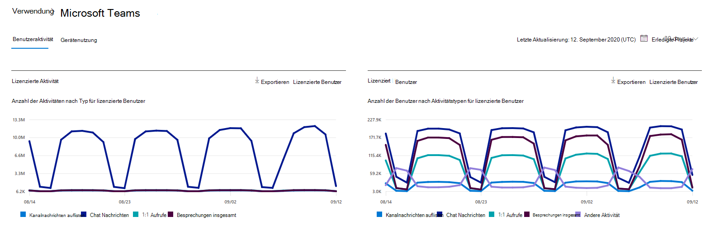
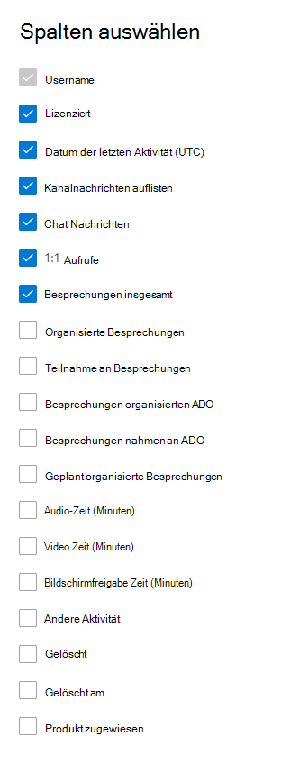

# Microsoft 365-Berichte im Admin Center-Microsoft Teams-BenutzeraktivitätMicrosoft 365 Reports in the admin center - Microsoft Teams user activity

Im Microsoft 365 **Reports** -Dashboard wird die Aktivitätsübersicht für die Produkte in Ihrer Organisation angezeigt.The Microsoft 365 **Reports** dashboard shows you the activity overview across the products in your organization. Sie können Drilldowns zu Einzelberichten auf Produktebene ausführen und auf diese Weise genauere Einblicke in die Aktivitäten innerhalb der einzelnen Produkte erhalten.It enables you to drill in to individual product level reports to give you more granular insight about the activities within each product. Sehen Sie sich die [Übersicht über Berichte](activity-reports.md) an.Check out [the Reports overview topic](activity-reports.md). Der Bericht "Microsoft Teams-Benutzeraktivität" bietet Ihnen Einblicke in die Microsoft Teams-Aktivitäten in Ihrer Organisation.In the Microsoft Teams user activity report, you can gain insights into the Microsoft Teams activity in your organization.
  
> [!NOTE]
> Sie müssen ein globaler Administrator, ein globaler Leser oder ein Leser von Berichten in Microsoft 365 oder einer Exchange-, SharePoint-, Teams-Dienst-, Microsoft Teams-oder Skype for Business-Administrator sein, um Berichte anzuzeigen.You must be a global administrator, global reader or reports reader in Microsoft 365 or an Exchange, SharePoint, Teams Service, Teams Communications, or Skype for Business administrator to see reports.  
 
## Abrufen des Berichts "Microsoft Teams-Benutzeraktivität"How to get to the Microsoft Teams user activity report

1. Wechseln Sie im Admin Center zur Seite **Berichte** \> <a href="https://go.microsoft.com/fwlink/p/?linkid=2074756" target="_blank">Verwendung</a>.In the admin center, go to the **Reports** \> <a href="https://go.microsoft.com/fwlink/p/?linkid=2074756" target="_blank">Usage</a> page.
2. Klicken Sie auf der Dashboard-Startseite auf die Schaltfläche **mehr anzeigen** auf der Microsoft Teams-Aktivitäts Karte.From the dashboard homepage, click on the **View more** button on the Microsoft Teams activity card.
  
## Interpretieren des Berichts "Microsoft Teams-Benutzeraktivität"Interpret the Microsoft Teams user activity report

Sie können die Benutzeraktivität im Bericht "Teams" anzeigen, indem Sie die Registerkarte **Benutzeraktivität** auswählen.You can view the user activity in the Teams report by choosing the **User activity** tab.  

Wählen Sie **Spalten auswählen** aus, um Spalten zum Bericht hinzuzufügen oder daraus zu entfernen.Select **Choose columns** to add or remove columns from the report.    

Sie können die Berichtsdaten auch im CSV-Format in eine Excel-Datei exportieren, indem Sie den Link **Exportieren** auswählen.You can also export the report data into an Excel .csv file by selecting the **Export** link. Dadurch werden Daten aller Benutzer exportiert, und Sie können einfache Sortier- und Filtervorgänge zur weiteren Analyse ausführen.This exports data of all users and enables you to do simple sorting and filtering for further analysis. Bei weniger als 2.000 Benutzern können Sie innerhalb der Tabelle im Bericht selbst sortieren und filtern.If you have less than 2000 users, you can sort and filter within the table in the report itself. Bei mehr als 2.000 Benutzern müssen Sie die Daten zum Filtern und Sortieren exportieren.If you have more than 2000 users, in order to filter and sort, you will need to export the data. Das exportierte Format für **Audiozeit**, **Video Zeit** und **Bildschirmfreigabe Zeit** folgt dem ISO8601-Datumsformat.The exported format for **audio time**, **video time** and **screen share time** follows ISO8601 date format.

|ElementItem|BeschreibungDescription|
|:-----|:-----|
|**Metrik****Metric**|**Definition****Definition**|
|BenutzernameUser name    |Die E-Mail-Adresse des Benutzers.The email address of the user. Sie können die eigentliche E-Mail-Adresse anzeigen oder dieses Feld anonymisieren.You can display the actual email address or make this field anonymous.     |
|Kanal NachrichtenChannel messages     |Die Anzahl der eindeutigen Nachrichten, die der Benutzer während des angegebenen Zeitraums in einem Teamchat gepostet hat.The number of unique messages that the user posted in a team chat during the specified time period.    |
|Chat NachrichtenChat messages     |Die Anzahl der eindeutigen Nachrichten, die der Benutzer während des angegebenen Zeitraums in einem privaten Chat gepostet hat.The number of unique messages that the user posted in a private chat during the specified time period.    |
|Besprechungen insgesamtTotal meetings     |Die Anzahl der Onlinebesprechungen, an denen der Benutzer während des angegebenen Zeitraums teilgenommen hat.The number of online meetings that the user participated in during the specified time period.    |
|1:1 Anrufe1:1 calls     | Die Anzahl der 1:1 Anrufe, an denen der Benutzer während des angegebenen Zeitraums teilgenommen hat.The number of 1:1 calls that the user participated in during the specified time period.    |
|Datum der letzten Aktivität (UTC)Last activity date (UTC)    |Das letzte Datum, an dem der Benutzer an einer Microsoft Teams-Aktivität teilgenommen hat.The last date that the user participated in a Microsoft Teams activity.  |
|Teilnahme an Adhoc-BesprechungenMeetings participated adhoc     | Die Anzahl der Besprechungen, die im Kalender nicht geplant sind, an denen der Benutzer während des angegebenen Zeitraums teilgenommen hat.The number of  meetings not scheduled on the calendar that the user participated in during the specified time period.    |
|Organisierte Meetings AdhocMeetings organized adhoc   |Die Anzahl der Besprechungen, die im Kalender nicht geplant sind, die der Benutzer während des angegebenen Zeitraums organisiert hat.The number of meetings not scheduled on the calendar that the user organized during the specified time period.  |
|Geplant organisierte BesprechungenMeetings organized scheduled    |Die Anzahl geplanter Besprechungen, die ein Benutzer während des angegebenen Zeitraums organisiert hat.The number of scheduled meetings  a user organized during the specified time period.    |
|LizenziertIs licensed |Ausgewählt, wenn der Benutzer für die Verwendung von Microsoft Teams lizenziert ist.Selected if the user is licensed to use Teams.|
|Andere AktivitätOther activity|der Benutzer wird als aktiv betrachtet, hat aber einen Nullwert für die Chat Nachrichten, 1:1 Anrufe, Kanal Nachrichten, Gesamt Besprechungen und Besprechungen organisierten metrischen Werte.the User is considered active but has a zero value for the Chat Messages, 1:1 calls, Channel Messages, Total Meetings, and Meetings organized metric values. Beispiele für Aktionen sind, wenn ein Benutzer einen Kanal Nachrichtenbeitrag öffnet, aber nicht antwortet oder wenn eine private Nachricht empfangen wird und Sie gelesen, aber nicht geantwortet wird.Examples actions are when a user opens a Channel Message post but does not reply or when a Private message is received and it is read but not responded to. |
|||