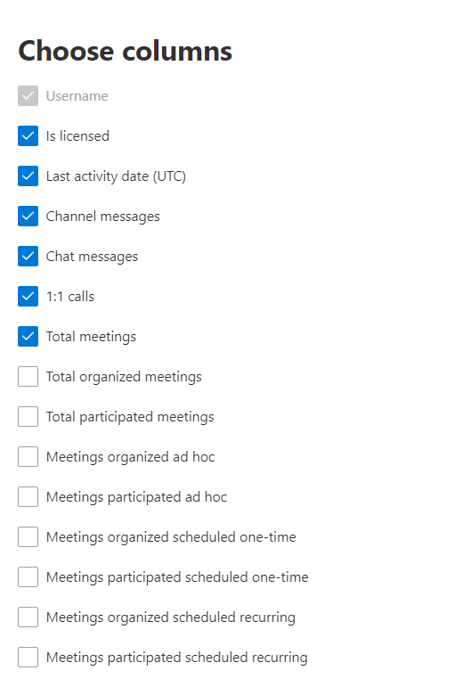

# Microsoft 365 Berichte im Admin Center – Microsoft Teams Benutzeraktivität

Das Microsoft 365 **-Dashboard** zeigt Ihnen die Übersicht über die Aktivitäten in den Produkten in Ihrer Organisation. Sie können Drilldowns zu Einzelberichten auf Produktebene ausführen und auf diese Weise genauere Einblicke in die Aktivitäten innerhalb der einzelnen Produkte erhalten. Sehen Sie sich die [Übersicht über Berichte](activity-reports.md) an. Der Bericht "Microsoft Teams-Benutzeraktivität" bietet Ihnen Einblicke in die Microsoft Teams-Aktivitäten in Ihrer Organisation.
  
> [!NOTE]
> Sie müssen ein globaler Administrator, globaler Leser oder Berichtleser in Microsoft 365 oder ein Exchange-, SharePoint-, Teams-Dienst-, Teams-Kommunikations- oder Skype for Business-Administrator sein, um Berichte anzeigen zu können.  
 
## Abrufen des Berichts "Microsoft Teams-Benutzeraktivität"

1. Wechseln Sie im Admin Center zur Seite **Berichte** \> <a href="https://go.microsoft.com/fwlink/p/?linkid=2074756" target="_blank">Verwendung</a>.
2. Klicken Sie auf der Dashboard-Homepage auf **die** Schaltfläche Weitere Anzeigen auf der Microsoft Teams Aktivitätskarte.

## Interpretieren des Berichts "Microsoft Teams-Benutzeraktivität"

Sie können die Benutzeraktivität im Teams anzeigen, indem Sie die Registerkarte **Benutzeraktivität** auswählen.  

Wählen **Sie Spalten auswählen** aus, um Spalten aus dem Bericht hinzuzufügen oder zu entfernen.    

Sie können die Berichtsdaten auch im CSV-Format in eine Excel-Datei exportieren, indem Sie den Link **Exportieren** auswählen. Dadurch werden Daten aller Benutzer exportiert, und Sie können einfache Sortier- und Filtervorgänge zur weiteren Analyse ausführen. Bei weniger als 2.000 Benutzern können Sie innerhalb der Tabelle im Bericht selbst sortieren und filtern. Bei mehr als 2.000 Benutzern müssen Sie die Daten zum Filtern und Sortieren exportieren. Das exportierte Format für **Audiozeit,** **Videozeit** und **Bildschirmfreigabezeit** folgt dem ISO8601-Dauerformat.

Im Bericht **Microsoft Teams-Benutzeraktivität** werden die Trends über die letzten 7 Tage, 30 Tage, 90 Tage oder 180 Tage angezeigt. Wenn Sie im Bericht jedoch einen bestimmten Tag auswählen, werden in der Tabelle (7) Daten für bis zu 28 Tage ab dem aktuellen Datum angezeigt (nicht ab dem Datum, an dem der Bericht generiert wurde).

Um die Datenqualität sicherzustellen, führen wir tägliche Datenüberprüfungen für die letzten drei Tage durch und füllen alle erkannten Lücken. Während des Prozesses können Unterschiede in verlaufshistorischen Daten festgestellt werden.

|Element|Beschreibung|
|:-----|:-----|
|**Metrik**|**Definition**|
|Benutzername    |Die E-Mail-Adresse des Benutzers. Sie können die eigentliche E-Mail-Adresse anzeigen oder dieses Feld anonymisieren.     |
|Kanalnachrichten     |Die Anzahl eindeutiger Nachrichten, die der Benutzer während des angegebenen Zeitraums in einem Teamchat gepostet hat.    |
|Chat-Nachrichten     |Die Anzahl eindeutiger Nachrichten, die der Benutzer während des angegebenen Zeitraums in einem privaten Chat gepostet hat.    |
|Besprechungen insgesamt     |Die Anzahl der Onlinebesprechungen, an der der Benutzer während des angegebenen Zeitraums teilgenommen hat.    |
|1:1-Anrufe     | Die Anzahl der 1:1-Anrufe, an der der Benutzer während des angegebenen Zeitraums teilgenommen hat.    |
|Datum der letzten Aktivität (UTC)    |Das letzte Datum, an dem der Benutzer an einer Microsoft Teams teilgenommen hat.  |
|Ad-hoc-Besprechungen     | Die Anzahl der Ad-hoc-Besprechungen, an der ein Benutzer während des angegebenen Zeitraums teilgenommen hat.    |
|Ad-hoc-Organisierte Besprechungen   |Die Anzahl der Ad-hoc-Besprechungen, die ein Benutzer während des angegebenen Zeitraums organisiert hat.  |
|Insgesamt organisierte Besprechungen    |Die Summe der einmal geplanten, wiederkehrenden, ad hoc- und nicht klassifizierten Besprechungen, die ein Benutzer während des angegebenen Zeitraums organisiert hat.    |
|Insgesamt teilgenommene Besprechungen    |Die Summe der einmal geplanten, wiederkehrenden, ad hoc und nicht klassifizierten Besprechungen, an der ein Benutzer während des angegebenen Zeitraums teilgenommen hat.    |
|Einmal geplante Besprechungen    |Die Anzahl der einmal geplanten Besprechungen, die ein Benutzer während des angegebenen Zeitraums organisiert hat.    |
|Besprechungen mit geplanten Terminserien    |Die Anzahl wiederkehrender Besprechungen, die ein Benutzer während des angegebenen Zeitraums organisiert hat.    |
|Besprechungen wurden einmal geplant    |Die Anzahl der einmal geplanten Besprechungen, an der ein Benutzer während des angegebenen Zeitraums teilgenommen hat.    |
|Besprechungen teilnahmen an geplanten Terminserien    |Die Anzahl der besprechungsserien, an der ein Benutzer während des angegebenen Zeitraums teilgenommen hat.    |
|Ist lizenziert    |Ausgewählt, wenn der Benutzer für die Verwendung von Teams.  |
|Andere Aktivitäten   |Der Benutzer ist aktiv, hat aber andere Aktivitäten ausgeführt als im Bericht angebotene offengelegte Aktionstypen (Senden oder Antworten auf Kanalnachrichten und Chatnachrichten, Planen oder Teilnehmen an 1:1-Anrufen und Besprechungen). Beispielaktionen sind, wenn ein Benutzer den Status Teams status oder Teams oder einen Kanalnachrichtenbeitrag öffnet, aber nicht antwortet.   |
|Nicht klassifizierte Besprechungen  |Die, die nicht als Zeitplan oder Terminserie oder ad hoc klassifiziert werden kann. Diese sind kurz und können aufgrund manipulierter Telemetrieinformationen meist nicht identifiziert werden. |
|||