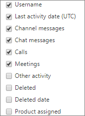

# Microsoft 365 Admin Center-Berichte – Microsoft Teams Benutzeraktivität

Das Dashboard Microsoft 365 **Berichte** zeigt Ihnen die Aktivitätsübersicht für alle Produkte in Ihrer Organisation. Sie können Drilldowns zu Einzelberichten auf Produktebene ausführen und auf diese Weise genauere Einblicke in die Aktivitäten innerhalb der einzelnen Produkte erhalten. Sehen Sie sich die [Übersicht über Berichte](activity-reports.md) an. Der Bericht "Microsoft Teams-Benutzeraktivität" bietet Ihnen Einblicke in die Microsoft Teams-Aktivitäten in Ihrer Organisation.
  
> [!NOTE]
> Sie müssen ein globaler Administrator, ein globaler Leser oder ein Leser von Berichten in Microsoft 365 oder ein Exchange-, SharePoint-, Teams-Dienst-, Teams- oder Skype for Business-Administrator sein, um Berichte anzeigen zu können.  
 
## Abrufen des Berichts "Microsoft Teams-Benutzeraktivität"

1. Wechseln Sie im Admin Center zur Seite **Berichte** \> <a href="https://go.microsoft.com/fwlink/p/?linkid=2074756" target="_blank">Verwendung</a>.

    
2. Wählen Sie in der Dropdownliste **"Bericht auswählen"** **Microsoft Teams** \> **Benutzeraktivität** aus.
  
## Interpretieren des Berichts "Microsoft Teams-Benutzeraktivität"

Die Microsoft Teams-Benutzeraktivität wird in den Diagrammen **Aktivität** und **Benutzer** grafisch dargestellt. 
  
|Element|Beschreibung|
|:-----|:-----|
|1.    |Im Bericht **Microsoft Teams-Benutzeraktivität** werden die Trends über die letzten 7 Tage, 30 Tage, 90 Tage oder 180 Tage angezeigt. Wenn Sie im Bericht jedoch einen bestimmten Tag auswählen, werden in der Tabelle (7) Daten für bis zu 28 Tage ab dem aktuellen Datum angezeigt (nicht ab dem Datum, an dem der Bericht generiert wurde).    |
|2.    |Die Daten in den einzelnen Berichten decken in der Regel die letzten 24 bis 48 Stunden ab.    |
|3.    |Um die Datenqualität sicherzustellen, führen wir tägliche Datenüberprüfungen für die letzten fünf Tage durch und füllen alle erkannten Lücken. Möglicherweise stellen Sie während des Prozesses Unterschiede bei verlaufshistorischen Daten fest.    |
|4.    |In der Ansicht **Aktivität** wird die Anzahl der Microsoft Teams-Aktivitäten nach Aktivitätstyp angezeigt. Die Aktivitätstypen sind Anzahl von Teamchatnachrichten, privaten Chatnachrichten, Anrufen oder Besprechungen.    |
|5.    |In der Ansicht **Benutzer** wird die Anzahl der Benutzer nach Aktivitätstyp angezeigt. Die Aktivitätstypen sind Anzahl von Teamchatnachrichten, privaten Chatnachrichten, Anrufen oder Besprechungen.    |
|6.    | Im **Diagramm Aktivität** ist die Y-Achse die Anzahl der angegebenen Aktivitäten.     Im Diagramm **"Dateien"** ist die Y-Achse die Anzahl der Benutzer, die an Teams-Chats, privaten Chats, Anrufen oder Besprechungen teilnehmen.     Die X-Achse in den Diagrammen ist der ausgewählte Datumsbereich für den spezifischen Bericht.    |
|7.    |Sie können die im Diagramm angezeigte Datenreihe filtern, indem Sie in der Legende ein Element auswählen. Wählen Sie beispielsweise im **Diagramm "Aktivität"** **Kanalnachrichten,** **Chatnachrichten,** **Anrufe** oder **Besprechungen** aus, um nur die jeweils zugehörigen Informationen anzuzeigen. Durch das Ändern dieser Auswahl werden die Informationen in der Gitternetztabelle nicht geändert.    |
|8.    | Die Liste der angezeigten Gruppen wird von der Anzahl aller Gruppen bestimmt, die über den längsten Berichtszeitraum (180 Tage) vorhanden waren (nicht gelöscht wurden). Die Anzahl der Aktivitäten variiert entsprechend der Datumsauswahl.    HINWEIS: Möglicherweise werden nicht alle Elemente in der nachstehenden Liste in den Spalten angezeigt, solange Sie diese nicht hinzugefügt haben. **Benutzername** ist die E-Mail-Adresse des Benutzers. Sie können die eigentliche E-Mail-Adresse anzeigen oder dieses Feld anonymisieren.    **Datum der letzten Aktivität (UTC)** bezieht sich auf das letzte Datum, an dem der Benutzer an einer Microsoft Teams-Aktivität teilgenommen hat.    **Kanalnachrichten** ist die Anzahl der eindeutigen Nachrichten, die der Benutzer in einem Teamchat während des angegebenen Zeitraums gepostet hat.    **Chatnachrichten** ist die Anzahl der eindeutigen Nachrichten, die der Benutzer in einem privaten Chat während des angegebenen Zeitraums gepostet hat.    **Anrufe** ist die Anzahl der Anrufe, an denen der Benutzer während des angegebenen Zeitraums teilgenommen hat.    **Besprechungen** ist die Anzahl der Onlinebesprechungen, an denen der Benutzer während des angegebenen Zeitraums teilgenommen hat.    **Andere Aktivität** ist die Anzahl anderer Teamaktivitäten des Benutzers.    **Gelöscht** gibt an, ob das Team gelöscht wurde. Wenn das Team gelöscht wurde, im Berichtszeitraum jedoch Aktivitäten ausgeführt wurden, wird es im Raster angezeigt, und die Gelöscht-Kennzeichnung ist auf TRUE festgelegt.    **Gelöscht am** ist das Datum, an dem das Team gelöscht wurde.    **Zugewiesenes Produkt** bezeichnet die Liste der Produkte, die dem Benutzer zugewiesen sind.     Wenn Die Richtlinien Ihrer Organisation verhindern, dass Sie Berichte anzeigen, in denen Benutzerinformationen identifizierbar sind, können Sie die Datenschutzeinstellung für alle diese Berichte ändern. Lesen Sie den Abschnitt zum **Ausblenden von Details auf Benutzerebene** in den [Aktivitätsberichten im Microsoft 365 Admin Center](activity-reports.md).    |
|9.    |Wählen Sie **Spalten** aus, um Spalten zum Bericht hinzuzufügen oder daraus zu entfernen.    |
|10.    |Sie können die Berichtsdaten auch im CSV-Format in eine Excel-Datei exportieren, indem Sie den Link **Exportieren** auswählen. Dadurch werden Daten aller Benutzer exportiert, und Sie können einfache Sortier- und Filtervorgänge zur weiteren Analyse ausführen. Bei weniger als 2.000 Benutzern können Sie innerhalb der Tabelle im Bericht selbst sortieren und filtern. Bei mehr als 2.000 Benutzern müssen Sie die Daten zum Filtern und Sortieren exportieren.    |
|||
   

