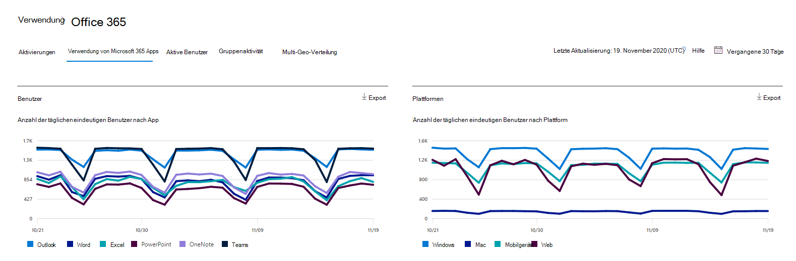

# Microsoft 365 Berichte im Admin Center – Microsoft 365 Apps Verwendung

Das Microsoft 365 **-Dashboard** zeigt Ihnen die Übersicht über die Aktivitäten in den Produkten in Ihrer Organisation. Sie können Drilldowns zu Einzelberichten auf Produktebene ausführen und auf diese Weise genauere Einblicke in die Aktivitäten innerhalb der einzelnen Produkte erhalten. Sehen Sie sich die [Übersicht über Berichte](activity-reports.md) an.

 Beispielsweise können Sie die Aktivitäten der einzelnen Benutzer verstehen, die für die Verwendung von Microsoft 365 Apps-Apps lizenziert sind, indem Sie sich ihre Aktivitäten in den Apps und deren Nutzung auf verschiedenen Plattformen anschauen.

 > [!NOTE]
 > Sie müssen ein globaler Administrator, globaler Leser oder Berichtleser in Microsoft 365 oder ein Exchange-, SharePoint- oder Skype for Business-Administrator sein, um Berichte anzeigen zu können. Aktivierungen freigegebener Computer sind in diesem Bericht nicht enthalten.

## So erhalten Sie den Microsoft 365 Apps Nutzungsbericht

1. Wechseln Sie im Admin Center zur Seite **Berichte** \> <a href="https://go.microsoft.com/fwlink/p/?linkid=2074756" target="_blank">Verwendung</a>. 
2. Klicken Sie auf der Startseite des Dashboards auf **die** Schaltfläche Weitere Anzeigen auf der Microsoft 365 Apps Aktive Benutzer.

## Interpretieren des Microsoft 365 Apps Verwendungsberichts

Sie können einen Einblick in die Aktivitäten Ihres Benutzers  Microsoft 365 Apps, indem Sie sich die Benutzer- und **Plattformdiagramme** ansehen.

> [!div class="mx-imgBorder"]
> 

|Element|Beschreibung|
 |:-----|:-----|
 |1.   |Der **Microsoft 365 Apps verwendungsbericht** kann für Trends der letzten 7 Tage, 30 Tage, 90 Tage oder 180 Tage angezeigt werden. Wenn Sie im Bericht jedoch einen bestimmten Tag auswählen, werden in der Tabelle (7) Daten für bis zu 28 Tage ab dem aktuellen Datum angezeigt (nicht ab dem Datum, an dem der Bericht generiert wurde).   |
 |2.   |Die Daten in den einzelnen Berichten decken in der Regel bis zu den letzten beiden Tagen ab. Alle sechs Tage aktualisieren wir den Bericht mit kleinen Updates, um die Datenqualität sicherzustellen.   |
 |3.   |Die **Ansicht** Benutzer zeigt den Trend in der Anzahl der aktiven Benutzer für jede App an – Outlook, Word, Excel, PowerPoint, OneNote und Teams. "Aktive Benutzer" sind alle Personen, die beabsichtigte Aktionen in diesen Apps ausführen.   |
 |4.   |Die **Ansicht Plattformen** zeigt den Trend aktiver Benutzer für alle Apps für jede Plattform – Windows, Mac, Web und Mobile.   |
 |5. |Im Diagramm **Benutzer** ist die Y-Achse die Anzahl der eindeutigen aktiven Benutzer für die jeweilige App. Im **Diagramm Plattformen**   ist die Y-Achse die Anzahl eindeutiger Benutzer für die jeweilige Plattform. Die X-Achse in beiden Diagrammen ist das Datum, an dem eine App auf einer bestimmten Plattform verwendet wurde. |
 6. |Sie können die im Diagramm angezeigte Datenreihe filtern, indem Sie in der Legende ein Element auswählen. Wählen Sie beispielsweise  im Diagramm Benutzer die Option Outlook, Word, Excel, PowerPoint, OneDrive oder Teams aus, um nur die jeweils zugehörigen Informationen zu sehen. Wenn Sie diese Auswahl ändern, werden die Informationen in der darunter stehenden Rastertabelle nicht geändert.|
 |7. |Die Tabelle zeigt eine Auflistung der Daten nach Benutzerebene. Sie können Spalten zur Tabelle hinzufügen oder aus der Tabelle entfernen.    **Benutzername** ist die E-Mail-Adresse des Benutzers, der die Aktivität auf Microsoft Apps.  **Das letzte Aktivierungsdatum (UTC)** ist das letzte Datum, an dem der Benutzer sein Microsoft 365 Apps hat.  **Das Datum der letzten Aktivität (UTC)** ist das letzte Datum, an dem eine beabsichtigte Aktivität vom Benutzer ausgeführt wurde. Um Aktivitäten anzuzeigen, die an einem bestimmten Datum stattfanden, wählen Sie das Datum direkt im Diagramm aus.  Die anderen Spalten identifizieren, ob der Benutzer auf dieser Plattform für diese App (innerhalb Microsoft 365 Apps) im ausgewählten Zeitraum aktiv war. |
 |8. |Wählen Sie **das Symbol Spalten auswählen** aus, um Spalten aus dem Bericht hinzuzufügen oder zu entfernen.|
 |9. |Sie können die Berichtsdaten auch im CSV-Format in eine Excel-Datei exportieren, indem Sie den Link **Exportieren** auswählen. Dadurch werden Daten für alle Benutzer exportiert, und Sie können einfache Aggregation, Sortierung und Filterung für weitere Analysen durchführen. Wenn Sie weniger als 100 Benutzer haben, können Sie innerhalb der Tabelle im Bericht selbst sortieren und filtern. Wenn Sie mehr als 100 Benutzer haben, müssen Sie die Daten exportieren, um filtern und sortieren zu können.|
