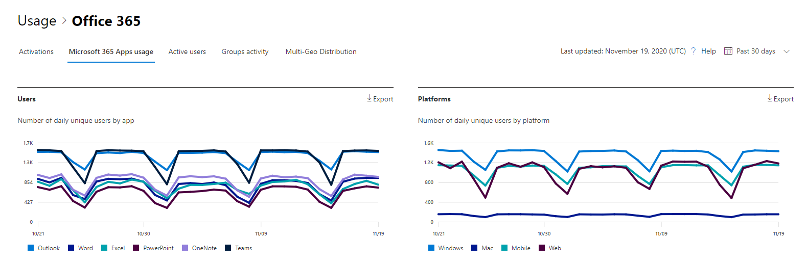

# Microsoft 365 Berichte im Admin Center – Microsoft 365 Apps Nutzung

Das Dashboard Microsoft 365 **Berichte** zeigt Ihnen die Aktivitätsübersicht für alle Produkte in Ihrer Organisation. Sie können Drilldowns zu Einzelberichten auf Produktebene ausführen und auf diese Weise genauere Einblicke in die Aktivitäten innerhalb der einzelnen Produkte erhalten. Sehen Sie sich die [Übersicht über Berichte](activity-reports.md) an.

 Sie können z. B. die Aktivität jedes Benutzers verstehen, der für die Verwendung Microsoft 365 Apps Apps lizenziert ist, indem Sie sich seine Aktivitäten in den Apps ansehen und wie sie plattformübergreifend genutzt werden.

 > [!NOTE]
 > Sie müssen ein globaler Administrator, globaler Leser oder Berichtsleser in Microsoft 365 oder ein Exchange-, SharePoint- oder Skype for Business-Administrator sein, um Berichte anzeigen zu können. Aktivierungen gemeinsam genutzter Computer sind in diesem Bericht nicht enthalten.

## So gelangen Sie zum nutzungsbericht Microsoft 365 Apps

1. Wechseln Sie im Admin Center zur Seite **Berichte** \> <a href="https://go.microsoft.com/fwlink/p/?linkid=2074756" target="_blank">Verwendung</a>. 
2. Klicken Sie auf der Dashboard-Startseite auf die Schaltfläche **"Weitere Anzeigen"** auf den aktiven Benutzern – Microsoft 365 Apps Karte.

## Interpretieren des Microsoft 365 Apps Nutzungsberichts

Sie können einen Einblick in die Microsoft 365 Apps Aktivitäten Ihres Benutzers erhalten, indem Sie sich die **Diagramme "Benutzer"** und **"Plattform"** ansehen.

> [!div class="mx-imgBorder"]
> 

|Element|Beschreibung|
 |:-----|:-----|
 |1.   |Der **Microsoft 365 Apps Nutzungsbericht** kann für Trends der letzten 7 Tage, 30 Tage, 90 Tage oder 180 Tage angezeigt werden. Wenn Sie im Bericht jedoch einen bestimmten Tag auswählen, werden in der Tabelle (7) Daten für bis zu 28 Tage ab dem aktuellen Datum angezeigt (nicht ab dem Datum, an dem der Bericht generiert wurde).   |
 |2.   |Die Daten in den einzelnen Berichten umfassen in der Regel bis zu den letzten zwei Tagen. Alle sechs Tage aktualisieren wir den Bericht mit geringfügigen Updates, um die Datenqualität sicherzustellen.   |
 |3.   |Die **Ansicht "Benutzer"** zeigt den Trend in der Anzahl der aktiven Benutzer für jede App – Outlook, Word, Excel, PowerPoint, OneNote und Teams. "Aktive Benutzer" sind alle, die beabsichtigte Aktionen innerhalb dieser Apps ausführen.   |
 |4.   |Die **Ansicht "Plattformen"** zeigt den Trend aktiver Benutzer in allen Apps für jede Plattform – Windows, Mac, Web und Mobile.   |
 |5. |Im Diagramm **"Benutzer"** ist die Y-Achse die Anzahl der eindeutigen aktiven Benutzer für die jeweilige App. Im Diagramm **"Plattformen"**   ist die Y-Achse die Anzahl der eindeutigen Benutzer für die jeweilige Plattform. Die X-Achse in beiden Diagrammen ist das Datum, an dem eine App auf einer bestimmten Plattform verwendet wurde. |
 6. |Sie können die im Diagramm angezeigte Datenreihe filtern, indem Sie in der Legende ein Element auswählen. Wählen Sie beispielsweise im Diagramm **"Benutzer"** Outlook, Word, Excel, PowerPoint, OneDrive oder Teams aus, um nur die jeweils zugehörigen Informationen anzuzeigen. Wenn Sie diese Auswahl ändern, werden die Informationen in der Rastertabelle darunter nicht geändert.|
 |7. |Die Tabelle zeigt eine Auflistung der Daten nach Benutzerebene. Sie können Spalten zur Tabelle hinzufügen oder aus der Tabelle entfernen.    **Der Benutzername** ist die E-Mail-Adresse des Benutzers, der die Aktivität auf Microsoft Apps ausgeführt hat.  Das datum der **letzten Aktivierung (UTC)** ist das neueste Datum, an dem der Benutzer sein Microsoft 365 Apps Abonnement auf einem Computer aktiviert hat oder sich auf einem freigegebenen Computer anmeldet und die App mit dem Konto startet.   Das Datum der **letzten Aktivität (UTC)** ist das späteste Datum, an dem der Benutzer eine beabsichtigte Aktivität ausgeführt hat. Um Aktivitäten anzuzeigen, die an einem bestimmten Datum stattfanden, wählen Sie das Datum direkt im Diagramm aus.  In den anderen Spalten wird angegeben, ob der Benutzer im ausgewählten Zeitraum für diese App (innerhalb Microsoft 365 Apps) auf dieser Plattform aktiv war. |
 |8. |Wählen Sie das Symbol **"Spalten auswählen"** aus, um Dem Bericht Spalten hinzuzufügen oder daraus zu entfernen.|
 |9. |Sie können die Berichtsdaten auch im CSV-Format in eine Excel-Datei exportieren, indem Sie den Link **Exportieren** auswählen. Dadurch werden Daten für alle Benutzer exportiert, und Sie können einfache Aggregations-, Sortier- und Filtervorgänge zur weiteren Analyse durchführen. Wenn Sie weniger als 100 Benutzer haben, können Sie innerhalb der Tabelle im Bericht selbst sortieren und filtern. Wenn Sie mehr als 100 Benutzer haben, müssen Sie zum Filtern und Sortieren die Daten exportieren.|
