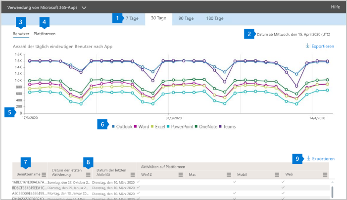

# Microsoft 365-Berichte im Admin Center – ProPlus-Nutzung

Im Microsoft 365 **Reports** -Dashboard wird die Aktivitätsübersicht für die Produkte in Ihrer Organisation angezeigt. Sie können Drilldowns zu Einzelberichten auf Produktebene ausführen und auf diese Weise genauere Einblicke in die Aktivitäten innerhalb der einzelnen Produkte erhalten. Sehen Sie sich die [Übersicht über Berichte](activity-reports.md) an.
  
Sie können beispielsweise die Aktivität jedes Benutzers verstehen, der für die Verwendung von ProPlus-apps lizenziert ist, indem Sie sich Ihre Aktivitäten in den apps ansehen und wie Sie plattformübergreifend verwendet werden.  
  
> [!NOTE]
> Sie müssen ein globaler Administrator, ein globaler Leser oder ein berichtsleser in Microsoft 365 oder ein Exchange-, SharePoint-oder Skype for Business-Administrator sein, um Berichte anzuzeigen. 

## So gelangen Sie zum ProPlus-Verwendungsbericht

1. Wechseln Sie im Admin Center zur Seite **Berichte** \> <a href="https://go.microsoft.com/fwlink/p/?linkid=2074756" target="_blank">Verwendung</a>.

    
2. Wählen Sie in der Dropdownliste **Bericht auswählen** die Option **Office 365** \> **ProPlus-Verwendung** aus.

## Interpretieren des ProPlus-Verwendungsberichts

Sie können eine Ansicht der ProPlus-Aktivität Ihrer Benutzer erhalten, indem Sie sich die Diagramme **Users** und **Platform** ansehen. 

|||
|:-----|:-----|
|1.    |Der **ProPlus-Verwendungs** Bericht kann für Trends in den letzten 7 Tagen, 30 Tagen, 90 Tagen oder 180 Tagen angezeigt werden. Wenn Sie im Bericht jedoch einen bestimmten Tag auswählen, werden in der Tabelle (7) Daten für bis zu 28 Tage ab dem aktuellen Datum angezeigt (nicht ab dem Datum, an dem der Bericht generiert wurde).    |
|2.    |Die Daten in den einzelnen Berichten decken in der Regel die letzten 24 bis 48 Stunden ab.    |
|3.    |Die **Benutzer** Ansicht IEW zeigt den Trend bei der Anzahl der aktiven Benutzer für jede APP – Outlook, Word, Excel, PowerPoint, OneNote und Microsoft Teams. "Aktive Benutzer" sind alle, die absichtlich Aktionen in diesen apps durchführen.    |
|4.    |Die Ansicht **Plattformen** zeigt den Trend der aktiven Benutzer in allen Apps für jede Plattform – Windows, Mac, Internet und Mobile.   |
|5. |Im Diagramm **Benutzer** ist die Y-Achse die Anzahl der eindeutigen aktiven Benutzer für die jeweilige app. Im Diagramm **Plattformen** ist die Y-Achse die Anzahl der eindeutigen Benutzer für die jeweilige Plattform. X-Achse in beiden Diagrammen ist das Datum, an dem eine APP auf einer bestimmten Plattform. RM verwendet wurde. |
|6. |Sie können die im Diagramm angezeigte Datenreihe filtern, indem Sie in der Legende ein Element auswählen. Wählen Sie beispielsweise im Diagramm **Benutzer** die Option Outlook, Word, Excel, PowerPoint, OneDrive oder Teams aus, um nur die zugehörigen Informationen anzuzeigen. Wenn Sie diese Auswahl ändern, werden die Informationen in der Raster Tabelle darunter nicht geändert.|
|7. |Die Tabelle zeigt eine Auflistung der Daten nach Benutzerebene. Sie können Spalten zur Tabelle hinzufügen oder aus der Tabelle entfernen.   **Username** ist die e-Mail-Adresse des Benutzers, der die Aktivität in Microsoft apps ausgeführt hat.  **Datum der letzten Aktivierung (UTC)** ist das Datum, an dem der Benutzer sein ProPlus-Abonnement zuletzt aktiviert hat.  **Datum der letzten Aktivität (UTC)** ist das letzte Datum, an dem eine absichtliche Aktivität vom Benutzer ausgeführt wurde. Um Aktivitäten anzuzeigen, die an einem bestimmten Datum stattfanden, wählen Sie das Datum direkt im Diagramm aus.  Die folgenden Spalten, die den einzelnen apps entsprechen, die ermitteln, ob der Benutzer in der ausgewählten Periode für diese APP aktiv war:   **Outlook**  **Word**  **Excel** **PowerPoint**  **OneNote**   Die folgenden Spalten entsprechen den einzelnen Plattformen, die ermitteln, ob der Benutzer auf dieser Plattform für eine beliebige app (innerhalb von ProPlus) in der ausgewählten Zeitspanne aktiv war:  **Outlook (Windows)** **Outlook (Mac)** **Outlook (im Internet)**  **Outlook (mobil)**  **Word (Windows)**  **Word (Mac)**  **Word (Internet)**  **Word (mobil)**  **Excel (Windows)**  **Excel (Mac)**  **Excel (im Internet)**  **Excel (Mobile)**  **PowerPoint (Windows)**  **PowerPoint (Mac)** **PowerPoint (Internet)**  **PowerPoint (mobil)**  **OneNote (Windows)**  **OneNote (Mac)**  **OneNote (im Internet)** **OneNote (mobil)**  **Teams (Windows)**  **Teams (Mac)**  **Teams (im Internet)** **Teams (mobil)** |
|8. |Wählen Sie das Symbol " **Spalten verwalten** " aus, um Spalten zum Bericht hinzuzufügen oder daraus zu entfernen.|
|9. |Sie können die Berichtsdaten auch im CSV-Format in eine Excel-Datei exportieren, indem Sie den Link **Exportieren** auswählen. Dadurch werden Daten für alle Benutzer exportiert, und Sie können einfache Aggregation, Sortierung und Filterung für weitere Analysen durchführen. Wenn Sie über weniger als 100 Benutzer verfügen, können Sie innerhalb der Tabelle im Bericht selbst sortieren und filtern. Wenn Sie über mehr als 100 Benutzer verfügen, müssen Sie die Daten exportieren, um Sie zu filtern und zu sortieren.|