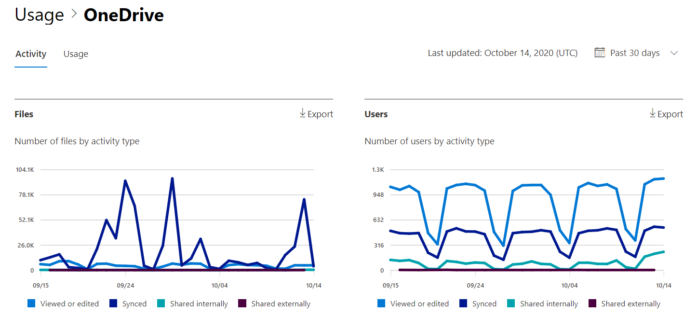

# Microsoft 365-Berichte im Admin Center – OneDrive for #A0Microsoft 365 Reports in the admin center - OneDrive for Business activity

Das Microsoft 365 **Reports-Dashboard** zeigt Ihnen die Übersicht über die Aktivitäten in den Produkten in Ihrer Organisation.The Microsoft 365 **Reports** dashboard shows you the activity overview across the products in your organization. Sie können Drilldowns zu Einzelberichten auf Produktebene ausführen und auf diese Weise genauere Einblicke in die Aktivitäten innerhalb der einzelnen Produkte erhalten.It lets you drill in to individual product level reports to give you more granular insight about the activities within each product. Sehen Sie sich die [Übersicht zu Berichten](activity-reports.md) an.Check out [the Reports overview topic](activity-reports.md).
  
Sie können z. B. die Aktivität jedes Benutzers verstehen, der für die Verwendung von OneDrive lizenziert ist, indem Sie dessen Interaktion mit Dateien auf OneDrive betrachten. Außerdem hilft es Ihnen, das Ausmaß der Zusammenarbeit zu erkennen, indem Sie die Anzahl der freigegebenen Dateien betrachten.For example, you can understand the activity of every user licensed to use OneDrive by looking at their interaction with files on OneDrive. It also helps you to understand the level of collaboration going on by looking at the number of files shared.
  
> [!NOTE]
> Sie müssen ein globaler Administrator, globaler Leser oder Berichtleser in Microsoft 365 oder ein Exchange-, SharePoint-, Teams-Dienst-, Teams Communications- oder Skype for Business-Administrator sein, um Berichte anzeigen zu können.You must be a global administrator, global reader or reports reader in Microsoft 365 or an Exchange, SharePoint, Teams Service, Teams Communications, or Skype for Business administrator to see reports.  
 
## Wie erhalte ich den OneDrive-Aktivitätsbericht?How do I get to the OneDrive Activity report?

1. Wechseln Sie im Admin Center zur Seite **Berichte** \> <a href="https://go.microsoft.com/fwlink/p/?linkid=2074756" target="_blank">Verwendung</a>.In the admin center, go to the **Reports** \> <a href="https://go.microsoft.com/fwlink/p/?linkid=2074756" target="_blank">Usage</a> page. 
2. Klicken Sie auf der Startseite des Dashboards **auf** die Schaltfläche Weitere Anzeigen auf der OneDrive-Karte.From the dashboard homepage, click on the **View more** button on the OneDrive card.
  
## Interpretieren des Aktivitätsberichts für OneDrive for BusinessInterpret the OneDrive for Business activity report

Sie können die Aktivitäten im #A0 anzeigen, indem Sie die Registerkarte **Aktivität** auswählen.You can view the activities in the OneDrive report by choosing the **Activity** tab. 

Wählen **Sie Spalten auswählen** aus, um Spalten aus dem Bericht hinzuzufügen oder zu entfernen.Select **Choose columns** to add or remove columns from the report.    

Sie können die Berichtsdaten auch im CSV-Format in eine Excel-Datei exportieren, indem Sie den Link **Exportieren** auswählen.You can also export the report data into an Excel .csv file by selecting the **Export** link. Dadurch werden Daten aller Benutzer exportiert, und Sie können einfache Sortier- und Filtervorgänge zur weiteren Analyse ausführen.This exports data of all users and enables you to do simple sorting and filtering for further analysis. Bei weniger als 2.000 Benutzern können Sie innerhalb der Tabelle im Bericht selbst sortieren und filtern.If you have less than 2000 users, you can sort and filter within the table in the report itself. Bei mehr als 2.000 Benutzern müssen Sie die Daten zum Filtern und Sortieren exportieren.If you have more than 2000 users, in order to filter and sort, you will need to export the data. 
  
|ElementItem|BeschreibungDescription|
|:-----|:-----|
|**Metrik****Metric**|**Definition****Definition**|
|UsernameUsername    |Der Benutzername des Besitzers des OneDrive-Kontos.The user name of the owner of the OneDrive account.    |
|Datum der letzten Aktivität (UTC)Last activity date (UTC)    |Das letzte Datum, an dem eine Dateiaktivität für das #A0 für den ausgewählten Datumsbereich ausgeführt wurde.The latest date a file activity was performed on the OneDrive account for the selected date range. .. Um Aktivitäten anzuzeigen, die an einem bestimmten Datum stattfanden, wählen Sie das Datum direkt im Diagramm aus.To see activity that occurred on a specific date, select the date directly in the chart.    |
|Angezeigte oder bearbeitete DateienFiles viewed or edited    |Die Anzahl der Dateien, die der Benutzer hochgeladen, heruntergeladen, geändert oder angezeigt hat.The number of files that the user uploaded, downloaded, modified, or viewed.     |
|Synchronisierte DateienFiles synced    |Die Anzahl der Dateien, die vom lokalen Gerät eines Benutzers mit dem #A0 synchronisiert wurden.The number of files that have been synced from a user's local device to the OneDrive account.   |
|Intern freigegebene DateienFiles shared internally    | Die Anzahl der Dateien, die für Benutzer innerhalb der Organisation oder für Benutzer innerhalb von Gruppen freigegeben wurden (z. B. externe Benutzer).The number of files that have been shared with users within the organization, or with users within groups (that might include external users).    |
|Extern freigegebene DateienFiles shared externally    |Die Anzahl der Dateien, die für Benutzer außerhalb der Organisation freigegeben wurden.The number of files that have been shared with users outside of the organization.  |
|GelöschtDeleted    | Dies bedeutet, dass die Lizenz des Benutzers entfernt wurde.This indicates that the user's license was removed.    HINWEIS: Die Aktivität für einen gelöschten Benutzer wird weiterhin in einem Bericht angezeigt, solange er zu einem bestimmten Zeitpunkt während des ausgewählten Zeitraums lizenziert wurde.NOTE: Activity for a deleted user will still display in a report as long as he or she was licensed at some time during the selected time period. Der Spalte **Gelöscht** können Sie entnehmen, dass der Benutzer zwar möglicherweise nicht mehr aktiv ist, aber dass der Bericht dennoch ihn betreffende Daten enthält.The **Deleted** column helps you to note that the user may no longer be active, but contributed to the data in the report.    |
|Gelöschtes DatumDeleted date    |Das Datum, an dem die Lizenz des Benutzers entfernt wurde.The date on which the user's license was removed.  |
|Produkt zugewiesenProduct assigned    |Die Microsoft 365-Produkte, die für den Benutzer lizenziert sind.The Microsoft 365 products that are licensed to the user.|
|||