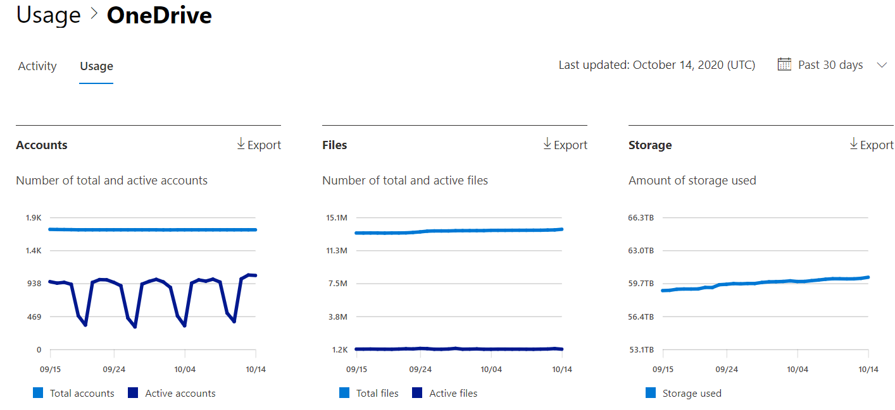

# Microsoft 365-Berichte im Admin Center – OneDrive für Unternehmen Nutzung

Im Microsoft 365 **Reports** -Dashboard wird die Aktivitätsübersicht für die Produkte in Ihrer Organisation angezeigt. Sie können Drilldowns zu Einzelberichten auf Produktebene ausführen und auf diese Weise genauere Einblicke in die Aktivitäten innerhalb der einzelnen Produkte erhalten. Sehen Sie sich die [Übersicht über Berichte](activity-reports.md) an.
  
Die OneDrive Karte auf dem Dashboard bietet beispielsweise einen allgemeinen Überblick über den Wert, den Sie OneDrive for Business hinsichtlich der Anzahl von Dateien und des Ihrer Organisation verwendeten Speichers erhalten. Anschließend können Sie darin einen Drilldown ausführen, um die Trends der aktiven OneDrive Konten, die Anzahl von Dateien, mit denen Benutzer interagieren, sowie den verwendeten Speicher nachzuvollziehen. Außerdem werden Details pro Konto angezeigt OneDrive.
  
> [!NOTE]
> Sie müssen ein globaler Administrator, ein globaler Leser oder ein Leser von Berichten in Microsoft 365 oder einer Exchange-, SharePoint-, Teams-Dienst-, Microsoft Teams-oder Skype for Business-Administrator sein, um Berichte anzuzeigen.  
 
## Wie erhalte ich den OneDrive-Aktivitätsbericht?

1. Wechseln Sie im Admin Center zur Seite **Berichte** \> <a href="https://go.microsoft.com/fwlink/p/?linkid=2074756" target="_blank">Verwendung</a>. 
2. Klicken Sie auf der Dashboard-Startseite auf die Schaltfläche **mehr anzeigen** auf der OneDrive-Karte.
  
## Interpretieren des Berichts zur Verwendung von OneDrive

Sie können die Verwendung im Bericht OneDrive anzeigen, indem Sie auf die Registerkarte **Verwendung** wählen. 

Wählen Sie **Spalten auswählen** aus, um Spalten zum Bericht hinzuzufügen oder daraus zu entfernen.    

Sie können die Berichtsdaten auch im CSV-Format in eine Excel-Datei exportieren, indem Sie den Link **Exportieren** auswählen. Dadurch werden Daten aller Benutzer exportiert, und Sie können einfache Sortier- und Filtervorgänge zur weiteren Analyse ausführen. Bei weniger als 2.000 Benutzern können Sie innerhalb der Tabelle im Bericht selbst sortieren und filtern. Bei mehr als 2.000 Benutzern müssen Sie die Daten zum Filtern und Sortieren exportieren. 
  
|Element|Beschreibung|
|:-----|:-----|
|**Metrik**|**Definition**|
|URL    |Die Webadresse für das OneDrive des Benutzers.   |
|Gelöscht    |Der Löschstatus des OneDrive. Es dauert mindestens 7 Tage bis Konten als gelöscht gekennzeichnet werden.    |
|Besitzer    |Der Benutzername des primären Administrators des OneDrive.     |
|Besitzer Prinzipalname    |Die e-Mail-Adresse des Besitzers des OneDrive.   |
|Datum der letzten Aktivität (UTC)    | Das letzte Datum, an dem eine Dateiaktivität in OneDrive durchgeführt wurde. Wenn die OneDrive keine Dateiaktivität aufweist, bleibt der Wert leer.    |
|Dateien    |Die Anzahl der Dateien in der OneDrive.  |
|Aktive Dateien    | Die Anzahl der aktiven Dateien innerhalb des Zeitraums.  Hinweis: Wenn Dateien während des angegebenen Zeitraums für den Bericht entfernt wurden, kann die Anzahl der aktiven Dateien, die im Bericht angezeigt werden, größer sein als die aktuelle Anzahl der Dateien im OneDrive. >  Gelöschte Benutzer werden in Berichten für 180 Tage weiterhin angezeigt.    |
|Verwendeter Speicherplatz (MB)    |Die Menge an Speicherplatz, die die OneDrive in MB verwendet. |
|||