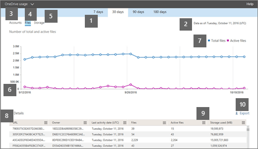

# Microsoft 365-Berichte im Admin Center – OneDrive für Unternehmen NutzungMicrosoft 365 Reports in the admin center - OneDrive for Business usage

Im Microsoft 365 **Reports** -Dashboard wird die Aktivitätsübersicht für die Produkte in Ihrer Organisation angezeigt.The Microsoft 365 **Reports** dashboard shows you the activity overview across the products in your organization. Sie können Drilldowns zu Einzelberichten auf Produktebene ausführen und auf diese Weise genauere Einblicke in die Aktivitäten innerhalb der einzelnen Produkte erhalten.It enables you to drill in to individual product level reports to give you more granular insight about the activities within each product. Sehen Sie sich die [Übersicht über Berichte](activity-reports.md) an.Check out [the Reports overview topic](activity-reports.md).
  
Die OneDrive Karte auf dem Dashboard bietet beispielsweise einen allgemeinen Überblick über den Wert, den Sie OneDrive for Business hinsichtlich der Anzahl von Dateien und des Ihrer Organisation verwendeten Speichers erhalten. Anschließend können Sie darin einen Drilldown ausführen, um die Trends der aktiven OneDrive Konten, die Anzahl von Dateien, mit denen Benutzer interagieren, sowie den verwendeten Speicher nachzuvollziehen. Außerdem werden Details pro Konto angezeigt OneDrive.For example, the OneDrive card on the dashboard gives you a high-level view of the value you are getting from OneDrive for Business in terms of the total number of files and storage used across your organization. You can then drill into it to understand the trends of active OneDrive accounts, how many files are users interacting with as well as the storage used. It also gives you details for each user's OneDrive.
  
> [!NOTE]
> Sie müssen ein globaler Administrator, ein globaler Leser oder ein Leser von Berichten in Microsoft 365 oder einer Exchange-, SharePoint-, Teams-Dienst-, Microsoft Teams-oder Skype for Business-Administrator sein, um Berichte anzuzeigen.You must be a global administrator, global reader or reports reader in Microsoft 365 or an Exchange, SharePoint, Teams Service, Teams Communications, or Skype for Business administrator to see reports.  
 
## Wie erhalte ich den OneDrive-Verwendungsbericht?How do I get to the OneDrive Usage Report?

1. Wechseln Sie im Admin Center zu **Berichte** : \> <a href="https://go.microsoft.com/fwlink/p/?linkid=2074756" target="_blank">Verwendung</a>.In the admin center, go to **Reports** \> <a href="https://go.microsoft.com/fwlink/p/?linkid=2074756" target="_blank">Usage</a>.

    
2. Wählen Sie in der Dropdownliste **Bericht auswählen** die Option **OneDrive** - \> **Verwendung**aus.From the **Select a report** drop-down, select **OneDrive** \> **Usage**. 
  
## Interpretieren des Berichts zur Verwendung von OneDriveInterpret the OneDrive usage report

Sie können einen Überblick über die Verwendung von OneDrive for Business erhalten, indem Sie die Ansichten **Konten**, **Dateien** und **Speicher** betrachten.You can get a view into OneDrive for Business usage by looking at the **Accounts**, **Files**, and **Storage** views. 
  

  
|||
|:-----|:-----|
|1.1.    |Im Bericht **OneDrive-Nutzung** werden die Trends über die letzten 7 Tage, 30 Tage, 90 Tage oder 180 Tage angezeigt.The **OneDrive usage** report shows trends over the last 7 days, 30 days, 90 days, or 180 days. Wenn Sie im Bericht jedoch einen bestimmten Tag auswählen, werden in der Tabelle (7) Daten für bis zu 28 Tage ab dem aktuellen Datum angezeigt (nicht ab dem Datum, an dem der Bericht generiert wurde).However, if you select a particular day in the report, the table (7) will show data for up to 28 days from the current date (not the date the report was generated).    |
|2.2.    |Die Daten in den einzelnen Berichten decken in der Regel die letzten 24 bis 48 Stunden ab.The data in each report usually covers up to the last 24 to 48 hours.  |
|3.3.    |In der Ansicht **Konten** wird der Trend hinsichtlich der Anzahl von insgesamt und aktiven OneDrive Konten angezeigt. "Aktive Konten" sind alle, in denen die Benutzer Dateien ansehen, ändern, hochladen, runterladen, teilen oder synchronisieren.  The **Accounts** view shows the trend in the number of total and active OneDrive accounts. "Active accounts" are any in which users view, modify, upload, download, share, or sync files.    |
|4.4.    |In der Ansicht **Dateien** werden die Anzahl der Gesamtzahl der aktiven Dateien angezeigt. Eine Datei wird als aktiv betrachtet, wenn sie gespeichert, synchronisiert, geändert oder innerhalb eines bestimmten Zeitraums freigegeben wurde.  The **Files** view shows the number of number of total and active files. A file is considered active if it has been saved, synced, modified or shared within the specific time period.    Hinweis: eine Dateiaktivität kann mehrere Male für eine einzelne Datei auftreten, wird aber nur als eine aktive Datei gezählt.NOTE: A file activity can occur multiple times for a single file, but will count only as one active file. Sie können beispielsweise dieselbe Datei über einen angegebenen Zeitraum mehrmals speichern und synchronisieren, aber sie wird nur als einzelne aktive Datei und als einzelne synchronisierte Datei in den Daten gezählt.For example, you can save and sync the same file multiple times over a specified time period, but it will count only as one single active file and one single synced file in the data.           |
|5.5.    |In der Ansicht **Speicher** wird der Trend hinsichtlich des in OneDrive verwendeten Speicherplatzes angezeigt.The **Storage** view shows the trend in the amount of OneDrive storage you're using.    > Hinweis: die Größe enthält alle Versionen und Metadaten, die mit den Dateien verknüpft sind.> NOTE: The size includes any versions and metadata associated with the files.           |
|6.6.    | Im Diagramm **Konten** stellt die Y-Achse die Anzahl der OneDrive Konten dar.On the **Accounts** chart, the Y axis is the number of OneDrive accounts.     Im Diagramm **Dateien** stellt die Y-Achse die Anzahl der gespeicherten Dateien dar OneDrive.On the **Files** chart, the Y axis is the number of files stored in OneDrive.     Im Diagramm **Speicher** gibt die y-Achse die Menge des OneDrive verwendeten Speicherplatzes an.On the **Storage** chart, the Y axis is the amount of OneDrive storage used.     Die x-Achse in allen Diagrammen entspricht dem ausgewählten Zeitraum für diesen bestimmten Bericht.The X axis on all charts is the selected date range for this specific report.    |
|7.7.    |Sie können die im Diagramm angezeigte Datenreihe filtern, indem Sie in der Legende ein Element auswählen.You can filter the series you see on the chart by selecting an item in the legend. Wählen Sie beispielsweise im Diagramm **Dateien** die Option **Gesamtdateien** oder **aktive Dateien**aus.For example, on the **Files** chart, select **Total files** or **Active files**. Wählen Sie im Diagramm **Konten** die Option **Gesamtkonten** oder **aktive Konten**aus.On the **Accounts** chart, select **Total accounts** or **Active accounts**. Oder wählen Sie im **Speicher** Diagramm die Option **Speicher verwendet**aus.Or on the **Storage** chart, select **Storage used**. Wenn Sie Ihre Auswahl ändern, werden die Informationen in der Tabelle nicht geändert.Changing your selection doesn't change the information in the table.    |
|8.8.    | Die Tabelle zeigt eine Auflistung der Daten für jeden Benutzer OneDrive. Um in der Tabelle zu erscheinen, muss einem Benutzer eine Produktlizenz zugeordnet wurden, die OneDrive enthält, und sie müssen SharePoint Online aktivieren. Der Benutzer muss sich auch entweder im OneDrive Synchronisierungsclient anmelden, oder mithilfe eines Webbrowsers zu seiner OneDrive gehen.  The table shows you a breakdown of data for each user's OneDrive. To appear in the table, a user needs to have been assigned a product license that includes OneDrive, and they need to have SharePoint Online turned on. The user also needed to either sign in to the OneDrive sync client, or browse to their OneDrive using a web browser.     Wenn Dateiaktivitäten für das OneDrive stattgefunden haben, weist es das aktuelle Datum auf, an dem die Dateiaktivität ausgeführt wurde. Die Zeilen in der Tabelle sind nach dem Wert **Datum der letzten Aktivität** sortiert, damit die OneDrive mit der letzten Dateiaktivität am Anfange der Liste angezeigt werden.  If the OneDrive has had file activity, it will have the latest date that the file activity was performed. The rows in the table are sorted by **Last activity date** so the OneDrive with the most recent file activity appears at the top of the list.     Sie können der Tabelle Spalten hinzufügen oder daraus entfernen.You can add or remove columns from the table.        **URL** ist die Webadresse für die OneDrive des Benutzers.**URL** is the web address for the user's OneDrive.    **Gelöscht** ist der Löschstatus des OneDrive. Es dauert mindestens 7 Tage bis Konten als gelöscht gekennzeichnet werden.  **Deleted** is the deletion status of the OneDrive. It takes at least 7 days for accounts to be marked as deleted.    **Besitzer** ist der Benutzername des primären Administrators der OneDrive.**Owner** is the username of the primary administrator of the OneDrive.    **Besitzer Prinzipalname** ist die e-Mail-Adresse des Besitzers des OneDrive.**Owner principal name** is the email address of the owner of the OneDrive.    **Datum der letzten Aktivität (UTC)** ist das letzte Datum, an dem eine Dateiaktivität für die OneDrive ausgeführt wurde. Wenn die OneDrive keine Dateiaktivität aufweist, bleibt der Wert leer.  **Last activity date (UTC)** is the latest date a file activity was performed in the OneDrive. If the OneDrive has had no file activity, the value will be blank.    **Dateien** entspricht der Anzahl von Dateien auf der OneDrive.**Files** is the number of files in the OneDrive.    **Aktive Dateien** entspricht der Anzahl der aktiven Dateien für einen Zeitraum.**Active files** is the number of active files within the time period.  Hinweis: Wenn Dateien während des angegebenen Zeitraums für den Bericht entfernt wurden, kann die Anzahl der aktiven Dateien, die im Bericht angezeigt werden, größer sein als die aktuelle Anzahl der Dateien im OneDrive.NOTE: If files were removed during the specified time period for the report, the number of active files shown in the report may be larger than the current number of files in the OneDrive. >  Gelöschte Benutzer werden in Berichten für 180 Tage weiterhin angezeigt.>  Deleted users will continue to appear in reports for 180 days. **Verwendeter Speicherplatz (MB)** entspricht der auf der OneDrive verwendeten Speichermenge in MB.**Storage used (MB)** is the amount of storage the OneDrive uses in MB.    Wenn die Richtlinien Ihrer Organisation das Anzeigen von Berichten verhindern, in denen Benutzerinformationen identifizierbar sind, können Sie die Datenschutzeinstellung für alle diese Berichte ändern.If your organization's policies prevent you from viewing reports where user information is identifiable, you can change the privacy setting for all these reports. Lesen Sie den Abschnitt zum **Ausblenden von Details auf Benutzerebene** in den [Aktivitätsberichten im Microsoft 365 Admin Center](activity-reports.md).Check out the **How do I hide user level details?** section in the [Activity Reports in the Microsoft 365 admin center](activity-reports.md).    |
|9.9.    |Wählen Sie **das Symbol Spalten verwalten**  aus, um Spalten aus dem Bericht hinzuzufügen oder zu entfernen.Select the **Manage columns** icon  to add or remove columns from the report.    |
|10.10.    |Sie können die Berichtsdaten auch im CSV-Format in eine Excel-Datei exportieren, indem Sie den Link **Exportieren** auswählen.You can also export the report data into an Excel .csv file, by selecting the **Export** link. Dadurch werden Daten aller OneDrive exportiert, und Sie können einfache Sortier- und Filtervorgänge zur weiteren Analyse ausführen.This exports the date for each OneDrive and allows you to do simple sorting and filtering for further analysis. Bei weniger als 2000 OneDrive Konten können Sie innerhalb der Tabelle im Bericht selbst sortieren und filtern.If you have less than 2000 OneDrive accounts, you can sort and filter within the table in the report itself. Bei mehr als 2000 OneDrive Konten müssen Sie die Daten zum Filtern und Sortieren exportieren.If you have more than 2000 OneDrive accounts, you need to export the data to filter and sort.    Hinweis: Wenn die Daten in eine Excel-Datei exportiert werden, wird das Datum, an dem der Inhaltsbericht generiert wurde, in der Datei in der Spalte " **Daten von** " wiedergegeben.NOTE: When the data is exported to an Excel file, the date the content report was generated is reflected in the file in the **Data as of** column.    |
|||
   

