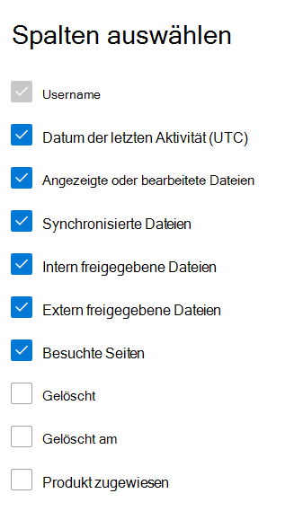

# Microsoft 365 Berichte im Admin Center – SharePoint Aktivitäten

Als Microsoft 365 zeigt Ihnen das **Dashboard** Berichte die Aktivitätsübersicht für verschiedene Produkte in Ihrer Organisation. Hiermit können Sie einen Drilldown ausführen, um genauere Einblicke in die Aktivitäten für die einzelnen Produkte zu erhalten. Sehen Sie sich die [Aktivitätsberichte im Microsoft 365 Admin Center an.](activity-reports.md)
  
Sie können z. B. die Aktivität jedes Benutzers verstehen, der für die Verwendung von SharePoint lizenziert ist, indem Sie dessen Interaktion mit Dateien betrachten. Außerdem hilft es Ihnen, das Ausmaß der Zusammenarbeit zu erkennen, indem Sie sich die Anzahl der freigegebenen Dateien anschauen.
  
> [!NOTE]
> Sie müssen ein globaler Administrator, globaler Leser oder Berichtleser in Microsoft 365 oder ein Exchange-, SharePoint-, Teams-Dienst-, Teams-Kommunikations- oder Skype for Business-Administrator sein, um Berichte anzeigen zu können. 
 
## Wie gelange ich zum SharePoint-Aktivitätsbericht?

1. Wechseln Sie im Admin Center zur Seite **Berichte** \> <a href="https://go.microsoft.com/fwlink/p/?linkid=2074756" target="_blank">Verwendung</a>. 
2. Klicken Sie auf der Startseite des Dashboards auf **die** Schaltfläche Weitere Anzeigen auf der SharePoint Karte.
  
## Interpretieren des SharePoint Aktivitätsberichts

Sie können die Aktivitäten im SharePoint anzeigen, indem Sie die Registerkarte **Aktivität** auswählen. 

Wählen **Sie Spalten auswählen** aus, um Spalten aus dem Bericht hinzuzufügen oder zu entfernen.    

Sie können die Berichtsdaten auch im CSV-Format in eine Excel-Datei exportieren, indem Sie den Link **Exportieren** auswählen. Dadurch werden Daten aller Benutzer exportiert, und Sie können einfache Sortier- und Filtervorgänge zur weiteren Analyse ausführen. Bei weniger als 2.000 Benutzern können Sie innerhalb der Tabelle im Bericht selbst sortieren und filtern. Bei mehr als 2.000 Benutzern müssen Sie die Daten zum Filtern und Sortieren exportieren. 
  
|Element|Beschreibung|
|:-----|:-----|
|**Metrik**|**Definition**|
|Benutzername    |Die E-Mail-Adresse des Benutzers, der die Aktivität auf der website SharePoint hat.    |
|Datum der letzten Aktivität (UTC)    |Das letzte Datum, an dem eine Dateiaktivität ausgeführt oder eine Seite für den ausgewählten Datumsbereich besucht wurde. Um Aktivitäten anzuzeigen, die an einem bestimmten Datum stattfanden, wählen Sie das Datum direkt im Diagramm aus.    |
|Angezeigte oder bearbeitete Dateien    |Die Anzahl der Dateien, die der Benutzer hochgeladen, heruntergeladen, geändert oder angezeigt hat.     |
|Synchronisierte Dateien    |Die Anzahl der Dateien, die vom lokalen Gerät eines Benutzers mit dem lokalen SharePoint wurden.   |
|Intern freigegebene Dateien    | Die Anzahl der Dateien, die für Benutzer innerhalb der Organisation oder für Benutzer innerhalb von Gruppen (die auch externe Benutzer enthalten können) freigegeben wurden.    |
|Extern freigegebene Dateien    |Die Anzahl der Dateien, die für Benutzer außerhalb der Organisation freigegeben wurden.  |
|Besuchte Seiten    |Die Besuche eindeutiger Seiten durch den Benutzer.  |
|Gelöscht    | Dies bedeutet, dass die Lizenz des Benutzers entfernt wurde.     **HINWEIS:** Die Aktivität für einen gelöschten Benutzer wird weiterhin im Bericht angezeigt, solange er zu einem bestimmten Zeitpunkt während des ausgewählten Zeitraums lizenziert wurde. Durch die Spalte "Gelöscht" werden Sie darauf aufmerksam gemacht, dass der Benutzer möglicherweise nicht mehr aktiv ist, aber zu den Daten im Bericht beigetragen hat.    |
|Gelöschtes Datum    |Das Datum, an dem die Lizenz des Benutzers entfernt wurde.  |
|Produkt zugewiesen    |Die Microsoft 365, die für den Benutzer lizenziert sind.|
|||