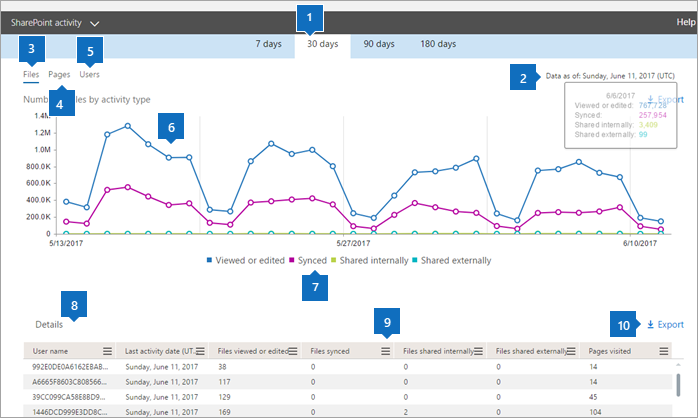
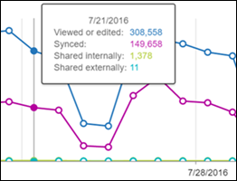

# Microsoft 365-Berichte im Admin Center – SharePoint-Aktivität

Als Microsoft 365-Administrator zeigt das Dashboard **Berichte** die Aktivitätsübersicht für verschiedene Produkte in Ihrer Organisation an. Hiermit können Sie einen Drilldown ausführen, um genauere Einblicke in die Aktivitäten für die einzelnen Produkte zu erhalten. Schauen Sie sich die [Aktivitätsberichte im Microsoft 365 Admin Center an](activity-reports.md).
  
Sie können z. B. die Aktivität jedes Benutzers verstehen, der für die Verwendung von SharePoint lizenziert ist, indem Sie dessen Interaktion mit Dateien betrachten. Außerdem hilft es Ihnen, das Ausmaß der Zusammenarbeit zu erkennen, indem Sie sich die Anzahl der freigegebenen Dateien anschauen.
  
> [!NOTE]
> Einige Funktionen werden schrittweise eingeführt. Das bedeutet, dass diese Funktion möglicherweise noch nicht angezeigt wird oder anders aussieht, als in den Hilfeartikeln beschrieben. Doch machen Sie sich keine Sorgen. Auch wenn sie bei Ihnen noch nicht angezeigt wird, ist sie in Kürze verfügbar! 
  
Wenn Sie den Umfang der Aktivität für die einzelnen SharePoint-Websites und die Speichernutzung erfahren möchten , können Sie den [Bericht zur Verwendung der SharePoint-Website](sharepoint-site-usage.md) anzeigen.
  
> [!NOTE]
> Sie müssen ein globaler Administrator, ein globaler Leser oder ein Leser von Berichten in Microsoft 365 oder einer Exchange-, SharePoint-, Teams-Dienst-, Microsoft Teams-oder Skype for Business-Administrator sein, um Berichte anzuzeigen.  
 
## Wie gelange ich zum SharePoint-Aktivitätsbericht?

1. Wechseln Sie im Admin Center zur Seite **Berichte** \> <a href="https://go.microsoft.com/fwlink/p/?linkid=2074756" target="_blank">Verwendung</a>.

    
2. Wählen Sie in der Dropdownliste **Bericht auswählen** die Option **SharePoint** - \> **Aktivität**aus.
  
## Interpretieren des SharePoint-Aktivitätsberichts

Sie können einen Einblick in die SharePoint-Aktivität erhalten, indem Sie die Ansichten **Dateien** und **Benutzer** betrachten.  
  
|||
|:-----|:-----|
|1.    |Im Bericht **SharePoint-Aktivität** werden die Trends über die letzten 7 Tage, 30 Tage, 90 Tage oder 180 Tage angezeigt. Wenn Sie im Bericht jedoch einen bestimmten Tag auswählen, werden in der Tabelle (7) Daten für bis zu 28 Tage ab dem aktuellen Datum angezeigt (nicht ab dem Datum, an dem der Bericht generiert wurde).    |
|2.    |Die Daten in den einzelnen Berichten decken in der Regel die letzten 24 bis 48 Stunden ab.    |
|3.    |Anhand der Ansicht **Dateien** können Sie die eindeutige Anzahl an lizenzierten Benutzern erkennen, die Dateiinteraktionen mit beliebigen auf SharePoint gespeicherten Dateien ausgeführt haben.    |
|4.    |In der Ansicht **Seiten** wird die Anzahl der eindeutigen Seiten angezeigt, die von Benutzern besucht wurden.    |
|5.    |Anhand der Ansicht **Benutzer** können Sie den Trend in Hinsicht auf die Anzahl der aktiven Benutzer erkennen. Ein Benutzer wird als "aktiv" betrachtet, wenn er innerhalb eines bestimmten Zeitraums eine Dateiaktivität (Speichern, Synchronisieren, Ändern oder Freigeben) ausgeführt oder eine Seite besucht hat.    Hinweis: eine Dateiaktivität kann mehrere Male für eine einzelne Datei auftreten, wird aber nur als eine aktive Datei gezählt. Sie können beispielsweise dieselbe Datei über einen angegebenen Zeitraum mehrmals speichern und synchronisieren, aber sie wird nur als einzelne aktive Datei und als einzelne synchronisierte Datei in den Daten gezählt.           |
|6.    | Im Diagramm **Dateien** stellt die Y-Achse die Anzahl der eindeutigen Dateien dar, die ein Benutzer gespeichert, synchronisiert, geändert oder freigegeben hat.     Im Diagramm **Benutzer** stellt die Y-Achse die Anzahl der eindeutigen Benutzer dar, die Dateiinteraktionen (Speichern, Synchronisieren, Ändern oder Freigeben) auf einer Website ausgeführt haben.     Im Diagramm **Seiten** stellt die X-Achse die Anzahl der eindeutigen Seiten dar, die von Benutzern besucht wurden.     Die x-Achse in allen Diagrammen entspricht dem ausgewählten Zeitraum für diesen bestimmten Bericht.    |
|7.    |Sie können die im Diagramm angezeigte Datenreihe filtern, indem Sie in der Legende ein Element auswählen. Wählen Sie beispielsweise im Diagramm **Dateien** die Option **angezeigt oder bearbeitet**, **synchronisiert**, **intern freigegeben**oder **extern freigegeben** aus, um nur die zugehörigen Informationen anzuzeigen. Durch das Ändern dieser Auswahl werden die Informationen in der Gitternetztabelle nicht geändert.    |
|8.    | Die Tabelle zeigt eine Aufschlüsselung der Aktivitäten auf Ebene der einzelnen Websites.       **Username** ist die e-Mail-Adresse des Benutzers, der die Aktivität auf der SharePoint-Website ausgeführt hat.    **Datum der letzten Aktivität (UTC)** ist das letzte Datum, an dem innerhalb des ausgewählten Datumsbereichs eine Dateiaktivität ausgeführt oder eine Seite besucht wurde. Um Aktivitäten anzuzeigen, die an einem bestimmten Datum stattfanden, wählen Sie das Datum direkt im Diagramm aus.       Dadurch wird die Tabelle so gefiltert, dass Datei Aktivitätsdaten nur für Benutzer angezeigt werden, die die Aktivität an diesem bestimmten Tag ausgeführt haben.     **Angezeigte oder bearbeitete Dateien** gibt die Anzahl der Dateien an, die der Benutzer hochgeladen, heruntergeladen, geändert oder angezeigt hat.     **Synchronisierte Dateien** ist die Anzahl der Dateien, die vom lokalen Gerät eines Benutzers mit der SharePoint-Website synchronisiert wurden.     **Intern freigegebene Dateien** ist die Anzahl der Dateien, die für Benutzer innerhalb der Organisation freigegeben wurden, oder mit Benutzern innerhalb von Gruppen (die externe Benutzer enthalten können).     **Extern freigegebene Dateien** gibt die Anzahl der Dateien an, die für Benutzer außerhalb der Organisation freigegeben wurden.     Bei **besuchten Seiten** handelt es sich um Besuche von eindeutigen Seiten durch den Benutzer.     **Gelöscht** gibt an, dass die Lizenz des Benutzers entfernt wurde.     **Hinweis:** Aktivitäten für einen gelöschten Benutzer werden weiterhin im Bericht angezeigt, solange er während des ausgewählten Zeitraums zu einem bestimmten Zeitpunkt lizenziert wurde. Durch die Spalte "Gelöscht" werden Sie darauf aufmerksam gemacht, dass der Benutzer möglicherweise nicht mehr aktiv ist, aber zu den Daten im Bericht beigetragen hat.    **Gelöscht am** ist das Datum, an dem die Lizenz des Benutzers entfernt wurde.     " **Produkt zugewiesen** " sind die Microsoft 365-Produkte, die für den Benutzer lizenziert sind.    |
|9.    |Wählen Sie **das Symbol Spalten verwalten**  aus, um Spalten aus dem Bericht hinzuzufügen oder zu entfernen.    |
|10.    |Sie können die Berichtsdaten auch im CSV-Format in eine Excel-Datei exportieren, indem Sie den Link **Exportieren** auswählen. Dadurch werden Daten für alle Benutzer exportiert, und Sie können einfache Sortier- und Filtervorgänge zur weiteren Analyse ausführen. Bei weniger als 2.000 Benutzern können Sie innerhalb der Tabelle im Bericht selbst sortieren und filtern. Bei mehr als 2.000 Benutzern müssen Sie die Daten zum Filtern und Sortieren exportieren.    |
|||
   

