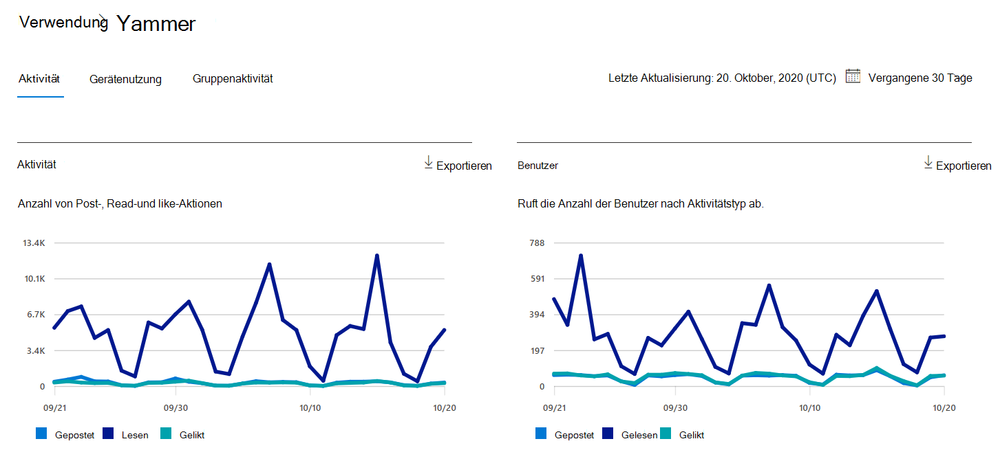

# Microsoft 365-Berichte im Admin Center – Yammer AktivitätsberichtMicrosoft 365 Reports in the admin center - Yammer activity report

Das Dashboard **Berichte** zeigt Ihnen als Microsoft 365-Administrator Ihre Daten im Hinblick auf die Nutzung der Produkte innerhalb Ihrer Organisation an.As Microsoft 365 admin, the **Reports** dashboard shows you data on the usage of the products within your organization. Schauen Sie sich [Aktivitätsberichte im Admin Center](activity-reports.md) an.Check out [activity reports in the admin center](activity-reports.md). Mit dem **Yammer-Aktivitätsbericht** können Sie den Grad des Engagements Ihrer Organisation mit Yammer erkennen. Dazu schauen Sie sich die Anzahl eindeutiger Benutzer, die über Yammer eine Nachricht posten, lesen oder mit "Gefällt mir" bewerten, und den Umfang der Aktivitäten an, die organisationsweit generiert wurden.With the **Yammer Activity report**, you can understand the level of engagement of your organization with Yammer by looking at the number of unique users using Yammer to post, like or read a message and the amount of activity generated across the organization. 
  
> [!NOTE]
> Sie müssen ein globaler Administrator, globaler Leser oder Berichtleser in Microsoft 365 oder ein Exchange-, SharePoint-, Teams-Dienst-, Teams Communications- oder Skype for Business-Administrator sein, um Berichte anzeigen zu können.You must be a global administrator, global reader or reports reader in Microsoft 365 or an Exchange, SharePoint, Teams Service, Teams Communications, or Skype for Business administrator to see reports.  
 
## Wie kann ich zum Aktivitätsbericht Yammer werden?How do I get to the Yammer activity report?

1. Wechseln Sie im Admin Center zur Seite **Berichte** \> <a href="https://go.microsoft.com/fwlink/p/?linkid=2074756" target="_blank">Verwendung</a>.In the admin center, go to the **Reports** \> <a href="https://go.microsoft.com/fwlink/p/?linkid=2074756" target="_blank">Usage</a> page. 
2. Klicken Sie auf der Dashboard-Homepage auf **die** Schaltfläche Weitere Anzeigen auf der Yammer Karte.From the dashboard homepage, click on the **View more** button on the Yammer card.

  
## Interpretieren des Yammer-AktivitätsberichtsInterpret the Yammer activity report

Sie können die Aktivitäten im Bericht Yammer anzeigen, indem Sie die Registerkarte **Aktivität** auswählen.You can view the activities in the Yammer report by choosing the **Activity** tab. 

Wählen **Sie Spalten auswählen** aus, um Spalten aus dem Bericht hinzuzufügen oder zu entfernen.Select **Choose columns** to add or remove columns from the report.    

Sie können die Berichtsdaten auch im CSV-Format in eine Excel-Datei exportieren, indem Sie den Link **Exportieren** auswählen.You can also export the report data into an Excel .csv file by selecting the **Export** link. Dadurch werden Daten aller Benutzer exportiert, und Sie können einfache Sortier- und Filtervorgänge zur weiteren Analyse ausführen.This exports data of all users and enables you to do simple sorting and filtering for further analysis. Bei weniger als 2.000 Benutzern können Sie innerhalb der Tabelle im Bericht selbst sortieren und filtern.If you have less than 2000 users, you can sort and filter within the table in the report itself. Bei mehr als 2.000 Benutzern müssen Sie die Daten zum Filtern und Sortieren exportieren.If you have more than 2000 users, in order to filter and sort, you will need to export the data. 
  
|ElementItem|BeschreibungDescription|
|:-----|:-----|
|**Metrik****Metric**|**Definition****Definition**|
|BenutzernameUsername    |Die E-Mail-Adresse des Benutzers.The email address of the user. Sie können die eigentliche E-Mail-Adresse anzeigen oder dieses Feld anonymisieren.You can display the actual email address or make this field anonymous. Dieses Raster zeigt Benutzer, die sich mit Yammer Microsoft 365-Konto angemeldet haben oder sich über einmaliges Anmelden am Netzwerk angemeldet haben.This grid shows users who logged into Yammer using the Microsoft 365 account or who logged into the network using single sign-on.   |
|AnzeigenameDisplay name    |Der vollständige Name des Benutzers.The full name of the user. Sie können die eigentliche E-Mail-Adresse anzeigen oder dieses Feld anonymisieren.You can display the actual email address or make this field anonymous.    |
|BenutzerstatusUser state    |Einer von drei Werten: Aktiviert, Gelöscht oder Angehalten.One of three values: Activated, Deleted, or Suspended. Diese Berichte zeigen Daten für aktive, angehaltene und gelöschte Benutzer.These reports show data for active, suspended, and deleted users. Sie zeigen keine ausstehenden Benutzer, weil ausstehende Benutzer nicht posten, lesen oder eine Nachricht mit "Gefällt mir" bewerten können.They do not reflect pending users, because pending users cannot post, read, or like a message.    |
|Statusänderungsdatum (UTC)State change date (UTC)    |Das Datum, an dem der Status des Benutzers in der Yammer.The date on which the user's state was changed in Yammer.    |
|Datum der letzten Aktivität (UTC)Last activity date (UTC)    | Das letzte Datum, an dem der Benutzer eine Nachricht gepostet, gelesen oder gemocht hat.The last date that the user posted, read, or liked a message.    |
|GepostetPosted    |Die Anzahl der Nachrichten, die der Benutzer während des angegebenen Zeitraums gepostet hat.The number of messages the user posted during the time period you specified.  |
|LesenRead    |Die Anzahl der Unterhaltungen, die der Benutzer während des angegebenen Zeitraums gelesen hat.The number of conversations that the user read during the time period you specified.    |
|GeliktLiked    |Die Anzahl der Nachrichten, die dem Benutzer während des angegebenen Zeitraums gefallen haben.The number of messages that the user liked during the time period you specified.   |
|Produkt zugewiesenProduct assigned    |Die Produkte, die diesem Benutzer zugewiesen sind.The products that are assigned to this user.|
|||