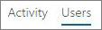

# Office 365-Berichte im Admin Center – Yammer-Aktivitätsbericht

Das Dashboard **Berichte** zeigt Ihnen als Microsoft 365-Administrator Ihre Daten im Hinblick auf die Nutzung der Produkte innerhalb Ihrer Organisation an. Schauen Sie sich [Aktivitätsberichte im Admin Center](activity-reports.md) an. Mit dem **Yammer-Aktivitätsbericht** können Sie den Grad des Engagements Ihrer Organisation mit Yammer erkennen. Dazu schauen Sie sich die Anzahl eindeutiger Benutzer, die über Yammer eine Nachricht posten, lesen oder mit "Gefällt mir" bewerten, und den Umfang der Aktivitäten an, die organisationsweit generiert wurden. 
  
> [!NOTE]
> Sie müssen ein globaler Administrator, ein globaler Leser oder ein berichtsleser in Microsoft 365 oder ein Exchange-, SharePoint-oder Skype for Business-Administrator sein, um Berichte anzuzeigen. 
 
## Aufrufen des Yammer-Aktivitätsberichts

1. Wechseln Sie im Admin Center zur Seite **Berichte** \> <a href="https://go.microsoft.com/fwlink/p/?linkid=2074756" target="_blank">Verwendung</a>.

    
2. Wählen Sie in der Dropdownliste **Bericht auswählen** den Eintrag **Yammer** \> **Aktivität** aus.
  
## Interpretieren des Yammer-Aktivitätsberichts

Sie erhalten einen Einblick in die Yammer-Aktivitäten Ihrer Benutzer, indem Sie sich die Diagramme "Aktivität" und "Benutzer" ansehen.
  

  
Der Aktivitätsbericht enthält die folgenden Informationen.
  
- Mithilfe der Registerkarten für verschiedene Anzahlen von Tagen können Sie die Trends im Bericht **Yammer-Aktivität** über die letzten 7 Tage, 30 Tage, 90 Tage oder 180 Tage anzeigen. Wenn Sie im Bericht jedoch einen bestimmten Tag auswählen, werden in der Tabelle Daten für bis zu 28 Tage ab dem aktuellen Datum angezeigt (nicht ab dem Datum, an dem der Bericht generiert wurde). 
    
- Jeder Bericht weist das Datum auf, an dem er generiert wurde. Die Berichte weisen in der Regel eine Latenz von 24 bis 48 Stunden ab dem Zeitpunkt der Aktivität auf.
    
- Sie können das Diagramm **Aktivität** anzeigen, um den Trend in Hinsicht auf die Menge von Yammer-Aktivitäten in Ihrer Organisation zu erkennen. Sie können die Aufteilung von Nachrichten in "gepostet", "gelesen" oder "Gefällt mir" erkennen. 
    
    
  
  - Im Diagramm **Aktivität** bezeichnet die y-Achse die Anzahl der Aktivitäten bei den geposteten, gelesenen oder mit "Gefällt mir" bewerteten Nachrichten. 
    
- Sie können das Diagramm **Benutzer** anzeigen, um den Trend in Hinsicht auf die Anzahl eindeutiger Benutzer zu erkennen, die die Yammer-Aktivitäten generieren. Sie können sich den Trend von Benutzern anschauen, die Yammer-Nachrichten posten, lesen oder mit "Gefällt mir" bewerten. 
    
    
  
  - Im Aktivitätsdiagramm **Benutzer** bezeichnet die y-Achse die Benutzer, die Yammer-Nachrichten posten, lesen oder mit "Gefällt mir" bewerten. 
    
  - Die X-Achse bezeichnet in beiden Diagrammen den ausgewählten Zeitraum für diesen bestimmten Bericht.
    
- Sie können die im Diagramm angezeigte Datenreihe filtern, indem Sie in der Legende ein Element auswählen. Wählen Sie beispielsweise im Diagramm **Aktivität** die Option **Gepostet**, **Gelesen** oder **Mit "Gefällt mir" markiert** aus, um nur die jeweils zugehörigen Informationen anzuzeigen. 
    
    
  
    Durch das Ändern dieser Auswahl werden die Informationen in der Gitternetztabelle nicht geändert.
    
- Die Tabelle unter der Grafik zeigt eine Aufschlüsselung der Yammer-Aktivitäten auf Ebene der einzelnen Benutzer.
    
    Mithilfe des Menüs können Sie die Daten filtern und sortieren.
    
    
  
    Sie können auch Spalten hinzufügen und entfernen. Die verfügbaren Spalten sind:
    
  - **Benutzername** ist die E-Mail-Adresse des Benutzers. Sie können die eigentliche E-Mail-Adresse anzeigen oder dieses Feld anonymisieren. 
    
    Diese Tabelle zeigt die Benutzer, die sich mit ihrem Office 365-Konto bei Yammer oder aber mit einmaligem Anmelden am Netzwerk angemeldet haben.
    
  - **Anzeigename** ist der vollständige Name des Benutzers. Sie können die eigentliche E-Mail-Adresse anzeigen oder dieses Feld anonymisieren. 
    
  - **Benutzerstatus** weist einen der drei folgenden Werte auf: "Aktiviert", "Gelöscht" oder "Angehalten". 
    
     Diese Berichte zeigen Daten für aktive, angehaltene und gelöschte Benutzer. Sie zeigen keine ausstehenden Benutzer, weil ausstehende Benutzer nicht posten, lesen oder eine Nachricht mit "Gefällt mir" bewerten können. 
    
  - **Datum der Statusänderung (UTC)** ist das Datum, an dem der Status des Benutzers in Yammer geändert wurde. 
    
  - **Datum der letzten Aktivität (UTC)** bezieht sich auf das letzte Datum, an dem der Benutzer eine Nachricht gepostet, gelesen oder mit "Gefällt mir" bewertet hat. 
    
  - **Gepostet** ist die Anzahl der Nachrichten, die der Benutzer während des angegebenen Zeitraums gepostet hat. 
    
  - **Gelesen** ist die Anzahl der Unterhaltungen, die der Benutzer während des angegebenen Zeitraums gelesen hat. 
    
  - **Mit "Gefällt mir" markiert** ist die Anzahl der Nachrichten, die der Benutzer während des angegebenen Zeitraums mit "Gefällt mir" bewertet hat. 
    
  - **Zugewiesenes Produkt** bezeichnet die Produkte, die diesem Benutzer zugewiesen sind. 
    
    Wenn die Richtlinien Ihrer Organisation eine Anzeige von Berichten verhindern, in denen Benutzerinformationen identifizierbar sind, können Sie die Datenschutzeinstellung für alle diese Berichte ändern. Lesen Sie den Abschnitt zum **Ausblenden von Details auf Benutzerebene** in [Aktivitätsberichte im Microsoft 365 Admin Center](activity-reports.md).
    
- Sie können die Berichtsdaten auch im CSV-Format in eine Excel-Datei exportieren, indem Sie den Link **Exportieren** auswählen. Dadurch werden Daten aller Benutzer exportiert, und Sie können einfache Sortier- und Filtervorgänge zur weiteren Analyse ausführen. Bei weniger als 2.000 Benutzern können Sie innerhalb der Tabelle im Bericht selbst sortieren und filtern. Bei mehr als 2.000 Benutzern müssen Sie die Daten zum Filtern und Sortieren exportieren. 
    
## Welche Daten sind in diesen Berichten enthalten?

- **Alle Clients** – Diese Berichte aggregieren Daten kundenübergreifend, einschließlich derjenigen, die Yammer über einen Browser oder aber in einer iOS- oder Android-App nutzen. 
    
- **Keine externen Netzwerkdaten** – Externe Netzwerkdaten sind in diesen Berichten nicht enthalten. 
    
- **Aktivierte Netzwerke** – Diese Berichte zeigen Daten für das Yammer-Netzwerk, das in Ihrem Office 365-Abonnement enthalten ist. Das Diagramm aggregiert die Verwendung durch alle Benutzer, die sich am Yammer-Netzwerk angemeldet haben – unabhängig davon, ob dies über Office 365 oder Yammer geschehen ist. 
    

