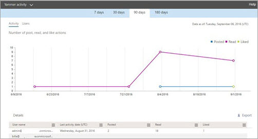

# Microsoft 365-Berichte im Admin Center – jammern-AktivitätsberichtMicrosoft 365 Reports in the admin center - Yammer activity report

Das Dashboard **Berichte** zeigt Ihnen als Microsoft 365-Administrator Ihre Daten im Hinblick auf die Nutzung der Produkte innerhalb Ihrer Organisation an.As Microsoft 365 admin, the **Reports** dashboard shows you data on the usage of the products within your organization. Schauen Sie sich [Aktivitätsberichte im Admin Center](activity-reports.md) an.Check out [activity reports in the admin center](activity-reports.md). Mit dem **Yammer-Aktivitätsbericht** können Sie den Grad des Engagements Ihrer Organisation mit Yammer erkennen. Dazu schauen Sie sich die Anzahl eindeutiger Benutzer, die über Yammer eine Nachricht posten, lesen oder mit "Gefällt mir" bewerten, und den Umfang der Aktivitäten an, die organisationsweit generiert wurden.With the **Yammer Activity report**, you can understand the level of engagement of your organization with Yammer by looking at the number of unique users using Yammer to post, like or read a message and the amount of activity generated across the organization. 
  
> [!NOTE]
> Sie müssen ein globaler Administrator, ein globaler Leser oder ein Leser von Berichten in Microsoft 365 oder einer Exchange-, SharePoint-, Teams-Dienst-, Microsoft Teams-oder Skype for Business-Administrator sein, um Berichte anzuzeigen.You must be a global administrator, global reader or reports reader in Microsoft 365 or an Exchange, SharePoint, Teams Service, Teams Communications, or Skype for Business administrator to see reports. 
 
## Aufrufen des Yammer-AktivitätsberichtsHow to get to the Yammer activity report

1. Wechseln Sie im Admin Center zur Seite **Berichte** \> <a href="https://go.microsoft.com/fwlink/p/?linkid=2074756" target="_blank">Verwendung</a>.In the admin center, go to the **Reports** \> <a href="https://go.microsoft.com/fwlink/p/?linkid=2074756" target="_blank">Usage</a> page.

    
2. Wählen Sie in der Dropdownliste **Bericht auswählen** den Eintrag **Yammer** \> **Aktivität** aus.From the **Select a report** drop-down, select **Yammer** \> **Activity**.
  
## Interpretieren des Yammer-AktivitätsberichtsInterpret the Yammer activity report

Sie erhalten einen Einblick in die Yammer-Aktivitäten Ihrer Benutzer, indem Sie sich die Diagramme "Aktivität" und "Benutzer" ansehen.You can get a view into your user's Yammer activity by looking at the Activity and Users charts.
  

  
Der Aktivitätsbericht enthält die folgenden Informationen.The activity report contains the following information.
  
- Mithilfe der Registerkarten für verschiedene Anzahlen von Tagen können Sie die Trends im Bericht **Yammer-Aktivität** über die letzten 7 Tage, 30 Tage, 90 Tage oder 180 Tage anzeigen.Use the day tabs to view the **Yammer activity** report trends over the last 7 days, 30 days, 90 days, or 180 days. Wenn Sie im Bericht jedoch einen bestimmten Tag auswählen, werden in der Tabelle Daten für bis zu 28 Tage ab dem aktuellen Datum angezeigt (nicht ab dem Datum, an dem der Bericht generiert wurde).However, if you select a particular day in the report, the table will show data for up to 28 days from the current date (not the date the report was generated). 
    
- Jeder Bericht weist das Datum auf, an dem er generiert wurde. Die Berichte weisen in der Regel eine Latenz von 24 bis 48 Stunden ab dem Zeitpunkt der Aktivität auf.Each report has a date for when the report was generated. The reports usually reflect a 24 to 48 hour latency from time of activity.
    
- Sie können das Diagramm **Aktivität** anzeigen, um den Trend in Hinsicht auf die Menge von Yammer-Aktivitäten in Ihrer Organisation zu erkennen. Sie können die Aufteilung von Nachrichten in "gepostet", "gelesen" oder "Gefällt mir" erkennen.You can view the **Activity** chart to understand the trend of the amount of Yammer activity going on in your organization. You can understand the split of messages posted, read, or liked. 
    
    
  
  - Im Diagramm **Aktivität** bezeichnet die y-Achse die Anzahl der Aktivitäten bei den geposteten, gelesenen oder mit "Gefällt mir" bewerteten Nachrichten.On the **Activity** chart, the Y axis is the count of activity of the messages posted, read, or liked. 
    
- Sie können das Diagramm **Benutzer** anzeigen, um den Trend in Hinsicht auf die Anzahl eindeutiger Benutzer zu erkennen, die die Yammer-Aktivitäten generieren. Sie können sich den Trend von Benutzern anschauen, die Yammer-Nachrichten posten, lesen oder mit "Gefällt mir" bewerten.You can view the **User** chart to understand the trend of the amount of unique users who are generating the Yammer activities. You can look at the trend of users posting, reading, or liking Yammer messages. 
    
    
  
  - Im Aktivitätsdiagramm **Benutzer** bezeichnet die y-Achse die Benutzer, die Yammer-Nachrichten posten, lesen oder mit "Gefällt mir" bewerten.On the **Users** activity chart, the Y axis is the user posting, reading, or liking Yammer messages. 
    
  - Die X-Achse bezeichnet in beiden Diagrammen den ausgewählten Zeitraum für diesen bestimmten Bericht.The X axis on both charts is the selected date range for this specific report.
    
- Sie können die im Diagramm angezeigte Datenreihe filtern, indem Sie in der Legende ein Element auswählen.You can filter the series you see on the chart by selecting an item in the legend. Wählen Sie beispielsweise im Diagramm **Aktivität** die Option **Gepostet**, **Gelesen** oder **Mit "Gefällt mir" markiert** aus, um nur die jeweils zugehörigen Informationen anzuzeigen.For example, on the **Activity** chart, select **Posted**, **Read**, or **Liked** to see only the info related to each one. 
    
    
  
    Durch das Ändern dieser Auswahl werden die Informationen in der Gitternetztabelle nicht geändert.Changing this selection doesn't change the info in the grid table.
    
- Die Tabelle unter der Grafik zeigt eine Aufschlüsselung der Yammer-Aktivitäten auf Ebene der einzelnen Benutzer.The table under the graph shows you a breakdown of the Yammer activities at the per-user level.
    
    Mithilfe des Menüs können Sie die Daten filtern und sortieren.You can use the menu to filter and sort the data.
    
    
  
    Sie können auch Spalten hinzufügen und entfernen.You can also add and remove columns. Die verfügbaren Spalten sind:The available columns are:
    
  - **Benutzername** ist die E-Mail-Adresse des Benutzers.**Username** is the email address of the user. Sie können die eigentliche E-Mail-Adresse anzeigen oder dieses Feld anonymisieren.You can display the actual email address or make this field anonymous. 
    
    Dieses Raster zeigt Benutzer an, die sich bei jammern mit dem Microsoft 365-Konto angemeldet haben oder sich mit einmaligem Anmelden am Netzwerk angemeldet haben.This grid shows users who logged into Yammer using the Microsoft 365 account or who logged into the network using single sign-on.
    
  - **Anzeigename** ist der vollständige Name des Benutzers. Sie können die eigentliche E-Mail-Adresse anzeigen oder dieses Feld anonymisieren.**Display name** is the full name of the user. You can display the actual email address or make this field anonymous. 
    
  - **Benutzerstatus** weist einen der drei folgenden Werte auf: "Aktiviert", "Gelöscht" oder "Angehalten".**User state** is one of three values: Activated, Deleted, or Suspended. 
    
     Diese Berichte zeigen Daten für aktive, angehaltene und gelöschte Benutzer. Sie zeigen keine ausstehenden Benutzer, weil ausstehende Benutzer nicht posten, lesen oder eine Nachricht mit "Gefällt mir" bewerten können. These reports show data for active, suspended, and deleted users. They do not reflect pending users, because pending users cannot post, read, or like a message.
    
  - **Datum der Statusänderung (UTC)** ist das Datum, an dem der Status des Benutzers in Yammer geändert wurde.**State change date (UTC)** is the date on which the user's state was changed in Yammer. 
    
  - **Datum der letzten Aktivität (UTC)** bezieht sich auf das letzte Datum, an dem der Benutzer eine Nachricht gepostet, gelesen oder mit "Gefällt mir" bewertet hat.**Last activity date (UTC)** refers to the last date that the user posted, read, or liked a message. 
    
  - **Gepostet** ist die Anzahl der Nachrichten, die der Benutzer während des angegebenen Zeitraums gepostet hat.**Posted** is the number of messages the user posted during the time period you specified. 
    
  - **Gelesen** ist die Anzahl der Unterhaltungen, die der Benutzer während des angegebenen Zeitraums gelesen hat.**Read** is the number of conversations that the user read during the time period you specified. 
    
  - **Mit "Gefällt mir" markiert** ist die Anzahl der Nachrichten, die der Benutzer während des angegebenen Zeitraums mit "Gefällt mir" bewertet hat.**Liked** is the number of messages that the user liked during the time period you specified. 
    
  - **Zugewiesenes Produkt** bezeichnet die Produkte, die diesem Benutzer zugewiesen sind.**Product assigned** is the products that are assigned to this user. 
    
    Wenn die Richtlinien Ihrer Organisation eine Anzeige von Berichten verhindern, in denen Benutzerinformationen identifizierbar sind, können Sie die Datenschutzeinstellung für alle diese Berichte ändern.If your organization's policies prevents you from viewing reports where user information is identifiable, you can change the privacy setting for all these reports. Lesen Sie den Abschnitt zum **Ausblenden von Details auf Benutzerebene** in [Aktivitätsberichte im Microsoft 365 Admin Center](activity-reports.md).Check out the **How do I hide user level details?** section in [Activity reports in the Microsoft 365 admin center](activity-reports.md).
    
- Sie können die Berichtsdaten auch im CSV-Format in eine Excel-Datei exportieren, indem Sie den Link **Exportieren** auswählen.You can also export the report data into an Excel .csv file, by selecting the **Export** link. Dadurch werden Daten aller Benutzer exportiert, und Sie können einfache Sortier- und Filtervorgänge zur weiteren Analyse ausführen.This exports data of all users and enables you to do simple sorting and filtering for further analysis. Bei weniger als 2.000 Benutzern können Sie innerhalb der Tabelle im Bericht selbst sortieren und filtern.If you have less than 2000 users, you can sort and filter within the table in the report itself. Bei mehr als 2.000 Benutzern müssen Sie die Daten zum Filtern und Sortieren exportieren.If you have more than 2000 users, in order to filter and sort, you will need to export the data. 
    
## Welche Daten sind in diesen Berichten enthalten?What data is in these reports?

- **Alle Clients** – Diese Berichte aggregieren Daten kundenübergreifend, einschließlich derjenigen, die Yammer über einen Browser oder aber in einer iOS- oder Android-App nutzen.**All clients** These reports aggregate data across all clients, including using Yammer in a browser or on an iOS or Android app. 
    
- **Keine externen Netzwerkdaten** – Externe Netzwerkdaten sind in diesen Berichten nicht enthalten.**No external network data** External network data is not included in these reports. 
    
- **Aktivierte Netzwerke** Diese Berichte zeigen Daten für das Jammern-Netzwerk an, das Teil Ihres Microsoft 365-Abonnements ist. Das Diagramm aggregiert die Verwendung aller Benutzer, die sich am Jammer Netzwerk angemeldet haben, unabhängig davon, ob Sie Microsoft 365 oder jammern für die Anmeldung verwendet haben.**Activated networks** These reports show data for the Yammer network that is part of your Microsoft 365 subscription. The chart aggregates usage of all users who logged into the Yammer network, irrespective of whether they used Microsoft 365 or Yammer to log in. 
    

