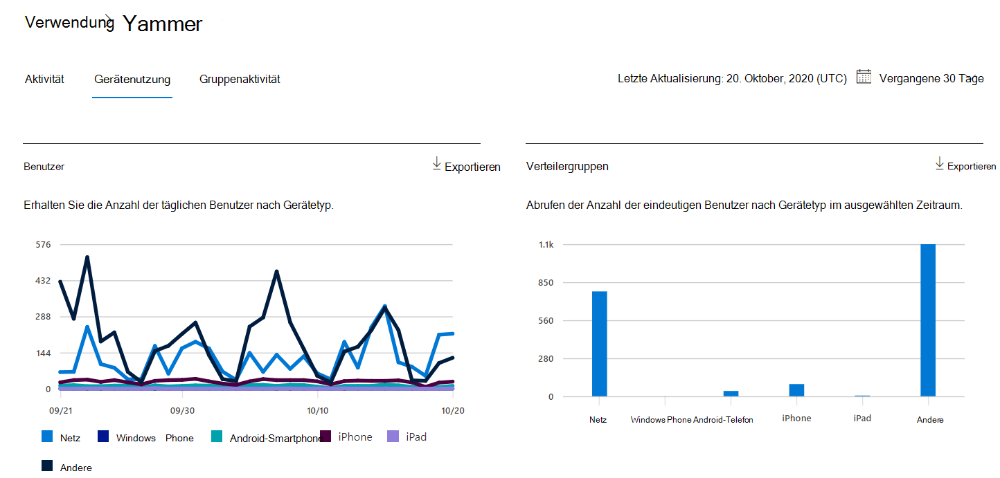
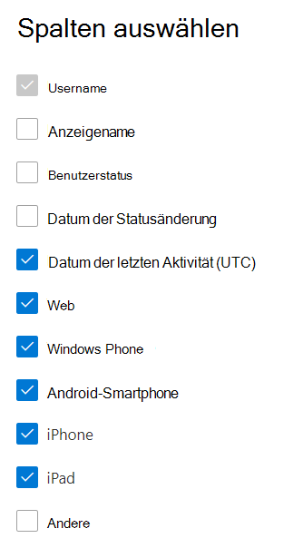

# Microsoft 365-Berichte im Admin Center – Yammer GerätenutzungsberichtMicrosoft 365 Reports in the admin center - Yammer device usage report

Das Microsoft 365 **Reports-Dashboard** zeigt Ihnen die Übersicht über die Aktivitäten in den Produkten in Ihrer Organisation.The Microsoft 365 **Reports** dashboard shows you the activity overview across the products in your organization. Sie können Drilldowns zu Einzelberichten auf Produktebene ausführen und auf diese Weise genauere Einblicke in die Aktivitäten innerhalb der einzelnen Produkte erhalten.It enables you to drill in to individual product level reports to give you more granular insight about the activities within each product. Sehen Sie sich die [Übersicht über Berichte](activity-reports.md) an.Check out [the Reports overview topic](activity-reports.md).
  
Die Yammer-Geräteverwendungsberichte geben Ihnen Aufschluss darüber, auf welchen Geräten Ihre Benutzer Yammer nutzen. Sie können die Anzahl der täglichen Benutzer nach Gerätetyp sowie die Anzahl der Benutzer pro Gerätetyp anzeigen. Für beide Berichtsarten können Sie einen bestimmten Zeitraum auswählen. Zudem können Sie auch Details für einzelne Benutzer anzeigen.The Yammer device usage reports give you information about which devices your users are using Yammer on. You can view the number of daily users by device type, and number of users by device type. You can view both over a selected time period. You can also view details per user.
  
> [!NOTE]
> Sie müssen ein globaler Administrator, globaler Leser oder Berichtleser in Microsoft 365 oder ein Exchange-, SharePoint-, Teams-Dienst-, Teams Communications- oder Skype for Business-Administrator sein, um Berichte anzeigen zu können.You must be a global administrator, global reader or reports reader in Microsoft 365 or an Exchange, SharePoint, Teams Service, Teams Communications, or Skype for Business administrator to see reports.  
 
## Wie kann ich den Yammer-Geräteverwendungsbericht abrufen?How do I get to the Yammer device usage report?

1. Wechseln Sie im Admin Center zur Seite **Berichte** \> <a href="https://go.microsoft.com/fwlink/p/?linkid=2074756" target="_blank">Verwendung</a>.In the admin center, go to the **Reports** \> <a href="https://go.microsoft.com/fwlink/p/?linkid=2074756" target="_blank">Usage</a> page. 
2. Klicken Sie auf der Dashboard-Homepage auf **die** Schaltfläche Weitere Anzeigen auf der Yammer Karte.From the dashboard homepage, click on the **View more** button on the Yammer card.
  
## Interpretieren des Yammer GeräteverwendungsberichtsInterpret the Yammer device usage report

Sie können die Verwendung im #A0 anzeigen, indem Sie die Registerkarte **Geräteverwendung** auswählen.You can view the usage in the OneDrive report by choosing the **Device usage** tab. 

Wählen **Sie Spalten auswählen** aus, um Spalten aus dem Bericht hinzuzufügen oder zu entfernen.Select **Choose columns** to add or remove columns from the report.    

Sie können die Berichtsdaten auch im CSV-Format in eine Excel-Datei exportieren, indem Sie den Link **Exportieren** auswählen.You can also export the report data into an Excel .csv file by selecting the **Export** link. Dadurch werden Daten aller Benutzer exportiert, und Sie können einfache Sortier- und Filtervorgänge zur weiteren Analyse ausführen.This exports data of all users and enables you to do simple sorting and filtering for further analysis. Bei weniger als 2.000 Benutzern können Sie innerhalb der Tabelle im Bericht selbst sortieren und filtern.If you have less than 2000 users, you can sort and filter within the table in the report itself. Bei mehr als 2.000 Benutzern müssen Sie die Daten zum Filtern und Sortieren exportieren.If you have more than 2000 users, in order to filter and sort, you will need to export the data. 
  
|ElementItem|BeschreibungDescription|
|:-----|:-----|
|**Metrik****Metric**|**Definition****Definition**|
|UsernameUsername    |Die E-Mail-Adresse des Benutzers.The email address of the user. Sie können die eigentliche E-Mail-Adresse anzeigen oder dieses Feld anonymisieren.You can display the actual email address or make this field anonymous. Dieses Raster zeigt Benutzer, die sich mit Yammer Microsoft 365-Konto angemeldet haben oder sich über einmaliges Anmelden am Netzwerk angemeldet haben.This grid shows users who logged into Yammer using the Microsoft 365 account or who logged into the network using single sign-on.   |
|NameDisplay name    |Der vollständige Name des Benutzers.The full name of the user. Sie können die eigentliche E-Mail-Adresse anzeigen oder dieses Feld anonymisieren.You can display the actual email address or make this field anonymous.    |
|BenutzerstatusUser state    |Einer von drei Werten: Active, Deleted oder Suspended.One of three values: Active, Deleted, or Suspended. Diese Berichte zeigen Daten für aktive, angehaltene und gelöschte Benutzer.These reports show data for active, suspended, and deleted users. Sie zeigen keine ausstehenden Benutzer, weil ausstehende Benutzer nicht posten, lesen oder eine Nachricht mit "Gefällt mir" bewerten können.They do not reflect pending users, because pending users cannot post, read, or like a message.     |
|Statusänderungsdatum (UTC)State change date (UTC)    |Das Datum, an dem der Status des Benutzers in der Yammer.The date on which the user's state was changed in Yammer.    |
|Datum der letzten Aktivität (UTC)Last activity date (UTC)    |Das letzte Datum (UTC), an dem der Benutzer an einer Yammer teilgenommen hat.The last date (UTC) that the user participated in an Yammer activity.    |
|NetzWeb    |Gibt an, ob der Benutzer Yammer im Web verwendet hat.Indicates if the user has used Yammer on the web.    |
|Windows PhoneWindows phone    | Gibt an, ob der Benutzer Yammer windows phone verwendet hat.Indicates if the user has used Yammer on a Windows phone.    |
|Android-SmartphoneAndroid phone    |Gibt an, ob der Benutzer Yammer auf einem Android-Smartphone verwendet hat.Indicates if the user has used Yammer on an Android phone.  |
|iphoneiphone   | Gibt an, ob der Benutzer Yammer iPhone verwendet hat.Indicates if the user has used Yammer on an iPhone.    |
|ipadipad    |Gibt an, ob der Benutzer Yammer iPad verwendet hat.Indicates if the user has used Yammer on an iPad.  |
|otherother    |Gibt an, ob der Benutzer die Yammer auf einem anderen Gerät verwendet hat, das zuvor nicht aufgeführt wurde.Indicates if the user has used Yammer on another device, not listed previously.  |
|||