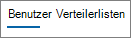
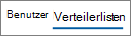

# Microsoft 365-Berichte im Admin Center – Nutzungsbericht zum Jammern von GerätenMicrosoft 365 Reports in the admin center - Yammer device usage report

Im Microsoft 365 **Reports** -Dashboard wird die Aktivitätsübersicht für die Produkte in Ihrer Organisation angezeigt.The Microsoft 365 **Reports** dashboard shows you the activity overview across the products in your organization. Sie können Drilldowns zu Einzelberichten auf Produktebene ausführen und auf diese Weise genauere Einblicke in die Aktivitäten innerhalb der einzelnen Produkte erhalten.It enables you to drill in to individual product level reports to give you more granular insight about the activities within each product. Sehen Sie sich die [Übersicht über Berichte](activity-reports.md) an.Check out [the Reports overview topic](activity-reports.md).
  
Die Yammer-Geräteverwendungsberichte geben Ihnen Aufschluss darüber, auf welchen Geräten Ihre Benutzer Yammer nutzen. Sie können die Anzahl der täglichen Benutzer nach Gerätetyp sowie die Anzahl der Benutzer pro Gerätetyp anzeigen. Für beide Berichtsarten können Sie einen bestimmten Zeitraum auswählen. Zudem können Sie auch Details für einzelne Benutzer anzeigen.The Yammer device usage reports give you information about which devices your users are using Yammer on. You can view the number of daily users by device type, and number of users by device type. You can view both over a selected time period. You can also view details per user.
  
> [!NOTE]
> Sie müssen ein globaler Administrator, ein globaler Leser oder ein berichtsleser in Microsoft 365 oder ein Exchange-, SharePoint-oder Skype for Business-Administrator sein, um Berichte anzuzeigen.You must be a global administrator, global reader or reports reader in Microsoft 365 or an Exchange, SharePoint, or Skype for Business administrator to see reports. 
  
## Wie kann ich den Yammer-Geräteverwendungsbericht abrufen?How do I get to the Yammer device usage report?

1. Wechseln Sie im Admin Center zur Seite **Berichte** \> <a href="https://go.microsoft.com/fwlink/p/?linkid=2074756" target="_blank">Verwendung</a>.In the admin center, go to the **Reports** \> <a href="https://go.microsoft.com/fwlink/p/?linkid=2074756" target="_blank">Usage</a> page.

    
2. Wählen Sie in der Dropdownliste **Bericht auswählen** die Optionen **Yammer** \> **Geräteverwendung** aus.From the **Select a report** drop-down, select **Yammer** \> **Device usage**.
  
## Interpretieren des Yammer-AktivitätsberichtsInterpret the Yammer activity report

Die Yammer-Geräteverwendung durch Ihre Benutzer werden in den Diagrammen **Benutzer** und **Verteilung** grafisch dargestellt.You can get a view into your users' Yammer device usage by looking at the **Users** and **Distribution** charts. 
  
Der Geräteverwendungsbericht enthält die folgenden Informationen.The device usage report contains the following information.
  
- Mithilfe der Registerkarten können Sie die Trends im Aktivitätsbericht **Yammer-Geräteverwendung** über die letzten 7 Tage, 30 Tage, 90 Tage oder 180 Tage anzeigen.Use the day tabs to view the **Yammer device usage** activity report trends over the last 7 days, 30 days, 90 days, or 180 days. Wenn Sie im Bericht jedoch einen bestimmten Tag auswählen, werden in der Tabelle Daten für bis zu 28 Tage ab dem aktuellen Datum angezeigt (nicht ab dem Datum, an dem der Bericht generiert wurde).However, if you select a particular day in the report, the table will show data for up to 28 days from the current date (not the date the report was generated). 
    
- Jeder Bericht weist das Datum auf, an dem er generiert wurde. Die Berichte weisen in der Regel eine Latenz von 24 bis 48 Stunden ab dem Zeitpunkt der Aktivität auf.Each report has a date for when the report was generated. The reports usually reflect a 24 to 48 hour latency from time of activity.
    
- Im Diagramm **Benutzer** können Sie die Anzahl der täglichen Benutzer nach Gerätetyp anzeigen.You can view the **Users** chart to see the number of daily users by device type.  
  
- Im Diagramm **Verteilung** können Sie die Anzahl der Benutzer pro Gerätetyp anzeigen.You can view the **Distribution** chart to see the number of users by device type.  
  
- Die Tabelle **Details** unterhalb der Grafik zeigt eine Aufschlüsselung der Yammer-Geräteverwendung auf der Ebene der einzelnen Benutzer. The **Details** table under the graph shows you a breakdown of the Yammer device usage at the per-user level. 
    
    Sie können auch Spalten hinzufügen und entfernen. Die verfügbaren Spalten sind:You can also add and remove columns. The available columns are:
    
  - **Benutzername** ist die E-Mail-Adresse des Benutzers.**Username** is the email address of the user. Sie können die eigentliche E-Mail-Adresse anzeigen oder dieses Feld anonymisieren.You can display the actual email address or make this field anonymous. 
    
    Dieses Raster zeigt Benutzer an, die sich bei jammern mit dem Microsoft 365-Konto angemeldet haben oder sich mit einmaligem Anmelden am Netzwerk angemeldet haben.This grid shows users who logged into Yammer using the Microsoft 365 account or who logged into the network using single sign-on.
    
  - **Anzeigename** ist der vollständige Name des Benutzers. Sie können die eigentliche E-Mail-Adresse anzeigen oder dieses Feld anonymisieren.**Display name** is the full name of the user. You can display the actual email address or make this field anonymous. 
    
  - **Benutzerstatus** weist einen der drei folgenden Werte auf: "Aktiviert", "Gelöscht" oder "Angehalten".**User state** is one of three values: Active, Deleted, or Suspended. 
    
     Diese Berichte zeigen Daten für aktive, angehaltene und gelöschte Benutzer. Sie zeigen keine ausstehenden Benutzer, weil ausstehende Benutzer nicht posten, lesen oder eine Nachricht mit "Gefällt mir" bewerten können. These reports show data for active, suspended, and deleted users. They do not reflect pending users, because pending users cannot post, read, or like a message.
    
  - **Web** gibt an, ob der Benutzer Yammer im Web verwendet hat.**Web** indicates if the user has used Yammer on the web. 
    
  - **Windows Phone** gibt an, ob der Benutzer Yammer auf einem Windows Phone verwendet hat.**Windows phone** indicates if the user has used Yammer on a Windows phone 
    
  - **Android-Smartphone** gibt an, ob der Benutzer Yammer auf einem Android-Smartphone verwendet hat.**Android phone** indicates if the user has used Yammer on an Android phone. 
    
  - **iPhone** gibt an, ob der Benutzer Yammer auf einem iPhone verwendet hat.**iPhone** indicates if the user has used Yammer on an iPhone. 
    
  - **iPad** gibt an, ob der Benutzer Yammer auf einem iPad verwendet hat.**iPad** indicates if the user has used Yammer on an iPad. 
    
  - **Andere** gibt an, ob der Benutzer Yammer auf einem anderen Gerät, das oben nicht aufgeführt ist, verwendet hat.**Other** indicates if the user has used Yammer on another device, not listed previously. 
    
    Wenn die Richtlinien Ihrer Organisation eine Anzeige von Berichten verhindern, in denen Benutzerinformationen identifizierbar sind, können Sie die Datenschutzeinstellung für alle diese Berichte ändern.If your organization's policies prevents you from viewing reports where user information is identifiable, you can change the privacy setting for all these reports. Lesen Sie den Abschnitt zum **Ausblenden von Details auf Benutzerebene** in den [Aktivitätsberichten im Microsoft 365 Admin Center](activity-reports.md).Check out the **How do I hide user level details?** section in the [Activity Reports in the Microsoft 365 admin center](activity-reports.md).
    
- Sie können die Berichtsdaten auch im CSV-Format in eine Excel-Datei exportieren, indem Sie den Link **Exportieren** auswählen.You can also export the report data into an Excel .csv file, by selecting the **Export** link. Dadurch werden Daten aller Benutzer exportiert, und Sie können einfache Sortier- und Filtervorgänge zur weiteren Analyse ausführen.This exports data of all users and enables you to do simple sorting and filtering for further analysis. Bei weniger als 2.000 Benutzern können Sie innerhalb der Tabelle im Bericht selbst sortieren und filtern.If you have less than 2000 users, you can sort and filter within the table in the report itself. Bei mehr als 2.000 Benutzern müssen Sie die Daten zum Filtern und Sortieren exportieren.If you have more than 2000 users, in order to filter and sort, you will need to export the data. 
    

