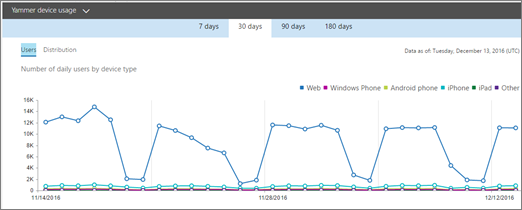

# Microsoft 365-Berichte im Admin Center – Yammer Gerätenutzungsbericht

Das Microsoft 365 **Reports-Dashboard** zeigt Ihnen die Übersicht über die Aktivitäten in den Produkten in Ihrer Organisation. Sie können Drilldowns zu Einzelberichten auf Produktebene ausführen und auf diese Weise genauere Einblicke in die Aktivitäten innerhalb der einzelnen Produkte erhalten. Sehen Sie sich die [Übersicht über Berichte](activity-reports.md) an.
  
Die Yammer-Geräteverwendungsberichte geben Ihnen Aufschluss darüber, auf welchen Geräten Ihre Benutzer Yammer nutzen. Sie können die Anzahl der täglichen Benutzer nach Gerätetyp sowie die Anzahl der Benutzer pro Gerätetyp anzeigen. Für beide Berichtsarten können Sie einen bestimmten Zeitraum auswählen. Zudem können Sie auch Details für einzelne Benutzer anzeigen.
  
> [!NOTE]
> Sie müssen ein globaler Administrator, globaler Leser oder Berichtleser in Microsoft 365 oder ein Exchange-, SharePoint-, Teams-Dienst-, Teams Communications- oder Skype for Business-Administrator sein, um Berichte anzeigen zu können. 
  
## Wie kann ich den Yammer-Geräteverwendungsbericht abrufen?

1. Wechseln Sie im Admin Center zur Seite **Berichte** \> <a href="https://go.microsoft.com/fwlink/p/?linkid=2074756" target="_blank">Verwendung</a>.

    
2. Wählen Sie in der Dropdownliste **Bericht auswählen** die Optionen **Yammer** \> **Geräteverwendung** aus.
  
## Interpretieren des Yammer-Aktivitätsberichts

Die Yammer-Geräteverwendung durch Ihre Benutzer werden in den Diagrammen **Benutzer** und **Verteilung** grafisch dargestellt. 
  
Der Geräteverwendungsbericht enthält die folgenden Informationen.
  
- Mithilfe der Registerkarten können Sie die Trends im Aktivitätsbericht **Yammer-Geräteverwendung** über die letzten 7 Tage, 30 Tage, 90 Tage oder 180 Tage anzeigen. Wenn Sie im Bericht jedoch einen bestimmten Tag auswählen, werden in der Tabelle Daten für bis zu 28 Tage ab dem aktuellen Datum angezeigt (nicht ab dem Datum, an dem der Bericht generiert wurde). 
    
- Jeder Bericht weist das Datum auf, an dem er generiert wurde. Die Berichte weisen in der Regel eine Latenz von 24 bis 48 Stunden ab dem Zeitpunkt der Aktivität auf.
    
- Im Diagramm **Benutzer** können Sie die Anzahl der täglichen Benutzer nach Gerätetyp anzeigen.  
  
- Im Diagramm **Verteilung** können Sie die Anzahl der Benutzer pro Gerätetyp anzeigen.  
  
- Die Tabelle **Details** unterhalb der Grafik zeigt eine Aufschlüsselung der Yammer-Geräteverwendung auf der Ebene der einzelnen Benutzer.  
    
    Sie können auch Spalten hinzufügen und entfernen. Die verfügbaren Spalten sind:
    
  - **Benutzername** ist die E-Mail-Adresse des Benutzers. Sie können die eigentliche E-Mail-Adresse anzeigen oder dieses Feld anonymisieren. 
    
    Dieses Raster zeigt Benutzer, die sich mit Yammer Microsoft 365-Konto angemeldet haben oder sich über einmaliges Anmelden am Netzwerk angemeldet haben.
    
  - **Anzeigename** ist der vollständige Name des Benutzers. Sie können die eigentliche E-Mail-Adresse anzeigen oder dieses Feld anonymisieren. 
    
  - **Benutzerstatus** weist einen der drei folgenden Werte auf: "Aktiviert", "Gelöscht" oder "Angehalten". 
    
     Diese Berichte zeigen Daten für aktive, angehaltene und gelöschte Benutzer. Sie zeigen keine ausstehenden Benutzer, weil ausstehende Benutzer nicht posten, lesen oder eine Nachricht mit "Gefällt mir" bewerten können. 
    
  - **Web** gibt an, ob der Benutzer Yammer im Web verwendet hat. 
    
  - **Windows Phone** gibt an, ob der Benutzer Yammer auf einem Windows Phone verwendet hat. 
    
  - **Android-Smartphone** gibt an, ob der Benutzer Yammer auf einem Android-Smartphone verwendet hat. 
    
  - **iPhone** gibt an, ob der Benutzer Yammer auf einem iPhone verwendet hat. 
    
  - **iPad** gibt an, ob der Benutzer Yammer auf einem iPad verwendet hat. 
    
  - **Andere** gibt an, ob der Benutzer Yammer auf einem anderen Gerät, das oben nicht aufgeführt ist, verwendet hat. 
    
    Wenn die Richtlinien Ihrer Organisation eine Anzeige von Berichten verhindern, in denen Benutzerinformationen identifizierbar sind, können Sie die Datenschutzeinstellung für alle diese Berichte ändern. Lesen Sie den Abschnitt zum **Ausblenden von Details auf Benutzerebene** in den [Aktivitätsberichten im Microsoft 365 Admin Center](activity-reports.md).
    
- Sie können die Berichtsdaten auch im CSV-Format in eine Excel-Datei exportieren, indem Sie den Link **Exportieren** auswählen. Dadurch werden Daten aller Benutzer exportiert, und Sie können einfache Sortier- und Filtervorgänge zur weiteren Analyse ausführen. Bei weniger als 2.000 Benutzern können Sie innerhalb der Tabelle im Bericht selbst sortieren und filtern. Bei mehr als 2.000 Benutzern müssen Sie die Daten zum Filtern und Sortieren exportieren. 
    

