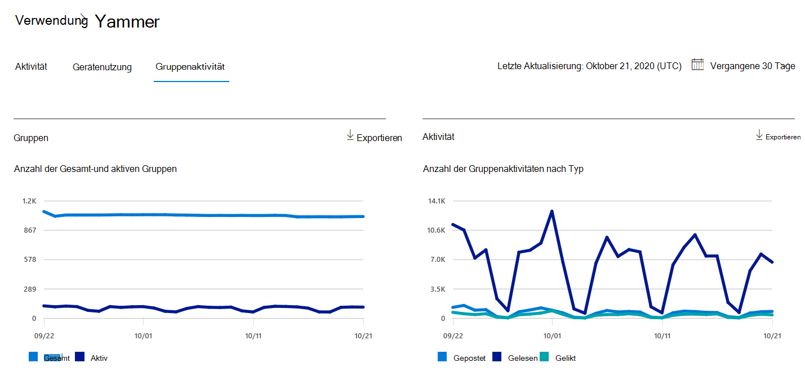
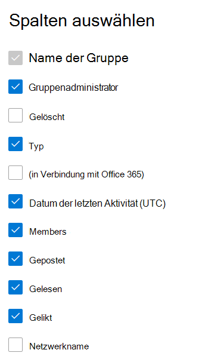

# Microsoft 365 Berichte im Admin Center – Yammer Gruppenaktivitätsbericht

Das Microsoft 365 **-Dashboard** zeigt Ihnen die Übersicht über die Aktivitäten in den Produkten in Ihrer Organisation. Sie können Drilldowns zu Einzelberichten auf Produktebene ausführen und auf diese Weise genauere Einblicke in die Aktivitäten innerhalb der einzelnen Produkte erhalten. Sehen Sie sich die [Übersicht über Berichte](activity-reports.md) an. Über den Yammer-Gruppenaktivitätsbericht erhalten Sie Einblicke in die Aktivitäten der Yammer-Gruppen innerhalb Ihrer Organisation und erfahren, wie viele Yammer-Gruppen erstellt und verwendet wurden.
  
> [!NOTE]
> Sie müssen ein globaler Administrator, globaler Leser oder Berichtleser in Microsoft 365 oder ein Exchange-, SharePoint-, Teams-Dienst-, Teams-Kommunikations- oder Skype for Business-Administrator sein, um Berichte anzeigen zu können.  
 
## Wie kann ich zum Aktivitätsbericht Yammer Gruppen kommen?

1. Wechseln Sie im Admin Center zur Seite **Berichte** \> <a href="https://go.microsoft.com/fwlink/p/?linkid=2074756" target="_blank">Verwendung</a>. 
2. Klicken Sie auf der Dashboard-Homepage auf **die** Schaltfläche Weitere Anzeigen auf der Yammer Karte.

  
## Interpretieren des Berichts "Yammer-Gruppenaktivität"

Sie können die Gruppenaktivitäten im Bericht Yammer anzeigen, indem Sie die Registerkarte **Gruppenaktivität** auswählen. 

Wählen **Sie Spalten auswählen** aus, um Spalten aus dem Bericht hinzuzufügen oder zu entfernen.    

Sie können die Berichtsdaten auch im CSV-Format in eine Excel-Datei exportieren, indem Sie den Link **Exportieren** auswählen. Dadurch werden Daten aller Benutzer exportiert, und Sie können einfache Sortier- und Filtervorgänge zur weiteren Analyse ausführen. Bei weniger als 2.000 Benutzern können Sie innerhalb der Tabelle im Bericht selbst sortieren und filtern. Bei mehr als 2.000 Benutzern müssen Sie die Daten zum Filtern und Sortieren exportieren. 
  
|Element|Beschreibung|
|:-----|:-----|
|**Metrik**|**Definition**|
|Name der Gruppe    |Der Name der Gruppe.   |
|Gruppenadministrator    |Der Name des Gruppenadministrators oder Besitzers.    |
|Gelöscht    |Die Anzahl der gelöschten Yammer Gruppen. Wenn eine Gruppe gelöscht wird, die im Berichtszeitraum Aktivitäten ausgeführt hat, wird sie im Raster mit dieser auf TRUE festgelegten Kennzeichnung angezeigt.    |
|Typ    |Der Typ der Gruppe, öffentlich oder privat.   |
|Verbunden mit Office 365    |Gibt an, ob Yammer gruppe auch eine Microsoft 365 ist.   |
|Datum der letzten Aktivität (UTC)    | Das letzte Datum, an dem eine Nachricht von der Gruppe gelesen, veröffentlicht oder gefällt wurde.    |
|Elemente    | Die Anzahl der Mitglieder in der Gruppe.    |
|Gepostet    |Die Anzahl der nachrichten, die in der gruppe Yammer Berichtszeitraum gepostet werden.  |
|Lesen    |Die Anzahl der Unterhaltungen, die in der gruppe Yammer Berichtszeitraum gelesen werden.    |
|Gelikt    |Die Anzahl der Nachrichten, die in der gruppe Yammer Berichtszeitraum gefielen.  |
|Netzwerkname    |Der vollständige Name des Netzwerks, zu dem die Gruppe gehört. |
|||