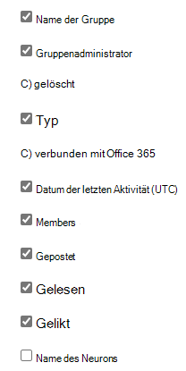

# Microsoft 365-Berichte im Admin Center-Aktivitätsbericht "Jammer Gruppen"Microsoft 365 Reports in the admin center - Yammer groups activity report

Im Microsoft 365 **Reports** -Dashboard wird die Aktivitätsübersicht für die Produkte in Ihrer Organisation angezeigt.The Microsoft 365 **Reports** dashboard shows you the activity overview across the products in your organization. Sie können Drilldowns zu Einzelberichten auf Produktebene ausführen und auf diese Weise genauere Einblicke in die Aktivitäten innerhalb der einzelnen Produkte erhalten.It enables you to drill in to individual product level reports to give you more granular insight about the activities within each product. Sehen Sie sich die [Übersicht über Berichte](activity-reports.md) an.Check out [the Reports overview topic](activity-reports.md). Über den Yammer-Gruppenaktivitätsbericht erhalten Sie Einblicke in die Aktivitäten der Yammer-Gruppen innerhalb Ihrer Organisation und erfahren, wie viele Yammer-Gruppen erstellt und verwendet wurden.In the Yammer groups activity report, you can gain insights into the activity of Yammer groups in your organization and see how many Yammer groups are being created and used.
  
> [!NOTE]
> Sie müssen ein globaler Administrator, ein globaler Leser oder ein Leser von Berichten in Microsoft 365 oder einer Exchange-, SharePoint-, Teams-Dienst-, Microsoft Teams-oder Skype for Business-Administrator sein, um Berichte anzuzeigen.You must be a global administrator, global reader or reports reader in Microsoft 365 or an Exchange, SharePoint, Teams Service, Teams Communications, or Skype for Business administrator to see reports.  

## So gelangen Sie zum Bericht "Yammer-Gruppenaktivität"How to get to the Yammer groups activity report

1. Wechseln Sie im Admin Center zur Seite **Berichte** \> <a href="https://go.microsoft.com/fwlink/p/?linkid=2074756" target="_blank">Verwendung</a>.In the admin center, go to the **Reports** \> <a href="https://go.microsoft.com/fwlink/p/?linkid=2074756" target="_blank">Usage</a> page.

    
2. Wählen Sie in der Dropdownliste **Bericht auswählen** den Eintrag **Yammer** \> **Gruppenaktivität** aus.From the **Select a report** drop-down, select **Yammer** \> **Groups activity** .
  
## Interpretieren des Berichts "Yammer-Gruppenaktivität"Interpret the Yammer groups activity report

Sie können sich einen Überblick über die Aktivitäten von Yammer-Gruppen verschaffen, indem Sie sich die Diagramme **Gruppen** und **Aktivität** ansehen.You can get a view into Yammer groups activity by looking at the **Groups** and **Activity** charts. 
  
|ElementItem|BeschreibungDescription|
|:-----|:-----|
|1.1.    |Im Bericht **Yammer-Gruppenaktivität** werden die Trends über die letzten 7 Tage, 30 Tage, 90 Tage oder 180 Tage angezeigt.The **Yammer groups activity** report can be viewed for trends over the last 7 days, 30 days, 90 days, or 180 days. Wenn Sie im Bericht jedoch einen bestimmten Tag auswählen, werden in der Tabelle (7) Daten für bis zu 28 Tage ab dem aktuellen Datum angezeigt (nicht ab dem Datum, an dem der Bericht generiert wurde).However, if you select a particular day in the report, the table (7) will show data for up to 28 days from the current date (not the date the report was generated).    |
|2.2.    |Die Daten in den einzelnen Berichten decken in der Regel die letzten 24 bis 48 Stunden ab.The data in each report usually covers up to the last 24 to 48 hours.   |
|3.3.    |In der Ansicht **Gruppen** wird die Gesamtanzahl der vorhanden Gruppen angezeigt, und Sie können sehen, wie viele an Gruppenunterhaltungen teilgenommen haben.The **Groups** view shows a total number of groups that existed , and how many performed group conversation activity.    |
|4.4.    |In der Ansicht **Aktivität** wird die Anzahl der veröffentlichten, gelesenen und mit "Gefällt mir" markierten Yammer-Nachrichten in Gruppen angezeigt.The **Activity** view shows you the number Yammer messages posted, read, and liked in groups.    |
|5.5.    | Im Diagramm **Gruppen** gibt die Y-Achse die Anzahl der gesamten oder aktiven Gruppen an.On the **Groups** chart, the Y axis is the count of total or active groups.     Im Diagramm **Aktivität** stellt die Y-Achse die Anzahl der angegebenen Aktivität für Yammer-Gruppen dar.On the **Activity** chart, the Y axis is the count of specified activity for Yammer groups.     Die X-Achse stellt in allen drei Diagrammen den ausgewählten Datumsbereich für den jeweiligen Bericht dar.The X axis on all three charts is the selected date range for the specific report.    |
|6.6.    |Sie können die im Diagramm angezeigte Datenreihe filtern, indem Sie in der Legende ein Element auswählen.You can filter the series you see on the chart by selecting an item in the legend. Wählen Sie beispielsweise im Diagramm **Gruppen** die Option **Gesamt** oder **Aktiv**, um nur die jeweils zugehörigen Informationen anzuzeigen.For example, on the **Groups** chart, select **Total** or **Active**   to see only the info related to each one. Durch das Ändern dieser Auswahl werden die Informationen in der Gitternetztabelle nicht geändert.Changing this selection doesn't change the info in the grid table.    |
|7.7.    | Die Liste der angezeigten Gruppen wird von der Anzahl aller Gruppen bestimmt, die über den längsten Berichtszeitraum (180 Tage) vorhanden waren (nicht gelöscht wurden). Die Anzahl der Aktivitäten (empfangenen Nachrichten) variiert entsprechend der Datumsauswahl.  The list of groups to show is determined by the set of all groups that existed (weren't deleted) across the widest (180-day) reporting time frame. The activity count (messages received) will vary according to the date selection.    HINWEIS: Möglicherweise werden nicht alle Elemente in der nachstehenden Liste in den Spalten angezeigt, solange Sie diese nicht hinzugefügt haben.NOTE: You might not see all the items in the list below in the columns until you add them. **Gruppenname** ist der Name der Gruppe.**Group name** is the name of the group.    **Gruppenadministrator** ist der Name des Gruppenadministrators oder Besitzers.**Group admin** is the name of the group administrator, or owner.    **Gelöscht** ist die Anzahl der gelöschten Yammer-Gruppen. Wenn eine Gruppe gelöscht wird, die im Berichtszeitraum Aktivitäten ausgeführt hat, wird sie im Raster mit dieser auf TRUE festgelegten Kennzeichnung angezeigt.  **Deleted** is the number of deleted Yammer groups. If the group is deleted, but had activity in the reporting period it will show up in the grid with this flag set to true.    **Typ** gibt den Typ der Gruppe zurück (öffentlich oder privat).**Type** is the type of group, public or private.    **Verbunden mit Office 365** gibt an, ob es sich bei der Gruppe jammern auch um eine Microsoft 365-Gruppe handelt.**Connected to Office 365** indicates whether the Yammer group is also an Microsoft 365 group.    **Datum der letzten Aktivität** ist das letzte Datum, an dem eine Nachricht von der Gruppe gelesen, veröffentlicht oder mit "Gefällt mir" markiert wurde.**Last activity date** is the latest date a message was read, posted or liked by the group.    **Mitglieder** ist die Anzahl der Mitglieder der Gruppe.**Members** is the number of members in the group.    **Veröffentlicht** ist die Anzahl der während des Berichtszeitraums in der Yammer-Gruppe veröffentlichten Nachrichten.**Posted** is the number of messages posted in the Yammer group over the reporting period.    **Gelesen** ist die Anzahl der während des Berichtszeitraums in der Yammer-Gruppe gelesenen Unterhaltungen.**Read** is the number of conversations read in the Yammer group over the reporting period.    **Mit "Gefällt mir" markiert** ist die Anzahl der während des Berichtszeitraums in der Yammer-Gruppe mit "Gefällt mir" markierten Nachrichten.**Liked** is the number of messages liked in the Yammer group over the reporting period.   **Network Name** ist der vollständige Name des Netzwerks, zu dem die Gruppe gehört.**Network name** is the full name of the network that the group belongs to.    Wenn die Richtlinien Ihrer Organisation eine Anzeige von Berichten verhindern, in denen Benutzerinformationen identifizierbar sind, können Sie die Datenschutzeinstellung für alle diese Berichte ändern.If your organization's policies prevents you from viewing reports where user information is identifiable, you can change the privacy setting for all these reports. Lesen Sie den Abschnitt zum **Ausblenden von Details auf Benutzerebene** in [Aktivitätsberichte im Microsoft 365 Admin Center](activity-reports.md).Check out the **How do I hide user level details?** section in [Activity reports in the Microsoft 365 admin center](activity-reports.md).    |
|8.8.    |Wählen Sie **Spalten** aus, um Spalten zum Bericht hinzuzufügen oder daraus zu entfernen.Select **Columns** to add or remove columns from the report.    |
|9.9.    |Sie können die Berichtsdaten auch im CSV-Format in eine Excel-Datei exportieren, indem Sie den Link **Exportieren** auswählen.You can also export the report data into an Excel .csv file, by selecting the **Export** link. Dadurch werden Daten aller Benutzer exportiert, und Sie können einfache Sortier- und Filtervorgänge zur weiteren Analyse ausführen.This exports data of all users and enables you to do simple sorting and filtering for further analysis. Bei weniger als 2.000 Benutzern können Sie innerhalb der Tabelle im Bericht selbst sortieren und filtern.If you have less than 2000 users, you can sort and filter within the table in the report itself. Bei mehr als 2.000 Benutzern müssen Sie die Daten zum Filtern und Sortieren exportieren.If you have more than 2000 users, in order to filter and sort, you will need to export the data.    |
|||
   

