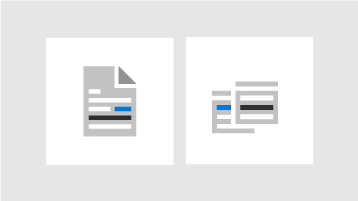

<!-- The following is just placeholder text from Madhura's mail. We need to add images/examples of each -->

# So erhalten Sie Hilfe im Microsoft 365 Admin Center

Wenn Sie ein Administrator sind, ist [Admin.Microsoft.com](https://admin.microsoft.com) Ihr "Go-to-Place" zum Verwalten und Nutzen Ihres Microsoft 365-Abonnements. Manchmal finden Sie möglicherweise nicht die richtige Aufgabe, benötigen mehr Kontext, bevor Sie einen Aufgabenfluss beginnen, oder Sie können sich einfach nicht sicher sein, welchen Umfang und welche Auswirkungen ihre Aktionen als Administrator haben. Um diese Situationen zu decken, bieten wir auf diese Weise moderne Hilfe und intelligente Unterstützung im gesamten Microsoft 365 Admin Center:

<ul class="panelContent cardsW">
    <li>
        

            

                

                    <a href="what-is-help.md">
                        

                            

                                
                            

                        

                        

                            <h3>Integrierte Hilfe</h3>
                            
Hilfe im Admin Center

                        

                    </a>
                

            

        

    </li>
    <li>
        

            

                

                    <a href="what-is-help.md#modern-self-help-powered-by-ai">
                        

                            

                                
                            

                        

                        

                            <h3>Intelligente Unterstützung</h3>
                            
Selbsthilfe powered by AI

                        

                    </a>
                

            

        

    </li>
    <li>
        

            

                

                    <a href="what-is-help.md#guides-and-articles">
                        

                            

                                
                            

                        

                        

                            <h3>Leitfäden und Artikel</h3>
                            
Umfassende Inhalte im Internet

                        

                    </a>
                

            

        

    </li>
</ul>
 
## Integrierte Hilfe

Die Hilfe ist im gesamten Admin Center integriert, daher ist Sie genau dort, wo Sie Sie benötigen. Oben auf vielen Seiten finden Sie einen Inline Hilfetext, der eine Informationsübersicht über die Aufgabe bietet, sowie Links zu Artikeln, in denen Sie schnell die offizielle Dokumentation für ein vertieftes lernen finden können.

## Moderne Selbsthilfe powered by AI

Wenn Sie die Schaltfläche "Hilfe benötigen" im Microsoft 365 Admin Center auswählen, wird unsere moderne Selbsthilfe mit künstlicher Intelligenz betrieben. Wenn Sie beispielsweise nach " *meine Domäne überprüfen*" suchen, erhalten Sie die Schritte und einige Artikel, die Ihnen helfen werden. Wir verwenden Maschinelles Lernen, um die nächstgelegene Lösung zu finden, die für andere Administratoren, die ähnliche Abfragen vorgenommen haben, hilfreich ist.

Oder verwenden Sie den Support-Assistenten, wenn Sie nicht genau wissen, wie Sie in ihrer spezifischen Situation etwas erledigen können. Diese Erfahrung ist derzeit nur in englischer Sprache verfügbar. Verwenden Sie einfach die Umschaltfläche oben im Bereich "Hilfe benötigen", um Sie zu aktivieren. Der Support-Assistent bietet eine Konversations Schnittstelle, um Hilfe zu erhalten. Geben Sie Ihre Abfrage ein, und der Chatbot stellt Klärungs Fragen zur Verfügung, damit Sie die richtige Antwort für Ihre spezifische Situation erhalten. Betrachten Sie es als Ihren virtuellen Helfer, um Lösungen zu entdecken und Aufgaben abzuschließen.

Natürlich sind manchmal Fragen am besten von Menschen beantwortet. Wenn unsere moderne Selbsthilfe keine Antwort hat, haben Sie immer die Möglichkeit, unsere Support-Mitarbeiter zu kontaktieren.

## Leitfäden und Artikel

Wenn Sie außerdem nach umfassenden Bereitstellungshandbüchern, schnellen schrittweisen Verfahren oder PowerShell-Cmdlets suchen, schauen Sie uns im Internet nach. Wir aktualisieren Inhalte regelmäßig und versuchen, Ihnen die neuesten Informationen bereitzustellen. Lesen Sie unsere Artikel und Leitfäden auf der [Microsoft 365-Dokumentations](https://docs.microsoft.com/microsoft-365/) Website.
