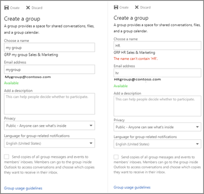
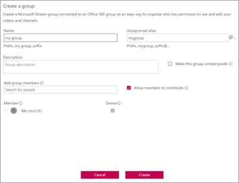

# Benennungsrichtlinie für Office 365-GruppenOffice 365 Groups naming policy

Mithilfe der Gruppenbenennungsrichtlinie können Sie eine konsistente Benennungsstrategie für Gruppen erzwingen, die von Benutzern in Ihrer Organisation erstellt werden.You use a group naming policy to enforce a consistent naming strategy for groups created by users in your organization. Eine Benennungsrichtlinie kann Ihnen und Ihren Benutzern bei der Identifizierung der Funktion der Gruppe, der Mitgliedschaft, der geografischen Region oder der Person helfen, die die Gruppe erstellt hat.A naming policy can help you and your users identify the function of the group, membership, geographic region, or who created the group. Die Benennungsrichtlinie kann auch hilfreich beim Kategorisieren von Gruppen im Adressbuch sein.The naming policy can also help categorize groups in the address book. Mithilfe der Richtlinie können Sie bestimmte Wörter in Gruppennamen und -aliasen blockieren.You can use the policy to block specific words from being used in group names and aliases.

Die Benennungsrichtlinie wird übergreifend auf Gruppen angewendet, die in allen Workloads (wie Outlook, Microsoft Teams, SharePoint, Planner, Yammer usw.) erstellt werden.The naming policy is applied to groups that are created across all groups workloads (like Outlook, Microsoft Teams, SharePoint, Planner, Yammer, etc). Sie wird sowohl auf den Gruppennamen als auch auf den Gruppenalias angewendet.It gets applied to both the group name and group alias. Außerdem wird sie angewendet, wenn ein Benutzer eine Gruppe erstellt und wenn ein Gruppenname oder -alias bei einer bestehenden Gruppe bearbeitet wird.It gets applied when a user creates a group and when group name or alias is edited for an existing group.

> [!TIP]
> Die Benennungsrichtlinie für Office 365-Gruppen gilt nur für Office 365-Gruppen.An Office 365 group naming policy only applies to Office 365 Groups. Sie gilt nicht für in Exchange Online erstellte Verteilergruppen.It doesn't apply to distribution groups created in Exchange Online. Informationen zum Erstellen einer Benennungsrichtlinie für Verteilergruppen finden Sie unter [Erstellen einer Namensrichtlinie für Verteilergruppen](https://docs.microsoft.com/exchange/recipients-in-exchange-online/manage-distribution-groups/create-group-naming-policy).To create a naming policy for distribution groups, see [Create a distribution group naming policy](https://docs.microsoft.com/exchange/recipients-in-exchange-online/manage-distribution-groups/create-group-naming-policy).

Die Gruppenbenennungsrichtlinie besteht aus den folgenden Features:The group naming policy consists of the following features:

- **Präfix-Suffix-Benennungsrichtlinie**: Sie können Präfixe oder Suffixe verwenden, um die Benennungskonvention von Gruppen zu\_definieren\_(Beispiel\_: "GRP US My Group Engineering"). Bei den Präfixen/Suffixen kann es sich entweder um feste Zeichenfolgen oder Benutzerattribute wie [Department] handeln, die basierend auf dem Benutzer ersetzt werden, der die Gruppe erstellt.**Prefix-Suffix naming policy**: You can use prefixes or suffixes to define the naming convention of groups (for example: "GRP\_US\_My Group\_Engineering"). The prefixes/suffixes can either be fixed strings or user attributes like [Department] that will get substituted based on the user who is creating the group.

- **Benutzerdefinierte blockierte Wörter**: Sie können eine Gruppe blockierter Wörter für Ihre Organisation hochladen, die in von Benutzern erstellten Gruppen blockiert würde. (Beispiel: "CEO, Abrechnung, HR").**Custom Blocked Words**: You can upload a set of blocked words specific to their organization that would be blocked in groups created by users. (For example: "CEO, Payroll, HR").

## LizenzierungsanforderungenLicensing requirements

Die Verwendung der Azure AD-Benennungsrichtlinie für Office 365-Gruppen setzt voraus, dass Sie über eine Azure Active Directory Premium P1-Lizenz oder eine Azure AD Basic EDU-Lizenz für jeden eindeutigen Benutzer (einschließlich Gäste) verfügen, der Mitglied einer oder mehrerer Office 365-Gruppen ist.Using Azure AD naming policy for Office 365 groups requires that you possess but not necessarily assign an Azure Active Directory Premium P1 license or Azure AD Basic EDU license for each unique user (including guests) that is a member of one or more Office 365 groups.
Dies gilt auch für den Administrator, der die Benennungsrichtlinie für Gruppen erstellt.This is also required for the administrator that creates the Groups naming policy.

## Präfix Suffix-BenennungsrichtliniePrefix-Suffix naming policy

Bei Präfixen und Suffixen kann es sich entweder um feste Zeichenfolgen oder um Benutzerattribute handeln.Prefixes and suffixes can either be fixed strings or user attributes.

### Feste ZeichenfolgenFixed strings

Sie können kurze Zeichenfolgen verwenden, mit denen Sie Gruppen in der GAL und im linken Navigationsbereich der Gruppen Arbeitsauslastungen unterscheiden können. Einige der gängigen Präfix Suffixe sind Schlüsselwörter wie "GRP\_Name", "\#Name", "\_Name".You can use short strings that can help you differentiate groups in the GAL and Left nav of the group workloads. Some of the common prefixes suffixes are Keywords like 'Grp\_Name' , '\#Name', '\_Name'

### AttributeAttributes

Sie können Attribute verwenden, anhand derer Sie feststellen können, wer eine Gruppe erstellt hat, z. B. "[Abteilung]", und wo sie erstellt wurde "[Land]".You can use attributes that can help identify who created the group like [Department] and where it was created from like [Country].

|||
|:-----|:-----|
|**Beispiele****Examples**|Richtlinie = "GRP [Gruppenname] [Abteilung]"Policy = "GRP [GroupName] [Department]"|
||Abteilung des Benutzers = EntwicklungUser's department = Engineering|
||Erstellter Gruppenname = "GRP Meine Gruppe Entwicklung"Created group name = "GRP My Group Engineering"|

Die unterstützten Azure Active Directory (Azure AD)-Attribute sind [Abteilung], [Firma], [Büro], [Bundesland/Kanton], [Land/Region], [Position]Supported Azure Active Directory (Azure AD) attributes are [Department], [Company], [Office], [StateOrProvince], [CountryOrRegion], [Title]

- Nicht unterstützte Benutzerattribute werden als feste Zeichenfolgen angesehen. Z. B. "[Postleitzahl]"Unsupported user attributes are considered as fixed strings. E.g. "[postalCode]"

- Erweiterungsattribute und benutzerdefinierte Attribute werden nicht unterstützt.Extension attributes and custom attributes aren't supported.

Es empfiehlt sich, Attribute mit ausgefüllten Werten für alle Benutzer in Ihrer Organisation zu verwenden und Attribute mit längeren Werten zu vermeiden.It's recommended that you use attributes that have values filled in for all users in your organization and don't use attributes that have longer values.

### Worauf Sie achten solltenThings to look out for

- Während der Erstellung der Richtlinie ist die Gesamtlänge der Zeichenfolgen für Präfixe und Suffixe auf 53 Zeichen eingeschränkt.During policy creation, the total prefixes and suffixes string length is restricted to 53 characters.

- Präfixe und Suffixe können Sonderzeichen enthalten, die in Gruppennamen und Gruppenaliasen unterstützt werden. Wenn die Präfixe und Suffixe Sonderzeichen enthalten, die im Gruppenalias nicht zulässig sind, werden diese entfernt und die Präfixe und Suffixe dann auf den Gruppenalias angewendet. In diesem Fall würden sich also die auf den Gruppennamen angewendeten Präfixe und Suffixe von den auf den Gruppennamen angewendeten unterscheiden.Prefixes and suffixes can contain special characters supported in group name and group alias. When the prefixes and suffixes contain special characters that are not allowed in the group alias, they are removed and applied to the group alias. So in this case, the prefixes and suffixes applied to group name would be different from the ones applied to the group alias.

- Wenn Sie jammern Office 365 verbundene Gruppen verwenden, vermeiden Sie die Verwendung der folgenden Zeichen in ihrer Benennungs \#Richtlinie \[: \]@ \<,, \>,, und.If you are using Yammer Office 365 connected groups, avoid using the following characters in your naming policy: @, \#, \[, \], \<, and \>. Wenn die Benennungsrichtlinie eines dieser Zeichen enthält, können normale Yammer-Benutzer keine Gruppen erstellen.If these characters are in the naming policy, regular Yammer users will not be able to create groups.

## Benutzerdefinierte blockierte WörterCustom blocked words

Sie können eine durch Trennzeichen getrennte Liste der blockierten Wörter eingeben, die in Gruppennamen und -aliasen blockiert werden.You can enter a comma separated list of blocked words that will be blocked in group names and aliases.

Die Überprüfung von blockierten Wörtern wird für den eingegebenen Gruppennamen durchgeführt.The blocked words check is done on the user entered group name. Wenn der Benutzer also "darnit" eingibt und\_"prefix" die Benennungsrichtlinie\_ist, schlägt "prefix darnit" fehl.So if user enters 'darnit' and 'Prefix\_' is the naming policy, 'Prefix\_darnit' will fail.

Es erfolgt keine Suche nach Teilzeichenfolgen, d. h. es muss eine genaue Übereinstimmung zwischen dem vom Benutzer eingegebenen Namen und den benutzerdefinierten blockierten Wörtern bestehen, um eine Ablehnung auszulösen.No sub-string searches are carried out; specifically, an exact match between the user entered name and the custom blocked words is required to trigger a failure. Es erfolgt keine Suche nach Teilzeichenfolgen, sodass Benutzer ein Wort wie 'Klarschiff' verwenden können, obwohl 'Arsch' ein blockiertes Wort ist.Sub-string search isn't done so that users can use some of the common words like 'Class' even if 'ass' is a blocked word.

**Dinge, die Sie beachten**sollten:**Things to look out for**:

- Bei blockierten Wörtern wird die Groß-/Kleinschreibung nicht berücksichtigt.The blocked words are case-insensitive.

- Wenn ein Benutzer ein blockiertes Wort eingibt, zeigt der Gruppenclient eine Fehlermeldung mit dem gesperrten Wort an.When a user enters a blocked word, the group client will show an error message with the blocked word.

- Es bestehen keine Zeichenbeschränkungen für die verwendeten blockierten Wörter.There are no character restrictions in the blocked words used.

- Es können maximal 5.000 Wörter als blockierte Wörter festgelegt werden.There is an upper limit of 5000 words that can be set as blocked words.

## Außerkraftsetzung durch AdministratorenAdmin override

Ausgewählte Administratoren sind übergreifend über alle Workloads und Endpunkte von diesen Richtlinien ausgenommen, sodass sie Gruppen mit den blockierten Wörtern und Benennungskonventionen nach eigenen Wünschen erstellen können. Es folgt eine Liste der Administratorrollen, die von der Gruppenbenennungsrichtlinie ausgenommen sind.Selective administrators are exempted from these policies, across all group workloads and endpoints, so that they can create groups with these blocked words and with their desired naming conventions. The following are the list of administrator roles exempted from the group naming policy.

- Globaler AdministratorGlobal admin

- Partnersupport der Ebene 1Partner Tier 1 Support

- Partnersupport der Ebene 2Partner Tier 2 Support

- Administrator für BenutzerkontenUser account admin

- VerzeichnisautorenDirectory writers

## Vorgehensweise zum Einrichten der BenennungsrichtlinieHow to set up the naming policy

So richten Sie eine Benennungsrichtlinie ein:To set up a naming policy:

1. Klicken Sie in [Azure Active Directory](https://aad.portal.azure.com) unter **Verwalten** auf **Gruppen**.In [Azure Active Directory](https://aad.portal.azure.com), under **Manage**, click **Groups**.
2. Klicken Sie unter **Einstellungen** auf **Benennungsrichtlinie**.Under **Settings**, click **Naming policy**.
3. Wählen Sie die Registerkarte **Gruppenbenennungsrichtlinie** aus.Choose the **Group naming policy** tab.
4. Wählen Sie unter **Aktuelle Richtlinie** aus, ob ein Präfix oder ein Suffix oder beides benötigt wird, und aktivieren Sie die entsprechenden Kontrollkästchen.Under **Current policy**, choose if you want to require a prefix or suffix or both, and select the appropriate check boxes.
5. Wählen Sie zwischen **Attribut** und **Zeichenfolge** für jede Zeile aus, und geben Sie dann das Attribut oder die Zeichenfolge an.Choose between **Attribute** and **String** for each line and then specify the attribute or string.
6. Wenn Sie die benötigten Präfixe und Suffixe hinzugefügt haben, klicken Sie auf **Speichern**.When you have added the prefixes and suffixes that you need, click **Save**.

## Benutzererfahrung der Benennungsrichtlinien in den einzelnen Office 365-AppsNaming policy experiences across Office 365 apps

Die Office 365-Apps wurden aktualisiert, um eine Vorschau des Benennungsrichtlinien-Gruppennamens (mit Präfixen und Suffixen) anzuzeigen, wenn der Benutzer den Gruppennamen und den Alias eingibt. Wenn Benutzer blockierte Wörter eingeben, wird eine Fehlermeldung angezeigt, sodass sie die blockierten Wörter entfernen können.The Office 365 apps have been updated to show a preview of the naming policy group name (with prefixes and suffixes) when the user types in the group name and alias. When the user enters blocked words, they'll see an error message so they can remove the blocked words.

## Outlook im WebOutlook on the web

Outlook im Internet (früher bekannt als Outlook Web App oder OWA) zeigt den Benennungsrichtlinien ergänzten Namen an, wenn der Benutzer einen Gruppennamen oder Gruppen Alias eingibt. Wenn ein Benutzer ein benutzerdefiniertes blockiertes Wort eingibt, wird in der Benutzeroberfläche eine Fehlermeldung zusammen mit dem blockierten Wort angezeigt, sodass der Benutzer es entfernen kann. Im folgenden sind die Snapshots für Outlook im Webbrowser dargestellt.Outlook on the web (formerly known as Outlook Web App or OWA) shows the naming policy decorated name when the user types a group name or group alias. When an user enters a custom blocked word, an error message is shown in the UI along with the blocked word so that the user can remove it. Outlook on the web experience snapshots are shown below.

## Outlook DesktopOutlook Desktop

In Outlook Desktop erstellte Gruppen sind mit der Benennungsrichtlinie kompatibel.Groups created in Outlook desktop are compliant with naming policy. Die Outlook Desktop-App zeigt derzeit noch keine Vorschau der Benennungsrichtlinie an und gibt Fehler aufgrund benutzerdefinierter blockierter Wörter nicht zurück, wenn der Benutzer den Gruppennamen eingibt.Outlook desktop app doesn't yet show the preview of the naming policy and doesn't return the custom blocked word errors, when the user enters the group name. Allerdings wird die Benennungsrichtlinie beim Auswählen von Erstellen/Bearbeiten automatisch angewendet, und Benutzern werden Fehler angezeigt, wenn sich im Gruppennamen oder Alias benutzerdefinierte blockierte Wörter befinden.However, naming policy will be automatically applied on selecting create/edit and users will be presented with errors if there are custom blocked words in the group name or alias.

## Microsoft TeamsMicrosoft Teams

Wenn der Benutzer einen Teamnamen eingibt, zeigt Microsoft Teams den von der Benennungsrichtlinie ergänzten Namen an. Wenn ein Benutzer ein benutzerdefiniertes blockiertes Wort eingibt, wird eine Fehlermeldung zusammen mit dem blockierten Wort angezeigt, sodass der Benutzer es entfernen kann.Microsoft Teams shows the naming policy decorated name when the user types a team name. When a user enters a custom blocked word, an error message is shown along with the blocked word so that the user can remove it.

## SharePointSharePoint

SharePoint zeigt den Namen gemäß der Benennungsrichtlinie an, wenn der Benutzer einen Websitenamen oder eine Gruppen-E-Mail-Adresse eingibt.SharePoint shows the naming policy name when the user types a site name or group email address. Wenn ein Benutzer ein benutzerdefiniertes blockiertes Wort eingibt, wird eine Fehlermeldung zusammen mit dem blockierten Wort angezeigt, sodass der Benutzer es entfernen kann.When an user enters a custom blocked word, an error message is shown, along with the blocked word so that the user can remove it.

## Microsoft StreamMicrosoft Stream

Microsoft Stream zeigt den gemäß der Benennungsrichtlinie ergänzten Namen an, wenn der Benutzer einen Gruppennamen oder einen Gruppen-E-Mail-Alias eingibt. Wenn ein Benutzer ein benutzerdefiniertes blockiertes Wort eingibt, wird eine Fehlermeldung mit dem blockierten Wort angezeigt, sodass der Benutzer es entfernen kann.Microsoft Stream shows the naming policy decorated name when the user types a group name or group email alias. When an user enters a custom blocked word, an error message is shown with the blocked word so the user can remove it.

## Outlook iOS- und Android-AppOutlook iOS and Android App

In Outlook-Apps erstellte Gruppen sind mit der Benennungsrichtlinie kompatibel.Groups created in Outlook apps are compliant with naming policy. Outlook Mobile zeigt bei der Eingabe des Gruppennamens eine Vorschau des durch die Benennungsrichtlinie erzwungenen Namens an.Outlook mobile shows the naming policy preview when entering the Group name. Wenn ein Benutzer ein benutzerdefiniertes blockiertes Wort eingibt, wird beim Erstellen der Gruppe eine Fehlermeldung angezeigt, sodass der Benutzer das blockierte Wort entfernen kann.When a user enters a custom blocked word, an error message is shown on creating the group, so the user can remove the blocked word.

## PlannerPlanner

Planer ist mit den Benennungsrichtlinien kompatibel.Planner is compliant with naming policy. Planner zeigt bei der Eingabe des Plannamens eine Vorschau des durch die Benennungsrichtlinie erzwungenen Namens an.Planner shows the naming policy preview when entering the Plan name. Wenn ein Benutzer ein benutzerdefiniertes blockiertes Wort eingibt, wird beim Erstellen des Plans eine Fehlermeldung angezeigt, sodass der Benutzer das blockierte Wort entfernen kann.When a user enters a custom blocked word, an error message is shown on creating the plan, so the user can remove the blocked word.

## Dynamics 365 for Customer EngagementDynamics 365 for Customer Engagement

Dynamics 365 for Customer Engagement ist mit der Benennungsrichtlinie konform.Dynamics 365 for Customer Engagement is compliant with naming policy. Dynamics 365 zeigt den durch die Benennungsrichtlinie ergänzten Namen an, wenn der Benutzer einen Gruppennamen oder den E-Mail-Alias einer Gruppe eingibt.Dynamics 365 shows the naming policy decorated name when the user types a group name or group email alias. Wenn ein Benutzer ein benutzerdefiniertes blockiertes Wort eingibt, wird eine Fehlermeldung mit dem blockierten Wort angezeigt, damit der Benutzer es entfernen kann.When the user enters a custom blocked word, an error message is shown with the blocked word so the user can remove it.

## School Data Sync (SDS)School Data Sync (SDS)

Mithilfe von SDS erstellte Gruppen sind mit der Benennungsrichtlinie kompatibel, die Benennungsrichtlinie wird aber nicht automatisch angewendet. SDS-Administratoren müssen die Präfixe und Suffixe an die Namen von Klassen anhängen, für die Gruppen erstellt werden müssen, und sie dann auf SDS hochladen. Andernfalls tritt beim Erstellen/Bearbeiten von Gruppen ein Fehler auf.Groups created through SDS comply with naming policy, but the naming policy isn't applied automatically. SDS administrators have to append the prefixes and suffixes to class names for which groups need to be created and then upload to SDS. Groups creation/edit would fail otherwise.

## Outlook Customer Manager (OCM)Outlook Customer Manager (OCM)

Outlook Customer Manager ist mit der Benennungsrichtlinie konform.Outlook Customer Manager is compliant with naming policy. Die Benennungsrichtlinie wird automatisch auf die in Outlook Customer Manager erstellte Gruppe angewendet.The naming policy gets automatically applied to the group created in Outlook Customer Manager. Wenn eines der Wörter in "Gesamtes Vertriebsteam" als benutzerdefiniertes blockiertes Wort definiert ist, wird die Gruppenerstellung in OCM blockiert.If any of the words within "All Sales Team" is defined as a custom blocked word, the group creation in OCM will be blocked. Der Benutzer kann die OCM-Gruppe nicht erstellen und wird für die Nutzung der OCM-App blockiert.The user will not be able to create the OCM group and will be blocked from using the OCM app."

## Classroom-AppClassroom App

In der Classroom-App erstellte Gruppen sind mit der Benennungsrichtlinie kompatibel, aber die Benennungsrichtlinie wird nicht automatisch angewendet, und beim Eingeben eines Classroom-Gruppennamens wird den Benutzern keine Vorschau der Benennungsrichtlinie angezeigt. Daher müssen Benutzer den um Präfixe und Suffixe ergänzten Gruppennamen eingeben. Andernfalls treten beim Erstellen oder Bearbeiten der Classroom-Gruppe Fehler auf.Groups created in classroom app comply with naming policy, but the naming policy isn't applied automatically, and the naming policy preview isn't shown to the users while entering a classroom group name. So users would have to enter the decorated classroom group name with prefixes and suffixes. Otherwise the classroom group create or edit will fail with errors.

## Power BIPower BI

In Power BI-Arbeitsbereichen erstellte Gruppen sind mit der Benennungsrichtlinie kompatibel, die Benennungsrichtlinie wird aber nicht automatisch angewendet.Groups created in Power BI workspaces comply with the naming policy, but the naming policy isn't applied automatically. Und die Vorschau der Benennungsrichtlinie wird Benutzern nicht angezeigt, wenn Sie einen Power BI-Arbeitsbereichsnamen eingeben.And, the naming policy preview isn't shown to users when they enter a Power BI workspace name.

Der empfohlene Name – mit der angewendeten Benennungsrichtlinie – wird in den Fehlerdetails unter Erstellen oder Bearbeiten von Arbeitsbereichen angezeigt.The recommended name - with the naming policy applied - is shown in the error details on create or edit workspaces. Benutzer müssen dann den ergänzten Arbeitsbereichsnamen mit Präfixen und Suffixen eingeben.This means users have to enter the decorated workspace name with prefixes and suffixes. Andernfalls treten beim Erstellen oder Bearbeiten des Arbeitsbereichs Fehler auf.Otherwise the workspace create or edit will fail with errors.

## YammerYammer

Wenn ein Benutzer, der sich mit seinem Azure Active Directory-Konto bei Yammer angemeldet hat, eine Gruppe erstellt oder einen Gruppennamen bearbeitet, entspricht der Gruppenname der Benennungsrichtlinie.When a user signed in to Yammer with their Azure Active Directory account creates a group or edits a group name, the group name will comply with naming policy. Dies gilt sowohl für mit Office 365 verbundene Gruppen als auch für alle anderen Yammer-Gruppen.This applies both to Office 365 connected groups and all other Yammer groups.

Wenn eine mit Office 365 verbundene Gruppe erstellt wurde, bevor die Benennungsrichtlinie vorhanden war, entspricht der Gruppenname nicht automatisch den Benennungsrichtlinien.If an Office 365 connected group was created before the naming policy is in place, the group name will not automatically follow the naming policies. Wenn ein Benutzer den Gruppennamen bearbeitet, wird er aufgefordert, das Präfix und das Suffix hinzuzufügen.When a user edits the group name, they will be prompted to add the prefix and suffix.

Wenn die Benennungsrichtlinie Zeichen enthält, die nicht in Yammer-Gruppennamen enthalten sein dürfen, können nur Administratoren eine verbundene Gruppe in Yammer erstellen.If the naming policy includes characters that can't be in Yammer group names, only admins will be able to create a connected group in Yammer.

## StaffHubStaffHub

StaffHub-Teams unterliegen nicht der Benennungsrichtlinie, die zugrunde liegende Office 365-Gruppe jedoch schon.StaffHub teams do not follow the naming policy, but the underlying Office 365 group does. Der StaffHub-Teamname wendet die Präfixe und Suffixe nicht an und wird nicht auf benutzerdefinierte blockierte Wörter überprüft.StaffHub team name does not apply the prefixes and suffixes and does not check for custom blocked words. StaffHub wendet die Präfixe und Suffixe allerdings auf die zugrunde liegende Office 365-Gruppe an und entfernt dort ggf. blockierte Wörter.But StaffHub does apply the prefixes and suffixes and removes blocked words from the underlying Office 365 group.

## Exchange PowerShellExchange PowerShell

Exchange-PowerShell-Cmdlets sind mit der Benennungsrichtlinie kompatibel. Benutzern werden entsprechende Fehlermeldungen mit Vorschlägen für Präfixe und Suffixe und benutzerdefinierte blockierte Wörter angezeigt, wenn die Benennungskonvention in Gruppennamen und Gruppenaliasen nicht befolgt wird.Exchange PowerShell cmdlets are compliant with naming policy. Users will get appropriate error messages with suggested prefixes and suffixes and for custom blocked words if naming convention isn't used in the group names and group alias.

## Azure Active Directory PowerShell-CmdletsAzure Active Directory PowerShell cmdlets

Azure Active Directory PowerShell-Cmdlets sind mit der Benennungsrichtlinie konform.Azure Active Directory PowerShell cmdlets are compliant with naming policy. Benutzern werden entsprechende Fehlermeldungen mit Vorschlägen für Präfixe und Suffixe und benutzerdefinierte blockierte Wörter angezeigt, wenn die Benennungskonvention in Gruppennamen und Gruppenaliasen nicht befolgt wird.Users will get appropriate error messages with suggested prefixes and suffixes and for custom blocked words if naming convention isn't used in the group names and group alias.

## Exchange Admin CenterExchange admin center

Das Exchange Admin Center (EAC) ist mit der Benennungsrichtlinie kompatibel.The Exchange admin center (EAC) is compliant with naming policy. Beim Erstellen oder Bearbeiten von Aktionen werden Benutzern entsprechende Fehlermeldungen mit Vorschlägen für Präfixe und Suffixe und benutzerdefinierte blockierte Wörter angezeigt, wenn die Benennungskonvention in Gruppennamen und Gruppenaliasen nicht befolgt wird.On create or edit actions, users will get appropriate error messages with suggested prefixes and suffixes and for custom blocked words if naming convention isn't used in the group names and group alias.

## Microsoft 365 Admin CenterMicrosoft 365 admin center

Das Microsoft 365 Admin Center ist mit den Benennungsrichtlinien kompatibel.The Microsoft 365 admin center is compliant with naming policy. Beim Erstellen oder Bearbeiten von Aktionen wird die Benennungsrichtlinie automatisch angewendet.On create or edit actions, naming policy will automatically get applied. Benutzer erhalten entsprechende Fehler, wenn sie benutzerdefinierte blockierte Wörter eingeben.Users will get appropriate errors when they enter custom blocked words. Das Microsoft 365 Admin Center zeigt derzeit noch keine Vorschau der Benennungsrichtlinie an und gibt die Fehler aufgrund benutzerdefinierter blockierter Wörter nicht zurück, wenn der Benutzer den Gruppennamen eingibt.The Microsoft 365 admin center doesn't yet show the preview of the naming policy and doesn't return the custom blocked word errors, when the user enters the group name.

## Azure Active Directory-PortalAzure Active Directory portal

Das Azure Active Directory-Portal ist mit der Benennungsrichtlinie konform.The Azure Active Directory portal is compliant with naming policy. Das Azure Active Directory-Portal zeigt bei der Eingabe des Gruppennamens eine Vorschau des durch die Benennungsrichtlinie erzwungenen Namens an.Azure Active Directory portal shows the naming policy preview when entering the Group name. Wenn ein Benutzer ein benutzerdefiniertes blockiertes Wort eingibt, wird beim Erstellen der Gruppe eine Fehlermeldung angezeigt, sodass der Benutzer das blockierte Wort entfernen kann.When a user enters a custom blocked word, an error message is shown on creating the group, so the user can remove the blocked word.

## Weitere Artikel zur BenennungsrichtlinieMore articles on naming policy

[Erzwingen einer Benennungsrichtlinie für Office 365-Gruppen in Azure Active DirectoryEnforce a naming policy for Office 365 groups in Azure Active Directory](https://go.microsoft.com/fwlink/?linkid=868340)

[Azure Active Directory-Cmdlets für die Konfiguration von GruppeneinstellungenAzure Active Directory cmdlets for configuring group settings](https://go.microsoft.com/fwlink/?linkid=868341)
