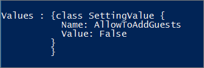

# <a name="manage-guest-access-in-microsoft-365-groups"></a><span data-ttu-id="7fed0-103">Verwalten des Gastzugriffs in Microsoft 365-Gruppen</span><span class="sxs-lookup"><span data-stu-id="7fed0-103">Manage guest access in Microsoft 365 groups</span></span>

<span data-ttu-id="7fed0-104">Standardmäßig ist der Gastzugriff für Microsoft 365-Gruppen für Ihre Organisation aktiviert.</span><span class="sxs-lookup"><span data-stu-id="7fed0-104">By default, guest access for Microsoft 365 groups is turned on for your organization.</span></span> <span data-ttu-id="7fed0-105">Administratoren können steuern, ob sie den Gastzugriff für die ganze Organisation oder für einzelne Gruppen zulassen möchten.</span><span class="sxs-lookup"><span data-stu-id="7fed0-105">Admins can control whether to allow guest access to groups for their whole organization or for individual groups.</span></span>

<span data-ttu-id="7fed0-106">Wenn es aktiviert ist, können Gruppenmitglieder Gastbenutzer zu einer Microsoft 365-Gruppe über Outlook im Internet einladen.</span><span class="sxs-lookup"><span data-stu-id="7fed0-106">When it's turned on, group members can invite guest users to a Microsoft 365 group through Outlook on Web.</span></span> <span data-ttu-id="7fed0-107">Einladungen werden zur Genehmigung an den Gruppenbesitzer gesendet.</span><span class="sxs-lookup"><span data-stu-id="7fed0-107">Invitations are sent to the group owner for approval.</span></span>

> [!Note]
> <span data-ttu-id="7fed0-108">Yammer Enterprise-Netzwerke, die sich im nativen Modus oder im [EU-Gebiet](https://go.microsoft.com/fwlink/?linkid=2107357) befinden, unterstützen keine Netzwerkgäste.</span><span class="sxs-lookup"><span data-stu-id="7fed0-108">Yammer Enterprise networks that are in Native Mode or the [EU Geo](https://go.microsoft.com/fwlink/?linkid=2107357) do not support network guests.</span></span>
> <span data-ttu-id="7fed0-109">Microsoft 365 verbundene Jammer Gruppen unterstützen derzeit keinen Gastzugriff, Sie können jedoch nicht verbundene externe Gruppen in Ihrem Jammer Netzwerk erstellen.</span><span class="sxs-lookup"><span data-stu-id="7fed0-109">Microsoft 365 Connected Yammer groups do not currently support guest access, but you can create non-connected, external groups in your Yammer network.</span></span> <span data-ttu-id="7fed0-110">Entsprechende Anleitungen finden Sie unter [Erstellen und Verwalten von externen Gruppen in Yammer](https://docs.microsoft.com/yammer/work-with-external-users/create-and-manage-external-groups).</span><span class="sxs-lookup"><span data-stu-id="7fed0-110">See [Create and manage external groups in Yammer](https://docs.microsoft.com/yammer/work-with-external-users/create-and-manage-external-groups) for instructions.</span></span>

### <a name="edit-guest-information"></a><span data-ttu-id="7fed0-111">Bearbeiten von Gastinformationen</span><span class="sxs-lookup"><span data-stu-id="7fed0-111">Edit guest information</span></span>

<span data-ttu-id="7fed0-112">Nach der Genehmigung wird der Gastbenutzer dem Verzeichnis und der Gruppe hinzugefügt.</span><span class="sxs-lookup"><span data-stu-id="7fed0-112">Once approved, the guest user is added to the directory and the group.</span></span>

<span data-ttu-id="7fed0-113">Der Gastzugriff in Gruppen wird häufig als Teil eines breiter gefächerten Szenarios verwendet, das SharePoint oder Teams umfasst.</span><span class="sxs-lookup"><span data-stu-id="7fed0-113">Guest access in groups is often used as part of a broader scenario that includes SharePoint or Teams.</span></span> <span data-ttu-id="7fed0-114">Diese Dienste besitzen ihre eigenen Einstellungen für die Gastfreigabe.</span><span class="sxs-lookup"><span data-stu-id="7fed0-114">These services have their own guest sharing settings.</span></span> <span data-ttu-id="7fed0-115">Umfassende Anweisungen zum Einrichten der gemeinsamen Nutzung über Gruppen, SharePoint und Teams hinweg finden Sie unter:</span><span class="sxs-lookup"><span data-stu-id="7fed0-115">For complete instructions for setting up guest sharing across groups, SharePoint, and Teams, see:</span></span>

- [<span data-ttu-id="7fed0-116">Zusammenarbeit mit Gästen in einer Website</span><span class="sxs-lookup"><span data-stu-id="7fed0-116">Collaborate with guests in a site</span></span>](../../solutions/collaborate-in-site.md)
- [<span data-ttu-id="7fed0-117">Zusammenarbeit mit Gästen in einem Team</span><span class="sxs-lookup"><span data-stu-id="7fed0-117">Collaborate with guests in a team</span></span>](../../solutions/collaborate-as-team.md)

## <a name="manage-groups-guest-access"></a><span data-ttu-id="7fed0-118">Verwalten des Gastzugriffs von Gruppen</span><span class="sxs-lookup"><span data-stu-id="7fed0-118">Manage groups guest access</span></span>

<span data-ttu-id="7fed0-119">Wenn Sie den Gastzugriff in Gruppen aktivieren oder deaktivieren möchten, können Sie dies im Microsoft 365 Admin Center tun.</span><span class="sxs-lookup"><span data-stu-id="7fed0-119">If you want to enable or disable guest access in groups, you can do so in the Microsoft 365 admin center.</span></span>

1. <span data-ttu-id="7fed0-120">Wechseln Sie im Admin Center zu den **Einstellungs** \> **Einstellungen** , und wählen Sie **Microsoft 365-Gruppen**aus.</span><span class="sxs-lookup"><span data-stu-id="7fed0-120">In the admin center, go to the **Settings** \> **Settings** and select **Microsoft 365 groups**.</span></span>
  
2. <span data-ttu-id="7fed0-121">Wählen Sie auf der Seite **Microsoft 365-Gruppen** aus, ob Personen außerhalb Ihrer Organisation auf Gruppen Ressourcen zugreifen oder Gruppenbesitzer Personen außerhalb Ihrer Organisation zu Gruppen hinzufügen lassen möchten.</span><span class="sxs-lookup"><span data-stu-id="7fed0-121">On the **Microsoft 365 Groups** page, choose whether you want to let people outside your organization access group resources or let group owners add people outside your organization to groups.</span></span>

## <a name="add-guests-to-a-microsoft-365-group-from-the-admin-center"></a><span data-ttu-id="7fed0-122">Hinzufügen von Gästen zu einer Microsoft 365-Gruppe aus dem Admin Center</span><span class="sxs-lookup"><span data-stu-id="7fed0-122">Add guests to a Microsoft 365 group from the admin center</span></span>

<span data-ttu-id="7fed0-123">Wenn der Gast bereits in Ihrem Verzeichnis vorhanden ist, können Sie ihn über das Microsoft 365 Admin Center zu Ihren Gruppen hinzufügen.</span><span class="sxs-lookup"><span data-stu-id="7fed0-123">If the guest already exists in your directory, you can add them to your groups from the Microsoft 365 admin center.</span></span>
  
1. <span data-ttu-id="7fed0-124">Wechseln Sie im Admin Center zur Seite **Gruppen** > **Gruppen**.</span><span class="sxs-lookup"><span data-stu-id="7fed0-124">In the admin center, go to the **Groups** > **Groups** page.</span></span>
  
2. <span data-ttu-id="7fed0-125">Klicken Sie auf die Gruppe, der Sie den Gast hinzufügen möchten, und wählen Sie auf der Registerkarte **Mitglieder** die Option **Alle anzeigen und Mitglieder verwalten** aus.</span><span class="sxs-lookup"><span data-stu-id="7fed0-125">Click the group you want to add the guest to, and select **View all and manage members** on the **Members** tab.</span></span> 
  
4. <span data-ttu-id="7fed0-126">Wählen Sie **Mitglieder hinzufügen** und dann den Namen der Person, die Sie hinzufügen möchten.</span><span class="sxs-lookup"><span data-stu-id="7fed0-126">Select **Add members**, and choose the name of the guest you want to add.</span></span>
    
5. <span data-ttu-id="7fed0-127">Klicken Sie auf **Speichern**.</span><span class="sxs-lookup"><span data-stu-id="7fed0-127">Select **Save**.</span></span>

<span data-ttu-id="7fed0-128">Wenn Sie einen Gast direkt zum Verzeichnis hinzufügen möchten, können Sie [Benutzer der Azure Active Directory-B2B-Zusammenarbeit im Azure-Portal hinzufügen](https://docs.microsoft.com/azure/active-directory/b2b/add-users-administrator).</span><span class="sxs-lookup"><span data-stu-id="7fed0-128">If you want to add a guest to the directory directly, you can [Add Azure Active Directory B2B collaboration users in the Azure portal](https://docs.microsoft.com/azure/active-directory/b2b/add-users-administrator).</span></span>

<span data-ttu-id="7fed0-129">Wenn Sie die Informationen eines Gastes bearbeiten möchten, können Sie die [Profilinformationen eines Benutzers mithilfe von Azure Active Directory hinzufügen oder aktualisieren](https://docs.microsoft.com/azure/active-directory/fundamentals/active-directory-users-profile-azure-portal).</span><span class="sxs-lookup"><span data-stu-id="7fed0-129">If you want to edit any of a guest's information, you can [Add or update a user's profile information using Azure Active Directory](https://docs.microsoft.com/azure/active-directory/fundamentals/active-directory-users-profile-azure-portal).</span></span>
  
## <a name="block-guest-users-from-a-specific-group"></a><span data-ttu-id="7fed0-130">Blockieren von Gastbenutzern aus einer bestimmten Gruppe</span><span class="sxs-lookup"><span data-stu-id="7fed0-130">Block guest users from a specific group</span></span>

<span data-ttu-id="7fed0-131">Wenn Sie den Gastzugriff auf die meisten, aber nicht alle Gruppen zulassen möchten, können Sie den Gastzugriff für einzelne Gruppen mithilfe von Microsoft PowerShell sperren.</span><span class="sxs-lookup"><span data-stu-id="7fed0-131">If you want to allow guest access to most groups, but have some where you want to prevent guest access, you can block guest access for individual groups by using Microsoft PowerShell.</span></span>

<span data-ttu-id="7fed0-132">Sie müssen die Vorschauversion von [Azure Active Directory PowerShell for Graph](https://docs.microsoft.com/powershell/azure/active-directory/install-adv2) (Module Name **AzureADPreview**) verwenden, um die Einstellung Gastzugriff auf Gruppenebene zu ändern:</span><span class="sxs-lookup"><span data-stu-id="7fed0-132">You must use the preview version of [Azure Active Directory PowerShell for Graph](https://docs.microsoft.com/powershell/azure/active-directory/install-adv2) (module name **AzureADPreview**) to change the group-level guest access setting:</span></span>

- <span data-ttu-id="7fed0-133">Wenn Sie zuvor noch keine Version des Azure AD PowerShell-Moduls installiert haben, lesen Sie [Installieren des Azure AD-Moduls](https://docs.microsoft.com/powershell/azure/active-directory/install-adv2?view=azureadps-2.0-preview#installing-the-azure-ad-module), und folgen Sie den Anweisungen zum Installieren der öffentlichen Vorschauversion.</span><span class="sxs-lookup"><span data-stu-id="7fed0-133">If you haven't installed any version of the Azure AD PowerShell module before, see [Installing the Azure AD Module](https://docs.microsoft.com/powershell/azure/active-directory/install-adv2?view=azureadps-2.0-preview#installing-the-azure-ad-module) and follow the instructions to install the public preview release.</span></span>

- <span data-ttu-id="7fed0-134">Wenn Sie die allgemein verfügbare Version 2.0 des Azure AD PowerShell-Moduls (AzureAD) installiert haben, müssen Sie sie deinstallieren, indem Sie `Uninstall-Module AzureAD` in ihrer PowerShell-Sitzung ausführen, und dann mit `Install-Module AzureADPreview` die Vorschauversion installieren.</span><span class="sxs-lookup"><span data-stu-id="7fed0-134">If you have the 2.0 general availability version of the Azure AD PowerShell module (AzureAD) installed, you must uninstall it by running `Uninstall-Module AzureAD` in your PowerShell session, and then install the preview version by running `Install-Module AzureADPreview`.</span></span>

- <span data-ttu-id="7fed0-135">Wenn Sie die Vorschauversion bereits installiert haben, führen Sie `Install-Module AzureADPreview` aus, um sicherzustellen, dass es sich um die neueste Version dieses Moduls handelt.</span><span class="sxs-lookup"><span data-stu-id="7fed0-135">If you have already installed the preview version, run `Install-Module AzureADPreview` to make sure it's the latest version of this module.</span></span>

> [!NOTE]
> <span data-ttu-id="7fed0-136">Sie müssen über globale Administratorrechte verfügen, um diese Befehle ausführen zu können.</span><span class="sxs-lookup"><span data-stu-id="7fed0-136">You must have global admin rights to run these commands.</span></span> 

<span data-ttu-id="7fed0-137">Führen Sie das folgende Skript aus und ändern Sie */<GroupName/>* auf den Namen der Gruppe, für den Sie Gastzugriff sperren möchten.</span><span class="sxs-lookup"><span data-stu-id="7fed0-137">Run the following script, changing */<GroupName/>* to the name of the group where you want to block guest access.</span></span>

```PowerShell
$GroupName = "<GroupName>"

Connect-AzureAD

$template = Get-AzureADDirectorySettingTemplate | ? {$_.displayname -eq "group.unified.guest"}
$settingsCopy = $template.CreateDirectorySetting()
$settingsCopy["AllowToAddGuests"]=$False
$groupID= (Get-AzureADGroup -SearchString $GroupName).ObjectId
New-AzureADObjectSetting -TargetType Groups -TargetObjectId $groupID -DirectorySetting $settingsCopy
```

<span data-ttu-id="7fed0-138">Zum Überprüfen Ihrer Einstellungen führen Sie diesen Befehl aus:</span><span class="sxs-lookup"><span data-stu-id="7fed0-138">To verify your settings, run this command:</span></span>

```PowerShell
Get-AzureADObjectSetting -TargetObjectId $groupID -TargetType Groups | fl Values
```

<span data-ttu-id="7fed0-139">Die Überprüfung sieht wie folgt aus:</span><span class="sxs-lookup"><span data-stu-id="7fed0-139">The verification looks like this:</span></span>
    

  
## <a name="allow-or-block-guest-access-based-on-their-domain"></a><span data-ttu-id="7fed0-141">Zulassen oder Blockieren des Gastzugriffs basierend auf der Domäne</span><span class="sxs-lookup"><span data-stu-id="7fed0-141">Allow or block guest access based on their domain</span></span>

<span data-ttu-id="7fed0-142">Sie können Gastbenutzer zulassen oder blockieren, die eine bestimmte Domäne verwenden.</span><span class="sxs-lookup"><span data-stu-id="7fed0-142">You can allow or block guest users who are using a specific domain.</span></span> <span data-ttu-id="7fed0-143">Nehmen wir z. B. an, dass Ihr Unternehmen (Contoso) über eine Partnerschaft mit einem anderen Unternehmen (Fabrikam) verfügt. Sie können Fabrikam zu Ihrer Zulassungsliste hinzufügen, damit Ihre Benutzer diese Gäste zu ihren Gruppen hinzufügen können.</span><span class="sxs-lookup"><span data-stu-id="7fed0-143">For example, if your business (Contoso) has a partnership with another business (Fabrikam), you can add Fabrikam to your Allow list so your users can add those guests to their groups.</span></span>

<span data-ttu-id="7fed0-144">Weitere Informationen finden Sie unter [Zulassen oder Blockieren von Einladungen für B2B-Benutzer von bestimmten Organisationen](https://docs.microsoft.com/azure/active-directory/b2b/allow-deny-list).</span><span class="sxs-lookup"><span data-stu-id="7fed0-144">For more information, see [Allow or block invitations to B2B users from specific organizations](https://docs.microsoft.com/azure/active-directory/b2b/allow-deny-list).</span></span>

## <a name="add-guests-to-the-global-address-list"></a><span data-ttu-id="7fed0-145">Hinzufügen von Gästen zur globalen Adressliste</span><span class="sxs-lookup"><span data-stu-id="7fed0-145">Add guests to the global address list</span></span>

<span data-ttu-id="7fed0-146">Standardmäßig sind Gastbenutzer in der globalen Adressliste von Exchange nicht sichtbar.</span><span class="sxs-lookup"><span data-stu-id="7fed0-146">By default, guests aren't visible in the Exchange Global Address List.</span></span> <span data-ttu-id="7fed0-147">Führen Sie die nachstehenden Schritte aus, um einen Gast in der globalen Adressliste anzuzeigen.</span><span class="sxs-lookup"><span data-stu-id="7fed0-147">Use the steps listed below to make a guest visible in the global address list.</span></span>

<span data-ttu-id="7fed0-148">Suchen Sie die ObjectID des Gastbenutzers:</span><span class="sxs-lookup"><span data-stu-id="7fed0-148">Find the guest user's ObjectID by running:</span></span>

```PowerShell
Get-AzureADUser -Filter "userType eq 'Guest'"
```

<span data-ttu-id="7fed0-149">Führen Sie dann die folgenden Aktionen mit den entsprechenden Werten für Objekt-ID, Vorname, Nachname, Anzeigename und Telefonnummer aus.</span><span class="sxs-lookup"><span data-stu-id="7fed0-149">Then run the following using the appropriate values for ObjectID, GivenName, Surname, DisplayName, and TelephoneNumber.</span></span>

```PowerShell
Set-AzureADUser -ObjectId cfcbd1a0-ed18-4210-9b9d-cf0ba93cf6b2 -ShowInAddressList $true -GivenName 'Megan' -Surname 'Bowen' -DisplayName 'Megan Bowen' -TelephoneNumber '555-555-5555'
```

## <a name="related-articles"></a><span data-ttu-id="7fed0-150">Verwandte Artikel</span><span class="sxs-lookup"><span data-stu-id="7fed0-150">Related articles</span></span>

[<span data-ttu-id="7fed0-151">Verwalten der Gruppenmitgliedschaft im Microsoft 365 Admin Center</span><span class="sxs-lookup"><span data-stu-id="7fed0-151">Manage group membership in the Microsoft 365 admin center</span></span>](add-or-remove-members-from-groups.md)
  
[<span data-ttu-id="7fed0-152">Azure Active Directory Domain Services-Zugriffsüberprüfungen</span><span class="sxs-lookup"><span data-stu-id="7fed0-152">Azure Active Directory access reviews</span></span>](https://docs.microsoft.com/azure/active-directory/active-directory-azure-ad-controls-perform-access-review)

[<span data-ttu-id="7fed0-153">Set-AzureADUser</span><span class="sxs-lookup"><span data-stu-id="7fed0-153">Set-AzureADUser</span></span>](https://docs.microsoft.com/powershell/module/azuread/set-azureaduser)
