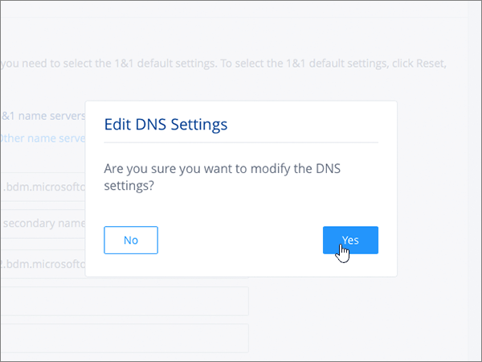
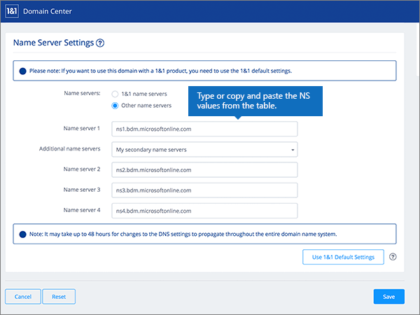
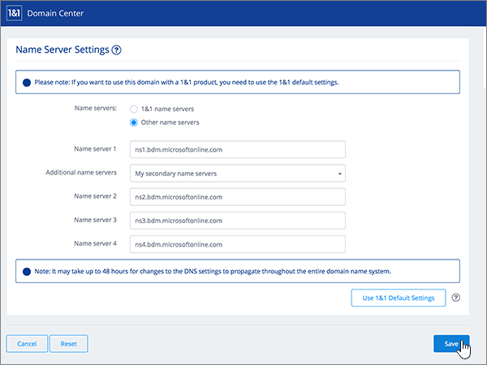

# Ändern von Namenservern zum Einrichten von Microsoft 365 mit 1&1 Ionos

 **[Überprüfen Sie die häufig gestellten Fragen (FAQ) zu Domänen](../setup/domains-faq.md)**, wenn Sie nicht finden, wonach Sie suchen. 
  
Befolgen Sie diese Anweisungen, wenn Microsoft 365 Ihre Microsoft 365-DNS-Einträge für Sie verwalten soll. (Wenn es Ihnen lieber ist, können Sie [alle Ihre Microsoft 365-DNS-Einträge mit 1&1 Ionos verwalten](create-dns-records-at-1-1-internet.md).) 
  

    
## Hinzufügen eines TXT-Eintrags zur Überprüfung

Bevor Sie Ihre Domäne in Microsoft 365 verwenden können, müssen wir uns vergewissern, dass Sie deren Besitzer sind. Ihre Fähigkeit, sich bei Ihrem Konto bei Ihrer Domänenregistrierungsstelle anzumelden und den DNS-Eintrag zu erstellen, ist für Microsoft 365 der Nachweis, dass Sie der Besitzer der Domäne sind.
  
> [!NOTE]
> Dieser Eintrag wird nur verwendet, um zu überprüfen, ob Sie der Besitzer Ihrer Domäne sind. Er hat keine weiteren Auswirkungen. Sie können ihn später ggf. löschen. 
  
Führen Sie die folgenden Schritte aus, oder [schauen Sie sich das Video an (beginnen Sie bei 0:42)](https://support.office.com/article/Video-Change-nameservers-to-set-up-Office-365-with-1-1-Internet-0ef1b3b5-d27a-4004-8ca1-fbe0453a0ea3?ui=en-US&amp;rs=en-US&amp;ad=US).
  
1. Um zu beginnen, wechseln Sie über [diesen Link](https://account.1and1.com/?redirect_url=https%3A%2F%2Fmy.1and1.com%2F)zu ihrer Domänen Seite bei 1&1 Ionos. You'll be prompted to log in. 
    
2. Wählen Sie unter **Meine Domänen**die Option **Domänen verwalten**aus.
    
3. Suchen Sie auf der Seite **Domänen Center** die Domäne, die Sie aktualisieren möchten. Wählen Sie dann das **Panel** -Steuerelement ( **v**) für diese Domäne aus.
    
4. Wählen Sie im Bereich **Domäneneinstellungen** die Option **DNS-Einstellungen bearbeiten**aus.
    
5. Wählen Sie im Abschnitt **txt-und SRV-Einträge** die Option **Eintrag hinzufügen**aus.
    
    (Möglicherweise müssen Sie nach unten scrollen.) 
    
6. In the **Add Record** area, in the boxes for the new record, type or copy and paste the values from the following table. 
    
||||
|:-----|:-----|:-----|
|**Type**   |**Prefix**   |**Name Value**   |
|TXT    |(Dieses Feld leer lassen.)    |MS=ms *XXXXXXXX*   **Hinweis:** Dies ist ein nur Beispiel. Verwenden Sie hier Ihren spezifischen Wert für **Ziel oder verweisende Adresse** aus der Tabelle in Microsoft 365. [Wie finde ich diese Angabe?](../get-help-with-domains/information-for-dns-records.md)   |

   
7. Wählen Sie **Speichern**und dann erneut **Speichern** aus. 
    
8. Wählen Sie im Dialogfeld **DNS-Einstellungen bearbeiten** die Option **Ja**aus.
    
9. Warten Sie einige Minuten, bevor Sie fortfahren, damit der soeben erstellte Eintrag im Internet aktualisiert werden kann.
    
Nachdem Sie den Eintrag auf der Website Ihrer Domänenregistrierungsstelle hinzugefügt haben, kehren Sie zu Microsoft 365 zurück und fordern Microsoft 365 auf, nach dem Eintrag zu suchen.
  
Wenn Microsoft 365 den richtigen TXT-Eintrag findet, ist die Domäne überprüft.
  
1. Wechseln Sie im Admin Center zur Seite **Einstellungen** \> <a href="https://go.microsoft.com/fwlink/p/?linkid=834818" target="_blank">Domänen</a>.
    
2. Wählen Sie auf der Seite **Domänen** die zu überprüfende Domäne aus. 
    
3. Wählen Sie auf der Seite **Setup** die Option **Setup starten** aus.
    
4. Wählen Sie auf der Seite **Domäne überprüfen** die Option **Überprüfen** aus.
    
> [!NOTE]
> Typically it takes about 15 minutes for DNS changes to take effect. However, it can occasionally take longer for a change you've made to update across the Internet's DNS system. Wenn Sie Probleme mit dem Nachrichtenfluss oder anderen Problemen haben, nachdem Sie DNS-Einträge hinzugefügt haben, finden Sie weitere Informationen unter [Suchen und Beheben von Problemen nach dem Hinzufügen Ihrer Domänen-oder DNS-Einträge in Microsoft 365](../get-help-with-domains/find-and-fix-issues.md). 
  
## Ändern der Namenservereinträge (NS) Ihrer Domäne

Um die Einrichtung Ihrer Domäne mit Microsoft 365 abzuschließen, ändern Sie die NS-Einträge Ihrer Domäne bei Ihrer Domänenregistrierungsstelle so, dass Sie auf den primären und sekundären Namenserver von Microsoft 365 verweist. Dadurch wird Microsoft 365 zum Aktualisieren der DNS-Einträge der Domäne für Sie eingerichtet. Wir fügen alle Einträge hinzu, sodass E-Mails, Skype for Business Online und Ihre öffentliche Website in Verbindung mit Ihrer Domäne funktionieren und alles für Sie eingerichtet ist.
  
> [!CAUTION]
> Wenn Sie die NS-Einträge Ihrer Domäne so ändern, dass Sie auf die Microsoft 365-Namenserver verweist, sind alle Dienste betroffen, die derzeit Ihrer Domäne zugeordnet sind. Beispielsweise werden alle e-Mails, die an Ihre Domäne gesendet werden (wie Rob@ *your_domain* . com), nach dem vornehmen dieser Änderung zu Microsoft 365. 
  
Möchten Sie Ihre NS-Einträge so ändern, dass Microsoft 365 Ihre Domäne einrichten kann? Führen Sie die folgenden Schritte aus, oder [schauen Sie sich das Video an (beginnen Sie bei 2:47)](https://support.office.com/article/Video-Change-nameservers-to-set-up-Office-365-with-1-1-Internet-0ef1b3b5-d27a-4004-8ca1-fbe0453a0ea3?ui=en-US&amp;rs=en-US&amp;ad=US).
  
> [!IMPORTANT]
>  Im folgenden Verfahren wird gezeigt, wie Sie alle anderen unerwünschten Namenserver aus der Liste löschen und wie Sie die richtigen Nameserver hinzufügen, wenn Sie noch nicht aufgeführt sind. > Wenn Sie die Schritte in diesem Abschnitt abgeschlossen haben, sollten Sie die folgenden vier Namenserver finden: > ns1.BDM.microsoftonline.com > ns2.BDM.microsoftonline.com > NS3.BDM.microsoftonline.com > NS4.BDM.microsoftonline.com 
  
1. Um zu beginnen, navigieren Sie über [diesen Link](https://account.1and1.com/?redirect_url=https%3A%2F%2Fmy.1and1.com%2F)zu ihrer Domänen Seite bei 1&1 Ionos. You'll be prompted to log in. 
    
2. Wählen Sie unter **Meine Domänen**die Option **Domänen verwalten**aus.
    
3. Suchen Sie auf der Seite **Domänen Center** die Domäne, die Sie aktualisieren möchten, und wählen Sie dann das Steuerelement **Panel** ( **v**) für diese Domäne aus.
    
4. Wählen Sie im Bereich **Domäneneinstellungen** die Option **DNS-Einstellungen bearbeiten**aus.
    
5. Wählen Sie im Abschnitt **Name Server Settings** die Option **Other name servers** aus.
    
    (Möglicherweise müssen Sie nach unten scrollen.)
    
6. Abhängig davon, ob auf der jetzt angezeigten Seite bereits Namenserver aufgelistet sind oder nicht, setzen Sie den Vorgang mit einem der beiden folgenden Verfahren fort:
    
  - Wenn noch **KEINE** Namenserver aufgelistet sind, [Wenn noch KEINE Namenserver aufgelistet sind](#if-there-are-no-nameservers-already-listed).
    
  - Wenn **BEREITS** Namenserver aufgelistet sind, [Wenn Namenserver BEREITS aufgelistet sind](#if-there-are-nameservers-already-listed).
    
### Wenn noch KEINE Namenserver aufgelistet sind

1. Geben Sie im Feld **Name server 1** den Wert aus der folgenden Tabelle ein. Sie können den Wert auch kopieren und einfügen. 
    
|||
|:-----|:-----|
|**Name server 1**   |ns1.bdm.microsoftonline.com    |
   
   
  
2. Wählen Sie in der Dropdownliste **Additional name servers** den Eintrag **My secondary name servers** aus.
    
    
  
3. Geben Sie in den Feldern **Name server 2, 3 und 4** den Wert aus der folgenden Tabelle ein. Sie können den Wert auch kopieren und einfügen. 
    
|||
|:-----|:-----|
|**Name server 2**   |ns2.bdm.microsoftonline.com    |
|**Name server 3**   |ns3.bdm.microsoftonline.com    |
|**Name server 4**   |ns4.bdm.microsoftonline.com    |
   

  
4. Klicken Sie auf **Speichern**.
    
    
  
5. Wählen Sie im Dialogfeld **DNS-Einstellungen bearbeiten** die Option **Ja**aus.
    
    
  
> [!NOTE]
> Your nameserver record updates may take up to several hours to update across the Internet's DNS system. Dann sind Ihre Microsoft-e-Mails und andere Dienste für die Verwendung Ihrer Domäne festgelegt. 
  
### Wenn Namenserver BEREITS aufgelistet sind

> [!CAUTION]
> Folgen Sie diesen Schritten  *nur*  , wenn es andere Namenserver als die vier  *korrekten*  Namenserver gibt. (Das heißt, löschen Sie  *nur*  andere als die vier korrekten Namenserver, also  *nicht* **ns1.bdm.microsoftonline.com**, **ns2.bdm.microsoftonline.com**, **ns3.bdm.microsoftonline.com** oder **ns4.bdm.microsoftonline.com**. 
  
1. If there are already nameservers listed in the **Name server** boxes, delete each one by selecting it and then pressing the **Delete** key on your keyboard. 
    
    
  
2. Geben Sie in den Feldern **Nameserver 1, 2, 3 und 4** die Werte aus der folgenden Tabelle ein. Sie können die Werte auch kopieren und einfügen. 
    
|||
|:-----|:-----|
|**Nameserver 1**   |ns1.bdm.microsoftonline.com    |
|**Nameserver 2**   |ns2.bdm.microsoftonline.com    |
|**Name server 3**   |ns3.bdm.microsoftonline.com    |
|**Name server 4**   |ns4.bdm.microsoftonline.com    |
   
   
  
3. Klicken Sie auf **Speichern**.
    
    
  
4. Wählen Sie im Dialogfeld **DNS-Einstellungen bearbeiten** die Option **Ja**aus.
    
    
  
> [!NOTE]
> Your nameserver record updates may take up to several hours to update across the Internet's DNS system. Dann sind Ihre Microsoft-e-Mails und andere Dienste für die Verwendung Ihrer Domäne festgelegt. 
  

