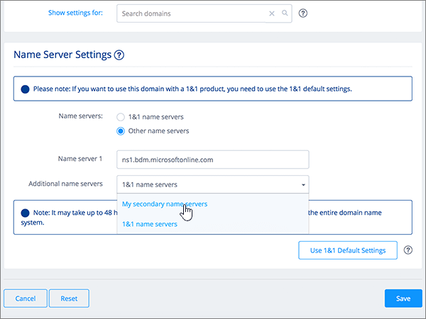

# Ändern von Namenservern zum Einrichten von Microsoft 365 mit 1&1 IonosChange nameservers to set up Microsoft 365 with 1&1 IONOS

 **[Überprüfen Sie die häufig gestellten Fragen (FAQ) zu Domänen](../setup/domains-faq.md)**, wenn Sie nicht finden, wonach Sie suchen.**[Check the Domains FAQ](../setup/domains-faq.md)** if you don't find what you're looking for. 
  
Befolgen Sie diese Anweisungen, wenn Microsoft 365 Ihre Microsoft 365-DNS-Einträge für Sie verwalten soll.Follow these instructions if you want Microsoft 365 to manage your Microsoft 365 DNS records for you. (Wenn es Ihnen lieber ist, können Sie [alle Ihre Microsoft 365-DNS-Einträge mit 1&1 Ionos verwalten](create-dns-records-at-1-1-internet.md).)(If you prefer, you can [manage all your Microsoft 365 DNS records at 1&1 IONOS](create-dns-records-at-1-1-internet.md).) 
  

    
## Hinzufügen eines TXT-Eintrags zur ÜberprüfungAdd a TXT record for verification

Bevor Sie Ihre Domäne in Microsoft 365 verwenden können, müssen wir uns vergewissern, dass Sie deren Besitzer sind. Ihre Fähigkeit, sich bei Ihrem Konto bei Ihrer Domänenregistrierungsstelle anzumelden und den DNS-Eintrag zu erstellen, ist für Microsoft 365 der Nachweis, dass Sie der Besitzer der Domäne sind.Before you use your domain with Microsoft 365, we have to make sure that you own it. Your ability to log in to your account at your domain registrar and create the DNS record proves to Microsoft 365 that you own the domain.
  
> [!NOTE]
> Dieser Eintrag wird nur verwendet, um zu überprüfen, ob Sie der Besitzer Ihrer Domäne sind. Er hat keine weiteren Auswirkungen. Sie können ihn später ggf. löschen.This record is used only to verify that you own your domain; it doesn't affect anything else. You can delete it later, if you like. 
  
Führen Sie die folgenden Schritte aus, oder [schauen Sie sich das Video an (beginnen Sie bei 0:42)](https://support.microsoft.com/office/0ef1b3b5-d27a-4004-8ca1-fbe0453a0ea3).Follow the steps below or [watch the video (start at 0:42)](https://support.microsoft.com/office/0ef1b3b5-d27a-4004-8ca1-fbe0453a0ea3).
  
1. Um zu beginnen, wechseln Sie über [diesen Link](https://account.1and1.com/?redirect_url=https%3A%2F%2Fmy.1and1.com%2F)zu ihrer Domänen Seite bei 1&1 Ionos.To get started, go to your domains page at 1&1 IONOS via [this link](https://account.1and1.com/?redirect_url=https%3A%2F%2Fmy.1and1.com%2F). You'll be prompted to log in.You'll be prompted to log in. 
    
2. Wählen Sie unter **Meine Domänen**die Option **Domänen verwalten**aus.Under **MY DOMAINS**, select **Manage domains**.
    
3. Suchen Sie auf der Seite **Domänen Center** die Domäne, die Sie aktualisieren möchten. Wählen Sie dann das **Panel** -Steuerelement ( **v**) für diese Domäne aus.On the **Domain Center** page, find the domain that you want to update; then select the **Panel** ( **v**) control for that domain.
    
4. Wählen Sie im Bereich **Domäneneinstellungen** die Option **DNS-Einstellungen bearbeiten**aus.In the **Domain Settings** area, select **Edit DNS Settings**.
    
5. Wählen Sie im Abschnitt **txt-und SRV-Einträge** die Option **Eintrag hinzufügen**aus.In the **TXT and SRV Records** section, select **Add Record**.
    
    (Möglicherweise müssen Sie nach unten scrollen.)(You may have to scroll down.) 
    
6. In the **Add Record** area, in the boxes for the new record, type or copy and paste the values from the following table.In the **Add Record** area, in the boxes for the new record, type or copy and paste the values from the following table. 
    
||||
|:-----|:-----|:-----|
|**Type****Type**   |**Prefix****Prefix**   |**Name Value****Name Value**   |
|TXTTXT    |(Dieses Feld leer lassen.)(Leave this field empty.)    |MS=ms *XXXXXXXX*MS=ms *XXXXXXXX*   **Hinweis:** Dies ist ein nur Beispiel.**Note**: This is an example. Verwenden Sie hier Ihren spezifischen Wert für **Ziel oder verweisende Adresse** aus der Tabelle in Microsoft 365.Use your specific **Destination or Points to Address** value here, from the table in Microsoft 365. [Wie finde ich diese Angabe?How do I find this?](../get-help-with-domains/information-for-dns-records.md)   |

   
7. Wählen Sie **Speichern**und dann erneut **Speichern** aus.Select **Save**, and then **Save** again. 
    
8. Wählen Sie im Dialogfeld **DNS-Einstellungen bearbeiten** die Option **Ja**aus.In the **Edit DNS Settings** dialog box, select **Yes**.
    
9. Warten Sie einige Minuten, bevor Sie fortfahren, damit der soeben erstellte Eintrag im Internet aktualisiert werden kann.Wait a few minutes before you continue, so that the record you just created can update across the Internet.
    
Nachdem Sie den Eintrag auf der Website Ihrer Domänenregistrierungsstelle hinzugefügt haben, kehren Sie zu Microsoft 365 zurück und fordern Microsoft 365 auf, nach dem Eintrag zu suchen.Now that you've added the record at your domain registrar's site, you'll go back to Microsoft 365 and request Microsoft 365 to look for the record.
  
Wenn Microsoft 365 den richtigen TXT-Eintrag findet, ist die Domäne überprüft.When Microsoft 365 finds the correct TXT record, your domain is verified.
  
1. Wechseln Sie im Admin Center zur Seite **Einstellungen** \> <a href="https://go.microsoft.com/fwlink/p/?linkid=834818" target="_blank">Domänen</a>.In the admin center, go to the **Settings** \> <a href="https://go.microsoft.com/fwlink/p/?linkid=834818" target="_blank">Domains</a> page.
    
2. Wählen Sie auf der Seite **Domänen** die zu überprüfende Domäne aus.On the **Domains** page, select the domain that you are verifying. 
    
3. Wählen Sie auf der Seite **Setup** die Option **Setup starten** aus.On the **Setup** page, select **Start setup**.
    
4. Wählen Sie auf der Seite **Domäne überprüfen** die Option **Überprüfen** aus.On the **Verify domain** page, select **Verify**.
    
> [!NOTE]
> Typically it takes about 15 minutes for DNS changes to take effect.Typically it takes about 15 minutes for DNS changes to take effect. However, it can occasionally take longer for a change you've made to update across the Internet's DNS system.However, it can occasionally take longer for a change you've made to update across the Internet's DNS system. Wenn Sie Probleme mit dem Nachrichtenfluss oder anderen Problemen haben, nachdem Sie DNS-Einträge hinzugefügt haben, finden Sie weitere Informationen unter [Suchen und Beheben von Problemen nach dem Hinzufügen Ihrer Domänen-oder DNS-Einträge in Microsoft 365](../get-help-with-domains/find-and-fix-issues.md).If you're having trouble with mail flow or other issues after adding DNS records, see [Find and fix issues after adding your domain or DNS records in Microsoft 365](../get-help-with-domains/find-and-fix-issues.md). 
  
## Ändern der Namenservereinträge (NS) Ihrer DomäneChange your domain's nameserver (NS) records

Um die Einrichtung Ihrer Domäne mit Microsoft 365 abzuschließen, ändern Sie die NS-Einträge Ihrer Domäne bei Ihrer Domänenregistrierungsstelle so, dass Sie auf den primären und sekundären Namenserver von Microsoft 365 verweist.To complete setting up your domain with Microsoft 365, you change your domain's NS records at your domain registrar to point to the Microsoft 365 primary and secondary name servers. Dadurch wird Microsoft 365 zum Aktualisieren der DNS-Einträge der Domäne für Sie eingerichtet.This sets up Microsoft 365 to update the domain's DNS records for you. Wir fügen alle Einträge hinzu, sodass E-Mails, Skype for Business Online und Ihre öffentliche Website in Verbindung mit Ihrer Domäne funktionieren und alles für Sie eingerichtet ist.We'll add all records so that email, Skype for Business Online, and your public website work with your domain, and you'll be all set.
  
> [!CAUTION]
> Wenn Sie die NS-Einträge Ihrer Domäne so ändern, dass Sie auf die Microsoft 365-Namenserver verweist, sind alle Dienste betroffen, die derzeit Ihrer Domäne zugeordnet sind.When you change your domain's NS records to point to the Microsoft 365 name servers, all the services that are currently associated with your domain are affected. Beispielsweise werden alle e-Mails, die an Ihre Domäne gesendet werden (wie Rob@ *your_domain* . com), nach dem vornehmen dieser Änderung zu Microsoft 365.For example, all email sent to your domain (like rob@ *your_domain*  .com) will start coming to Microsoft 365 after you make this change. 
  
Möchten Sie Ihre NS-Einträge so ändern, dass Microsoft 365 Ihre Domäne einrichten kann?Ready to change your NS records so Microsoft 365 can set up your domain? Führen Sie die folgenden Schritte aus, oder [schauen Sie sich das Video an (beginnen Sie bei 2:47)](https://support.microsoft.com/office/0ef1b3b5-d27a-4004-8ca1-fbe0453a0ea3).Follow the steps below or [watch the video (start at 2:47)](https://support.microsoft.com/office/0ef1b3b5-d27a-4004-8ca1-fbe0453a0ea3).
  
> [!IMPORTANT]
>  Im folgenden Verfahren wird gezeigt, wie Sie alle anderen unerwünschten Namenserver aus der Liste löschen und wie Sie die richtigen Nameserver hinzufügen, wenn Sie noch nicht aufgeführt sind.The following procedure will show you how to delete any other, unwanted nameservers from the list, and also how to add the correct nameservers if they are not already listed. > Wenn Sie die Schritte in diesem Abschnitt abgeschlossen haben, sollten Sie die folgenden vier Namenserver finden: > ns1.BDM.microsoftonline.com > ns2.BDM.microsoftonline.com > NS3.BDM.microsoftonline.com > NS4.BDM.microsoftonline.com>  When you have completed the steps in this section, the only nameservers that should be listed are these four: >  ns1.bdm.microsoftonline.com >  ns2.bdm.microsoftonline.com >  ns3.bdm.microsoftonline.com >  ns4.bdm.microsoftonline.com 
  
1. Um zu beginnen, navigieren Sie über [diesen Link](https://account.1and1.com/?redirect_url=https%3A%2F%2Fmy.1and1.com%2F)zu ihrer Domänen Seite bei 1&1 Ionos.To get started, go to your domains page at 1&1 IONOS by using [this link](https://account.1and1.com/?redirect_url=https%3A%2F%2Fmy.1and1.com%2F). You'll be prompted to log in.You'll be prompted to log in. 
    
2. Wählen Sie unter **Meine Domänen**die Option **Domänen verwalten**aus.Under **MY DOMAINS**, select **Manage domains**.
    
3. Suchen Sie auf der Seite **Domänen Center** die Domäne, die Sie aktualisieren möchten, und wählen Sie dann das Steuerelement **Panel** ( **v**) für diese Domäne aus.On the **Domain Center** page, find the domain that you want to update, and then select the **Panel** ( **v**) control for that domain.
    
4. Wählen Sie im Bereich **Domäneneinstellungen** die Option **DNS-Einstellungen bearbeiten**aus.In the **Domain Settings** area, select **Edit DNS Settings**.
    
5. Wählen Sie im Abschnitt **Name Server Settings** die Option **Other name servers** aus.In the **Name Server Settings** section, select **Other name servers**.
    
    (Möglicherweise müssen Sie nach unten scrollen.)(You may have to scroll down.)
    
6. Abhängig davon, ob auf der jetzt angezeigten Seite bereits Namenserver aufgelistet sind oder nicht, setzen Sie den Vorgang mit einem der beiden folgenden Verfahren fort:Depending on whether or not there are already nameservers listed on the page that is displayed now, continue to one of the two following procedures:
    
  - Wenn noch **KEINE** Namenserver aufgelistet sind, [Wenn noch KEINE Namenserver aufgelistet sind](#if-there-are-no-nameservers-already-listed).If there are **NO** nameservers already listed, [If there are NO nameservers already listed](#if-there-are-no-nameservers-already-listed).
    
  - Wenn **BEREITS** Namenserver aufgelistet sind, [Wenn Namenserver BEREITS aufgelistet sind](#if-there-are-nameservers-already-listed).If there **ARE** nameservers already listed, [If there ARE nameservers already listed](#if-there-are-nameservers-already-listed).
    
### Wenn noch KEINE Namenserver aufgelistet sindIf there are NO nameservers already listed

1. Geben Sie im Feld **Name server 1** den Wert aus der folgenden Tabelle ein. Sie können den Wert auch kopieren und einfügen.In the **Name server 1** box, type or copy and paste the value from the following table. 
    
|||
|:-----|:-----|
|**Name server 1****Name server 1**   |ns1.bdm.microsoftonline.comns1.bdm.microsoftonline.com    |
   
   
  
2. Wählen Sie in der Dropdownliste **Additional name servers** den Eintrag **My secondary name servers** aus.In the **Additional name servers** drop-down list, choose **My secondary name servers**.
    
    
  
3. Geben Sie in den Feldern **Name server 2, 3 und 4** den Wert aus der folgenden Tabelle ein. Sie können den Wert auch kopieren und einfügen.In the **Name server 2, 3, and 4** boxes, type or copy and paste the value from the following table. 
    
|||
|:-----|:-----|
|**Name server 2****Name server 2**   |ns2.bdm.microsoftonline.comns2.bdm.microsoftonline.com    |
|**Name server 3****Name server 3**   |ns3.bdm.microsoftonline.comns3.bdm.microsoftonline.com    |
|**Name server 4****Name server 4**   |ns4.bdm.microsoftonline.comns4.bdm.microsoftonline.com    |
   

  
4. Wählen Sie **Speichern**.Select **Save**.
    
    
  
5. Wählen Sie im Dialogfeld **DNS-Einstellungen bearbeiten** die Option **Ja**aus.In the **Edit DNS Settings** dialog box, select **Yes**.
    
    
  
> [!NOTE]
> Your nameserver record updates may take up to several hours to update across the Internet's DNS system.Your nameserver record updates may take up to several hours to update across the Internet's DNS system. Dann sind Ihre Microsoft-e-Mails und andere Dienste für die Verwendung Ihrer Domäne festgelegt.Then your Microsoft email and other services will be all set to work with your domain. 
  
### Wenn Namenserver BEREITS aufgelistet sindIf there ARE nameservers already listed

> [!CAUTION]
> Folgen Sie diesen Schritten  *nur*  , wenn es andere Namenserver als die vier  *korrekten*  Namenserver gibt. (Das heißt, löschen Sie  *nur*  andere als die vier korrekten Namenserver, also  *nicht* **ns1.bdm.microsoftonline.com**, **ns2.bdm.microsoftonline.com**, **ns3.bdm.microsoftonline.com** oder **ns4.bdm.microsoftonline.com**.Follow these steps  *only*  if you have existing nameservers other than the four  *correct*  nameservers. (That is, delete  *only*  any current nameservers that are  *not*  named **ns1.bdm.microsoftonline.com**, **ns2.bdm.microsoftonline.com**, **ns3.bdm.microsoftonline.com**, or **ns4.bdm.microsoftonline.com**.) 
  
1. If there are already nameservers listed in the **Name server** boxes, delete each one by selecting it and then pressing the **Delete** key on your keyboard.If there are already nameservers listed in the **Name server** boxes, delete each one by selecting it and then pressing the **Delete** key on your keyboard. 
    
    
  
2. Geben Sie in den Feldern **Nameserver 1, 2, 3 und 4** die Werte aus der folgenden Tabelle ein. Sie können die Werte auch kopieren und einfügen.In the **Name server 1, 2, 3, and 4** boxes, type or copy and paste the values from the following table. 
    
|||
|:-----|:-----|
|**Nameserver 1****Name server 1**   |ns1.bdm.microsoftonline.comns1.bdm.microsoftonline.com    |
|**Nameserver 2****Name server 2**   |ns2.bdm.microsoftonline.comns2.bdm.microsoftonline.com    |
|**Name server 3****Name server 3**   |ns3.bdm.microsoftonline.comns3.bdm.microsoftonline.com    |
|**Name server 4****Name server 4**   |ns4.bdm.microsoftonline.comns4.bdm.microsoftonline.com    |
   
   
  
3. Wählen Sie **Speichern**.Select **Save**.
    
    
  
4. Wählen Sie im Dialogfeld **DNS-Einstellungen bearbeiten** die Option **Ja**aus.In the **Edit DNS Settings** dialog box, select **Yes**.
    
    
  
> [!NOTE]
> Your nameserver record updates may take up to several hours to update across the Internet's DNS system.Your nameserver record updates may take up to several hours to update across the Internet's DNS system. Dann sind Ihre Microsoft-e-Mails und andere Dienste für die Verwendung Ihrer Domäne festgelegt.Then your Microsoft email and other services will be all set to work with your domain. 
  

