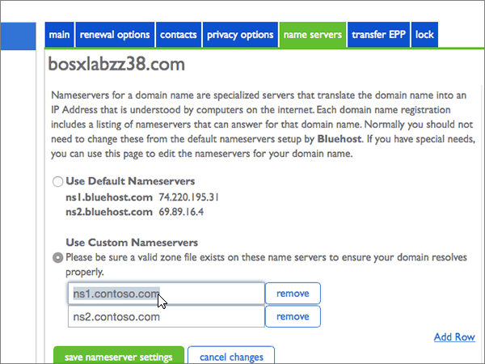

# Ändern von Namenservern zum Einrichten von Office 365 bei Bluehost

 **[Überprüfen Sie die häufig gestellten Fragen (FAQ) zu Domänen](../setup/domains-faq.md)**, wenn Sie nicht finden, wonach Sie suchen. 
  
Führen Sie die folgenden Anweisungen aus, wenn Office 365 Ihre Office 365-DNS-Einträge verwalten soll. (Wenn Sie es vorziehen, können Sie auch [alle Ihre Office 365-DNS-Einträge bei Bluehost verwalten](create-dns-records-at-bluehost.md).)
  
## Hinzufügen eines TXT-Eintrags zur Überprüfung

Bevor Sie Ihre Domäne in Office 365 verwenden können, müssen wir uns vergewissern, dass Sie deren Besitzer sind. Ihre Fähigkeit, sich bei Ihrem Konto bei Ihrer Domänenregistrierungsstelle anzumelden und den DNS-Eintrag zu erstellen, ist für Office 365 der Nachweis, dass Sie der Besitzer der Domäne sind.
  
> [!NOTE]
> Dieser Eintrag wird nur verwendet, um zu überprüfen, ob Sie der Besitzer Ihrer Domäne sind. Er hat keine weiteren Auswirkungen. Sie können ihn später ggf. löschen. 
  
1. Im ersten Schritt navigieren Sie über [diesen Link](https://my.bluehost.com/cgi/dm) zu Ihrer Domänenseite bei Bluehost. You'll be prompted to log in first.
    
2. Suchen Sie auf der Seite **Domains** im Bereich **Domain** die Zeile mit der Domäne, die Sie ändern möchten, und aktivieren Sie dann das Kontrollkästchen für diese Domäne. 
    
    (Möglicherweise müssen Sie nach unten scrollen.) 
    
3. Wählen Sie im Bereich **domain_name** in der Zeile **DNS-Zonen-Editor** die Option DNS- **Einträge verwalten**aus.
    
4. On the **DNS Zone Editor** page, in the Add DNS Record area, in the boxes for the new record, type or copy and paste the values from the following table. 
    
    (Choose the **Type** value from the drop-down list.) 
    
|||||
|:-----|:-----|:-----|:-----|
|**Host Record**   |**TTL**   |**Type**   |**TXT Value**   |
|@    |14400    |TXT    |MS=ms *XXXXXXXX*   **Hinweis:** Dies ist ein nur Beispiel. Verwenden Sie jeweils Ihren Wert für **die Zieladresse bzw. die Adresse, auf die verwiesen wird** aus der Tabelle in Office 365. [Wie finde ich diese Angabe?](../get-help-with-domains/information-for-dns-records.md)   |

   
5. Wählen Sie **Add Record**aus.
    
6. Warten Sie einige Minuten, bevor Sie fortfahren, damit der soeben erstellte Eintrag im Internet aktualisiert werden kann.
    
Nachdem Sie den Eintrag auf der Website Ihrer Domänenregistrierungsstelle hinzugefügt haben, kehren Sie zu Office 365 zurück und fordern Office 365 auf, nach dem Eintrag zu suchen.
  
Wenn Office 365 den richtigen TXT-Eintrag findet, wird die Domäne überprüft.
  
1. Wechseln Sie im Admin Center zur Seite **Einstellungen** \> <a href="https://go.microsoft.com/fwlink/p/?linkid=834818" target="_blank">Domänen</a>.

    
2. Wählen Sie auf der Seite **Domänen** die zu überprüfende Domäne aus. 
    
3. Wählen Sie auf der Seite **Setup** die Option **Setup starten** aus.
    
4. Wählen Sie auf der Seite **Domäne überprüfen** die Option **Überprüfen** aus.
    
> [!NOTE]
> Normalerweise dauert es ungefähr 15 Minuten, bis DNS-Änderungen wirksam werden. Es kann jedoch gelegentlich länger dauern, bis eine von Ihnen vorgenommene Änderung im Internet im DNS-System aktualisiert wurde. Wenn nach dem Hinzufügen von DNS-Einträgen Probleme mit dem E-Mail-Fluss oder andere Probleme auftreten, lesen Sie [Suchen und Beheben von Problemen, nachdem Ihre Domäne oder DNS-Einträge in Office 365 hinzugefügt wurden](../get-help-with-domains/find-and-fix-issues.md). 
  
## Ändern der Namenservereinträge (NS) Ihrer Domäne

Zum Abschluss der Einrichtung Ihrer Domäne in Office 365 ändern Sie die NS-Einträge bei Ihrer Domänenregistrierungsstelle so, dass sie auf die primären und sekundären Office 365-Namenserver verweisen. Dadurch wird Office 365 zum Aktualisieren der DNS-Einträge der Domäne eingerichtet. Wir fügen alle Einträge hinzu, sodass E-Mails, Skype for Business Online und Ihre öffentliche Website in Verbindung mit Ihrer Domäne funktionieren und alles für Sie eingerichtet ist.
  
> [!CAUTION]
> Wenn Sie die Namenservereinträge Ihrer Domäne so ändern, dass sie auf die Office 365-Namenserver verweisen, hat dies Auswirkungen auf alle Dienste, die aktuell mit Ihrer Domäne verbunden sind. So gehen beispielsweise alle an Ihre Domäne (z. B. an Bernd@ *Ihre_Domäne*  .com) gesendeten E-Mail-Nachrichten bei Office 365 ein, nachdem Sie diese Änderung vorgenommen haben. 
  
> [!IMPORTANT]
>  Im folgenden Verfahren wird gezeigt, wie Sie alle anderen unerwünschten Namenserver aus der Liste löschen und wie Sie die richtigen Nameserver hinzufügen, wenn Sie noch nicht aufgeführt sind. > Wenn Sie die Schritte in diesem Abschnitt abgeschlossen haben, sollten Sie die folgenden vier Namenserver finden: > ns1.BDM.microsoftonline.com > ns2.BDM.microsoftonline.com > NS3.BDM.microsoftonline.com > NS4.BDM.microsoftonline.com 
  
1. Im ersten Schritt navigieren Sie über [diesen Link](https://my.bluehost.com/cgi/dm) zu Ihrer Domänenseite bei Bluehost. You'll be prompted to log in first.
    
2. Aktivieren Sie auf der Seite **Domänen** im Bereich **domain_name** das Kontrollkästchen für Ihre Domäne, und wählen Sie dann **Name Servers**aus.
    
    
  
3. Wählen Sie im Bereich **domain_name** die Option **benutzerdefinierte Namenserver verwenden**aus.
    
    
  
4. Abhängig davon, ob auf der jetzt angezeigten Seite bereits Namenserver aufgelistet sind oder nicht, setzen Sie den Vorgang mit einem der beiden folgenden Verfahren fort:
    
  - Wenn noch **KEINE** Namenserver aufgelistet sind, [Wenn noch KEINE Namenserver aufgelistet sind](#if-there-are-no-nameservers-already-listed).
    
  - Wenn **BEREITS** Namenserver aufgelistet sind, [Wenn Namenserver BEREITS aufgelistet sind](#if-there-are-nameservers-already-listed).
    
### Wenn noch KEINE Namenserver aufgelistet sind

1. Geben Sie im Abschnitt **Use Custom Nameservers** die Werte aus der folgenden Tabelle direkt oder über Kopieren und Einfügen ein. 
    
|||
|:-----|:-----|
|**Erste leere Zeile**   |ns1.bdm.microsoftonline.com    |
|**Zweite leere Zeile**   |ns2.bdm.microsoftonline.com    |
   
   
  
2. Wählen Sie **Zeile hinzufügen**aus.
    
    
  
3. Geben Sie im Abschnitt **Use Custom Nameservers** die Werte aus der ersten Zeile der folgenden Tabelle in die neue leere Zeile ein. Sie können die Werte auch kopieren und einfügen. 
    
|||
|:-----|:-----|
|**Dritte leere Zeile**   |ns3.bdm.microsoftonline.com    |
|**Vierte leere Zeile**   |ns4.bdm.microsoftonline.com    |
   
    
  
4. Wenn Sie den vierten Namenservereintrag hinzufügen möchten, wählen Sie erneut **Zeile hinzufügen** aus, und erstellen Sie einen Datensatz mit den Werten aus der letzten Zeile der obigen Tabelle. 
    
5. Wählen Sie **Save Nameserver Settings**aus.
    
    
  
> [!NOTE]
> Es kann mehrere Stunden dauern, bis Ihre Namenservereinträge im Internet im DNS-System aktualisiert wurden. Dann sind Ihre Office 365-E-Mails und andere Dienste für das Arbeiten mit Ihrer Domäne eingerichtet. 
  
### Wenn Namenserver BEREITS aufgelistet sind

> [!CAUTION]
> Follow these steps only if you have existing nameservers other than the four correct nameservers. (Das heißt, löschen Sie nur aktuelle Namenserver, die *nicht* **ns1.BDM.microsoftonline.com**, **ns2.BDM.microsoftonline.com**, **NS3.BDM.microsoftonline.com**oder **NS4.BDM.microsoftonline.com**sind.) 
  
1. If there are any other name servers listed, delete each of them by selecting it and then pressing the **Delete** key on your keyboard. 
    
    
  
2. Geben Sie im Abschnitt **Use Custom Nameservers** die Werte aus der folgenden Tabelle direkt oder über Kopieren und Einfügen ein. 
    
|||
|:-----|:-----|
|**Erste leere Zeile**   |ns1.bdm.microsoftonline.com    |
|**Zweite leere Zeile**   |ns2.bdm.microsoftonline.com    |
   
   
  
3. Wählen Sie **Zeile hinzufügen**aus.
    
    
  
4. Geben Sie im Abschnitt **Use Custom Nameservers** die Werte aus der ersten Zeile der folgenden Tabelle in die neue leere Zeile ein. Sie können die Werte auch kopieren und einfügen. 
    
|||
|:-----|:-----|
|**Dritte leere Zeile**   |ns3.bdm.microsoftonline.com    |
|**Vierte leere Zeile**   |ns4.bdm.microsoftonline.com    |
   
   
  
5. Wenn Sie den vierten Namenservereintrag hinzufügen möchten, wählen Sie erneut **Zeile hinzufügen** aus, und erstellen Sie einen Datensatz mit den Werten aus der letzten Zeile der obigen Tabelle. 
    
6. Wählen Sie **Save Nameserver Settings**aus.
    
    
  
> [!NOTE]
> Es kann mehrere Stunden dauern, bis Ihre Namenservereinträge im Internet im DNS-System aktualisiert wurden. Dann sind Ihre Office 365-E-Mails und andere Dienste für das Arbeiten mit Ihrer Domäne eingerichtet. 
  
