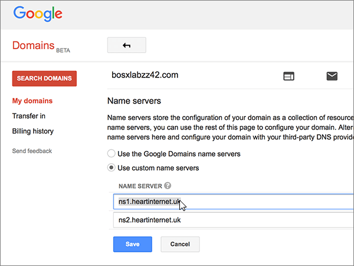
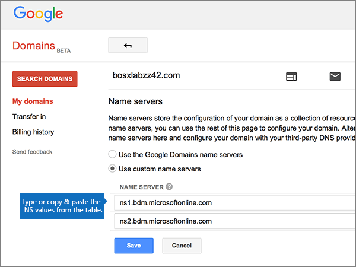

# Ändern von Namenservern zum Einrichten von Office 365 bei Google DomainsChange nameservers to set up Office 365 with Google Domains

 **[Überprüfen Sie die häufig gestellten Fragen (FAQ) zu Domänen](../setup/domains-faq.md)**, wenn Sie nicht finden, wonach Sie suchen.**[Check the Domains FAQ](../setup/domains-faq.md)** if you don't find what you're looking for. 
  
Führen Sie die folgenden Anweisungen aus, wenn Office 365 Ihre Office 365-DNS-Einträge automatisch verwalten soll. (Wenn es Ihnen lieber ist, können Sie [alle Ihre Office 365-DNS-Einträge bei Google Domains verwalten](create-dns-records-at-google-domains.md).)Follow these instructions if you want Office 365 to manage your Office 365 DNS records for you. (If you prefer, you can [manage all your Office 365 DNS records at Google Domains](create-dns-records-at-google-domains.md).)
  
    
## Hinzufügen eines TXT-Eintrags zur ÜberprüfungAdd a TXT record for verification

Bevor Sie Ihre Domäne in Office 365 verwenden können, müssen wir uns vergewissern, dass Sie deren Besitzer sind. Ihre Fähigkeit, sich bei Ihrem Konto bei Ihrer Domänenregistrierungsstelle anzumelden und den DNS-Eintrag zu erstellen, ist für Office 365 der Nachweis, dass Sie der Besitzer der Domäne sind.Before you use your domain with Office 365, we have to make sure that you own it. Your ability to log in to your account at your domain registrar and create the DNS record proves to Office 365 that you own the domain.
  
> [!NOTE]
>  Dieser Eintrag wird nur verwendet, um zu überprüfen, ob Sie der Besitzer Ihrer Domäne sind. Er hat keine weiteren Auswirkungen. Sie können ihn später ggf. löschen.This record is used only to verify that you own your domain; it doesn't affect anything else. You can delete it later, if you like. 
  
1. Um zu beginnen, navigieren Sie über [diesen Link](https://domains.google.com/registrar)zu ihrer Domänen Seite bei Google Domains.To get started, go to your domains page at Google Domains via [this link](https://domains.google.com/registrar). You'll be prompted to sign in.You'll be prompted to sign in. To do so:To do so:
    
1. Wählen Sie **Anmelden**aus.Select **Sign In**.
    
2. Geben Sie Ihre Anmeldeinformationen ein, und wählen Sie erneut **Anmelden**aus.Enter your login credentials and again select **Sign In**.
    
2. Wählen Sie auf der Seite **Domänen** im Abschnitt **Domäne** die Option **DNS** für die Domäne konfigurieren aus, die Sie bearbeiten möchten.On the **Domains** page, in the **Domain** section, select **Configure DNS** for the domain that you want to edit. 
    
3. In the **Custom resource records** section, in the boxes for the new record, type or copy and paste the values from the following table.In the **Custom resource records** section, in the boxes for the new record, type or copy and paste the values from the following table. 
    
    (You may have to scroll down.)(You may have to scroll down.)
    
    (Choose the **Type** value from the drop-down list.)(Choose the **Type** value from the drop-down list.) 
    
|||||
|:-----|:-----|:-----|:-----|
|**Name****Name**   |**Typ****Type**   |**TTL****TTL**   |**Data****Data**   |
|@    |TXTTXT    |1H1H    |MS=ms *XXXXXXXX*MS=ms *XXXXXXXX*   **Hinweis:** Dies ist ein nur Beispiel. Verwenden Sie jeweils Ihren Wert für **die Zieladresse bzw. die Adresse, auf die verwiesen wird** aus der Tabelle in Office 365. [Wie finde ich diese Angabe?](../get-help-with-domains/information-for-dns-records.md)**Note:** This is an example. Use your specific **Destination or Points to Address** value here, from the table in Office 365. [How do I find this?](../get-help-with-domains/information-for-dns-records.md)          |
   
4. Klicken Sie auf **Hinzufügen**.Select **Add**.
    
5. Warten Sie einige Minuten, bevor Sie fortfahren, damit der soeben erstellte Eintrag im Internet aktualisiert werden kann.Wait a few minutes before you continue, so that the record you just created can update across the Internet.
    
Nachdem Sie den Eintrag auf der Website Ihrer Domänenregistrierungsstelle hinzugefügt haben, kehren Sie zu Office 365 zurück und fordern Office 365 auf, nach dem Eintrag zu suchen.Now that you've added the record at your domain registrar's site, you'll go back to Office 365 and request Office 365 to look for the record.
  
Wenn Office 365 den richtigen TXT-Eintrag findet, wird die Domäne überprüft.When Office 365 finds the correct TXT record, your domain is verified.
  
1. Wechseln Sie im Admin Center zur Seite **Einstellungen** \> <a href="https://go.microsoft.com/fwlink/p/?linkid=834818" target="_blank">Domänen</a>.In the admin center, go to the **Settings** \> <a href="https://go.microsoft.com/fwlink/p/?linkid=834818" target="_blank">Domains</a> page.

    
2. Wählen Sie auf der Seite **Domänen** die zu überprüfende Domäne aus.On the **Domains** page, select the domain that you are verifying. 
    
3. Wählen Sie auf der Seite **Setup** die Option **Setup starten** aus.On the **Setup** page, select **Start setup**.
    
4. Wählen Sie auf der Seite **Domäne überprüfen** die Option **Überprüfen** aus.On the **Verify domain** page, select **Verify**.
    
> [!NOTE]
> Normalerweise dauert es ungefähr 15 Minuten, bis DNS-Änderungen wirksam werden. Es kann jedoch gelegentlich länger dauern, bis eine von Ihnen vorgenommene Änderung im Internet im DNS-System aktualisiert wurde. Wenn nach dem Hinzufügen von DNS-Einträgen Probleme mit dem E-Mail-Fluss oder andere Probleme auftreten, lesen Sie [Suchen und Beheben von Problemen, nachdem Ihre Domäne oder DNS-Einträge in Office 365 hinzugefügt wurden](../get-help-with-domains/find-and-fix-issues.md).Typically it takes about 15 minutes for DNS changes to take effect. However, it can occasionally take longer for a change you've made to update across the Internet's DNS system. If you're having trouble with mail flow or other issues after adding DNS records, see [Find and fix issues after adding your domain or DNS records in Office 365](../get-help-with-domains/find-and-fix-issues.md). 
  
## Ändern der Namenservereinträge (NS) Ihrer DomäneChange your domain's nameserver (NS) records

Zum Abschluss der Einrichtung Ihrer Domäne in Office 365 ändern Sie die NS-Einträge bei Ihrer Domänenregistrierungsstelle so, dass sie auf die primären und sekundären Office 365-Namenserver verweisen. Dadurch wird Office 365 zum Aktualisieren der DNS-Einträge der Domäne eingerichtet. Wir fügen alle Einträge hinzu, sodass E-Mails, Skype for Business Online und Ihre öffentliche Website in Verbindung mit Ihrer Domäne funktionieren und alles für Sie eingerichtet ist.To complete setting up your domain with Office 365, you change your domain's NS records at your domain registrar to point to the Office 365 primary and secondary name servers. This sets up Office 365 to update the domain's DNS records for you. We'll add all records so that email, Skype for Business Online, and your public website work with your domain, and you'll be all set.
  
> [!CAUTION]
> Wenn Sie die NS-Einträge Ihrer Domäne so ändern, dass Sie auf die Office 365 Namenserver verweist, sind alle Dienste betroffen, die derzeit Ihrer Domäne zugeordnet sind.When you change your domain's NS records to point to the Office 365 name servers, all the services that are currently associated with your domain are affected. Beispielsweise alle e-Mails, die an Ihre Domäne gesendet werden (wie Rob@ *your_domain.*For example, all email sent to your domain (like rob@ *your_domain.*  com) wird in Office 365 gestartet, nachdem Sie diese Änderung vorgenommen haben.com) will start coming to Office 365 after you make this change. 
  
> [!IMPORTANT]
> Im folgenden Verfahren wird gezeigt, wie Sie andere, unerwünschte Namenserver aus der Liste löschen können, und Sie erfahren, wie Sie die richtigen Namenserver hinzufügen, wenn sie sich nicht bereits in der Liste befinden.The following procedure will show you how to delete any other, unwanted nameservers from the list, and also how to add the correct nameservers if they are not already in the list. > Wenn Sie die Schritte in diesem Abschnitt abgeschlossen haben, sollten Sie die folgenden vier Namenserver finden:> When you have completed the steps in this section, the only nameservers that should be listed are these four: 
  
1. Im ersten Schritt navigieren Sie über [diesen Link](https://domains.google.com/registrar) zu Ihrer Domänenseite bei Google Domains. Sie werden aufgefordert, sich anzumelden. Gehen Sie dazu wie folgt vor:To get started, go to your domains page at Google Domains by using [this link](https://domains.google.com/registrar). You'll be prompted to sign in. To do so:
    
1. Wählen Sie **Anmelden**aus.Select **Sign In**.
    
2. Geben Sie Ihre Anmeldeinformationen ein, und wählen Sie dann erneut **Anmelden**aus.Enter your login credentials, and then again select **Sign In**.
    
2. Wählen Sie auf der Seite **Domänen** im Abschnitt **Domäne** die Option **DNS** für die Domäne konfigurieren aus, die Sie bearbeiten möchten.On the **Domains** page, in the **Domain** section, select **Configure DNS** for the domain that you want to edit. 
    
3. Wählen Sie auf der Seite **Domains** im Abschnitt **Name servers** die Option **Use custom name servers** aus.On the **Domains** page, in the **Name servers** section, select **Use custom name servers**.
    
    
  
4. Abhängig davon, ob auf der jetzt angezeigten Seite bereits Namenserver aufgelistet sind oder nicht, setzen Sie den Vorgang mit einem der beiden folgenden Verfahren fort:Depending on whether or not there are already nameservers listed on the page that is displayed now, continue to one of the two following procedures:
    
  - Wenn noch **KEINE** Namenserver aufgelistet sind, [Wenn noch KEINE Namenserver aufgelistet sind](#if-there-are-no-nameservers-already-listed).If there are **NO** nameservers already listed, [If there are NO nameservers already listed](#if-there-are-no-nameservers-already-listed).
    
  - Wenn **BEREITS** Namenserver aufgelistet sind, [Wenn Namenserver BEREITS aufgelistet sind](#if-there-are-nameservers-already-listed).If there **ARE** nameservers already listed, [If there ARE nameservers already listed](#if-there-are-nameservers-already-listed).
    
### Wenn noch KEINE Namenserver aufgelistet sindIf there are NO nameservers already listed

1. Fügen Sie den ersten Namenserver hinzu.Add the first nameserver.
    
    Geben Sie im Bereich **Name servers** im Feld **NAME SERVER** den ersten Wert aus der folgenden Tabelle ein. Sie können den Wert auch kopieren und einfügen.In the **Name servers** section, in the **NAME SERVER** box, type or copy and paste the first value from the following table. 
    
|||
|:-----|:-----|
|**Erster Namenserver****First name server**   |ns1.bdm.microsoftonline.comns1.bdm.microsoftonline.com    |
|**Zweiter Namenserver****Second name server**   |ns2.bdm.microsoftonline.comns2.bdm.microsoftonline.com    |
|**Dritter Namenserver****Third name server**   |ns3.bdm.microsoftonline.comns3.bdm.microsoftonline.com    |
|**Vierter Namenserver****Fourth name server**   |ns4.bdm.microsoftonline.comns4.bdm.microsoftonline.com    |
   
   
  
2. Wählen Sie das Steuerelement **+ (hinzufügen)** aus, um eine leere Zeile zu erstellen.Select the **+ (add)** control to create an empty row. 
    
    
  
3. Fügen Sie die anderen drei Namenservereinträge hinzu.Add the other three Nameserver records.
    
    Erstellen Sie im Abschnitt **benutzerdefinierte Namenserver verwenden** einen Datensatz mithilfe der Werte aus der nächsten Zeile in der Tabelle, und wählen Sie dann das Steuerelement **+ (hinzufügen)** aus, um eine weitere Zeile hinzuzufügen.In the **Use custom name servers** section, create a record by using the values from the next row in the table, and then select the **+ (add)** control to add another row. 
    
    Wiederholen Sie diesen Vorgang, bis Sie alle vier Namenservereinträge erstellt haben.Repeat this process until you have created all four Nameserver records.
    
4. Klicken Sie auf **Speichern**.Select **Save**.
    
    
  
> [!NOTE]
> Es kann mehrere Stunden dauern, bis Ihre Namenservereinträge im Internet im DNS-System aktualisiert wurden. Dann sind Ihre Office 365-E-Mails und andere Dienste für das Arbeiten mit Ihrer Domäne eingerichtet.Your nameserver record updates may take up to several hours to update across the Internet's DNS system. Then your Office 365 email and other services will be all set to work with your domain. 
  
### Wenn Namenserver BEREITS aufgelistet sindIf there ARE nameservers already listed

1. Wenn andere Namenserver aufgeführt sind, wählen Sie **Bearbeiten**aus.If there are any other nameservers listed, select **Edit**.
    
    > [!CAUTION]
    > Follow these steps only if you have existing nameservers other than the four correct nameservers.Follow these steps only if you have existing nameservers other than the four correct nameservers. (Das heißt, löschen Sie nur aktuelle Namenserver, die *nicht* **ns1.BDM.microsoftonline.com**, **ns2.BDM.microsoftonline.com**, **NS3.BDM.microsoftonline.com**oder **NS4.BDM.microsoftonline.com**sind.)(That is, delete only any current nameservers that are  *not*  named **ns1.bdm.microsoftonline.com**, **ns2.bdm.microsoftonline.com**, **ns3.bdm.microsoftonline.com**, or **ns4.bdm.microsoftonline.com**.) 
  
    
  
2. Delete each one by selecting it, and then pressing the **Delete** key on your keyboard.Delete each one by selecting it, and then pressing the **Delete** key on your keyboard. 
    
    
  
3. Geben Sie anschließend im Bereich **Name servers** in den **NAME SERVER**-Zeilen die Werte aus der folgenden Tabelle ein. Sie können die Werte auch kopieren und einfügen.Still in the **Name servers** section, in the **NAME SERVER** rows, type or copy and paste the values from the following table. 
    
|||
|:-----|:-----|
|**Erster Namenserver****First name server**   |ns1.bdm.microsoftonline.comns1.bdm.microsoftonline.com    |
|**Zweiter Namenserver****Second name server**   |ns2.bdm.microsoftonline.comns2.bdm.microsoftonline.com    |
|**Dritter Namenserver****Third name server**   |ns3.bdm.microsoftonline.comns3.bdm.microsoftonline.com    |
|**Vierter Namenserver****Fourth name server**   |ns4.bdm.microsoftonline.comns4.bdm.microsoftonline.com    |
   
   
  
4. Wählen Sie das Steuerelement **+ (hinzufügen)** aus, um eine leere Zeile zu erstellen.Select the **+(add)** control to create an empty row. 
    
    
  
5. Fügen Sie die anderen beiden Namenservereinträge hinzu.Add the other two Nameserver records.
    
    Erstellen Sie im Abschnitt **benutzerdefinierte Namenserver verwenden** einen Datensatz mithilfe der Werte aus der nächsten Zeile in der Tabelle, und wählen Sie dann das Steuerelement **+ (hinzufügen)** aus, um eine weitere Zeile hinzuzufügen.In the **Use custom name servers** section, create a record by using the values from the next row in the table, and then select the **+(add)** control to add another row. 
    
    Wiederholen Sie diesen Vorgang, bis Sie alle vier Namenservereinträge erstellt haben.Repeat this process until you have created all four Nameserver records.
    
6. Klicken Sie auf **Speichern**.Select **Save**.
    
    
  
> [!NOTE]
> Es kann mehrere Stunden dauern, bis Ihre Namenservereinträge im Internet im DNS-System aktualisiert wurden. Dann sind Ihre Office 365-E-Mails und andere Dienste für das Arbeiten mit Ihrer Domäne eingerichtet.Your nameserver record updates may take up to several hours to update across the Internet's DNS system. Then your Office 365 email and other services will be all set to work with your domain. 
  
