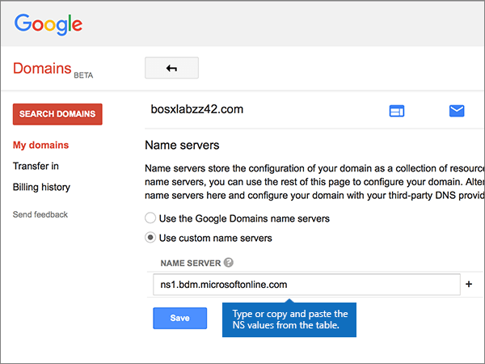

# Ändern von Namenservern zum Einrichten von Microsoft mit Google-DomänenChange nameservers to set up Microsoft with Google Domains

 **[Überprüfen Sie die häufig gestellten Fragen (FAQ) zu Domänen](../setup/domains-faq.yml)**, wenn Sie nicht finden, wonach Sie suchen.**[Check the Domains FAQ](../setup/domains-faq.yml)** if you don't find what you're looking for. 
  
Befolgen Sie diese Anweisungen, wenn Microsoft Ihre DNS-Einträge für Sie verwalten soll.Follow these instructions if you want Microsoft to manage your DNS records for you. (Wenn es Ihnen lieber ist, können Sie [alle Ihre DNS-Einträge bei Google Domains verwalten](create-dns-records-at-google-domains.md).)(If you prefer, you can [manage all your DNS records at Google Domains](create-dns-records-at-google-domains.md).)
  
    
## Hinzufügen eines TXT-Eintrags zur ÜberprüfungAdd a TXT record for verification

Bevor Sie Ihre Domäne mit Microsoft verwenden können, müssen wir uns vergewissern, dass Sie deren Besitzer sind. Ihre Fähigkeit, sich bei Ihrem Konto bei Ihrer Domänenregistrierungsstelle anzumelden und den DNS-Eintrag zu erstellen, ist für Microsoft der Nachweis, dass Sie der Besitzer der Domäne sind.Before you use your domain with Microsoft, we have to make sure that you own it. Your ability to log in to your account at your domain registrar and create the DNS record proves to Microsoft that you own the domain.
  
> [!NOTE]
>  Dieser Eintrag wird nur verwendet, um zu überprüfen, ob Sie der Besitzer Ihrer Domäne sind. Er hat keine weiteren Auswirkungen. Sie können ihn später ggf. löschen.This record is used only to verify that you own your domain; it doesn't affect anything else. You can delete it later, if you like. 
  
1. Um zu beginnen, navigieren Sie über [diesen Link](https://domains.google.com/registrar)zu ihrer Domänen Seite bei Google Domains.To get started, go to your domains page at Google Domains via [this link](https://domains.google.com/registrar). You'll be prompted to sign in.You'll be prompted to sign in. To do so:To do so:
    
1. Wählen Sie **Sign In** aus.Select **Sign In**.
    
2. Geben Sie Ihre Anmeldeinformationen ein, und wählen Sie erneut **Anmelden** aus.Enter your login credentials and again select **Sign In**.
    
2. Wählen Sie auf der Seite **Domains** im Abschnitt **Domain** die Option **Configure DNS** für die Domäne aus, die Sie bearbeiten möchten.On the **Domains** page, in the **Domain** section, select **Configure DNS** for the domain that you want to edit. 
    
3. Geben Sie im Bereich **Custom resource records** in den Feldern für den neuen Eintrag die Werte aus der folgenden Tabelle ein. Sie können die Werte auch kopieren und einfügen.In the **Custom resource records** section, in the boxes for the new record, type or copy and paste the values from the following table. 
    
    (Möglicherweise müssen Sie nach unten scrollen.)(You may have to scroll down.)
    
    (Wählen Sie in der Dropdownliste den Wert für **Type** aus.)(Choose the **Type** value from the drop-down list.) 
    
|||||
|:-----|:-----|:-----|:-----|
|**Name****Name**   |**Type****Type**   |**TTL****TTL**   |**Data****Data**   |
|@    |TXTTXT    |1H1H    |MS=ms *XXXXXXXX*MS=ms *XXXXXXXX*   **Hinweis:** Dies ist ein Beispiel. Verwenden Sie hier Ihren spezifischen Wert für **Ziel- oder Verweisadresse** aus der Tabelle in [Wie finde ich diese Angabe?](../get-help-with-domains/information-for-dns-records.md).**Note:** This is an example. Use your specific **Destination or Points to Address** value here, from the table. [How do I find this?](../get-help-with-domains/information-for-dns-records.md)          |
   
4. Klicken Sie auf **Hinzufügen**.Select **Add**.
    
5. Warten Sie einige Minuten, bevor Sie fortfahren, damit der soeben erstellte Eintrag im Internet aktualisiert werden kann.Wait a few minutes before you continue, so that the record you just created can update across the Internet.
    
Nachdem Sie den Eintrag auf der Website Ihrer Domänenregistrierungsstelle hinzugefügt haben, kehren Sie zu Microsoft zurück und fordern eine Suche nach dem Eintrag an.Now that you've added the record at your domain registrar's site, you'll go back to Microsoft and request a search for the record.
  
Wenn Microsoft den richtigen TXT-Eintrag findet, ist die Domäne überprüft.When Microsoft finds the correct TXT record, your domain is verified.
  
1. Wechseln Sie im Microsoft Admin Center zur Seite **Einstellungen** \> <a href="https://go.microsoft.com/fwlink/p/?linkid=834818" target="_blank">Domänen</a>.In the Microsoft admin center, go to the **Settings** \> <a href="https://go.microsoft.com/fwlink/p/?linkid=834818" target="_blank">Domains</a> page.

    
2. Wählen Sie auf der Seite **Domänen** die zu überprüfende Domäne aus.On the **Domains** page, select the domain that you are verifying. 
    
3. Wählen Sie auf der Seite **Setup** die Option **Setup starten** aus.On the **Setup** page, select **Start setup**.
    
4. Wählen Sie auf der Seite **Domäne überprüfen** die Option **Überprüfen** aus.On the **Verify domain** page, select **Verify**.
    
> [!NOTE]
> Normalerweise dauert es ungefähr 15 Minuten, bis DNS-Änderungen wirksam werden. Es kann jedoch gelegentlich länger dauern, bis eine von Ihnen vorgenommene Änderung im Internet im DNS-System aktualisiert wurde. Wenn nach dem Hinzufügen von DNS-Einträgen Probleme mit dem E-Mail-Fluss oder andere Probleme auftreten, lesen Sie [Suchen und Beheben von Problemen, nachdem Ihre Domäne oder DNS-Einträge hinzugefügt wurden](../get-help-with-domains/find-and-fix-issues.md).Typically it takes about 15 minutes for DNS changes to take effect. However, it can occasionally take longer for a change you've made to update across the Internet's DNS system. If you're having trouble with mail flow or other issues after adding DNS records, see [Find and fix issues after adding your domain or DNS records](../get-help-with-domains/find-and-fix-issues.md). 
  
## Ändern der Namenservereinträge (NS) Ihrer DomäneChange your domain's nameserver (NS) records

Um die Einrichtung Ihrer Domäne bei Microsoft abzuschließen, ändern Sie die NS-Einträge Ihrer Domäne bei Ihrer Domänenregistrierungsstelle so, dass Sie auf den primären und sekundären Namenserver von Microsoft verweist.To complete setting up your domain with Microsoft, you change your domain's NS records at your domain registrar to point to the Microsoft primary and secondary name servers. Dadurch wird Microsoft so eingerichtet, dass die DNS-Einträge der Domäne für Sie aktualisiert werden.This sets up Microsoft to update the domain's DNS records for you. Wir fügen alle Einträge hinzu, sodass E-Mails, Skype for Business Online und Ihre öffentliche Website in Verbindung mit Ihrer Domäne funktionieren und alles für Sie eingerichtet ist.We'll add all records so that email, Skype for Business Online, and your public website work with your domain, and you'll be all set.
  
> [!CAUTION]
> Wenn Sie die NS-Einträge Ihrer Domäne so ändern, dass Sie auf die Microsoft Name-Server verweist, sind alle Dienste betroffen, die derzeit Ihrer Domäne zugeordnet sind.When you change your domain's NS records to point to the Microsoft name servers, all the services that are currently associated with your domain are affected. Beispielsweise alle e-Mails, die an Ihre Domäne gesendet werden (wie Rob@ *your_domain.*For example, all email sent to your domain (like rob@ *your_domain.*  com) wird gestartet, nachdem Sie diese Änderung vorgenommen haben.com) will start coming to Microsoft after you make this change. 
  
> [!IMPORTANT]
> Im folgenden Verfahren wird gezeigt, wie Sie andere, unerwünschte Namenserver aus der Liste löschen können, und Sie erfahren, wie Sie die richtigen Namenserver hinzufügen, wenn sie sich nicht bereits in der Liste befinden.The following procedure will show you how to delete any other, unwanted nameservers from the list, and also how to add the correct nameservers if they are not already in the list. > Wenn Sie die Schritte in diesem Abschnitt abgeschlossen haben, sollten Sie die folgenden vier Namenserver finden:> When you have completed the steps in this section, the only nameservers that should be listed are these four: 
  
1. Im ersten Schritt navigieren Sie über [diesen Link](https://domains.google.com/registrar) zu Ihrer Domänenseite bei Google Domains. Sie werden aufgefordert, sich anzumelden. Gehen Sie dazu wie folgt vor:To get started, go to your domains page at Google Domains by using [this link](https://domains.google.com/registrar). You'll be prompted to sign in. To do so:
    
1. Wählen Sie **Sign In** aus.Select **Sign In**.
    
2. Geben Sie Ihre Anmeldeinformationen ein, und wählen Sie dann erneut **Sign In** aus.Enter your login credentials, and then again select **Sign In**.
    
2. Wählen Sie auf der Seite **Domains** im Abschnitt **Domain** die Option **Configure DNS** für die Domäne aus, die Sie bearbeiten möchten.On the **Domains** page, in the **Domain** section, select **Configure DNS** for the domain that you want to edit. 
    
3. Wählen Sie auf der Seite **Domains** im Abschnitt **Name servers** die Option **Use custom name servers** aus.On the **Domains** page, in the **Name servers** section, select **Use custom name servers**.
    
    
  
4. Abhängig davon, ob auf der jetzt angezeigten Seite bereits Namenserver aufgelistet sind oder nicht, setzen Sie den Vorgang mit einem der beiden folgenden Verfahren fort:Depending on whether or not there are already nameservers listed on the page that is displayed now, continue to one of the two following procedures:
    
  - Wenn noch **KEINE** Namenserver aufgelistet sind, [Wenn noch KEINE Namenserver aufgelistet sind](#if-there-are-no-nameservers-already-listed).If there are **NO** nameservers already listed, [If there are NO nameservers already listed](#if-there-are-no-nameservers-already-listed).
    
  - Wenn **BEREITS** Namenserver aufgelistet sind, [Wenn Namenserver BEREITS aufgelistet sind](#if-there-are-nameservers-already-listed).If there **ARE** nameservers already listed, [If there ARE nameservers already listed](#if-there-are-nameservers-already-listed).
    
### Wenn noch KEINE Namenserver aufgelistet sindIf there are NO nameservers already listed

1. Fügen Sie den ersten Namenserver hinzu.Add the first nameserver.
    
    Geben Sie im Bereich **Name servers** im Feld **NAME SERVER** den ersten Wert aus der folgenden Tabelle ein. Sie können den Wert auch kopieren und einfügen.In the **Name servers** section, in the **NAME SERVER** box, type or copy and paste the first value from the following table. 
    
|||
|:-----|:-----|
|**Erster Namenserver****First name server**   |ns1.bdm.microsoftonline.comns1.bdm.microsoftonline.com    |
|**Zweiter Namenserver****Second name server**   |ns2.bdm.microsoftonline.comns2.bdm.microsoftonline.com    |
|**Dritter Namenserver****Third name server**   |ns3.bdm.microsoftonline.comns3.bdm.microsoftonline.com    |
|**Vierter Namenserver****Fourth name server**   |ns4.bdm.microsoftonline.comns4.bdm.microsoftonline.com    |
   
   
  
2. Wählen Sie das Steuerelement **+ (hinzufügen)** aus, um eine leere Zeile zu erstellen.Select the **+ (add)** control to create an empty row. 
    
    
  
3. Fügen Sie die anderen drei Namenservereinträge hinzu.Add the other three Nameserver records.
    
    Erstellen Sie im Abschnitt **benutzerdefinierte Namenserver verwenden** einen Datensatz mithilfe der Werte aus der nächsten Zeile in der Tabelle, und wählen Sie dann das Steuerelement **+ (hinzufügen)** aus, um eine weitere Zeile hinzuzufügen.In the **Use custom name servers** section, create a record by using the values from the next row in the table, and then select the **+ (add)** control to add another row. 
    
    Wiederholen Sie diesen Vorgang, bis Sie alle vier Namenservereinträge erstellt haben.Repeat this process until you have created all four Nameserver records.
    
4. Wählen Sie **Speichern** aus.Select **Save**.
    
    
  
> [!NOTE]
> Es kann mehrere Stunden dauern, bis Ihre Namenservereinträge im Internet im DNS-System aktualisiert wurden.Your nameserver record updates may take up to several hours to update across the Internet's DNS system. Dann sind Ihre Microsoft-e-Mails und andere Dienste für die Verwendung Ihrer Domäne festgelegt.Then your Microsoft email and other services will be all set to work with your domain. 
  
### Wenn Namenserver BEREITS aufgelistet sindIf there ARE nameservers already listed

1. Wenn andere Namenserver aufgeführt sind, wählen Sie **Bearbeiten** aus.If there are any other nameservers listed, select **Edit**.
    
    > [!CAUTION]
    > Follow these steps only if you have existing nameservers other than the four correct nameservers.Follow these steps only if you have existing nameservers other than the four correct nameservers. (Das heißt, löschen Sie nur aktuelle Namenserver, die  *nicht* **ns1.BDM.microsoftonline.com**, **ns2.BDM.microsoftonline.com**, **NS3.BDM.microsoftonline.com** oder **NS4.BDM.microsoftonline.com** sind.)(That is, delete only any current nameservers that are  *not*  named **ns1.bdm.microsoftonline.com**, **ns2.bdm.microsoftonline.com**, **ns3.bdm.microsoftonline.com**, or **ns4.bdm.microsoftonline.com**.) 
  
    
  
2. Delete each one by selecting it, and then pressing the **Delete** key on your keyboard.Delete each one by selecting it, and then pressing the **Delete** key on your keyboard. 
    
    
  
3. Geben Sie anschließend im Bereich **Name servers** in den **NAME SERVER**-Zeilen die Werte aus der folgenden Tabelle ein. Sie können die Werte auch kopieren und einfügen.Still in the **Name servers** section, in the **NAME SERVER** rows, type or copy and paste the values from the following table. 
    
|||
|:-----|:-----|
|**Erster Namenserver****First name server**   |ns1.bdm.microsoftonline.comns1.bdm.microsoftonline.com    |
|**Zweiter Namenserver****Second name server**   |ns2.bdm.microsoftonline.comns2.bdm.microsoftonline.com    |
|**Dritter Namenserver****Third name server**   |ns3.bdm.microsoftonline.comns3.bdm.microsoftonline.com    |
|**Vierter Namenserver****Fourth name server**   |ns4.bdm.microsoftonline.comns4.bdm.microsoftonline.com    |
   
   
  
4. Wählen Sie das Steuerelement **+ (hinzufügen)** aus, um eine leere Zeile zu erstellen.Select the **+(add)** control to create an empty row. 
    
    
  
5. Fügen Sie die anderen beiden Namenservereinträge hinzu.Add the other two Nameserver records.
    
    Erstellen Sie im Abschnitt **benutzerdefinierte Namenserver verwenden** einen Datensatz mithilfe der Werte aus der nächsten Zeile in der Tabelle, und wählen Sie dann das Steuerelement **+ (hinzufügen)** aus, um eine weitere Zeile hinzuzufügen.In the **Use custom name servers** section, create a record by using the values from the next row in the table, and then select the **+(add)** control to add another row. 
    
    Wiederholen Sie diesen Vorgang, bis Sie alle vier Namenservereinträge erstellt haben.Repeat this process until you have created all four Nameserver records.
    
6. Wählen Sie **Speichern** aus.Select **Save**.
    
    
  
> [!NOTE]
> Es kann mehrere Stunden dauern, bis Ihre Namenservereinträge im Internet im DNS-System aktualisiert wurden.Your nameserver record updates may take up to several hours to update across the Internet's DNS system. Dann sind Ihre Microsoft-e-Mails und andere Dienste für die Verwendung Ihrer Domäne festgelegt.Then your Microsoft email and other services will be all set to work with your domain. 
  
