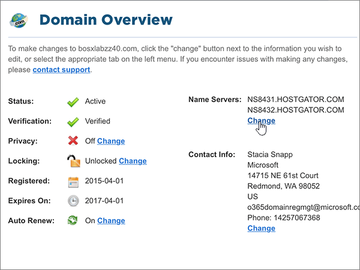
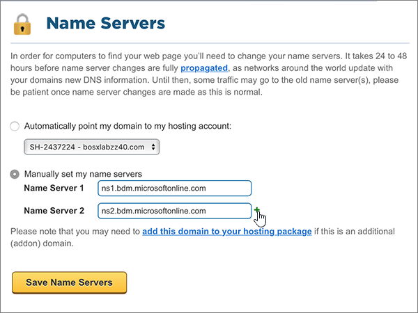

# Ändern von Namenservern zum Einrichten von Microsoft 365 mit Hostgator

 **[Überprüfen Sie die häufig gestellten Fragen (FAQ) zu Domänen](../setup/domains-faq.yml)**, wenn Sie nicht finden, wonach Sie suchen.
  
Befolgen Sie diese Anweisungen, wenn Microsoft Ihre DNS-Einträge für Sie verwalten soll. (Wenn es Ihnen lieber ist, können Sie [alle Ihre Microsoft-DNS-Einträge bei Hostgator verwalten](create-dns-records-at-hostgator.md).)
  
    
## Verweisen Sie Ihre Domäne auf Ihr Hostingkonto.

> [!IMPORTANT]
> Sie müssen dieses Verfahren ausführen, bevor Sie das Verfahren im folgenden Abschnitt, **Hinzufügen eines TXT-Eintrags zur Überprüfung** durchführen.
  
Führen Sie die folgenden Schritte aus, um Ihre Domäne und Hostingkonten zu verknüpfen.
  
1. Im ersten Schritt navigieren Sie über [diesen Link](https://portal.hostgator.com/domain/manage) zur Kundenportalseite bei Hostgator. Sie werden aufgefordert, sich anzumelden.
    
    
  
2. Wählen Sie die Registerkarte **Domänen** aus.
    
    
  
3. Wählen Sie auf der Seite " **Domänen verwalten** " im Bereich " **Meine Domänen** " die Domäne aus, die Sie aktualisieren möchten.
    
    
  
4. Wählen Sie auf der Seite **Domänenübersicht** im Bereich **Name Servers** die Option **Change** aus.
    
    
  
5. Wählen Sie auf der Seite **Namensserver** für Ihre Domäne in der Dropdownliste **Host Konto auswählen** das **Hostingkonto** aus, das Ihrer Domäne zugeordnet ist.
    
    
  
6. Wählen Sie **Namenserver speichern** aus.
    
    
  
## Hinzufügen eines TXT-Eintrags zur Überprüfung

> [!IMPORTANT]
> Bevor Sie dieses Verfahren ausführen, müssen Sie zuerst das Verfahren im ersten Abschnitt dieses Artikels ausführen, indem Sie [Ihre Domäne auf Ihr Hostingkonto hinweisen.](#point-your-domain-to-your-hosting-account).
  
Bevor Sie Ihre Domäne mit Microsoft verwenden können, müssen wir uns vergewissern, dass Sie deren Besitzer sind. Ihre Fähigkeit, sich bei Ihrem Konto bei Ihrer Domänenregistrierungsstelle anzumelden und den DNS-Eintrag zu erstellen, ist für Microsoft der Nachweis, dass Sie der Besitzer der Domäne sind.
  
> [!NOTE]
> Dieser Eintrag wird nur verwendet, um zu überprüfen, ob Sie der Besitzer Ihrer Domäne sind. Er hat keine weiteren Auswirkungen. Sie können ihn später ggf. löschen.
  
1. Um zu beginnen, wechseln Sie zu Ihrer cPanel-Seite bei Hostgator. Sie werden aufgefordert, sich zuerst anzumelden.
    
    (Jedem gehosteten Konto bei Hostgator ist eine eindeutige cPanel-Adresse zugewiesen. Ihre cPanel-Adresse sollte wie folgt aussehen: https://YourSiteAddress:secure-port-number. Diese Adresse ist in der Anmelde-E-Mail, die Sie von Hostgator erhalten, angegeben.)
    
    > [!IMPORTANT]
    > To have a cPanel associated with your domain, you need a hosting account with Hostgator. Um zu beginnen, können Sie entweder ein Hostingkonto von Hostgator erwerben oder [die Namenservereinträge (NS) Ihrer Domäne so ändern](#change-your-domains-nameserver-ns-records) , dass Sie auf Microsoft verweist. 
  
2. Wählen Sie auf der Seite **Systemsteuerung** im Bereich **Domänen** die Option **Erweiterter DNS-Zonen-Editor** aus.
    
    (Möglicherweise müssen Sie nach unten scrollen.) 
    
3. On the **Advanced DNS Zone Editor** page, in the **Add a Record** area, in the boxes for the new record, type or copy and paste the values from the following table. 
    
    (Wählen Sie in der Dropdownliste den Wert für **Type** aus.) 
    
|||||
|:-----|:-----|:-----|:-----|
|**Name**   |**TTL**   |**Type**   |**TXT Data**   |
|Verwenden Sie Ihren  *Domänennamen*  (z. B. "fourthcoffee.com").    **Dieser Wert MUSS mit einem Punkt (.) enden.**   |1     |TXT    |MS=ms *XXXXXXXX*    **Hinweis:** Dies ist ein Beispiel. Verwenden Sie hier Ihren spezifischen Wert für **Ziel- oder Verweisadresse** aus der Tabelle in [Wie finde ich diese Angabe?](../get-help-with-domains/information-for-dns-records.md).        |
   
4. Wählen Sie **Add Record** (Eintrag hinzufügen) aus.
    
5. Warten Sie einige Minuten, bevor Sie fortfahren, damit der soeben erstellte Eintrag im Internet aktualisiert werden kann.
    
Nachdem Sie den Eintrag auf der Website Ihrer Domänenregistrierungsstelle hinzugefügt haben, kehren Sie zu Microsoft zurück und fordern eine Suche nach dem Eintrag an.
  
Wenn Microsoft den richtigen TXT-Eintrag findet, ist die Domäne überprüft.
  
1. Wechseln Sie im Admin Center zur Seite **Einstellungen** \> <a href="https://go.microsoft.com/fwlink/p/?linkid=834818" target="_blank">Domänen</a>.

    
2. Wählen Sie auf der Seite **Domänen** die zu überprüfende Domäne aus. 
    
3. Wählen Sie auf der Seite **Setup** die Option **Setup starten** aus.
    
4. Wählen Sie auf der Seite **Domäne überprüfen** die Option **Überprüfen** aus.
    
> [!NOTE]
> Normalerweise dauert es ungefähr 15 Minuten, bis DNS-Änderungen wirksam werden. Es kann jedoch gelegentlich länger dauern, bis eine von Ihnen vorgenommene Änderung im Internet im DNS-System aktualisiert wurde. Wenn nach dem Hinzufügen von DNS-Einträgen Probleme mit dem E-Mail-Fluss oder andere Probleme auftreten, lesen Sie [Suchen und Beheben von Problemen, nachdem Ihre Domäne oder DNS-Einträge hinzugefügt wurden](../get-help-with-domains/find-and-fix-issues.md). 
  
## Ändern der Namenservereinträge (NS) Ihrer Domäne

Um die Einrichtung Ihrer Domäne bei Microsoft abzuschließen, ändern Sie die NS-Einträge Ihrer Domäne bei Ihrer Domänenregistrierungsstelle so, dass Sie auf den primären und sekundären Namenserver von Microsoft verweist. Dadurch wird Microsoft so eingerichtet, dass die DNS-Einträge der Domäne für Sie aktualisiert werden. Wir fügen alle Einträge hinzu, sodass E-Mails, Skype for Business Online und Ihre öffentliche Website in Verbindung mit Ihrer Domäne funktionieren und alles für Sie eingerichtet ist.
  
> [!CAUTION]
> Wenn Sie die NS-Einträge Ihrer Domäne so ändern, dass Sie auf die Microsoft Name-Server verweist, sind alle Dienste betroffen, die derzeit Ihrer Domäne zugeordnet sind. Beispielsweise werden alle e-Mails, die an Ihre Domäne gesendet werden (wie Rob@ *your_domain*  . com), nach dem Ausführen dieser Änderung an Microsoft weitergeleitet.
  
> [!IMPORTANT]
> Im folgenden Verfahren wird gezeigt, wie Sie alle anderen unerwünschten Namenserver aus der Liste löschen und wie Sie die richtigen Nameserver hinzufügen, wenn Sie noch nicht aufgeführt sind. Wenn Sie die Schritte in diesem Abschnitt abgeschlossen haben, sollten Sie die folgenden vier Namenserver finden:  **ns1.BDM.microsoftonline.com**, **ns2.BDM.microsoftonline.com**, **NS3.BDM.microsoftonline.com** und **NS4.BDM.microsoftonline.com**.
  
1. Im ersten Schritt navigieren Sie über [diesen Link](https://portal.hostgator.com/domain/manage) zur Kundenportalseite bei Hostgator. Sie werden aufgefordert, sich anzumelden.
    
    
  
2. Wählen Sie die Registerkarte **Domänen** aus. 
    
    
  
3. Wählen Sie auf der Seite " **Domänen verwalten** " im Bereich " **Meine Domänen** " die Domäne aus, die Sie aktualisieren möchten. 
    
    
  
4. Wählen Sie auf der Seite **Domain Overview** im Bereich **Name Servers** die Option **Change** aus.
    
    
  
5. Wählen Sie auf der Seite **Namensserver** für Ihre Domäne in der Dropdownliste **Host Konto auswählen** das **Hostingkonto** aus, das Ihrer Domäne zugeordnet ist. 
    
    
  
6. Wählen Sie " **meine Namenserver manuell festlegen**" aus.
    
    
  
7.   **Vorsicht**: Befolgen Sie diese Schritte nur, wenn Sie andere Namenserver als die vier richtigen Namenserver haben. (Das heißt, löschen Sie nur aktuelle Namenserver, die  *nicht* **ns1.BDM.microsoftonline.com**, **ns2.BDM.microsoftonline.com**, **NS3.BDM.microsoftonline.com** oder **NS4.BDM.microsoftonline.com** sind.)
  
        Während Sie sich noch auf der Seite **Name Servers** für Ihre Domäne befinden, löschen Sie in der Liste der Nameserver jeden Nameserver in dieser Liste, indem Sie ihn auswählen und dann die **ENTF**-TASTE auf der Tastatur drücken. 
    
   
  
8. Während Sie sich noch in der Liste der Nameserver befinden, geben Sie die beiden ersten Werte aus der folgenden Tabelle ein. Sie können die Werte auch kopieren und einfügen.
    
|||
|:-----|:-----|
|**Name Server 1:**   |ns1.bdm.microsoftonline.com    |
|**Name Server 2:**   |ns2.bdm.microsoftonline.com    |
|**Name Server 3:**   |ns3.bdm.microsoftonline.com    |
|**Name Server 4:**   |ns4.bdm.microsoftonline.com    |
   
   
  
9. Fügen Sie die anderen Namenserverwerte hinzu.
    
    Wählen Sie **(+)** hinzufügen aus, und geben Sie den Wert aus der nächsten Zeile der Tabelle in das Feld für den Datensatz ein, oder kopieren und fügen Sie ihn ein. 
    
    Wiederholen Sie diesen Vorgang, bis Sie alle vier Namenservereinträge erstellt haben.
    
    
  
10. Wählen Sie **Namenserver speichern** aus.
    
    
  
> [!NOTE]
> Es kann mehrere Stunden dauern, bis Ihre Namenservereinträge im Internet im DNS-System aktualisiert wurden. Dann sind Ihre Microsoft-e-Mails und andere Dienste für die Verwendung Ihrer Domäne festgelegt.
