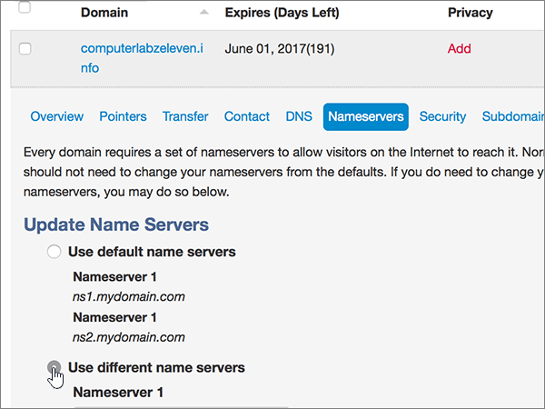

# Ändern von Namenservern zum Einrichten von Microsoft mit mydomain

 **[Überprüfen Sie die häufig gestellten Fragen (FAQ) zu Domänen](../setup/domains-faq.md)**, wenn Sie nicht finden, wonach Sie suchen.
  
Befolgen Sie diese Anweisungen, wenn Microsoft Ihre DNS-Einträge für Sie verwalten soll. (Wenn es Ihnen lieber ist, können Sie [alle Ihre Microsoft-DNS-Einträge bei mydomain verwalten](create-dns-records-at-mydomain.md).)
  
## Hinzufügen eines TXT-Eintrags zur Überprüfung

Bevor Sie Ihre Domäne mit Microsoft verwenden, müssen wir sicherstellen, dass Sie Sie besitzen. Ihre Fähigkeit, sich bei Ihrem Konto bei Ihrer Domänenregistrierungsstelle anzumelden und den DNS-Eintrag zu erstellen, beweist Microsoft, dass Sie die Domäne besitzen.
  
> [!NOTE]
> Dieser Eintrag wird nur verwendet, um zu überprüfen, ob Sie der Besitzer Ihrer Domäne sind. Er hat keine weiteren Auswirkungen. Sie können ihn später ggf. löschen. 
  
1. Im ersten Schritt navigieren Sie über [diesen Link](https://www.mydomain.com/controlpanel) zu Ihrer Domänenseite bei MyDomain. Sie werden aufgefordert, sich zuerst anzumelden.
    
2. Wählen Sie im Abschnitt **Meine Favorien** die Option **Domain Central** aus.
    
3. Wählen Sie unter **Domain** den Namen der Domäne aus, die Sie bearbeiten möchten.
    
4. Wählen Sie in der Zeile **Overview** die Option **DNS** aus.
    
5. Wählen Sie in der Dropdownliste **Modify** den Eintrag **TXT/SPF Record** aus.
    
6. Geben Sie unter **Content** im Feld für den neuen Eintrag den Wert aus der folgenden Tabelle ein. Sie können den Wert auch kopieren und einfügen.
    
||
|:-----|
|**Inhalt**   |
|MS=ms *XXXXXXXX*    **Hinweis:** Dies ist ein nur Beispiel. Verwenden Sie hier Ihre spezifischen **Ziel-oder Punkt-zu-Adresse** -Werte aus der Tabelle. [Wie finde ich diese Angabe?](../get-help-with-domains/information-for-dns-records.md)          |
   
7. Klicken Sie auf **Hinzufügen**.
    
8. Warten Sie einige Minuten, bevor Sie fortfahren, damit der soeben erstellte Eintrag im Internet aktualisiert werden kann.
    
Nachdem Sie den Eintrag auf der Website Ihrer Domänenregistrierungsstelle hinzugefügt haben, kehren Sie zu Microsoft 365 zurück und fordern Microsoft 365 auf, nach dem Eintrag zu suchen.
  
Wenn Microsoft den richtigen TXT-Eintrag findet, wird Ihre Domäne überprüft.
  
1. Wechseln Sie im Microsoft Admin Center zur Seite mit den **Einstellungs** \> <a href="https://go.microsoft.com/fwlink/p/?linkid=834818" target="_blank">Domänen</a> .

    
2. Wählen Sie auf der Seite **Domänen** die zu überprüfende Domäne aus. 
    
3. Wählen Sie auf der Seite **Setup** die Option **Setup starten** aus.
    
4. Wählen Sie auf der Seite **Domäne überprüfen** die Option **Überprüfen** aus.
    
> [!NOTE]
> Typically it takes about 15 minutes for DNS changes to take effect. However, it can occasionally take longer for a change you've made to update across the Internet's DNS system. Wenn Sie Probleme mit dem Nachrichtenfluss oder anderen Problemen haben, nachdem Sie DNS-Einträge hinzugefügt haben, finden Sie unter [Suchen und Beheben von Problemen nach dem Hinzufügen Ihrer Domäne oder DNS-Einträge](../get-help-with-domains/find-and-fix-issues.md). 
  
## Ändern der Namenservereinträge (NS) Ihrer Domäne

Um die Einrichtung Ihrer Domäne bei Microsoft abzuschließen, ändern Sie die NS-Einträge Ihrer Domäne bei Ihrer Domänenregistrierungsstelle so, dass Sie auf den primären und sekundären Namenserver von Microsoft verweist. Dadurch wird Microsoft so eingerichtet, dass die DNS-Einträge der Domäne für Sie aktualisiert werden. Wir fügen alle Einträge hinzu, sodass E-Mails, Skype for Business Online und Ihre öffentliche Website in Verbindung mit Ihrer Domäne funktionieren und alles für Sie eingerichtet ist.
  
> [!CAUTION]
> Wenn Sie die NS-Einträge Ihrer Domäne so ändern, dass Sie auf die Microsoft Name-Server verweist, sind alle Dienste betroffen, die derzeit Ihrer Domäne zugeordnet sind. Beispielsweise alle e-Mails, die an Ihre Domäne gesendet werden (wie Rob@ *your_domain.* com) wird gestartet, nachdem Sie diese Änderung vorgenommen haben. 
  
> [!IMPORTANT]
> Im folgenden Verfahren wird gezeigt, wie Sie andere, unerwünschte Namenserver aus der Liste löschen können, und Sie erfahren, wie Sie die richtigen Namenserver hinzufügen, wenn sie sich nicht bereits in der Liste befinden.  When you have completed the steps in this section, the only nameservers that should be listed are these four:
  
1. Im ersten Schritt navigieren Sie über [diesen Link](https://www.mydomain.com/controlpanel) zu Ihrer Domänenseite bei MyDomain. Sie werden aufgefordert, sich zuerst anzumelden.
    
2. Wählen Sie im Abschnitt **Meine Favorien** die Option **Domain Central** aus.
    
3. Wählen Sie unter **Domain** den Namen der Domäne aus, die Sie bearbeiten möchten.
    
4. Wählen Sie in der Zeile **Übersicht** die Option Namen **Server**aus.
    
    
  
5. Wählen Sie im Abschnitt **Update Name Servers** die Option **Use different name servers** aus.
    
    
  
6. Je nachdem, ob auf der jetzt angezeigten Seite bereits Namenserver aufgelistet sind oder nicht, fahren Sie mit einem der beiden folgenden Verfahren fort.
    
### Wenn die richtigen Namenserver bereits aufgelistet SIND

- Wenn die richtigen Namenserver bereits aufgelistet sind, können Sie diesen Schritt überspringen.
    
    
  
### Wenn die richtigen Namenserver noch NICHT aufgelistet sind

> [!CAUTION]
> Follow these steps only if you have existing nameservers other than the four correct nameservers. (Das heißt, löschen Sie nur aktuelle Namenserver, die *nicht* **ns1.BDM.microsoftonline.com**, **ns2.BDM.microsoftonline.com**, **NS3.BDM.microsoftonline.com**oder **NS4.BDM.microsoftonline.com**sind.) 
  
1. Delete the existing nameservers by selecting each entry in the **Nameserver:** field, and then pressing the **Delete** key on your keyboard. 
    
    
  
2. Wählen Sie zweimal **Hinzufügen** aus, um zwei neue Nameserver-Zeilen hinzuzufügen. 
    
    
  
3. Geben Sie in die Felder für die Einträge die Namenserverwerte aus der folgenden Tabelle ein. Sie können die Werte auch kopieren und einfügen.
    
|||
|:-----|:-----|
|**Nameserver 1**   |ns1.bdm.microsoftonline.com    |
|**Nameserver 2**   |ns2.bdm.microsoftonline.com    |
|**Nameserver 3**   |ns3.bdm.microsoftonline.com    |
|**Nameserver 4**   |ns4.bdm.microsoftonline.com    |
   
   
  
4. Klicken Sie auf **Speichern**.
    
    
  
> [!NOTE]
> Es kann mehrere Stunden dauern, bis Ihre Namenservereinträge im Internet im DNS-System aktualisiert wurden. Dann sind Ihre Microsoft-e-Mails und andere Dienste für die Verwendung Ihrer Domäne festgelegt. 
