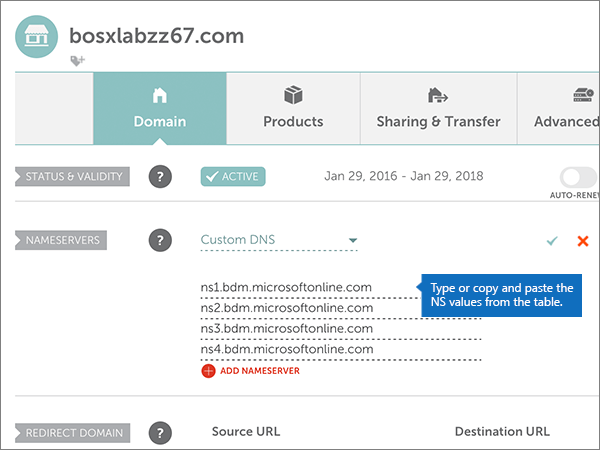

# Ändern von Namenservern zum Einrichten von Microsoft mit NamecheapChange nameservers to set up Microsoft with Namecheap

 **[Überprüfen Sie die häufig gestellten Fragen (FAQ) zu Domänen](../setup/domains-faq.md)**, wenn Sie nicht finden, wonach Sie suchen.**[Check the Domains FAQ](../setup/domains-faq.md)** if you don't find what you're looking for.
  
Befolgen Sie diese Anweisungen, wenn Microsoft Ihre DNS-Einträge für Sie verwalten soll.Follow these instructions if you want Microsoft to manage your DNS records for you. (Wenn es Ihnen lieber ist, können Sie [alle Ihre Microsoft-DNS-Einträge bei Namecheap verwalten](create-dns-records-at-namecheap.md).)(If you prefer, you can [manage all your Microsoft DNS records at Namecheap](create-dns-records-at-namecheap.md).)
  
    
## Hinzufügen eines TXT-Eintrags zur ÜberprüfungAdd a TXT record for verification

1. Um zu beginnen, navigieren Sie über [diesen Link](https://www.namecheap.com/myaccount/login.aspx?ReturnUrl=%2f) zu Ihrer Domänenseite bei Namecheap. Sie werden aufgefordert, sich zuerst anzumelden ("Sign in") und dann den Vorgang fortzusetzen ("Continue").To get started, go to your domains page at Namecheap by using [this link](https://www.namecheap.com/myaccount/login.aspx?ReturnUrl=%2f). You'll be prompted to Sign in and Continue.
    
    
  
2. Klicken Sie auf der **Start** Seite unter **Konto**auf **Domänenliste** in der Dropdownliste.On the **Landing** page, under **Account**, choose **Domain List** from the drop-down list. 
    
    
  
3. Suchen Sie auf der Seite **Domänenliste** den Namen der Domäne, die Sie bearbeiten möchten, und wählen Sie dann **Verwalten**aus.On the **Domain List** page, find the name of the domain that you want to edit, and then select **Manage**.
    
    
  
4. Wählen Sie **Advanced DNS**aus.Select **Advanced DNS**.
    
    
  
5. Wählen Sie im Abschnitt **Host Einträge** die Option **neuen Datensatz hinzufügen**aus.In the **HOST RECORDS** section, select **ADD NEW RECORD**.
    
    
  
6. Wählen Sie in der Dropdownliste **Type** den Eintrag **TXT Record** aus.In the **Type** drop-down, select **TXT Record**.
    
    > [!NOTE]
    > Die Dropdownliste **Typ** wird automatisch angezeigt, wenn Sie **neuen Datensatz hinzufügen**auswählen.The **Type** drop-down automatically appears when you select **ADD NEW RECORD**.
  
    
  
7. Geben Sie in den Feldern für den neuen Eintrag die Werte aus der folgenden Tabelle ein. Sie können die Werte auch kopieren und einfügen.In the boxes for the new record, type or copy and paste the values from the following table.
    
    (Wählen Sie in der Dropdownliste den Wert **TTL** aus.)(Choose the **TTL** value from the drop-down list.) 
    
|**Type****Type**|**Host****Host**|**Wert****Value**|**TTL****TTL**|
|:-----|:-----|:-----|:-----|
|TXTTXT    |@    |MS=ms *XXXXXXXX*MS=ms *XXXXXXXX*    **Hinweis:** Dies ist ein nur Beispiel.**Note**: This is an example. Verwenden Sie hier Ihre spezifischen **Ziel-oder Punkt-zu-Adresse** -Werte aus der Tabelle.Use your specific **Destination or Points to Address** value here, from the table.           [Wie finde ich diese Angabe?How do I find this?](../get-help-with-domains/information-for-dns-records.md)          |30 min30 min    |
   
   
  
8. Wählen Sie das Kontrollkästchen **Änderungen speichern** (Häkchen) aus.Select the **Save Changes** (check mark) control. 
    
    
  
9. Warten Sie einige Minuten, bevor Sie fortfahren, damit der soeben erstellte Eintrag im Internet aktualisiert werden kann.Wait a few minutes before you continue, so that the record you just created can update across the Internet.
    
Nachdem Sie den Eintrag auf der Website Ihrer Domänenregistrierungsstelle hinzugefügt haben, kehren Sie zu Microsoft zurück und fordern eine Suche nach dem Eintrag an.Now that you've added the record at your domain registrar's site, you'll go back to Microsoft and request a search for the record.
  
Wenn Microsoft den richtigen TXT-Eintrag findet, ist die Domäne überprüft.When Microsoft finds the correct TXT record, your domain is verified.
  
1. Wechseln Sie im Admin Center zur Seite **Einstellungen** \> <a href="https://go.microsoft.com/fwlink/p/?linkid=834818" target="_blank">Domänen</a>.In the admin center, go to the **Settings** \> <a href="https://go.microsoft.com/fwlink/p/?linkid=834818" target="_blank">Domains</a> page.

    
2. Wählen Sie auf der Seite **Domänen** die zu überprüfende Domäne aus.On the **Domains** page, select the domain that you are verifying. 
    
    
  
3. Wählen Sie auf der Seite **Setup** die Option **Setup starten** aus.On the **Setup** page, select **Start setup**.
    
    
  
4. Wählen Sie auf der Seite **Domäne überprüfen** die Option **Überprüfen** aus.On the **Verify domain** page, select **Verify**.
    
    
  
> [!NOTE]
>  Normalerweise dauert es ungefähr 15 Minuten, bis DNS-Änderungen wirksam werden. Es kann jedoch gelegentlich länger dauern, bis eine von Ihnen vorgenommene Änderung im Internet im DNS-System aktualisiert wurde. Wenn nach dem Hinzufügen von DNS-Einträgen Probleme mit dem E-Mail-Fluss oder andere Probleme auftreten, lesen Sie [Behandeln von Problemen nach Änderung des Domänennamens oder von DNS-Einträgen](../get-help-with-domains/find-and-fix-issues.md).Typically it takes about 15 minutes for DNS changes to take effect. However, it can occasionally take longer for a change you've made to update across the Internet's DNS system. If you're having trouble with mail flow or other issues after adding DNS records, see [Troubleshoot issues after changing your domain name or DNS records](../get-help-with-domains/find-and-fix-issues.md). 
  
## Ändern der Namenservereinträge (NS) Ihrer DomäneChange your domain's nameserver (NS) records

Um die Einrichtung Ihrer Domäne bei Microsoft abzuschließen, ändern Sie die NS-Einträge Ihrer Domäne bei Ihrer Domänenregistrierungsstelle so, dass Sie auf den primären und sekundären Namenserver von Microsoft verweist.To complete setting up your domain with Microsoft, you change your domain's NS records at your domain registrar to point to the Microsoft primary and secondary name servers. Dadurch wird Microsoft so eingerichtet, dass die DNS-Einträge der Domäne für Sie aktualisiert werden.This sets up Microsoft to update the domain's DNS records for you. Wir fügen alle Einträge hinzu, sodass E-Mails, Skype for Business Online und Ihre öffentliche Website in Verbindung mit Ihrer Domäne funktionieren und alles für Sie eingerichtet ist.We'll add all records so that email, Skype for Business Online, and your public website work with your domain, and you'll be all set.
  
> [!CAUTION]
> Wenn Sie die NS-Einträge Ihrer Domäne so ändern, dass Sie auf die Microsoft Name-Server verweist, sind alle Dienste betroffen, die derzeit Ihrer Domäne zugeordnet sind.When you change your domain's NS records to point to the Microsoft name servers, all the services that are currently associated with your domain are affected. Beispielsweise werden alle e-Mails, die an Ihre Domäne gesendet werden (wie Rob@ *your_domain*  . com), nach dem Ausführen dieser Änderung an Microsoft weitergeleitet.For example, all email sent to your domain (like rob@ *your_domain*  .com) will start coming to Microsoft after you make this change. 
  
> [!IMPORTANT]
>  Wenn Sie die Schritte in diesem Abschnitt abgeschlossen haben, werden  *nur*  die nachstehend aufgeführten vier Namenserver aufgelistet: >  ns1.bdm.microsoftonline.com >  ns2.bdm.microsoftonline.com >  ns3.bdm.microsoftonline.com >  ns4.bdm.microsoftonline.com >  Im folgenden Verfahren wird gezeigt, wie Sie andere, unerwünschte Namenserver aus der Liste löschen können, und Sie erfahren, wie Sie die  *richtigen*  Namenserver hinzufügen, wenn sie sich nicht bereits in der Liste befinden.When you have completed the steps in this section, the  *only*  nameservers that should be listed are these four: >  ns1.bdm.microsoftonline.com >  ns2.bdm.microsoftonline.com >  ns3.bdm.microsoftonline.com >  ns4.bdm.microsoftonline.com >  The following procedure will show you how to delete any other, unwanted nameservers from the list, and also how to add the  *correct*  nameservers if they are not already in the list. 
  
1. Um zu beginnen, navigieren Sie über [diesen Link](https://www.namecheap.com/myaccount/login.aspx?ReturnUrl=%2f) zu Ihrer Domänenseite bei Namecheap. Sie werden aufgefordert, sich zuerst anzumelden ("Sign in") und dann den Vorgang fortzusetzen ("Continue").To get started, go to your domains page at Namecheap by using [this link](https://www.namecheap.com/myaccount/login.aspx?ReturnUrl=%2f). You'll be prompted to Sign in and Continue.
    
    
  
2. Klicken Sie auf der **Start** Seite unter **Konto**auf **Domänenliste** in der Dropdownliste.On the **Landing** page, under **Account**, choose **Domain List** from the drop-down list. 
    
    
  
3. Suchen Sie auf der Seite **Domänenliste** den Namen der Domäne, die Sie bearbeiten möchten, und wählen Sie dann **Verwalten**aus.On the **Domain List** page, find the name of the domain that you want to edit, and then select **Manage**.
    
    
  
4. Wählen Sie **Domäne**aus.Select **Domain**.
    
    
  
5. Suchen Sie den Abschnitt **NAMESERVERS**, und wählen Sie in der Dropdownliste **Namecheap Default** den Eintrag **Custom** aus.Find the **NAMESERVERS** section, and then select **Custom** from the **Namecheap Default** drop-down list. 
    
    
  
6. Je nachdem, ob auf der jetzt angezeigten Seite bereits Namenserver aufgelistet sind oder nicht, fahren Sie mit einem der beiden folgenden Verfahren fort.Depending on whether or not there are already nameservers listed on the page that is displayed now, continue to one of the two following procedures.
    
### Wenn noch KEINE Namenserver aufgelistet sindIf there are NO nameservers already listed

1. Wählen Sie zweimal Namen **Server hinzufügen** aus, um zwei neue Zeilen hinzuzufügen.Select **ADD NAMESERVER** twice to add two new rows.
    
    
  
2. Geben Sie in den Feldern **Nameserver** die Werte aus der folgenden Tabelle ein. Sie können die Werte auch kopieren und einfügen.In the **Nameserver** boxes, type or copy and paste the values from the following table.
    
|||
|:-----|:-----|
|**Nameserver 1****Nameserver 1**   |ns1.bdm.microsoftonline.comns1.bdm.microsoftonline.com    |
|**Nameserver 2****Nameserver 2**   |ns2.bdm.microsoftonline.comns2.bdm.microsoftonline.com    |
|**Nameserver 3****Nameserver 3**   |ns3.bdm.microsoftonline.comns3.bdm.microsoftonline.com    |
|**Nameserver 4****Nameserver 4**   |ns4.bdm.microsoftonline.comns4.bdm.microsoftonline.com    |
   
   
  
3. Aktivieren Sie das Kontrollkästchensteuerelement **Speichern** (Häkchen).Select the **Save** (check mark) control. 
    
    
  
> [!NOTE]
> Es kann mehrere Stunden dauern, bis Ihre Namenservereinträge im Internet im DNS-System aktualisiert wurden.Your nameserver record updates may take up to several hours to update across the Internet's DNS system. Dann sind Ihre Microsoft-e-Mails und andere Dienste für die Verwendung Ihrer Domäne festgelegt.Then your Microsoft email and other services will be all set to work with your domain. 
  
### Wenn Namenserver BEREITS aufgelistet sindIf there ARE nameservers already listed

> [!CAUTION]
> Folgen Sie diesen Schritten  *nur*  , wenn es andere Namenserver als die vier  *korrekten*  Namenserver gibt. (Das heißt, löschen Sie  *nur*  andere als die vier korrekten Namenserver, also  *nicht* **ns1.bdm.microsoftonline.com**, **ns2.bdm.microsoftonline.com**, **ns3.bdm.microsoftonline.com** oder **ns4.bdm.microsoftonline.com**.Follow these steps  *only*  if you have existing nameservers other than the four  *correct*  nameservers. (That is, delete  *only*  any current nameservers that are  *not*  named **ns1.bdm.microsoftonline.com**, **ns2.bdm.microsoftonline.com**, **ns3.bdm.microsoftonline.com**, or **ns4.bdm.microsoftonline.com**.) 
  
1. If there are any other nameservers listed in the **Nameserver** boxes, delete each one by selecting it and then pressing the **Delete** key on your keyboard.If there are any other nameservers listed in the **Nameserver** boxes, delete each one by selecting it and then pressing the **Delete** key on your keyboard. 
    
    
  
2. Wählen Sie zweimal Namen **Server hinzufügen** aus, um zwei neue Zeilen hinzuzufügen.Select **ADD NAMESERVER** twice to add two new rows. 
    
    
  
3. Geben Sie in den Feldern **Nameserver** die Werte aus der folgenden Tabelle ein. Sie können die Werte auch kopieren und einfügen.In the **Nameserver** boxes, type or copy and paste the values from the following table.
 
    
|||
|:-----|:-----|
|**Name Server 1****Name Server 1**   |ns1.bdm.microsoftonline.comns1.bdm.microsoftonline.com    |
|**Name Server 2****Name Server 2**   |ns2.bdm.microsoftonline.comns2.bdm.microsoftonline.com    |
|**Nameserver 3****Nameserver 3**   |ns3.bdm.microsoftonline.comns3.bdm.microsoftonline.com    |
|**Nameserver 4****Nameserver 4**   |ns4.bdm.microsoftonline.comns4.bdm.microsoftonline.com    |
   
   
  
4. Aktivieren Sie das Kontrollkästchensteuerelement **Speichern** (Häkchen).Select the **Save** (check mark) control. 
    
    
  
> [!NOTE]
> Es kann mehrere Stunden dauern, bis Ihre Namenservereinträge im Internet im DNS-System aktualisiert wurden.Your nameserver record updates may take up to several hours to update across the Internet's DNS system. Dann sind Ihre Microsoft-e-Mails und andere Dienste für die Verwendung Ihrer Domäne festgelegt.Then your Microsoft email and other services will be all set to work with your domain.
