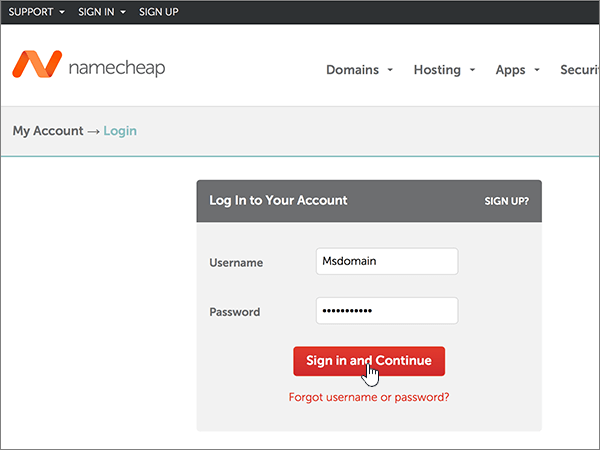
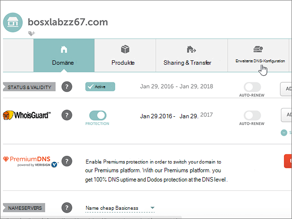

# Ändern von Namenservern zum Einrichten von Microsoft mit Namecheap

 **[Überprüfen Sie die häufig gestellten Fragen (FAQ) zu Domänen](../setup/domains-faq.md)**, wenn Sie nicht finden, wonach Sie suchen.
  
Befolgen Sie diese Anweisungen, wenn Microsoft Ihre DNS-Einträge für Sie verwalten soll. (Wenn es Ihnen lieber ist, können Sie [alle Ihre Microsoft-DNS-Einträge bei Namecheap verwalten](create-dns-records-at-namecheap.md).)
  
    
## Hinzufügen eines TXT-Eintrags zur Überprüfung

1. Um zu beginnen, navigieren Sie über [diesen Link](https://www.namecheap.com/myaccount/login.aspx?ReturnUrl=%2f) zu Ihrer Domänenseite bei Namecheap. Sie werden aufgefordert, sich zuerst anzumelden ("Sign in") und dann den Vorgang fortzusetzen ("Continue").
    
    
  
2. Klicken Sie auf der **Start** Seite unter **Konto**auf **Domänenliste** in der Dropdownliste. 
    
    
  
3. Suchen Sie auf der Seite **Domänenliste** den Namen der Domäne, die Sie bearbeiten möchten, und wählen Sie dann **Verwalten**aus.
    
    
  
4. Wählen Sie **Advanced DNS**aus.
    
    
  
5. Wählen Sie im Abschnitt **Host Einträge** die Option **neuen Datensatz hinzufügen**aus.
    
    
  
6. Wählen Sie in der Dropdownliste **Type** den Eintrag **TXT Record** aus.
    
    > [!NOTE]
    > Die Dropdownliste **Typ** wird automatisch angezeigt, wenn Sie **neuen Datensatz hinzufügen**auswählen.
  
    
  
7. Geben Sie in den Feldern für den neuen Eintrag die Werte aus der folgenden Tabelle ein. Sie können die Werte auch kopieren und einfügen.
    
    (Wählen Sie in der Dropdownliste den Wert **TTL** aus.) 
    
|**Type**|**Host**|**Wert**|**TTL**|
|:-----|:-----|:-----|:-----|
|TXT    |@    |MS=ms *XXXXXXXX*    **Hinweis:** Dies ist ein nur Beispiel. Verwenden Sie hier Ihre spezifischen **Ziel-oder Punkt-zu-Adresse** -Werte aus der Tabelle.           [Wie finde ich diese Angabe?](../get-help-with-domains/information-for-dns-records.md)          |30 min    |
   
   
  
8. Wählen Sie das Kontrollkästchen **Änderungen speichern** (Häkchen) aus. 
    
    
  
9. Warten Sie einige Minuten, bevor Sie fortfahren, damit der soeben erstellte Eintrag im Internet aktualisiert werden kann.
    
Nachdem Sie den Eintrag auf der Website Ihrer Domänenregistrierungsstelle hinzugefügt haben, kehren Sie zu Microsoft zurück und fordern eine Suche nach dem Eintrag an.
  
Wenn Microsoft den richtigen TXT-Eintrag findet, ist die Domäne überprüft.
  
1. Wechseln Sie im Admin Center zur Seite **Einstellungen** \> <a href="https://go.microsoft.com/fwlink/p/?linkid=834818" target="_blank">Domänen</a>.

    
2. Wählen Sie auf der Seite **Domänen** die zu überprüfende Domäne aus. 
    
    
  
3. Wählen Sie auf der Seite **Setup** die Option **Setup starten** aus.
    
    
  
4. Wählen Sie auf der Seite **Domäne überprüfen** die Option **Überprüfen** aus.
    
    
  
> [!NOTE]
>  Normalerweise dauert es ungefähr 15 Minuten, bis DNS-Änderungen wirksam werden. Es kann jedoch gelegentlich länger dauern, bis eine von Ihnen vorgenommene Änderung im Internet im DNS-System aktualisiert wurde. Wenn nach dem Hinzufügen von DNS-Einträgen Probleme mit dem E-Mail-Fluss oder andere Probleme auftreten, lesen Sie [Behandeln von Problemen nach Änderung des Domänennamens oder von DNS-Einträgen](../get-help-with-domains/find-and-fix-issues.md). 
  
## Ändern der Namenservereinträge (NS) Ihrer Domäne

Um die Einrichtung Ihrer Domäne bei Microsoft abzuschließen, ändern Sie die NS-Einträge Ihrer Domäne bei Ihrer Domänenregistrierungsstelle so, dass Sie auf den primären und sekundären Namenserver von Microsoft verweist. Dadurch wird Microsoft so eingerichtet, dass die DNS-Einträge der Domäne für Sie aktualisiert werden. Wir fügen alle Einträge hinzu, sodass E-Mails, Skype for Business Online und Ihre öffentliche Website in Verbindung mit Ihrer Domäne funktionieren und alles für Sie eingerichtet ist.
  
> [!CAUTION]
> Wenn Sie die NS-Einträge Ihrer Domäne so ändern, dass Sie auf die Microsoft Name-Server verweist, sind alle Dienste betroffen, die derzeit Ihrer Domäne zugeordnet sind. Beispielsweise werden alle e-Mails, die an Ihre Domäne gesendet werden (wie Rob@ *your_domain*  . com), nach dem Ausführen dieser Änderung an Microsoft weitergeleitet. 
  
> [!IMPORTANT]
>  Wenn Sie die Schritte in diesem Abschnitt abgeschlossen haben, werden  *nur*  die nachstehend aufgeführten vier Namenserver aufgelistet: >  ns1.bdm.microsoftonline.com >  ns2.bdm.microsoftonline.com >  ns3.bdm.microsoftonline.com >  ns4.bdm.microsoftonline.com >  Im folgenden Verfahren wird gezeigt, wie Sie andere, unerwünschte Namenserver aus der Liste löschen können, und Sie erfahren, wie Sie die  *richtigen*  Namenserver hinzufügen, wenn sie sich nicht bereits in der Liste befinden. 
  
1. Um zu beginnen, navigieren Sie über [diesen Link](https://www.namecheap.com/myaccount/login.aspx?ReturnUrl=%2f) zu Ihrer Domänenseite bei Namecheap. Sie werden aufgefordert, sich zuerst anzumelden ("Sign in") und dann den Vorgang fortzusetzen ("Continue").
    
    
  
2. Klicken Sie auf der **Start** Seite unter **Konto**auf **Domänenliste** in der Dropdownliste. 
    
    
  
3. Suchen Sie auf der Seite **Domänenliste** den Namen der Domäne, die Sie bearbeiten möchten, und wählen Sie dann **Verwalten**aus.
    
    
  
4. Wählen Sie **Domäne**aus.
    
    
  
5. Suchen Sie den Abschnitt **NAMESERVERS**, und wählen Sie in der Dropdownliste **Namecheap Default** den Eintrag **Custom** aus. 
    
    
  
6. Je nachdem, ob auf der jetzt angezeigten Seite bereits Namenserver aufgelistet sind oder nicht, fahren Sie mit einem der beiden folgenden Verfahren fort.
    
### Wenn noch KEINE Namenserver aufgelistet sind

1. Wählen Sie zweimal Namen **Server hinzufügen** aus, um zwei neue Zeilen hinzuzufügen.
    
    
  
2. Geben Sie in den Feldern **Nameserver** die Werte aus der folgenden Tabelle ein. Sie können die Werte auch kopieren und einfügen.
    
|||
|:-----|:-----|
|**Nameserver 1**   |ns1.bdm.microsoftonline.com    |
|**Nameserver 2**   |ns2.bdm.microsoftonline.com    |
|**Nameserver 3**   |ns3.bdm.microsoftonline.com    |
|**Nameserver 4**   |ns4.bdm.microsoftonline.com    |
   
   
  
3. Aktivieren Sie das Kontrollkästchensteuerelement **Speichern** (Häkchen). 
    
    
  
> [!NOTE]
> Es kann mehrere Stunden dauern, bis Ihre Namenservereinträge im Internet im DNS-System aktualisiert wurden. Dann sind Ihre Microsoft-e-Mails und andere Dienste für die Verwendung Ihrer Domäne festgelegt. 
  
### Wenn Namenserver BEREITS aufgelistet sind

> [!CAUTION]
> Folgen Sie diesen Schritten  *nur*  , wenn es andere Namenserver als die vier  *korrekten*  Namenserver gibt. (Das heißt, löschen Sie  *nur*  andere als die vier korrekten Namenserver, also  *nicht* **ns1.bdm.microsoftonline.com**, **ns2.bdm.microsoftonline.com**, **ns3.bdm.microsoftonline.com** oder **ns4.bdm.microsoftonline.com**. 
  
1. If there are any other nameservers listed in the **Nameserver** boxes, delete each one by selecting it and then pressing the **Delete** key on your keyboard. 
    
    
  
2. Wählen Sie zweimal Namen **Server hinzufügen** aus, um zwei neue Zeilen hinzuzufügen. 
    
    
  
3. Geben Sie in den Feldern **Nameserver** die Werte aus der folgenden Tabelle ein. Sie können die Werte auch kopieren und einfügen.
 
    
|||
|:-----|:-----|
|**Name Server 1**   |ns1.bdm.microsoftonline.com    |
|**Name Server 2**   |ns2.bdm.microsoftonline.com    |
|**Nameserver 3**   |ns3.bdm.microsoftonline.com    |
|**Nameserver 4**   |ns4.bdm.microsoftonline.com    |
   
   
  
4. Aktivieren Sie das Kontrollkästchensteuerelement **Speichern** (Häkchen). 
    
    
  
> [!NOTE]
> Es kann mehrere Stunden dauern, bis Ihre Namenservereinträge im Internet im DNS-System aktualisiert wurden. Dann sind Ihre Microsoft-e-Mails und andere Dienste für die Verwendung Ihrer Domäne festgelegt.
