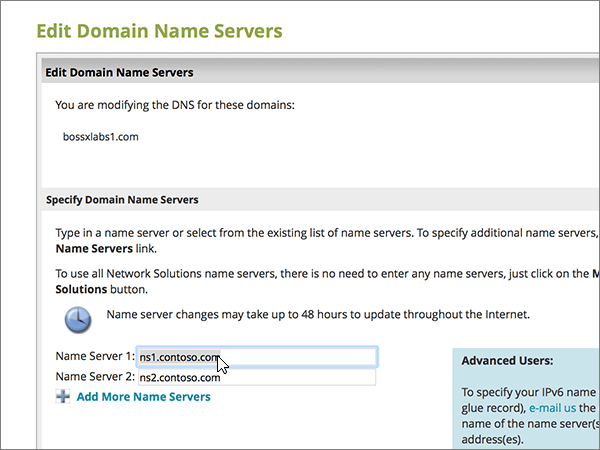

# Ändern von Namenservern zum Einrichten von Office 365 bei Network SolutionsChange nameservers to set up Office 365 with Network Solutions

 **[Überprüfen Sie die häufig gestellten Fragen (FAQ) zu Domänen](../setup/domains-faq.md)**, wenn Sie nicht finden, wonach Sie suchen.**[Check the Domains FAQ](../setup/domains-faq.md)** if you don't find what you're looking for.
  
Führen Sie die folgenden Anweisungen aus, wenn Office 365 Ihre Office 365-DNS-Einträge automatisch verwalten soll. (Wenn es Ihnen lieber ist, können Sie [alle Ihre Office 365-DNS-Einträge bei Network Solutions selbst verwalten](create-dns-records-at-network-solutions.md).)Follow these instructions if you want Office 365 to manage your Office 365 DNS records for you. (If you prefer, you can [manage all your Office 365 DNS records at Network Solutions](create-dns-records-at-network-solutions.md).)
  
    
## Hinzufügen eines TXT-Eintrags bei Network Solutions, um zu überprüfen, ob Sie der Besitzer der Domäne sindAdd a TXT record at Network Solutions to verify that you own the domain

Bevor Sie Ihre Domäne in Office 365 verwenden können, müssen wir uns vergewissern, dass Sie deren Besitzer sind. Ihre Fähigkeit, sich bei Ihrem Konto bei Ihrer Domänenregistrierungsstelle anzumelden und den DNS-Eintrag zu erstellen, ist für Office 365 der Nachweis, dass Sie der Besitzer der Domäne sind.Before you use your domain with Office 365, we have to make sure that you own it. Your ability to log in to your account at your domain registrar and create the DNS record proves to Office 365 that you own the domain.
  
> [!NOTE]
> Dieser Eintrag wird nur verwendet, um zu überprüfen, ob Sie der Besitzer Ihrer Domäne sind. Er hat keine weiteren Auswirkungen. Sie können ihn später ggf. löschen.This record is used only to verify that you own your domain; it doesn't affect anything else. You can delete it later, if you like. 
  
Führen Sie die folgenden Schritte aus, oder [schauen Sie sich das Video an (beginnen Sie bei 0:47)](https://support.office.com/article/Video-Change-nameservers-to-set-up-Office-365-with-Network-Solutions-69b092e3-c026-4d19-a7d0-16cdb2d8b261?ui=en-US&amp;rs=en-US&amp;ad=US).Follow the steps below or [watch the video (start at 0:47)](https://support.office.com/article/Video-Change-nameservers-to-set-up-Office-365-with-Network-Solutions-69b092e3-c026-4d19-a7d0-16cdb2d8b261?ui=en-US&amp;rs=en-US&amp;ad=US).
  
1. Im ersten Schritt navigieren Sie über [diesen Link](https://www.networksolutions.com/manage-it) zu Ihrer Domänenseite bei Network Solutions. Sie werden aufgefordert, sich anzumelden.To get started, go to your domains page at Network Solutions by using [this link](https://www.networksolutions.com/manage-it). You'll be prompted to log in.
    
    > [!IMPORTANT]
    > Bevor Sie die Schaltfläche **Anmeldung** auswählen, wählen Sie zuerst **Verwalten von Domänennamen** in der Dropdownliste **Anmelden in:** aus.Before you select the **Login** button, first choose **Manage My Domain Names** in the **Log In to:** drop-down list.
  
    
  
2. Aktivieren Sie das Kontrollkästchen neben dem Namen der Domäne, die Sie ändern möchten.Select the check box next to the name of the domain that you are modifying.
    
    
  
3. Wählen Sie **DNS bearbeiten**aus.Select **Edit DNS**.
    
    
  
4. Wählen Sie **Erweiterte DNS-Einträge verwalten**aus.Select **Manage Advanced DNS Records**.
    
    (Möglicherweise müssen Sie nach unten scrollen.)(You may have to scroll down.)
    
    
  
5. Scrollen Sie nach unten zum Abschnitt **Text (TXT Records)** , und wählen Sie dann **TXT-Einträge bearbeiten**aus.Scroll down to the **Text (TXT Records)** section, and then select **Edit TXT Records**.
    
    
  
6. Geben Sie in den Feldern für den neuen Eintrag die Werte aus der folgenden Tabelle ein. Sie können die Werte auch kopieren und einfügen.In the boxes for the new record, type or copy and paste the values in the following table.
    
|**Host****Host**|**TTL****TTL**|**Text****Text**|
|:-----|:-----|:-----|
|@    (The system will change this value to **@ (None)** when you save the record.)(The system will change this value to **@ (None)** when you save the record.)    |36003600    |MS=ms *XXXXXXXX*MS=ms *XXXXXXXX*    **Hinweis:** Dies ist ein nur Beispiel.**Note**: This is an example. Verwenden Sie hier Ihren spezifischen Wert von **Ziel oder verweisende Adresse** aus der Tabelle in Office 365.Use your specific **Destination or Points to Address** value here, from the table in Office 365.           [Wie finde ich diese Angabe?How do I find this?](../get-help-with-domains/information-for-dns-records.md)
   
    
   
  
7. Wählen Sie **weiter**aus.Select **Continue**.
    
    
  
8. Wählen Sie **Save Changes**aus.Select **Save Changes**.
    
    
  
9. Warten Sie einige Minuten, bevor Sie fortfahren, damit der soeben erstellte Eintrag im Internet aktualisiert werden kann.Wait a few minutes before you continue, so that the record you just created can update across the Internet.
    
Nachdem Sie den Eintrag auf der Website Ihrer Domänenregistrierungsstelle hinzugefügt haben, kehren Sie zu Office 365 zurück und fordern Office 365 auf, nach dem Eintrag zu suchen.Now that you've added the record at your domain registrar's site, you'll go back to Office 365 and request Office 365 to look for the record.
  
Wenn Office 365 den richtigen TXT-Eintrag findet, wird die Domäne überprüft.When Office 365 finds the correct TXT record, your domain is verified.
  
1. Wechseln Sie im Admin Center zur Seite **Einstellungen** \> <a href="https://go.microsoft.com/fwlink/p/?linkid=834818" target="_blank">Domänen</a>.In the admin center, go to the **Settings** \> <a href="https://go.microsoft.com/fwlink/p/?linkid=834818" target="_blank">Domains</a> page.

    
2. Wählen Sie auf der Seite **Domänen** die zu überprüfende Domäne aus.On the **Domains** page, select the domain that you are verifying. 
    
    
  
3. Wählen Sie auf der Seite **Setup** die Option **Setup starten** aus.On the **Setup** page, select **Start setup**.
    
    
  
4. Wählen Sie auf der Seite **Domäne überprüfen** die Option **Überprüfen** aus.On the **Verify domain** page, select **Verify**.
    
    
  
> [!NOTE]
>  Normalerweise dauert es ungefähr 15 Minuten, bis DNS-Änderungen wirksam werden. Es kann jedoch gelegentlich länger dauern, bis eine von Ihnen vorgenommene Änderung im Internet im DNS-System aktualisiert wurde. Wenn nach dem Hinzufügen von DNS-Einträgen Probleme mit dem E-Mail-Fluss oder andere Probleme auftreten, lesen Sie [Behandeln von Problemen nach Änderung des Domänennamens oder von DNS-Einträgen](../get-help-with-domains/find-and-fix-issues.md).Typically it takes about 15 minutes for DNS changes to take effect. However, it can occasionally take longer for a change you've made to update across the Internet's DNS system. If you're having trouble with mail flow or other issues after adding DNS records, see [Troubleshoot issues after changing your domain name or DNS records](../get-help-with-domains/find-and-fix-issues.md). 
  
## Ändern der Namenservereinträge (NS) Ihrer DomäneChange your domain's nameserver (NS) records

Zum Abschluss der Einrichtung Ihrer Domäne in Office 365 ändern Sie die NS-Einträge bei Ihrer Domänenregistrierungsstelle so, dass sie auf die primären und sekundären Office 365-Namenserver verweisen. Dadurch wird Office 365 zum Aktualisieren der DNS-Einträge der Domäne eingerichtet. Wir fügen alle Einträge hinzu, sodass E-Mails, Skype for Business Online und Ihre öffentliche Website in Verbindung mit Ihrer Domäne funktionieren und alles für Sie eingerichtet ist.To complete setting up your domain with Office 365, you change your domain's NS records at your domain registrar to point to the Office 365 primary and secondary name servers. This sets up Office 365 to update the domain's DNS records for you. We'll add all records so that email, Skype for Business Online, and your public website work with your domain, and you'll be all set.
  
> [!CAUTION]
> Wenn Sie die Namenservereinträge Ihrer Domäne so ändern, dass sie auf die Office 365-Namenserver verweisen, hat dies Auswirkungen auf alle Dienste, die aktuell mit Ihrer Domäne verbunden sind. So gehen beispielsweise alle an Ihre Domäne (z. B. an Bernd@ *Ihre_Domäne*  .com) gesendeten E-Mail-Nachrichten bei Office 365 ein, nachdem Sie diese Änderung vorgenommen haben.When you change your domain's NS records to point to the Office 365 name servers, all the services that are currently associated with your domain are affected. For example, all email sent to your domain (like rob@ *your_domain*  .com) will start coming to Office 365 after you make this change.
  
Sind Sie bereit, Ihre NS-Einträge so zu ändern, dass Office 365 Ihre Domäne einrichten kann? Führen Sie die folgenden Schritte aus, oder [schauen Sie sich das Video an (beginnen Sie bei 2:23)](https://support.office.com/article/Video-Change-nameservers-to-set-up-Office-365-with-Network-Solutions-69b092e3-c026-4d19-a7d0-16cdb2d8b261?ui=en-US&amp;rs=en-US&amp;ad=US).Ready to change your NS records so Office 365 can set up your domain? Follow the steps below or [watch the video (start at 2:23)](https://support.office.com/article/Video-Change-nameservers-to-set-up-Office-365-with-Network-Solutions-69b092e3-c026-4d19-a7d0-16cdb2d8b261?ui=en-US&amp;rs=en-US&amp;ad=US).
  
> [!IMPORTANT]
>  Wenn *Sie die Schritte* in diesem Abschnitt abgeschlossen haben, sollten Sie die folgenden vier Namenserver finden: **ns1.BDM.microsoftonline.com**, **ns2.BDM.microsoftonline.com**, **NS3.BDM.microsoftonline.com**und **NS4.BDM.microsoftonline.com**.When you have completed the steps in this section, the  *only*  nameservers that should be listed are these four: **ns1.bdm.microsoftonline.com**, **ns2.bdm.microsoftonline.com**, **ns3.bdm.microsoftonline.com**, and **ns4.bdm.microsoftonline.com**. Im folgenden Verfahren wird gezeigt, wie Sie andere, unerwünschte Namenserver aus der Liste löschen können, und Sie erfahren, wie Sie die  *richtigen*  Namenserver hinzufügen, wenn sie sich nicht bereits in der Liste befinden.The following procedure will show you how to delete any other, unwanted nameservers from the list, and also how to add the  *correct*  nameservers if they are not already in the list. 
  
1. Im ersten Schritt navigieren Sie über [diesen Link](https://www.networksolutions.com/manage-it) zu Ihrer Domänenseite bei Network Solutions.To get started, go to your domains page at Network Solutions by using [this link](https://www.networksolutions.com/manage-it). Sie werden aufgefordert, sich anzumelden.You'll be prompted to log in.
    
    > [!IMPORTANT]
    > Bevor Sie die Schaltfläche **Anmeldung** auswählen, wählen Sie zuerst **Verwalten von Domänennamen** in der Dropdownliste **Anmelden in:** aus.Before you select the **Login** button, first choose **Manage My Domain Names** in the **Log In to:** drop-down list. 
  
    
  
2. Aktivieren Sie das Kontrollkästchen neben dem Namen der Domäne, die Sie ändern möchten.Select the check box next to the name of the domain that you are modifying.
    
    
  
3. Wählen Sie **DNS bearbeiten**aus.Select **Edit DNS**.
    
    
  
4. Wählen Sie **DNS migrieren**aus.Select **Move DNS**.
    
    
  
5. Abhängig davon, ob auf der jetzt angezeigten Seite bereits Namenserver aufgelistet sind oder nicht, setzen Sie den Vorgang mit einem der beiden folgenden Verfahren fort:Depending on whether or not there are already nameservers listed on the page that is displayed now, continue to one of the two following procedures:
    
  - Wenn noch **KEINE** Namenserver aufgelistet sind, [Wenn noch KEINE Namenserver aufgelistet sind](#if-there-are-no-nameservers-already-listed).If there are **NO** nameservers already listed, [If there are NO nameservers already listed](#if-there-are-no-nameservers-already-listed).
    
  - Wenn **BEREITS** Namenserver aufgelistet sind, [Wenn Namenserver BEREITS aufgelistet sind](#if-there-are-nameservers-already-listed).If there **ARE** nameservers already listed, [If there ARE nameservers already listed](#if-there-are-nameservers-already-listed).
    
### Wenn noch KEINE Namenserver aufgelistet sindIf there are NO nameservers already listed

1. Wählen Sie auf der Seite **Domains** im Abschnitt **Domain Name Servers angeben** die Option **Weitere Namenserver hinzufügen**aus.On the **Domains** page, in the **Specify Domain Name Servers** section, select **Add More Name Servers**.
    
    
  
2. Geben Sie Nameserver-Werte aus der folgenden Tabelle auf der Seite **Domain Names** ein. Sie können die Werte auch kopieren und einfügen.On the **Domain Names** page, type or copy and paste the nameserver values from the following table. 
    
|||
|:-----|:-----|
|**Name Server 1****Name Server 1**   |ns1.bdm.microsoftonline.comns1.bdm.microsoftonline.com    |
|**Name Server 2****Name Server 2**   |ns2.bdm.microsoftonline.comns2.bdm.microsoftonline.com    |
|**Name Server 2****Name Server 2**   |ns3.bdm.microsoftonline.comns3.bdm.microsoftonline.com    |
|**Name Server 2****Name Server 2**   |ns4.bdm.microsoftonline.comns4.bdm.microsoftonline.com    |
   
    

  
3. Wählen Sie **DNS migrieren**aus.Select **Move DNS**.
    
    
  
4. Wählen Sie **Save Changes**aus.Select **Save Changes**.
    
    
  
> [!NOTE]
> Es kann mehrere Stunden dauern, bis Ihre Namenservereinträge im Internet im DNS-System aktualisiert wurden. Dann sind Ihre Office 365-E-Mails und andere Dienste für das Arbeiten mit Ihrer Domäne eingerichtet.Your nameserver record updates may take up to several hours to update across the Internet's DNS system. Then your Office 365 email and other services will be all set to work with your domain. 
  
### Wenn Namenserver BEREITS aufgelistet sindIf there ARE nameservers already listed

> [!CAUTION]
> Folgen Sie diesen Schritten  *nur*  , wenn es andere Namenserver als die vier  *korrekten*  Namenserver gibt. (Das heißt, löschen Sie  *nur*  andere als die vier korrekten Namenserver, also  *nicht* **ns1.bdm.microsoftonline.com**, **ns2.bdm.microsoftonline.com**, **ns3.bdm.microsoftonline.com** oder **ns4.bdm.microsoftonline.com**.Follow these steps  *only*  if you have existing nameservers other than the four  *correct*  nameservers. (That is, delete  *only*  any current nameservers that are  *not*  named **ns1.bdm.microsoftonline.com**, **ns2.bdm.microsoftonline.com**, **ns3.bdm.microsoftonline.com**, or **ns4.bdm.microsoftonline.com**.)
  
1. If there are any other nameservers listed, delete each one by selecting it and then pressing the **Delete** key on your keyboard.If there are any other nameservers listed, delete each one by selecting it and then pressing the **Delete** key on your keyboard.
    
    
  
2. Wählen Sie **Weitere Namenserver hinzufügen**aus.Select **Add More Name Servers**.
    
    
  
3. Geben Sie Nameserver-Werte aus der folgenden Tabelle auf der Seite **Domain Names** ein. Sie können die Werte auch kopieren und einfügen.On the **Domain Names** page, type or copy and paste the nameserver values from the following table.
 
    
|||
|:-----|:-----|
|**Name Server 1****Name Server 1**   |ns1.bdm.microsoftonline.comns1.bdm.microsoftonline.com    |
|**Name Server 2****Name Server 2**   |ns2.bdm.microsoftonline.comns2.bdm.microsoftonline.com    |
|**Name Server 3****Name Server 3**   |ns3.bdm.microsoftonline.comns3.bdm.microsoftonline.com    |
|**Name Server 4****Name Server 4**   |ns4.bdm.microsoftonline.comns4.bdm.microsoftonline.com    |
   
    

  
4. Wählen Sie **DNS migrieren**aus.Select **Move DNS**.
    
    
  
5. Wählen Sie **Save Changes aus.**Select **Save Changes.**
    
    
  
> [!NOTE]
> Es kann mehrere Stunden dauern, bis Ihre Namenservereinträge im Internet im DNS-System aktualisiert wurden. Dann sind Ihre Office 365-E-Mails und andere Dienste für das Arbeiten mit Ihrer Domäne eingerichtet.Your nameserver record updates may take up to several hours to update across the Internet's DNS system. Then your Office 365 email and other services will be all set to work with your domain.
