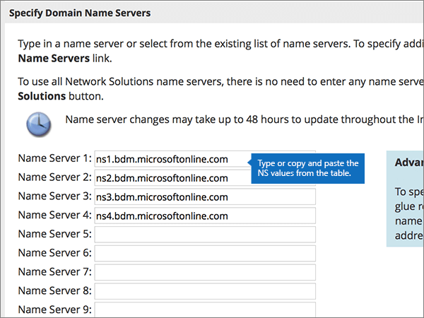

# Ändern von Namenservern zum Einrichten von Microsoft mit Netzwerklösungen

 **[Überprüfen Sie die häufig gestellten Fragen (FAQ) zu Domänen](../setup/domains-faq.md)**, wenn Sie nicht finden, wonach Sie suchen.
  
Befolgen Sie diese Anweisungen, wenn Microsoft Ihre DNS-Einträge für Sie verwalten soll. (Wenn es Ihnen lieber ist, können Sie [alle Ihre Microsoft-DNS-Einträge bei Netzwerklösungen verwalten](create-dns-records-at-network-solutions.md).)
  
    
## Hinzufügen eines TXT-Eintrags bei Network Solutions, um zu überprüfen, ob Sie der Besitzer der Domäne sind

Bevor Sie Ihre Domäne mit Microsoft verwenden können, müssen wir uns vergewissern, dass Sie deren Besitzer sind. Ihre Fähigkeit, sich bei Ihrem Konto bei Ihrer Domänenregistrierungsstelle anzumelden und den DNS-Eintrag zu erstellen, ist für Microsoft der Nachweis, dass Sie der Besitzer der Domäne sind.
  
> [!NOTE]
> Dieser Eintrag wird nur verwendet, um zu überprüfen, ob Sie der Besitzer Ihrer Domäne sind. Er hat keine weiteren Auswirkungen. Sie können ihn später ggf. löschen. 
  
Führen Sie die folgenden Schritte aus, oder [schauen Sie sich das Video an (beginnen Sie bei 0:47)](https://support.microsoft.com/office/69b092e3-c026-4d19-a7d0-16cdb2d8b261).
  
1. Im ersten Schritt navigieren Sie über [diesen Link](https://www.networksolutions.com/manage-it) zu Ihrer Domänenseite bei Network Solutions. Sie werden aufgefordert, sich anzumelden.
    
    > [!IMPORTANT]
    > Bevor Sie die Schaltfläche **Anmeldung** auswählen, wählen Sie zuerst **Verwalten von Domänennamen** in der Dropdownliste **Anmelden in:** aus.
  
    
  
2. Aktivieren Sie das Kontrollkästchen neben dem Namen der Domäne, die Sie ändern möchten.
    
    
  
3. Wählen Sie **DNS bearbeiten**aus.
    
    
  
4. Wählen Sie **Erweiterte DNS-Einträge verwalten**aus.
    
    (Möglicherweise müssen Sie nach unten scrollen.)
    
    
  
5. Scrollen Sie nach unten zum Abschnitt **Text (TXT Records)** , und wählen Sie dann **TXT-Einträge bearbeiten**aus.
    
    
  
6. Geben Sie in den Feldern für den neuen Eintrag die Werte aus der folgenden Tabelle ein. Sie können die Werte auch kopieren und einfügen.
    
|**Host**|**TTL**|**Text**|
|:-----|:-----|:-----|
|@    (The system will change this value to **@ (None)** when you save the record.)    |3600    |MS=ms *XXXXXXXX*    **Hinweis:** Dies ist ein nur Beispiel. Verwenden Sie hier Ihren spezifischen Wert für **Ziel oder verweisende Adresse** aus der Tabelle in Microsoft 365.           [Wie finde ich diese Angabe?](../get-help-with-domains/information-for-dns-records.md)
   
    
   
  
7. Wählen Sie **weiter**aus.
    
    
  
8. Wählen Sie **Save Changes**aus.
    
    
  
9. Warten Sie einige Minuten, bevor Sie fortfahren, damit der soeben erstellte Eintrag im Internet aktualisiert werden kann.
    
Nachdem Sie den Eintrag auf der Website Ihrer Domänenregistrierungsstelle hinzugefügt haben, kehren Sie zu Microsoft 365 zurück und fordern Microsoft 365 auf, nach dem Eintrag zu suchen.
  
Wenn Microsoft den richtigen TXT-Eintrag findet, ist die Domäne überprüft.
  
1. Wechseln Sie im Microsoft Admin Center zur Seite **Einstellungen** \> <a href="https://go.microsoft.com/fwlink/p/?linkid=834818" target="_blank">Domänen</a>.

    
2. Wählen Sie auf der Seite **Domänen** die zu überprüfende Domäne aus. 
    
    
  
3. Wählen Sie auf der Seite **Setup** die Option **Setup starten** aus.
    
    
  
4. Wählen Sie auf der Seite **Domäne überprüfen** die Option **Überprüfen** aus.
    
    
  
> [!NOTE]
>  Normalerweise dauert es ungefähr 15 Minuten, bis DNS-Änderungen wirksam werden. Es kann jedoch gelegentlich länger dauern, bis eine von Ihnen vorgenommene Änderung im Internet im DNS-System aktualisiert wurde. Wenn nach dem Hinzufügen von DNS-Einträgen Probleme mit dem E-Mail-Fluss oder andere Probleme auftreten, lesen Sie [Behandeln von Problemen nach Änderung des Domänennamens oder von DNS-Einträgen](../get-help-with-domains/find-and-fix-issues.md). 
  
## Ändern der Namenservereinträge (NS) Ihrer Domäne

Um die Einrichtung Ihrer Domäne bei Microsoft abzuschließen, ändern Sie die NS-Einträge Ihrer Domäne bei Ihrer Domänenregistrierungsstelle so, dass Sie auf den primären und sekundären Namenserver von Microsoft verweist. Dadurch wird Microsoft so eingerichtet, dass die DNS-Einträge der Domäne für Sie aktualisiert werden. Wir fügen alle Einträge hinzu, sodass E-Mails, Skype for Business Online und Ihre öffentliche Website in Verbindung mit Ihrer Domäne funktionieren und alles für Sie eingerichtet ist.
  
> [!CAUTION]
> Wenn Sie die NS-Einträge Ihrer Domäne so ändern, dass Sie auf die Microsoft Name-Server verweist, sind alle Dienste betroffen, die derzeit Ihrer Domäne zugeordnet sind. Beispielsweise werden alle e-Mails, die an Ihre Domäne gesendet werden (wie Rob@ *your_domain* . com), nach dem Ausführen dieser Änderung an Microsoft weitergeleitet.
  
Möchten Sie Ihre NS-Einträge so ändern, dass Microsoft Ihre Domäne einrichten kann? Führen Sie die folgenden Schritte aus, oder [schauen Sie sich das Video an (beginnen Sie bei 2:23)](https://support.microsoft.com/office/69b092e3-c026-4d19-a7d0-16cdb2d8b261).
  
> [!IMPORTANT]
>  Wenn *Sie die Schritte* in diesem Abschnitt abgeschlossen haben, sollten Sie die folgenden vier Namenserver finden: **ns1.BDM.microsoftonline.com**, **ns2.BDM.microsoftonline.com**, **NS3.BDM.microsoftonline.com**und **NS4.BDM.microsoftonline.com**. Im folgenden Verfahren wird gezeigt, wie Sie andere, unerwünschte Namenserver aus der Liste löschen können, und Sie erfahren, wie Sie die  *richtigen*  Namenserver hinzufügen, wenn sie sich nicht bereits in der Liste befinden. 
  
1. Im ersten Schritt navigieren Sie über [diesen Link](https://www.networksolutions.com/manage-it) zu Ihrer Domänenseite bei Network Solutions. Sie werden aufgefordert, sich anzumelden.
    
    > [!IMPORTANT]
    > Bevor Sie die Schaltfläche **Anmeldung** auswählen, wählen Sie zuerst **Verwalten von Domänennamen** in der Dropdownliste **Anmelden in:** aus. 
  
    
  
2. Aktivieren Sie das Kontrollkästchen neben dem Namen der Domäne, die Sie ändern möchten.
    
    
  
3. Wählen Sie **DNS bearbeiten**aus.
    
    
  
4. Wählen Sie **DNS migrieren**aus.
    
    
  
5. Abhängig davon, ob auf der jetzt angezeigten Seite bereits Namenserver aufgelistet sind oder nicht, setzen Sie den Vorgang mit einem der beiden folgenden Verfahren fort:
    
  - Wenn noch **KEINE** Namenserver aufgelistet sind, [Wenn noch KEINE Namenserver aufgelistet sind](#if-there-are-no-nameservers-already-listed).
    
  - Wenn **BEREITS** Namenserver aufgelistet sind, [Wenn Namenserver BEREITS aufgelistet sind](#if-there-are-nameservers-already-listed).
    
### Wenn noch KEINE Namenserver aufgelistet sind

1. Wählen Sie auf der Seite **Domains** im Abschnitt **Domain Name Servers angeben** die Option **Weitere Namenserver hinzufügen**aus.
    
    
  
2. Geben Sie Nameserver-Werte aus der folgenden Tabelle auf der Seite **Domain Names** ein. Sie können die Werte auch kopieren und einfügen. 
    
|||
|:-----|:-----|
|**Name Server 1**   |ns1.bdm.microsoftonline.com    |
|**Name Server 2**   |ns2.bdm.microsoftonline.com    |
|**Name Server 2**   |ns3.bdm.microsoftonline.com    |
|**Name Server 2**   |ns4.bdm.microsoftonline.com    |
   
    

  
3. Wählen Sie **DNS migrieren**aus.
    
    
  
4. Wählen Sie **Save Changes**aus.
    
    
  
> [!NOTE]
> Es kann mehrere Stunden dauern, bis Ihre Namenservereinträge im Internet im DNS-System aktualisiert wurden. Dann sind Ihre Microsoft-e-Mails und andere Dienste für die Verwendung Ihrer Domäne festgelegt. 
  
### Wenn Namenserver BEREITS aufgelistet sind

> [!CAUTION]
> Folgen Sie diesen Schritten  *nur*  , wenn es andere Namenserver als die vier  *korrekten*  Namenserver gibt. (Das heißt, löschen Sie  *nur*  andere als die vier korrekten Namenserver, also  *nicht* **ns1.bdm.microsoftonline.com**, **ns2.bdm.microsoftonline.com**, **ns3.bdm.microsoftonline.com** oder **ns4.bdm.microsoftonline.com**.
  
1. If there are any other nameservers listed, delete each one by selecting it and then pressing the **Delete** key on your keyboard.
    
    
  
2. Wählen Sie **Weitere Namenserver hinzufügen**aus.
    
    
  
3. Geben Sie Nameserver-Werte aus der folgenden Tabelle auf der Seite **Domain Names** ein. Sie können die Werte auch kopieren und einfügen. 
    
|||
|:-----|:-----|
|**Name Server 1**   |ns1.bdm.microsoftonline.com    |
|**Name Server 2**   |ns2.bdm.microsoftonline.com    |
|**Name Server 3**   |ns3.bdm.microsoftonline.com    |
|**Name Server 4**   |ns4.bdm.microsoftonline.com    |
   
    

  
4. Wählen Sie **DNS migrieren**aus.
    
    
  
5. Wählen Sie **Save Changes aus.**
    
    
  
> [!NOTE]
> Es kann mehrere Stunden dauern, bis Ihre Namenservereinträge im Internet im DNS-System aktualisiert wurden. Dann sind Ihre Microsoft-e-Mails und andere Dienste für die Verwendung Ihrer Domäne festgelegt.
