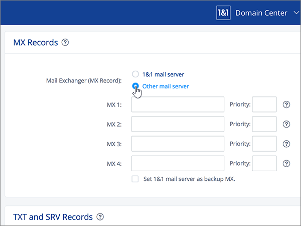
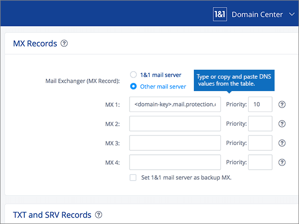
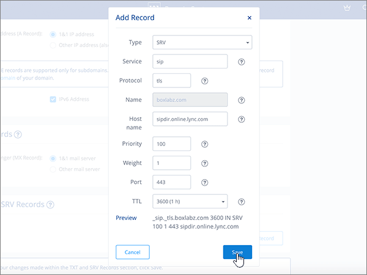
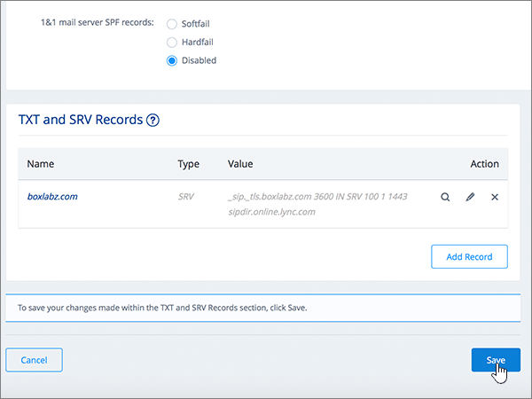

# Erstellen von DNS-Einträgen bei 1&1 Ionos für Office 365Create DNS records at 1&1 IONOS for Office 365

 **[Überprüfen Sie die häufig gestellten Fragen (FAQ) zu Domänen](../setup/domains-faq.md)**, wenn Sie nicht finden, wonach Sie suchen.**[Check the Domains FAQ](../setup/domains-faq.md)** if you don't find what you're looking for. 
  
> [!CAUTION]
> Beachten Sie, dass mit 1&1 Ionos keine Domäne sowohl über einen MX-Eintrag als auch über einen CNAME-Eintrag auf oberster Ebene verfügen kann.Note that 1&1 IONOS doesn't allow a domain to have both an MX record and a top-level Autodiscover CNAME record. Dadurch wird die Art und Weise eingeschränkt, in der Sie Exchange Online für Office 365 konfigurieren können.This limits the ways in which you can configure Exchange Online for Office 365. Es gibt eine Problemumgehung, aber wir empfehlen, Sie **nur** zu verwenden, wenn Sie bereits über Erfahrung mit dem Erstellen von Unterdomänen bei 1&1 Ionos verfügen.There is a workaround, but we recommend employing it **only** if you already have experience with creating subdomains at 1&1 IONOS. > Wenn Sie sich trotz dieser [Diensteinschränkung](https://support.office.com/article/7ae9a655-041d-4724-aa92-60392ee390c2.aspx) für die Verwaltung Ihrer eigenen Office 365-DNS-Einträge mit 1&1 Ionos entscheiden, befolgen Sie die Schritte in diesem Artikel, um Ihre Domäne zu überprüfen und DNS-Einträge für e-Mail, Skype for Business Online usw. einzurichten.> If despite this [service limitation](https://support.office.com/article/7ae9a655-041d-4724-aa92-60392ee390c2.aspx) you choose to manage your own Office 365 DNS records at 1&1 IONOS, follow the steps in this article to verify your domain and to set up DNS records for email, Skype for Business Online, and so on. 
  
Nachdem Sie diese Einträge bei 1&1 Ionos hinzugefügt haben, ist Ihre Domäne für die Verwendung mit Office 365 Diensten eingerichtet.After you add these records at 1&1 IONOS, your domain will be set up to work with Office 365 services.
  
Informationen zu Webhosting und DNS für Websites mit Office 365 finden Sie unter [Verwenden einer öffentlichen Website mit Office 365](https://support.office.com/article/choose-a-public-website-3325d50e-d131-403c-a278-7f3296fe33a9).To learn about webhosting and DNS for websites with Office 365, see [Use a public website with Office 365](https://support.office.com/article/choose-a-public-website-3325d50e-d131-403c-a278-7f3296fe33a9).
  
> [!NOTE]
> Normalerweise dauert es ungefähr 15 Minuten, bis DNS-Änderungen wirksam werden. Es kann jedoch gelegentlich länger dauern, bis eine von Ihnen vorgenommene Änderung im Internet im DNS-System aktualisiert wurde. Wenn nach dem Hinzufügen von DNS-Einträgen Probleme mit dem E-Mail-Fluss oder andere Probleme auftreten, lesen Sie [Suchen und Beheben von Problemen, nachdem Ihre Domäne oder DNS-Einträge in Office 365 hinzugefügt wurden](../get-help-with-domains/find-and-fix-issues.md).Typically it takes about 15 minutes for DNS changes to take effect. However, it can occasionally take longer for a change you've made to update across the Internet's DNS system. If you're having trouble with mail flow or other issues after adding DNS records, see [Find and fix issues after adding your domain or DNS records in Office 365](../get-help-with-domains/find-and-fix-issues.md). 
  
## Hinzufügen eines TXT-Eintrags zur ÜberprüfungAdd a TXT record for verification

Bevor Sie Ihre Domäne in Office 365 verwenden können, müssen wir uns vergewissern, dass Sie deren Besitzer sind. Ihre Fähigkeit, sich bei Ihrem Konto bei Ihrer Domänenregistrierungsstelle anzumelden und den DNS-Eintrag zu erstellen, ist für Office 365 der Nachweis, dass Sie der Besitzer der Domäne sind.Before you use your domain with Office 365, we have to make sure that you own it. Your ability to log in to your account at your domain registrar and create the DNS record proves to Office 365 that you own the domain.
  
> [!NOTE]
> Dieser Eintrag wird nur verwendet, um zu überprüfen, ob Sie der Besitzer Ihrer Domäne sind. Er hat keine weiteren Auswirkungen. Sie können ihn später ggf. löschen.This record is used only to verify that you own your domain; it doesn't affect anything else. You can delete it later, if you like. 
  
Führen Sie die folgenden Schritte aus, oder [schauen Sie sich das Video an (beginnen Sie bei 0:42)](https://support.office.com/article/Video-Create-DNS-records-at-1-1-Internet-for-Office-365-543fb112-ecf5-47ae-b096-07f3f942a089?ui=en-US&amp;rs=en-US&amp;ad=US).Follow the steps below or [watch the video (start at 0:42)](https://support.office.com/article/Video-Create-DNS-records-at-1-1-Internet-for-Office-365-543fb112-ecf5-47ae-b096-07f3f942a089?ui=en-US&amp;rs=en-US&amp;ad=US).
  
1. Um zu beginnen, navigieren Sie über [diesen Link](https://my.1and1.com/)zu ihrer Domänen Seite bei 1&1 Ionos.To get started, go to your domains page at 1&1 IONOS by using [this link](https://my.1and1.com/). You'll be prompted to log in.You'll be prompted to log in.
    
2. Wählen Sie **Manage Domains**aus.Select **Manage domains**.
    
3. Suchen Sie auf der Seite **Domänen Center** die Domäne, die Sie aktualisieren möchten, und wählen Sie dann das Steuerelement **Panel** ( **v**) für diese Domäne aus.On the **Domain Center** page, find the domain that you want to update, and then select the **Panel** ( **v**) control for that domain.
    
4. Wählen Sie im Bereich **Domäneneinstellungen** die Option **DNS-Einstellungen bearbeiten**aus.In the **Domain Settings** area, select **Edit DNS Settings**.
    
5. Wählen Sie im Abschnitt **txt-und SRV-Einträge** die Option **Eintrag hinzufügen**aus.In the **TXT and SRV Records** section, select **Add Record**.
    
6. In the **Add Record** area, in the boxes for the new record, type or copy and paste the values from the following table.In the **Add Record** area, in the boxes for the new record, type or copy and paste the values from the following table. 
    
    (Choose the **Type** value from the drop-down list.)(Choose the **Type** value from the drop-down list.) 
    
    ||||
    |:-----|:-----|:-----|
    |**Type****Type**   |**Prefix****Prefix**   |**Name Value****Name Value**   |
    |TXTTXT    |(Lassen Sie dieses Feld leer)(Leave this field blank)    |MS=ms *XXXXXXXX*MS=ms *XXXXXXXX*    Hinweis: Dies ist ein Beispiel.NOTE: This is an example. Verwenden Sie hier Ihren spezifischen Wert von **Ziel oder verweisende Adresse** aus der Tabelle in Office 365.Use your specific **Destination or Points to Address** value here, from the table in Office 365. [Wie finde ich diese Angabe?How do I find this?](../get-help-with-domains/information-for-dns-records.md)          |
   
7. Klicken Sie auf **Speichern**.Select **Save**.
    
8. Wählen Sie erneut **Speichern** aus.Select **Save** again. 
    
9. Wählen Sie im Dialogfeld **DNS-Einstellungen bearbeiten** die Option **Ja**aus.In the **Edit DNS Settings** dialog box, select **Yes**.
    
10. Warten Sie einige Minuten, bevor Sie fortfahren, damit der soeben erstellte Eintrag im Internet aktualisiert werden kann.Wait a few minutes before you continue, so that the record you just created can update across the Internet.
    
Nachdem Sie den Eintrag auf der Website Ihrer Domänenregistrierungsstelle hinzugefügt haben, kehren Sie zu Office 365 zurück und fordern Office 365 auf, nach dem Eintrag zu suchen.Now that you've added the record at your domain registrar's site, you'll go back to Office 365 and request Office 365 to look for the record.
  
Wenn Office 365 den richtigen TXT-Eintrag findet, wird die Domäne überprüft.When Office 365 finds the correct TXT record, your domain is verified.
  
1. Wechseln Sie im Admin Center zur Seite **Einstellungen** \> <a href="https://go.microsoft.com/fwlink/p/?linkid=834818" target="_blank">Domänen</a>.In the admin center, go to the **Settings** \> <a href="https://go.microsoft.com/fwlink/p/?linkid=834818" target="_blank">Domains</a> page.

    
2. Wählen Sie auf der Seite **Domänen** die zu überprüfende Domäne aus.On the **Domains** page, select the domain that you are verifying. 
    
3. Wählen Sie auf der Seite **Setup** die Option **Setup starten** aus.On the **Setup** page, select **Start setup**.
    
4. Wählen Sie auf der Seite **Domäne überprüfen** die Option **Überprüfen** aus.On the **Verify domain** page, select **Verify**.
    
> [!NOTE]
> Normalerweise dauert es ungefähr 15 Minuten, bis DNS-Änderungen wirksam werden. Es kann jedoch gelegentlich länger dauern, bis eine von Ihnen vorgenommene Änderung im Internet im DNS-System aktualisiert wurde. Wenn nach dem Hinzufügen von DNS-Einträgen Probleme mit dem E-Mail-Fluss oder andere Probleme auftreten, lesen Sie [Suchen und Beheben von Problemen, nachdem Ihre Domäne oder DNS-Einträge in Office 365 hinzugefügt wurden](../get-help-with-domains/find-and-fix-issues.md).Typically it takes about 15 minutes for DNS changes to take effect. However, it can occasionally take longer for a change you've made to update across the Internet's DNS system. If you're having trouble with mail flow or other issues after adding DNS records, see [Find and fix issues after adding your domain or DNS records in Office 365](../get-help-with-domains/find-and-fix-issues.md). 
  
## Hinzufügen eines MX-Eintrags, damit E-Mails für Ihre Domäne zu Office 365 geleitet werdenAdd an MX record so email for your domain will come to Office 365

Führen Sie die folgenden Schritte aus, oder [schauen Sie sich das Video an (beginnen Sie bei 3:22)](https://support.office.com/article/Video-Create-DNS-records-at-1-1-Internet-for-Office-365-543fb112-ecf5-47ae-b096-07f3f942a089?ui=en-US&amp;rs=en-US&amp;ad=US).Follow the steps below or [watch the video (start at 3:22)](https://support.office.com/article/Video-Create-DNS-records-at-1-1-Internet-for-Office-365-543fb112-ecf5-47ae-b096-07f3f942a089?ui=en-US&amp;rs=en-US&amp;ad=US).
  
> [!NOTE]
> Wenn Sie sich bei 1und1.de registriert haben, melden Sie sich [hier an](https://go.microsoft.com/fwlink/?linkid=859152).If you've registered with 1und1.de, [sign in here](https://go.microsoft.com/fwlink/?linkid=859152). 
  
1. Um zu beginnen, navigieren Sie über [diesen Link](https://my.1and1.com/)zu ihrer Domänen Seite bei 1&1 Ionos.To get started, go to your domains page at 1&1 IONOS by using [this link](https://my.1and1.com/). You'll be prompted to log in.You'll be prompted to log in.
    
2. Wählen Sie **Manage Domains**aus.Select **Manage domains**.
    
3. Suchen Sie auf der Seite **Domänen Center** die Domäne, die Sie aktualisieren möchten, und wählen Sie dann das Steuerelement **Panel** ( **v**) für diese Domäne aus.On the **Domain Center** page, find the domain that you want to update, and then select the **Panel** ( **v**) control for that domain.
    
4. Wählen Sie im Bereich **Domäneneinstellungen** die Option **DNS-Einstellungen bearbeiten**aus.In the **Domain Settings** area, select **Edit DNS Settings**.
    
5. In the **MX Records** section, in the \*\* Mail Exchanger (MX Record) \*\* area, select **Other mail server**.In the **MX Records** section, in the \*\* Mail Exchanger (MX Record) \*\* area, select **Other mail server**. (Möglicherweise müssen Sie nach unten scrollen.)(You may have to scroll down.)   
  
6. If there are any MX records already listed, delete each of them by selecting the record and then pressing the **Delete** key on your keyboard.If there are any MX records already listed, delete each of them by selecting the record and then pressing the **Delete** key on your keyboard. (Wenn noch keine MX-Einträge aufgeführt sind, fahren Sie mit dem nächsten Schritt fort.)(If there are no MX records already listed, continue to the next step.)  
  
7. Geben Sie in den Feldern für den Eintrag **MX 1** die Werte aus der folgenden Tabelle ein. Sie können die Werte auch kopieren und einfügen.In the boxes for the **MX 1** record, type or copy and paste the values from the following table. 
    
    |**MX 1****MX 1**|**Priorität****Priority**|
    |:-----|:-----|
    | *\<Domänenschlüssel\>*  .mail.protection.outlook.com*\<domain-key\>*  .mail.protection.outlook.com     Hinweis: Rufen Sie \<ihren Domänenschlüssel\> aus Ihrem Office 365-Konto ab.NOTE: Get your \<domain-key\> from your Office 365 account. [Wie finde ich diese Angabe?How do I find this?](../get-help-with-domains/information-for-dns-records.md)          |10 10    Weitere Informationen zur Priorität finden Sie unter [Was ist MX-Priorität?](https://support.office.com/article/2784cc4d-95be-443d-b5f7-bb5dd867ba83.aspx)For more information about priority, see [What is MX priority?](https://support.office.com/article/2784cc4d-95be-443d-b5f7-bb5dd867ba83.aspx)   | 
    
     
  
8. Klicken Sie auf **Speichern**.Select **Save**. (Möglicherweise müssen Sie nach unten scrollen.)(You may have to scroll down.) 
  
9. Wählen Sie im Dialogfeld **DNS-Einstellungen bearbeiten** die Option **Ja**aus.In the **Edit DNS Settings** dialog box, select **Yes**. 
  
## Hinzufügen der für Office 365 erforderlichen sechs CNAME-EinträgeAdd the six CNAME records that are required for Office 365

1&1 Ionos erfordert eine Problemumgehung, sodass Sie einen MX-Eintrag zusammen mit den CNAME-Einträgen verwenden können, die für Office 365 e-Mail-Dienste erforderlich sind.1&1 IONOS requires a workaround so that you can use an MX record together with the CNAME records that are required for Office 365 email services. Diese Problemumgehung erfordert, dass Sie eine Gruppe von Unterdomänen auf 1&1 Ionos erstellen und Sie CNAME-Einträgen zuweisen.This workaround requires you to create a set of subdomains at 1&1 IONOS, and to assign them to CNAME records.
  
> [!IMPORTANT]
> Bevor Sie beginnen, sollten Sie sich vergewissern, dass Sie mindestens zwei verfügbare Unterdomänen haben.Make sure that you have at least two available subdomains before starting this procedure. Diese Lösung wird nur empfohlen, wenn Sie bereits über Erfahrung mit dem Erstellen von Unterdomänen bei 1&1 Ionos verfügen.We recommend this solution only if you already have experience with creating subdomains at 1&1 IONOS. 
  
### Einfache CNAME-EinträgeBasic CNAME records

Führen Sie die folgenden Schritte aus, oder [schauen Sie sich das Video an (beginnen Sie bei 3:57)](https://support.office.com/article/Video-Create-DNS-records-at-1-1-Internet-for-Office-365-543fb112-ecf5-47ae-b096-07f3f942a089?ui=en-US&amp;rs=en-US&amp;ad=US).Follow the steps below or [watch the video (start at 3:57)](https://support.office.com/article/Video-Create-DNS-records-at-1-1-Internet-for-Office-365-543fb112-ecf5-47ae-b096-07f3f942a089?ui=en-US&amp;rs=en-US&amp;ad=US).
  
> [!NOTE]
> Wenn Sie sich bei 1und1.de registriert haben, melden Sie sich [hier an](https://go.microsoft.com/fwlink/?linkid=859152).If you've registered with 1und1.de, [sign in here](https://go.microsoft.com/fwlink/?linkid=859152). 
  
1. Um zu beginnen, navigieren Sie über [diesen Link](https://my.1and1.com/)zu ihrer Domänen Seite bei 1&1 Ionos.To get started, go to your domains page at 1&1 IONOS by using [this link](https://my.1and1.com/). You'll be prompted to log in.You'll be prompted to log in.
    
2. Wählen Sie **Manage Domains**aus.Select **Manage domains**.
    
3. Suchen Sie auf der Seite **Domänen Center** die Domäne, die Sie aktualisieren möchten, und wählen Sie dann unter **Domänen verwalten**aus.On the **Domain Center** page, find the domain that you want to update, and then select **Manage Subdomains**.   Im nächsten Schritt erstellen Sie zwei Unterdomänen und legen einen **Alias** für jede hiervor fest.Now you'll create two subdomains and set an **Alias** value for each. (Dies ist erforderlich, da 1&1 Ionos nur einen CNAME-Eintrag auf oberster Ebene unterstützt, für Office 365 jedoch mehrere CNAME-Einträge erforderlich sind.)(This is required because 1&1 IONOS supports only one top-level CNAME record, but Office 365 requires several CNAME records.) Zuerst erstellen Sie die Autoermittlungs-Unterdomäne.First, you'll create the Autodiscover subdomain.
    
4. Wählen Sie im Abschnitt unter **Domänenübersicht** die Option unter **Domäne erstellen**aus.In the **Subdomain Overview** section, select **Create Subdomain**.
    
    
  
5. Geben Sie im Feld **Create Subdomain** der neuen Unterdomäne nur den Wert unter **Create Subdomain** aus der folgenden Tabelle ein, oder kopieren Sie ihn, damit Sie ihn einfügen können. (Der Wert für **Alias** wird in einem späteren Schritt hinzugefügt.)In the **Create Subdomain** box for the new subdomain, type or copy and paste only the **Create Subdomain** value from the following table. (You'll add the **Alias** value in a later step.)

    |**Create Subdomain****Create Subdomain**|**Alias****Alias**|
    |:-----|:-----|
    |autodiscoverautodiscover    |autodiscover.outlook.comautodiscover.outlook.com   | 

    
  
6. Wählen Sie unter **Domäne erstellen**aus.Select **Create Subdomain**. 
  
7. Suchen Sie im Abschnitt **Subdomain Overview** die Unterdomäne **AutoErmittlung** , die Sie soeben erstellt haben, und wählen Sie dann das Panel-Steuerelement **(v)** für diese Unterdomäne aus.In the **Subdomain Overview** section, locate the **autodiscover** subdomain that you just created, and then select the **Panel (v)** control for that subdomain.  
  
8. Wählen Sie im Bereich unter **Domäneneinstellungen** die Option **DNS-Einstellungen bearbeiten**aus.In the **Subdomain Settings** area, select **Edit DNS Settings**.  
  
9. Wählen Sie im Abschnitt **a/AAAA Records (IP Addresses)** im Bereich **IP-Adresse (a Record)** die Option **CNAME**aus.In the **A/AAAA Records (IP Addresses)** section, in the **IP address (A Record)** area, select **CNAME**. 
  
10. Geben Sie im Feld **Alias:** nur den Wert für **Alias** aus der folgenden Tabelle ein. Sie können den Wert auch kopieren und einfügen.In the **Alias:** box, type or copy and paste only the **Alias** value from the following table.  
    
    |**Create Subdomain****Create Subdomain**|**Alias****Alias**|
    |:-----|:-----|
    |autodiscoverautodiscover    |autodiscover.outlook.comautodiscover.outlook.com   |

    
  
11. Aktivieren Sie das Kontrollkästchen für den Haftungsausschluss **I am aware**.Select the check box for the **I am aware** disclaimer. 
  
12. Klicken Sie auf **Speichern**.Select **Save**. 
  
  
### Zusätzliche CNAME-EinträgeAdditional CNAME records

Die zusätzlichen CNAME-Einträge, die mit den folgenden Schritten erstellt werden, aktivieren die Skype for Business Online-Dienste. Führen Sie dieselben Schritte wie beim Erstellen der beiden vorherigen CNAME-Einträge durch.The additional CNAME records created in the following procedure enable Skype for Business Online services. You will employ the same steps that you used to create the two CNAME records you have already created.
  
1. Erstellen Sie die dritte Unterdomäne (Lyncdiscover).Create the third subdomain (Lyncdiscover). Wählen Sie im Abschnitt unter **Domänenübersicht** die Option unter **Domäne erstellen**aus.On the **Subdomain Overview** section, select **Create Subdomain**.
    
2. Geben Sie im Feld **Create Subdomain** der neuen Unterdomäne nur den Wert unter **Create Subdomain** aus der folgenden Tabelle ein, oder kopieren Sie ihn, damit Sie ihn einfügen können. (Der Wert für **Alias** wird in einem späteren Schritt hinzugefügt.)In the **Create Subdomain** box for the new subdomain, type or copy and paste only the **Create Subdomain** value from the following table. (You'll add the **Alias** value in a later step.)  
    
    |**Create Subdomain****Create Subdomain**|**Alias****Alias**|
    |:-----|:-----|
    |lyncdiscoverlyncdiscover   |webdir.online.lync.comwebdir.online.lync.com  |
   
3. Wählen Sie unter **Domäne erstellen**aus.Select **Create Subdomain**.
    
4. Wählen Sie auf der Seite **Domänen Center** die Option unter **Domänen verwalten**aus.On the **Domain Center** page, select **Manage Subdomains**.
    
5. Suchen Sie im Abschnitt **Subdomain Overview** die Unterdomäne **lyncdiscover** , die Sie soeben erstellt haben, und wählen Sie dann das Steuerelement **Panel (v)** für diese Unterdomäne aus.In the **Subdomain Overview** section, find the **lyncdiscover** subdomain that you just created, and then select the **Panel (v)** control for that subdomain.  Wählen Sie im Bereich unter **Domäneneinstellungen** die Option **DNS-Einstellungen bearbeiten**aus.In the **Subdomain Settings** area, select **Edit DNS Settings**.
    
6. In the **A/AAAA Records (IP Addresses)** section, in the \*\* IP address (A Record) \*\* area, select **CNAME**.In the **A/AAAA Records (IP Addresses)** section, in the \*\* IP address (A Record) \*\* area, select **CNAME**.
    
7. Geben Sie im Feld **Alias:** nur den Wert für **Alias** aus der folgenden Tabelle ein. Sie können den Wert auch kopieren und einfügen.In the **Alias:** box, type or copy and paste only the **Alias** value from the following table.  
    
    |**Create Subdomain****Create Subdomain**|**Alias****Alias**|
    |:-----|:-----|
    |lyncdiscoverlyncdiscover    |webdir.online.lync.comwebdir.online.lync.com    |
   
8. Aktivieren Sie das Kontrollkästchen für den Haftungsausschluss **I am Aware** , und wählen Sie dann **Speichern**aus.Select the check box for the **I am aware** disclaimer, and then select **Save**.
    
9. Wählen Sie im Dialogfeld **DNS-Einstellungen bearbeiten** die Option **Ja**aus.In the **Edit DNS Settings** dialog box, select **Yes**.
    
10. Erstellen der vierten Unterdomäne (SIP):Create the fourth subdomain (SIP):  Wählen Sie im Abschnitt unter **Domänenübersicht** die Option unter **Domäne erstellen**aus.In the **Subdomain Overview** section, select **Create Subdomain**.
    
11. Geben Sie im Feld **Create Subdomain** der neuen Unterdomäne nur den Wert unter **Create Subdomain** aus der folgenden Tabelle ein, oder kopieren Sie ihn, damit Sie ihn einfügen können. (Der Wert für **Alias** wird in einem späteren Schritt hinzugefügt.)In the **Create Subdomain** box for the new subdomain, type or copy and paste only the **Create Subdomain** value from the following table. (You'll add the **Alias** value in a later step.)  
    
    |**Create Subdomain****Create Subdomain**|**Alias****Alias**|
    |:-----|:-----|
    |_sipsip    |sipdir.online.lync.comsipdir.online.lync.com    |
   
12. Wählen Sie unter **Domäne erstellen**aus.Select **Create Subdomain**.
    
13. Wählen Sie auf der Seite **Domänen Center** die Option unter **Domänen verwalten**aus.On the **Domain Center** page, select **Manage Subdomains**.
    
14. Suchen Sie im Abschnitt **Subdomain Overview** die **SIP** -Unterdomäne, die Sie soeben erstellt haben, und wählen Sie dann das Panel-Steuerelement **(v)** für diese Unterdomäne aus.In the **Subdomain Overview** section, find the **sip** subdomain that you just created, and then select the **Panel (v)** control for that subdomain.  Wählen Sie im Bereich unter **Domäneneinstellungen** die Option **DNS-Einstellungen bearbeiten**aus.In the **Subdomain Settings** area, select **Edit DNS Settings**.
    
15. In the **A/AAAA Records (IP Addresses)** section, in the \*\* IP address (A Record) \*\* area, select **CNAME**.In the **A/AAAA Records (IP Addresses)** section, in the \*\* IP address (A Record) \*\* area, select **CNAME**.
    
16. Geben Sie im Feld **Alias:** nur den Wert für **Alias** aus der folgenden Tabelle ein. Sie können den Wert auch kopieren und einfügen.In the **Alias:** box, type or copy and paste only the **Alias** value from the following table. 
    
    |**Create Subdomain****Create Subdomain**|**Alias****Alias**|
    |:-----|:-----|
    |_sipsip    |sipdir.online.lync.comsipdir.online.lync.com    |
   
17. Aktivieren Sie das Kontrollkästchen für den Haftungsausschluss **I am Aware** , und wählen Sie dann **Speichern**aus.Select the check box for the **I am aware** disclaimer, and then select **Save**.
    
18. Wählen Sie im Dialogfeld **DNS-Einstellungen bearbeiten** die Option **Ja**aus.In the **Edit DNS Settings** dialog box, select **Yes**.
    
### Für MDM erforderliche CNAME-EinträgeCNAME records needed for MDM

> [!IMPORTANT]
> Führen Sie das gleiche Verfahren wie bei den anderen vier CNAME-Einträgen aus, doch geben Sie dabei die Werte aus der folgenden Tabelle ein.Follow the procedure that you used for the other four CNAME records, but supply the values from the following table. 
  
|**Create Subdomain****Create Subdomain**|**Alias****Alias**|
|:-----|:-----|
|enterpriseregistrationenterpriseregistration    |enterpriseregistration.windows.netenterpriseregistration.windows.net    |
|enterpriseenrollmententerpriseenrollment    |enterpriseenrollment-s.manage.microsoft.comenterpriseenrollment-s.manage.microsoft.com    |
   
## Hinzufügen eines TXT-Eintrags für SPF, um E-Mail-Spam zu verhindernAdd a TXT record for SPF to help prevent email spam

> [!IMPORTANT]
> Es kann bei einer Domäne nur einen TXT-Eintrag für SPF geben. Wenn es bei Ihrer Domäne mehrere SPF-Einträge gibt, treten E-Mail-Fehler sowie Probleme bei der Übermittlung und Spamklassifizierung auf. Wenn es bei Ihrer Domäne bereits einen SPF-Eintrag gibt, erstellen Sie für Office 365 keinen neuen, sondern fügen Sie die erforderlichen Office 365-Werte dem aktuellen Eintrag hinzu. Damit verfügen Sie über einen *einzigen* SPF-Eintrag, in dem beide Wertemengen enthalten sind. Benötigen Sie Beispiele? Sehen Sie sich die folgenden [Externen DNS-Einträge für Office 365 an](https://support.office.com/article/c0531a6f-9e25-4f2d-ad0e-a70bfef09ac0). Zum Überprüfen Ihres SPF-Eintrags können Sie eines dieser [SPF-Überprüfungstools](../setup/domains-faq.md) verwenden.You cannot have more than one TXT record for SPF for a domain. If your domain has more than one SPF record, you'll get email errors, as well as delivery and spam classification issues. If you already have an SPF record for your domain, don't create a new one for Office 365. Instead, add the required Office 365 values to the current record so that you have a  *single*  SPF record that includes both sets of values. Need examples? Check out these [External Domain Name System records for Office 365](https://support.office.com/article/c0531a6f-9e25-4f2d-ad0e-a70bfef09ac0). To validate your SPF record, you can use one of these[SPF validation tools](../setup/domains-faq.md). 
  
Führen Sie die folgenden Schritte aus, oder [schauen Sie sich das Video an (beginnen Sie bei 5:09)](https://support.office.com/article/Video-Create-DNS-records-at-1-1-Internet-for-Office-365-543fb112-ecf5-47ae-b096-07f3f942a089?ui=en-US&amp;rs=en-US&amp;ad=US).Follow the steps below or [watch the video (start at 5:09)](https://support.office.com/article/Video-Create-DNS-records-at-1-1-Internet-for-Office-365-543fb112-ecf5-47ae-b096-07f3f942a089?ui=en-US&amp;rs=en-US&amp;ad=US).
  
> [!NOTE]
> Wenn Sie sich bei 1und1.de registriert haben, melden Sie sich [hier an](https://go.microsoft.com/fwlink/?linkid=859152).If you've registered with 1und1.de, [sign in here](https://go.microsoft.com/fwlink/?linkid=859152). 
  
1. Um zu beginnen, navigieren Sie über [diesen Link](https://my.1and1.com/)zu ihrer Domänen Seite bei 1&1 Ionos.To get started, go to your domains page at 1&1 IONOS by using [this link](https://my.1and1.com/). You'll be prompted to log in.You'll be prompted to log in.
    
2. Wählen Sie **Manage Domains**aus.Select **Manage domains**.
    
3. Suchen Sie auf der Seite **Domänen Center** die Domäne, die Sie aktualisieren möchten, und wählen Sie dann das Steuerelement **Panel** (**v**) für diese Domäne aus.On the **Domain Center** page, find the domain that you want to update, and then select the **Panel** (**v**) control for that domain.
    
4. Wählen Sie im Bereich **Domäneneinstellungen** die Option **DNS-Einstellungen bearbeiten**aus.In the **Domain Settings** area, select **Edit DNS Settings**.
    
5. Wählen Sie im Abschnitt **txt-und SRV-Einträge** die Option **Eintrag hinzufügen**aus.In the **TXT and SRV Records** section, select **Add Record**.  (Möglicherweise müssen Sie nach unten scrollen.)(You may have to scroll down.)
    
6. In the **Add Record** area, in the boxes for the new record, type or copy and paste the values from the following table.In the **Add Record** area, in the boxes for the new record, type or copy and paste the values from the following table.  (Choose the **Type** value from the drop-down list.)(Choose the **Type** value from the drop-down list.)  
    
    |**Typ****Type**|**Prefix****Prefix**|**Name Value****Name Value**|
    |:-----|:-----|:-----|
    |TXTTXT    |(Dieses Feld leer lassen.)(Leave this field empty.)    |v=spf1 include:spf.protection.outlook.com -allv=spf1 include:spf.protection.outlook.com -all    **Hinweis:** Es wird empfohlen, diesen Eintrag zu kopieren und einzufügen, damit alle Abstände korrekt übernommen werden.**Note:** We recommend copying and pasting this entry, so that all of the spacing stays correct.           | 
    
    
  
7. Klicken Sie auf **Speichern**.Select **Save**. 
  
8. Klicken Sie auf **Speichern**.Select **Save**. 
  
9. Wählen Sie im Dialogfeld **DNS-Einstellungen bearbeiten** die Option **Ja**aus.In the **Edit DNS Settings** dialog box, select **Yes**. 
  
## Hinzufügen der für Office 365 erforderlichen zwei SRV-EinträgeAdd the two SRV records that are required for Office 365

Führen Sie die folgenden Schritte aus, oder [schauen Sie sich das Video an (beginnen Sie bei 5:51)](https://support.office.com/article/Video-Create-DNS-records-at-1-1-Internet-for-Office-365-543fb112-ecf5-47ae-b096-07f3f942a089?ui=en-US&amp;rs=en-US&amp;ad=US).Follow the steps below or [watch the video (start at 5:51)](https://support.office.com/article/Video-Create-DNS-records-at-1-1-Internet-for-Office-365-543fb112-ecf5-47ae-b096-07f3f942a089?ui=en-US&amp;rs=en-US&amp;ad=US).
  
> [!NOTE]
> Wenn Sie sich bei 1und1.de registriert haben, melden Sie sich [hier an](https://go.microsoft.com/fwlink/?linkid=859152).If you've registered with 1und1.de, [sign in here](https://go.microsoft.com/fwlink/?linkid=859152). 
  
1. Um zu beginnen, navigieren Sie über [diesen Link](https://my.1and1.com/)zu ihrer Domänen Seite bei 1&1 Ionos.To get started, go to your domains page at 1&1 IONOS by using [this link](https://my.1and1.com/). You'll be prompted to log in.You'll be prompted to log in.
    
2. Wählen Sie **Manage Domains**aus.Select **Manage domains**.
    
3. Suchen Sie auf der Seite **Domänen Center** die Domäne, die Sie aktualisieren möchten, und wählen Sie dann das Steuerelement **Panel** ( **v**) für diese Domäne aus.On the **Domain Center** page, find the domain that you want to update, and then select the **Panel** ( **v**) control for that domain.
    
4. Wählen Sie im Bereich **Domäneneinstellungen** die Option **DNS-Einstellungen bearbeiten**aus.In the **Domain Settings** area, select **Edit DNS Settings**.
    
5. Wählen Sie im Abschnitt **txt-und SRV-Einträge** die Option **Eintrag hinzufügen**aus.In the **TXT and SRV Records** section, select **Add Record**.
    
6. Fügen Sie den ersten der zwei SRV-Einträge hinzu.Add the first of the two SRV records. Geben Sie im Bereich **Eintrag hinzufügen** in den Feldern für den neuen Eintrag die Werte aus der ersten Zeile der folgenden Tabelle ein. Sie können die Werte auch kopieren und einfügen.In the **Add Record** area, in the boxes for the new record, type or copy and paste the values from the first row in the following table.  (Wählen Sie in der Dropdownliste die Werte **Type** und **TTL** aus.)(Choose the **Type** and **TTL** values from the drop-down list.) 
    
    |**Type****Type**|**Service****Service**|**Protocol****Protocol**|**Name****Name**|**Host****Host**|**Priority****Priority**|**Weight****Weight**|**Port****Port**|**TTL****TTL**|
    |:-----|:-----|:-----|:-----|:-----|:-----|:-----|:-----|:-----|
    |SRVSRV    |sipsip    |tlstls    |(Dieses Feld leer lassen.)(Leave this field empty.)    |sipdir.online.lync.comsipdir.online.lync.com    |100100    |11    |443443    |3600 (1 h)3600 (1 h)    |
    |SRVSRV    |sipfederationtlssipfederationtls    |tcptcp    |(Dieses Feld leer lassen.)(Leave this field empty.)    |sipfed.online.lync.comsipfed.online.lync.com    |100100    |11    |50615061    |3600 (1 h)3600 (1 h)    |  
    
    
  
7. Klicken Sie auf **Speichern**.Select **Save**.  
  
8. Klicken Sie auf **Speichern**.Select **Save**.  
  
9. Wählen Sie im Dialogfeld **DNS-Einstellungen bearbeiten** die Option **Ja**aus.In the **Edit DNS Settings** dialog box, select **Yes**.  
  
10. Fügen Sie den anderen SRV-Eintrag hinzu.Add the other SRV record.  Wählen Sie im Abschnitt **txt-und SRV-Einträge** die Option **Eintrag hinzufügen**aus.In the **TXT and SRV Records** section, select **Add Record**.  Erstellen Sie im Bereich **Datensatz hinzufügen** einen Datensatz mit den Werten aus der anderen Zeile in der Tabelle, und wählen Sie dann erneut **Hinzufügen**, **Speichern**und **Ja** aus, um den Datensatz abzuschließen.In the **Add Record** area, create a record using the values from the other row in the table, and then again select **Add**, **Save**, and **Yes** to complete the record. 
    
> [!NOTE]
> Normalerweise dauert es ungefähr 15 Minuten, bis DNS-Änderungen wirksam werden. Es kann jedoch gelegentlich länger dauern, bis eine von Ihnen vorgenommene Änderung im Internet im DNS-System aktualisiert wurde. Wenn nach dem Hinzufügen von DNS-Einträgen Probleme mit dem E-Mail-Fluss oder andere Probleme auftreten, lesen Sie [Suchen und Beheben von Problemen, nachdem Ihre Domäne oder DNS-Einträge in Office 365 hinzugefügt wurden](../get-help-with-domains/find-and-fix-issues.md).Typically it takes about 15 minutes for DNS changes to take effect. However, it can occasionally take longer for a change you've made to update across the Internet's DNS system. If you're having trouble with mail flow or other issues after adding DNS records, see [Find and fix issues after adding your domain or DNS records in Office 365](../get-help-with-domains/find-and-fix-issues.md). 
  
