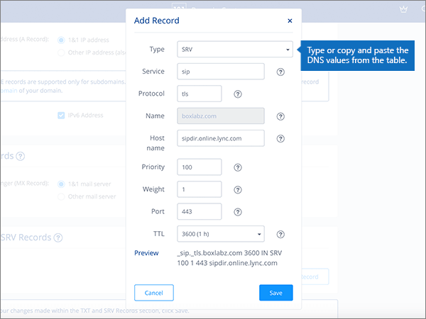

# Erstellen von DNS-Einträgen bei 1&1 Ionos für Microsoft

 **[Überprüfen Sie die häufig gestellten Fragen (FAQ) zu Domänen](../setup/domains-faq.yml)**, wenn Sie nicht finden, wonach Sie suchen. 
  
> [!CAUTION]
> Beachten Sie, dass mit 1&1 Ionos keine Domäne sowohl über einen MX-Eintrag als auch über einen CNAME-Eintrag auf oberster Ebene verfügen kann. Dadurch wird die Art und Weise eingeschränkt, in der Sie Exchange Online für Microsoft konfigurieren können. Es gibt eine Problemumgehung, aber wir empfehlen, Sie **nur** zu verwenden, wenn Sie bereits über Erfahrung mit dem Erstellen von Unterdomänen bei 1&1 Ionos verfügen. > Wenn Sie trotz dieser [Diensteinschränkung](https://docs.microsoft.com/microsoft-365/admin/setup/domains-faq) ihre eigenen Microsoft-DNS-Einträge mit 1&1 Ionos verwalten möchten, befolgen Sie die Schritte in diesem Artikel, um Ihre Domäne zu überprüfen und DNS-Einträge für e-Mail, Skype for Business Online usw. einzurichten. 
  
Nachdem Sie diese Einträge bei 1&1 Ionos hinzugefügt haben, ist Ihre Domäne für die Verwendung mit Microsoft-Diensten eingerichtet.
  
  
> [!NOTE]
> Normalerweise dauert es ungefähr 15 Minuten, bis DNS-Änderungen wirksam werden. Es kann jedoch gelegentlich länger dauern, bis eine von Ihnen vorgenommene Änderung im Internet im DNS-System aktualisiert wurde. Wenn nach dem Hinzufügen von DNS-Einträgen Probleme mit dem E-Mail-Fluss oder andere Probleme auftreten, lesen Sie [Suchen und Beheben von Problemen, nachdem Ihre Domäne oder DNS-Einträge hinzugefügt wurden](../get-help-with-domains/find-and-fix-issues.md). 
  
## Hinzufügen eines TXT-Eintrags zur Überprüfung

Bevor Sie Ihre Domäne mit Microsoft verwenden können, müssen wir uns vergewissern, dass Sie deren Besitzer sind. Ihre Fähigkeit, sich bei Ihrem Konto bei Ihrer Domänenregistrierungsstelle anzumelden und den DNS-Eintrag zu erstellen, ist für Microsoft der Nachweis, dass Sie der Besitzer der Domäne sind.
  
> [!NOTE]
> Dieser Eintrag wird nur verwendet, um zu überprüfen, ob Sie der Besitzer Ihrer Domäne sind. Er hat keine weiteren Auswirkungen. Sie können ihn später ggf. löschen. 
  
Führen Sie die folgenden Schritte aus, oder [schauen Sie sich das Video an (beginnen Sie bei 0:42)](https://docs.microsoft.com/microsoft-365/admin/dns/create-dns-records-at-1-1-internet).
  
1. Um zu beginnen, navigieren Sie über [diesen Link](https://my.1and1.com/)zu ihrer Domänen Seite bei 1&1 Ionos. You'll be prompted to log in.
    
2. Wählen Sie **Manage Domains** aus.
    
3. Suchen Sie auf der Seite **Domänen Center** die Domäne, die Sie aktualisieren möchten, und wählen Sie dann das Steuerelement **Panel** ( **v**) für diese Domäne aus.
    
4. Wählen Sie im Bereich **Domäneneinstellungen** die Option **DNS-Einstellungen bearbeiten** aus.
    
5. Wählen Sie im Abschnitt **txt-und SRV-Einträge** die Option **Eintrag hinzufügen** aus.
    
6. In the **Add Record** area, in the boxes for the new record, type or copy and paste the values from the following table. 
    
    (Wählen Sie in der Dropdownliste den Wert für **Type** aus.) 
    
    ||||
    |:-----|:-----|:-----|
    |**Type**   |**Prefix**   |**Name Value**   |
    |TXT    |(Lassen Sie dieses Feld leer)    |MS=ms *XXXXXXXX*    Hinweis: Dies ist ein Beispiel. Verwenden Sie hier Ihre spezifischen **Ziel-oder Punkt-zu-Adresse** -Werte aus der Tabelle. [Wie finde ich diese Angabe?](../get-help-with-domains/information-for-dns-records.md)          |
   
7. Wählen Sie **Speichern** aus.
    
8. Wählen Sie erneut **Speichern** aus. 
    
9. Wählen Sie im Dialogfeld **DNS-Einstellungen bearbeiten** die Option **Ja** aus.
    
10. Warten Sie einige Minuten, bevor Sie fortfahren, damit der soeben erstellte Eintrag im Internet aktualisiert werden kann.
    
Nachdem Sie den Eintrag auf der Website Ihrer Domänenregistrierungsstelle hinzugefügt haben, kehren Sie zu Microsoft 365 zurück und fordern Microsoft 365 auf, nach dem Eintrag zu suchen.
  
Wenn Microsoft den richtigen TXT-Eintrag findet, ist die Domäne überprüft.
  
1. Wechseln Sie im Microsoft Admin Center zur Seite **Einstellungen** \> <a href="https://go.microsoft.com/fwlink/p/?linkid=834818" target="_blank">Domänen</a>.

    
2. Wählen Sie auf der Seite **Domänen** die zu überprüfende Domäne aus. 
    
3. Wählen Sie auf der Seite **Setup** die Option **Setup starten** aus.
    
4. Wählen Sie auf der Seite **Domäne überprüfen** die Option **Überprüfen** aus.
    
> [!NOTE]
> Normalerweise dauert es ungefähr 15 Minuten, bis DNS-Änderungen wirksam werden. Es kann jedoch gelegentlich länger dauern, bis eine von Ihnen vorgenommene Änderung im Internet im DNS-System aktualisiert wurde. Wenn nach dem Hinzufügen von DNS-Einträgen Probleme mit dem E-Mail-Fluss oder andere Probleme auftreten, lesen Sie [Suchen und Beheben von Problemen, nachdem Ihre Domäne oder DNS-Einträge hinzugefügt wurden](../get-help-with-domains/find-and-fix-issues.md). 
  
## Fügen Sie einen MX-Eintrag hinzu, damit E-Mails für Ihre Domäne an Microsoft geleitet werden.

Führen Sie die folgenden Schritte aus, oder [schauen Sie sich das Video an (beginnen Sie bei 3:22)](https://docs.microsoft.com/microsoft-365/admin/dns/create-dns-records-at-1-1-internet).
  
> [!NOTE]
> Wenn Sie sich bei 1und1.de registriert haben, melden Sie sich [hier an](https://go.microsoft.com/fwlink/?linkid=859152). 
  
1. Um zu beginnen, navigieren Sie über [diesen Link](https://my.1and1.com/)zu ihrer Domänen Seite bei 1&1 Ionos. You'll be prompted to log in.
    
2. Wählen Sie **Manage Domains** aus.
    
3. Suchen Sie auf der Seite **Domänen Center** die Domäne, die Sie aktualisieren möchten, und wählen Sie dann das Steuerelement **Panel** ( **v**) für diese Domäne aus.
    
4. Wählen Sie im Bereich **Domäneneinstellungen** die Option **DNS-Einstellungen bearbeiten** aus.
    
5. Wählen Sie im Abschnitt **MX Records** im Bereich **Mail Exchanger (MX Record)** einen **anderen e-Mail-Server** aus. (Möglicherweise müssen Sie nach unten scrollen.)   
  
6. If there are any MX records already listed, delete each of them by selecting the record and then pressing the **Delete** key on your keyboard. (Wenn noch keine MX-Einträge aufgeführt sind, fahren Sie mit dem nächsten Schritt fort.)  
  
7. Geben Sie in den Feldern für den Eintrag **MX 1** die Werte aus der folgenden Tabelle ein. Sie können die Werte auch kopieren und einfügen. 
    
    |**MX 1**|**Priorität**|
    |:-----|:-----|
    | *\<domain-key\>*  .mail.protection.outlook.com     Hinweis: erhalten Sie Ihre \<domain-key\> von Ihrem Microsoft-Konto. [Wie finde ich diese Angabe?](../get-help-with-domains/information-for-dns-records.md)          |10     Weitere Informationen zur Priorität finden Sie unter [Was ist MX-Priorität?](https://docs.microsoft.com/microsoft-365/admin/setup/domains-faq)   | 
    
     
  
8. Wählen Sie **Speichern** aus. (Möglicherweise müssen Sie nach unten scrollen.) 
  
9. Wählen Sie im Dialogfeld **DNS-Einstellungen bearbeiten** die Option **Ja** aus. 
  
## Hinzufügen der sechs CNAME-Einträge, die für Microsoft erforderlich sind

1&1 Ionos erfordert eine Problemumgehung, sodass Sie einen MX-Eintrag zusammen mit den für Microsoft-e-Mail-Dienste erforderlichen CNAME-Einträgen verwenden können. Diese Problemumgehung erfordert, dass Sie eine Gruppe von Unterdomänen auf 1&1 Ionos erstellen und Sie CNAME-Einträgen zuweisen.
  
> [!IMPORTANT]
> Bevor Sie beginnen, sollten Sie sich vergewissern, dass Sie mindestens zwei verfügbare Unterdomänen haben. Diese Lösung wird nur empfohlen, wenn Sie bereits über Erfahrung mit dem Erstellen von Unterdomänen bei 1&1 Ionos verfügen. 
  
### Einfache CNAME-Einträge

Führen Sie die folgenden Schritte aus, oder [schauen Sie sich das Video an (beginnen Sie bei 3:57)](https://docs.microsoft.com/microsoft-365/admin/dns/create-dns-records-at-1-1-internet).
  
> [!NOTE]
> Wenn Sie sich bei 1und1.de registriert haben, melden Sie sich [hier an](https://go.microsoft.com/fwlink/?linkid=859152). 
  
1. Um zu beginnen, navigieren Sie über [diesen Link](https://my.1and1.com/)zu ihrer Domänen Seite bei 1&1 Ionos. You'll be prompted to log in.
    
2. Wählen Sie **Manage Domains** aus.
    
3. Suchen Sie auf der Seite **Domänen Center** die Domäne, die Sie aktualisieren möchten, und wählen Sie dann unter **Domänen verwalten** aus.   Im nächsten Schritt erstellen Sie zwei Unterdomänen und legen einen **Alias** für jede hiervor fest. (Dies ist erforderlich, da 1&1 Ionos nur einen CNAME-Eintrag auf oberster Ebene unterstützt, für Microsoft jedoch mehrere CNAME-Einträge erforderlich sind.) Zuerst erstellen Sie die Autoermittlungs-Unterdomäne.
    
4. Wählen Sie im Abschnitt unter **Domänenübersicht** die Option unter **Domäne erstellen** aus.
    
    
  
5. Geben Sie im Feld **Create Subdomain** der neuen Unterdomäne nur den Wert unter **Create Subdomain** aus der folgenden Tabelle ein, oder kopieren Sie ihn, damit Sie ihn einfügen können. (Der Wert für **Alias** wird in einem späteren Schritt hinzugefügt.)

    |**Create Subdomain**|**Alias**|
    |:-----|:-----|
    |autodiscover    |autodiscover.outlook.com   | 

    
  
6. Wählen Sie unter **Domäne erstellen** aus. 
  
7. Suchen Sie im Abschnitt **Subdomain Overview** die Unterdomäne **AutoErmittlung** , die Sie soeben erstellt haben, und wählen Sie dann das Panel-Steuerelement **(v)** für diese Unterdomäne aus.  
  
8. Wählen Sie im Bereich unter **Domäneneinstellungen** die Option **DNS-Einstellungen bearbeiten** aus.  
  
9. Wählen Sie im Abschnitt **a/AAAA Records (IP Addresses)** im Bereich **IP-Adresse (a Record)** die Option **CNAME** aus. 
  
10. Geben Sie im Feld **Alias:** nur den Wert für **Alias** aus der folgenden Tabelle ein. Sie können den Wert auch kopieren und einfügen.  
    
    |**Create Subdomain**|**Alias**|
    |:-----|:-----|
    |autodiscover    |autodiscover.outlook.com   |

    
  
11. Aktivieren Sie das Kontrollkästchen für den Haftungsausschluss **I am aware**. 
  
12. Wählen Sie **Speichern** aus. 
  
  
### Zusätzliche CNAME-Einträge

Die zusätzlichen CNAME-Einträge, die mit den folgenden Schritten erstellt werden, aktivieren die Skype for Business Online-Dienste. Führen Sie dieselben Schritte wie beim Erstellen der beiden vorherigen CNAME-Einträge durch.
  
1. Erstellen Sie die dritte Unterdomäne (Lyncdiscover). Wählen Sie im Abschnitt unter **Domänenübersicht** die Option unter **Domäne erstellen** aus.
    
2. Geben Sie im Feld **Create Subdomain** der neuen Unterdomäne nur den Wert unter **Create Subdomain** aus der folgenden Tabelle ein, oder kopieren Sie ihn, damit Sie ihn einfügen können. (Der Wert für **Alias** wird in einem späteren Schritt hinzugefügt.)  
    
    |**Create Subdomain**|**Alias**|
    |:-----|:-----|
    |lyncdiscover   |webdir.online.lync.com  |
   
3. Wählen Sie unter **Domäne erstellen** aus.
    
4. Wählen Sie auf der Seite **Domänen Center** die Option unter **Domänen verwalten** aus.
    
5. Suchen Sie im Abschnitt **Subdomain Overview** die Unterdomäne **lyncdiscover** , die Sie soeben erstellt haben, und wählen Sie dann das Steuerelement **Panel (v)** für diese Unterdomäne aus.  Wählen Sie im Bereich unter **Domäneneinstellungen** die Option **DNS-Einstellungen bearbeiten** aus.
    
6. Wählen Sie im Abschnitt **a/AAAA Records (IP Addresses)** im Bereich **IP-Adresse (a Record)** die Option **CNAME** aus.
    
7. Geben Sie im Feld **Alias:** nur den Wert für **Alias** aus der folgenden Tabelle ein. Sie können den Wert auch kopieren und einfügen.  
    
    |**Create Subdomain**|**Alias**|
    |:-----|:-----|
    |lyncdiscover    |webdir.online.lync.com    |
   
8. Aktivieren Sie das Kontrollkästchen für den Haftungsausschluss **I am Aware** , und wählen Sie dann **Speichern** aus.
    
9. Wählen Sie im Dialogfeld **DNS-Einstellungen bearbeiten** die Option **Ja** aus.
    
10. Erstellen der vierten Unterdomäne (SIP):  Wählen Sie im Abschnitt unter **Domänenübersicht** die Option unter **Domäne erstellen** aus.
    
11. Geben Sie im Feld **Create Subdomain** der neuen Unterdomäne nur den Wert unter **Create Subdomain** aus der folgenden Tabelle ein, oder kopieren Sie ihn, damit Sie ihn einfügen können. (Der Wert für **Alias** wird in einem späteren Schritt hinzugefügt.) 
    
    |**Create Subdomain**|**Alias**|
    |:-----|:-----|
    |sip    |sipdir.online.lync.com    |
   
12. Wählen Sie unter **Domäne erstellen** aus.
    
13. Wählen Sie auf der Seite **Domänen Center** die Option unter **Domänen verwalten** aus.
    
14. Suchen Sie im Abschnitt **Subdomain Overview** die **SIP** -Unterdomäne, die Sie soeben erstellt haben, und wählen Sie dann das Panel-Steuerelement **(v)** für diese Unterdomäne aus.  Wählen Sie im Bereich unter **Domäneneinstellungen** die Option **DNS-Einstellungen bearbeiten** aus.
    
15. Wählen Sie im Abschnitt **a/AAAA Records (IP Addresses)** im Bereich **IP-Adresse (a Record)** die Option **CNAME** aus.
    
16. Geben Sie im Feld **Alias:** nur den Wert für **Alias** aus der folgenden Tabelle ein. Sie können den Wert auch kopieren und einfügen. 
    
    |**Create Subdomain**|**Alias**|
    |:-----|:-----|
    |sip    |sipdir.online.lync.com    |
   
17. Aktivieren Sie das Kontrollkästchen für den Haftungsausschluss **I am Aware** , und wählen Sie dann **Speichern** aus.
    
18. Wählen Sie im Dialogfeld **DNS-Einstellungen bearbeiten** die Option **Ja** aus.
    
### Für MDM erforderliche CNAME-Einträge

> [!IMPORTANT]
> Führen Sie das gleiche Verfahren wie bei den anderen vier CNAME-Einträgen aus, doch geben Sie dabei die Werte aus der folgenden Tabelle ein. 
  
|**Create Subdomain**|**Alias**|
|:-----|:-----|
|enterpriseregistration    |enterpriseregistration.windows.net    |
|enterpriseenrollment    |enterpriseenrollment-s.manage.microsoft.com    |
   
## Hinzufügen eines TXT-Eintrags für SPF, um E-Mail-Spam zu verhindern

> [!IMPORTANT]
> Es kann bei einer Domäne nur einen TXT-Eintrag für SPF geben. Wenn es bei Ihrer Domäne mehrere SPF-Einträge gibt, treten E-Mail-Fehler sowie Probleme bei der Übermittlung und Spamklassifizierung auf. Wenn es für Ihre Domäne bereits einen SPF-Eintrag gibt, erstellen Sie für Microsoft keinen neuen, Fügen Sie stattdessen die erforderlichen Microsoft-Werte zum aktuellen Datensatz hinzu, sodass Sie einen  *einzelnen*  SPF-Eintrag haben, der beide Wertegruppen enthält. Benötigen Sie Beispiele? Lesen Sie die Informationen unter [Externe DNS-Einträge für Microsoft](https://docs.microsoft.com/microsoft-365/enterprise/external-domain-name-system-records). Zum Überprüfen des SPF-Eintrags können Sie eines dieser[SPF-Überprüfungstools](../setup/domains-faq.yml)verwenden. 
  
Führen Sie die folgenden Schritte aus, oder [schauen Sie sich das Video an (beginnen Sie bei 5:09)](https://docs.microsoft.com/microsoft-365/admin/dns/create-dns-records-at-1-1-internet).
  
> [!NOTE]
> Wenn Sie sich bei 1und1.de registriert haben, melden Sie sich [hier an](https://go.microsoft.com/fwlink/?linkid=859152). 
  
1. Um zu beginnen, navigieren Sie über [diesen Link](https://my.1and1.com/)zu ihrer Domänen Seite bei 1&1 Ionos. You'll be prompted to log in.
    
2. Wählen Sie **Manage Domains** aus.
    
3. Suchen Sie auf der Seite **Domänen Center** die Domäne, die Sie aktualisieren möchten, und wählen Sie dann das Steuerelement **Panel** (**v**) für diese Domäne aus.
    
4. Wählen Sie im Bereich **Domäneneinstellungen** die Option **DNS-Einstellungen bearbeiten** aus.
    
5. Wählen Sie im Abschnitt **txt-und SRV-Einträge** die Option **Eintrag hinzufügen** aus.  (Möglicherweise müssen Sie nach unten scrollen.)
    
6. In the **Add Record** area, in the boxes for the new record, type or copy and paste the values from the following table.  (Wählen Sie in der Dropdownliste den Wert für **Type** aus.)  
    
    |**Type**|**Prefix**|**Name Value**|
    |:-----|:-----|:-----|
    |TXT    |(Dieses Feld leer lassen.)    |v=spf1 include:spf.protection.outlook.com -all    **Hinweis:** Es wird empfohlen, diesen Eintrag zu kopieren und einzufügen, damit alle Abstände korrekt übernommen werden.           | 
    
    
  
7. Wählen Sie **Speichern** aus. 
  
8. Wählen Sie **Speichern** aus. 
  
9. Wählen Sie im Dialogfeld **DNS-Einstellungen bearbeiten** die Option **Ja** aus. 
  
## Hinzufügen der für Microsoft erforderlichen zwei SRV-Einträge

Führen Sie die folgenden Schritte aus, oder [schauen Sie sich das Video an (beginnen Sie bei 5:51)](https://docs.microsoft.com/microsoft-365/admin/dns/create-dns-records-at-1-1-internet).
  
> [!NOTE]
> Wenn Sie sich bei 1und1.de registriert haben, melden Sie sich [hier an](https://go.microsoft.com/fwlink/?linkid=859152). 
  
1. Um zu beginnen, navigieren Sie über [diesen Link](https://my.1and1.com/)zu ihrer Domänen Seite bei 1&1 Ionos. You'll be prompted to log in.
    
2. Wählen Sie **Manage Domains** aus.
    
3. Suchen Sie auf der Seite **Domänen Center** die Domäne, die Sie aktualisieren möchten, und wählen Sie dann das Steuerelement **Panel** ( **v**) für diese Domäne aus.
    
4. Wählen Sie im Bereich **Domäneneinstellungen** die Option **DNS-Einstellungen bearbeiten** aus.
    
5. Wählen Sie im Abschnitt **txt-und SRV-Einträge** die Option **Eintrag hinzufügen** aus.
    
6. Fügen Sie den ersten der zwei SRV-Einträge hinzu. Geben Sie im Bereich **Eintrag hinzufügen** in den Feldern für den neuen Eintrag die Werte aus der ersten Zeile der folgenden Tabelle ein. Sie können die Werte auch kopieren und einfügen.  (Wählen Sie in der Dropdownliste die Werte **Type** und **TTL** aus.) 
    
    |**Type**|**Service**|**Protocol**|**Name**|**Host**|**Priority**|**Weight**|**Port**|**TTL**|
    |:-----|:-----|:-----|:-----|:-----|:-----|:-----|:-----|:-----|
    |SRV    |sip    |tls    |(Dieses Feld leer lassen.)    |sipdir.online.lync.com    |100    |1     |443    |3600 (1 h)    |
    |SRV    |sipfederationtls    |tcp    |(Dieses Feld leer lassen.)    |sipfed.online.lync.com    |100    |1     |5061    |3600 (1 h)    |  
    
    
  
7. Wählen Sie **Speichern** aus.  
  
8. Wählen Sie **Speichern** aus.  
  
9. Wählen Sie im Dialogfeld **DNS-Einstellungen bearbeiten** die Option **Ja** aus.  
  
10. Fügen Sie den anderen SRV-Eintrag hinzu.  Wählen Sie im Abschnitt **txt-und SRV-Einträge** die Option **Eintrag hinzufügen** aus.  Erstellen Sie im Bereich **Datensatz hinzufügen** einen Datensatz mit den Werten aus der anderen Zeile in der Tabelle, und wählen Sie dann erneut **Hinzufügen**, **Speichern** und **Ja** aus, um den Datensatz abzuschließen. 
    
> [!NOTE]
> Normalerweise dauert es ungefähr 15 Minuten, bis DNS-Änderungen wirksam werden. Es kann jedoch gelegentlich länger dauern, bis eine von Ihnen vorgenommene Änderung im Internet im DNS-System aktualisiert wurde. Wenn nach dem Hinzufügen von DNS-Einträgen Probleme mit dem E-Mail-Fluss oder andere Probleme auftreten, lesen Sie [Suchen und Beheben von Problemen, nachdem Ihre Domäne oder DNS-Einträge hinzugefügt wurden](../get-help-with-domains/find-and-fix-issues.md). 
  
