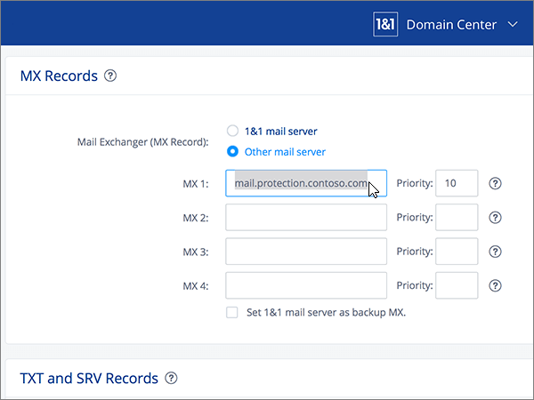

# Erstellen von DNS-Einträgen für Microsoft bei 1&1 IONOS

 **[Überprüfen Sie die häufig gestellten Fragen (FAQ) zu Domänen](../setup/domains-faq.yml)**, wenn Sie nicht finden, wonach Sie suchen. 
  
> [!CAUTION]
> Beachten Sie, dass 1 & 1 IONOS keine Domänen zulässt, die sowohl einen MX-Eintrag als auch einen Autoermittlungs-CNAME-Eintrag der oberen Ebene aufweisen. Damit werden die Möglichkeiten eingeschränkt, Exchange Online für Microsoft zu konfigurieren. Es gibt eine Problemumgehung, die Sie jedoch **nur** anwenden sollten, wenn Sie bereits Erfahrung mit der Erstellung von Unterdomänen bei 1 & 1 IONOS haben. > Wenn Sie sich trotz der [Diensteinschränkungen](../setup/domains-faq.yml) dafür entscheiden, Ihre eigenen Microsoft-DNS-Einträge bei 1&1 IONOS zu verwalten, führen Sie die Schritte in diesem Artikel aus, um die DNS-Einträge für E-Mail, Skype for Business Online und andere Dienste einzurichten. 
  
Nachdem Sie diese Einträge bei 1&1 IONOS hinzugefügt haben, ist Ihre Domäne für die Verwendung von Microsoft-Diensten eingerichtet.
  
  
> [!NOTE]
> Normalerweise dauert es ungefähr 15 Minuten, bis DNS-Änderungen wirksam werden. Es kann jedoch gelegentlich länger dauern, bis eine von Ihnen vorgenommene Änderung im Internet im DNS-System aktualisiert wurde. Wenn nach dem Hinzufügen von DNS-Einträgen Probleme mit dem E-Mail-Fluss oder andere Probleme auftreten, lesen Sie [Suchen und Beheben von Problemen, nachdem Ihre Domäne oder DNS-Einträge hinzugefügt wurden](../get-help-with-domains/find-and-fix-issues.md). 
  
## Hinzufügen eines TXT-Eintrags zur Überprüfung

Bevor Sie Ihre Domäne mit Microsoft verwenden können, müssen wir uns vergewissern, dass Sie deren Besitzer sind. Ihre Fähigkeit, sich bei Ihrem Konto bei Ihrer Domänenregistrierungsstelle anzumelden und den DNS-Eintrag zu erstellen, ist für Microsoft der Nachweis, dass Sie der Besitzer der Domäne sind.
  
> [!NOTE]
> Dieser Eintrag wird nur verwendet, um zu überprüfen, ob Sie der Besitzer Ihrer Domäne sind. Er hat keine weiteren Auswirkungen. Sie können ihn später ggf. löschen. 
  
Führen Sie die folgenden Schritte aus, oder [schauen Sie sich das Video an (beginnen Sie bei 0:42)]().
  
1. Im ersten Schritt navigieren Sie über [diesen Link](https://my.1and1.com/) zu Ihrer Domänenseite bei 1&1 IONOS. Sie werden aufgefordert, sich anzumelden.
    
2. Wählen Sie **Manage domains** aus.
    
3. Suchen Sie auf der Seite **Domain Center** die Domäne, die Sie aktualisieren möchten, und wählen Sie dann das Steuerelement **Panel** ( **v**) für diese Domäne aus.
    
4. Wählen Sie im Bereich **Domain Settings** die Option **DNS-Einstellungen bearbeiten** aus.
    
5. Wählen Sie im Abschnitt **TXT and SRV Records** die Option **Add Record** aus.
    
6. Geben Sie im Bereich **Add Record** in den Feldern für den neuen Eintrag die Werte aus der folgenden Tabelle ein. Sie können die Werte auch kopieren und einfügen. 
    
    (Wählen Sie in der Dropdownliste den Wert für **Type** aus.) 
    
    ||||
    |:-----|:-----|:-----|
    |**Type**   |**Prefix**   |**Name Value**   |
    |TXT    |(Dieses Feld leer lassen)    |MS=ms *XXXXXXXX*    HINWEIS: Dies ist ein Beispiel. Verwenden Sie hier Ihren spezifischen **Ziel- oder Verweist auf die Adresse**-Wert aus der Tabelle. [Wie finde ich diese Angabe?](../get-help-with-domains/information-for-dns-records.md)          |
   
7. Wählen Sie **Speichern** aus.
    
8. Wählen Sie noch mal **Speichern** aus. 
    
9. Wählen Sie im Dialogfeld **Edit DNS Settings** die Option **Yes** aus.
    
10. Warten Sie einige Minuten, bevor Sie fortfahren, damit der soeben erstellte Eintrag im Internet aktualisiert werden kann.
    
Nachdem Sie den Eintrag auf der Website Ihrer Domänenregistrierungsstelle hinzugefügt haben, kehren Sie zu Microsoft 365 zurück und fordern Microsoft 365 auf, nach dem Eintrag zu suchen.
  
Wenn Microsoft den richtigen TXT-Eintrag findet, ist die Domäne überprüft.
  
1. Wechseln Sie im Microsoft Admin Center zur Seite **Einstellungen** \> <a href="https://go.microsoft.com/fwlink/p/?linkid=834818" target="_blank">Domänen</a>.

    
2. Wählen Sie auf der Seite **Domänen** die zu überprüfende Domäne aus. 
    
3. Wählen Sie auf der Seite **Setup** die Option **Setup starten** aus.
    
4. Wählen Sie auf der Seite **Domäne überprüfen** die Option **Überprüfen** aus.
    
> [!NOTE]
> Normalerweise dauert es ungefähr 15 Minuten, bis DNS-Änderungen wirksam werden. Es kann jedoch gelegentlich länger dauern, bis eine von Ihnen vorgenommene Änderung im Internet im DNS-System aktualisiert wurde. Wenn nach dem Hinzufügen von DNS-Einträgen Probleme mit dem E-Mail-Fluss oder andere Probleme auftreten, lesen Sie [Suchen und Beheben von Problemen, nachdem Ihre Domäne oder DNS-Einträge hinzugefügt wurden](../get-help-with-domains/find-and-fix-issues.md). 
  
## Fügen Sie einen MX-Eintrag hinzu, damit E-Mails für Ihre Domäne an Microsoft geleitet werden.

Führen Sie die folgenden Schritte aus, oder [schauen Sie sich das Video an (beginnen Sie bei 3:22)]().
  
> [!NOTE]
> Hinweis: Wenn Sie sich bei 1und1.de registriert haben, [melden Sie sich hier an](https://go.microsoft.com/fwlink/?linkid=859152). 
  
1. Im ersten Schritt navigieren Sie über [diesen Link](https://my.1and1.com/) zu Ihrer Domänenseite bei 1&1 IONOS. Sie werden aufgefordert, sich anzumelden.
    
2. Wählen Sie **Manage domains** aus.
    
3. Suchen Sie auf der Seite **Domain Center** die Domäne, die Sie aktualisieren möchten, und wählen Sie dann das Steuerelement **Panel** ( **v**) für diese Domäne aus.
    
4. Wählen Sie im Bereich **Domain Settings** die Option **DNS-Einstellungen bearbeiten** aus.
    
5. Wählen Sie im Abschnitt **MX-Einträge** im Bereich **Mail Exchanger (MX-Eintrag)** die Option **Anderer E-Mail-Server** aus. (Möglicherweise müssen Sie nach unten scrollen.)   
  
6. If there are any MX records already listed, delete each of them by selecting the record and then pressing the **Delete** key on your keyboard. (Wenn noch keine MX-Einträge aufgeführt sind, fahren Sie mit dem nächsten Schritt fort.)  
  
7. Geben Sie in den Feldern für den Eintrag **MX 1** die Werte aus der folgenden Tabelle ein. Sie können die Werte auch kopieren und einfügen. 
    
    |**MX 1**|**Priorität**|
    |:-----|:-----|
    | *\<domain-key\>*  .mail.protection.outlook.com     HINWEIS: Erhalten Sie Ihren \<domain-key\> über Ihr Microsoft-Konto. [Wie finde ich diese Angabe?](../get-help-with-domains/information-for-dns-records.md)          |10      Weitere Informationen zur Priorität finden Sie unter [Was ist MX-Priorität?](../setup/domains-faq.yml)   | 
    
     
  
8. Wählen Sie **Speichern** aus. (Möglicherweise müssen Sie nach unten scrollen.) 
  
9. Wählen Sie im Dialogfeld **Edit DNS Settings** die Option **Yes** aus. 
  
## Hinzufügen der für Microsoft erforderlichen sechs CNAME-Einträge

Für 1&1 IONOS ist eine Problemumgehung erforderlich, damit Sie einen MX-Eintrag zusammen mit den CNAME-Einträgen verwenden können, die für die Microsoft-E-Mail-Dienste erforderlich sind. Im Rahmen dieser Problemumgehung müssen Sie eine Reihe von Unterdomänen bei 1&1 IONOS erstellen und diesen die CNAME-Einträge zuweisen.
  
> [!IMPORTANT]
> Bevor Sie beginnen, sollten Sie sich vergewissern, dass Sie mindestens zwei verfügbare Unterdomänen haben. Wir empfehlen diese Lösung nur, wenn Sie bereits Erfahrung mit der Erstellung von Unterdomänen bei 1&1 IONOS haben. 
  
### Einfache CNAME-Einträge

Führen Sie die folgenden Schritte aus, oder [schauen Sie sich das Video an (beginnen Sie bei 3:57)]().
  
> [!NOTE]
> Hinweis: Wenn Sie sich bei 1und1.de registriert haben, [melden Sie sich hier an](https://go.microsoft.com/fwlink/?linkid=859152). 
  
1. Im ersten Schritt navigieren Sie über [diesen Link](https://my.1and1.com/) zu Ihrer Domänenseite bei 1&1 IONOS. Sie werden aufgefordert, sich anzumelden.
    
2. Wählen Sie **Manage domains** aus.
    
3. Suchen Sie auf der Seite **Domain Center** die Domäne, die Sie aktualisieren möchten, und wählen Sie dann das Steuerelement **Manage Subdomains** aus.   Im nächsten Schritt erstellen Sie zwei Unterdomänen und legen einen **Alias** für jede davon fest. (Dies ist erforderlich, da 1&1 IONOS nur den CNAME-Eintrag auf oberster Ebene unterstützt, Microsoft erfordert jedoch mehrere CNAME-Einträge.) Zuerst erstellen Sie die Autoermittlungs-Unterdomäne.
    
4. Wählen Sie im Abschnitt **Subdomain Overview** den Befehl **Create Subdomain** aus.
    
    
  
5. Geben Sie im Feld **Create Subdomain** der neuen Unterdomäne nur den Wert unter **Create Subdomain** aus der folgenden Tabelle ein, oder kopieren Sie ihn, damit Sie ihn einfügen können. (Der Wert für **Alias** wird in einem späteren Schritt hinzugefügt.)

    |**Create Subdomain**|**Alias**|
    |:-----|:-----|
    |autodiscover    |autodiscover.outlook.com   | 

    
  
6. Wählen Sie **Create Subdomain** aus. 
  
7. Suchen Sie im Abschnitt **Subdomain Overview** die Unterdomäne **autodiscover**, die Sie soeben erstellt haben, und wählen Sie dann das Steuerelement **Panel (v)** für die Unterdomäne aus.  
  
8. Wählen Sie im Bereich **Subdomain Settings** die Option **Edit DNS Settings** aus.  
  
9. Wählen Sie im Abschnitt **A/AAAA Records (IP Addresses)** im Bereich **IP address (A Record)** die Option **CNAME** aus. 
  
10. Geben Sie im Feld **Alias:** nur den Wert für **Alias** aus der folgenden Tabelle ein. Sie können den Wert auch kopieren und einfügen.  
    
    |**Create Subdomain**|**Alias**|
    |:-----|:-----|
    |autodiscover    |autodiscover.outlook.com   |

    
  
11. Aktivieren Sie das Kontrollkästchen für den Haftungsausschluss **I am aware**. 
  
12. Wählen Sie **Speichern** aus. 
  
  
### Zusätzliche CNAME-Einträge

Die zusätzlichen CNAME-Einträge, die mit den folgenden Schritten erstellt werden, aktivieren die Skype for Business Online-Dienste. Führen Sie dieselben Schritte wie beim Erstellen der beiden vorherigen CNAME-Einträge durch.
  
1. Erstellen Sie die dritte Unterdomäne (Lyncdiscover). Wählen Sie im Abschnitt **Subdomain Overview** die Option **Create Subdomain** aus.
    
2. Geben Sie im Feld **Create Subdomain** der neuen Unterdomäne nur den Wert unter **Create Subdomain** aus der folgenden Tabelle ein, oder kopieren Sie ihn, damit Sie ihn einfügen können. (Der Wert für **Alias** wird in einem späteren Schritt hinzugefügt.)  
    
    |**Create Subdomain**|**Alias**|
    |:-----|:-----|
    |lyncdiscover   |webdir.online.lync.com  |
   
3. Wählen Sie **Create Subdomain** aus.
    
4. Wählen Sie auf der Seite **Domain Center** die Option **Manage Subdomains** aus.
    
5. Suchen Sie im Abschnitt **Subdomain Overview** die Unterdomäne **lyncdiscover**, die Sie soeben erstellt haben, und wählen Sie dann das Steuerelement **Panel (v)** für die Unterdomäne aus.  Wählen Sie im Bereich **Subdomain Settings** die Option **Edit DNS Settings** aus.
    
6. Wählen Sie im Abschnitt **A/AAAA Records (IP Addresses)** im Bereich **IP address (A Record)** die Option **CNAME** aus.
    
7. Geben Sie im Feld **Alias:** nur den Wert für **Alias** aus der folgenden Tabelle ein. Sie können den Wert auch kopieren und einfügen.  
    
    |**Create Subdomain**|**Alias**|
    |:-----|:-----|
    |lyncdiscover    |webdir.online.lync.com    |
   
8. Aktivieren Sie das Kontrollkästchen für den Haftungsausschluss **I am aware**, und wählen Sie dann **Save** aus.
    
9. Wählen Sie im Dialogfeld **Edit DNS Settings** die Option **Yes** aus.
    
10. Erstellen der vierten Unterdomäne (SIP):  Wählen Sie im Abschnitt **Subdomain Overview** den Befehl **Create Subdomain** aus.
    
11. Geben Sie im Feld **Create Subdomain** der neuen Unterdomäne nur den Wert unter **Create Subdomain** aus der folgenden Tabelle ein, oder kopieren Sie ihn, damit Sie ihn einfügen können. (Der Wert für **Alias** wird in einem späteren Schritt hinzugefügt.) 
    
    |**Create Subdomain**|**Alias**|
    |:-----|:-----|
    |sip    |sipdir.online.lync.com    |
   
12. Wählen Sie **Create Subdomain** aus.
    
13. Wählen Sie auf der Seite **Domain Center** die Option **Manage Subdomains** aus.
    
14. Suchen Sie im Abschnitt **Subdomain Overview** die Unterdomäne **sip**, die Sie soeben erstellt haben, und wählen Sie dann das Steuerelement **Panel (v)** für die Unterdomäne aus.  Wählen Sie im Bereich **Subdomain Settings** die Option **Edit DNS Settings** aus.
    
15. Wählen Sie im Abschnitt **A/AAAA Records (IP Addresses)** im Bereich **IP address (A Record)** die Option **CNAME** aus.
    
16. Geben Sie im Feld **Alias:** nur den Wert für **Alias** aus der folgenden Tabelle ein. Sie können den Wert auch kopieren und einfügen. 
    
    |**Create Subdomain**|**Alias**|
    |:-----|:-----|
    |sip    |sipdir.online.lync.com    |
   
17. Aktivieren Sie das Kontrollkästchen für den Haftungsausschluss **I am aware**, und wählen Sie dann **Save** aus.
    
18. Wählen Sie im Dialogfeld **Edit DNS Settings** die Option **Yes** aus.
    
### Für MDM erforderliche CNAME-Einträge

> [!IMPORTANT]
> Führen Sie das gleiche Verfahren wie bei den anderen vier CNAME-Einträgen aus, doch geben Sie dabei die Werte aus der folgenden Tabelle ein. 
  
|**Create Subdomain**|**Alias**|
|:-----|:-----|
|enterpriseregistration    |enterpriseregistration.windows.net    |
|enterpriseenrollment    |enterpriseenrollment-s.manage.microsoft.com    |
   
## Hinzufügen eines TXT-Eintrags für SPF, um E-Mail-Spam zu verhindern

> [!IMPORTANT]
> Es kann bei einer Domäne nur einen TXT-Eintrag für SPF geben. Wenn es bei Ihrer Domäne mehrere SPF-Einträge gibt, treten E-Mail-Fehler sowie Probleme bei der Übermittlung und Spamklassifizierung auf. Wenn es für Ihre Domäne bereits einen SPF-Eintrag gibt, erstellen Sie für Microsoft keinen neuen, sondern fügen Sie die erforderlichen Microsoft-Werte dem aktuellen Eintrag hinzu. Damit verfügen Sie über einen *einzigen* SPF-Eintrag, in dem beide Wertemengen enthalten sind. Benötigen Sie Beispiele? Lesen Sie die Informationen unter [Externe DNS-Einträge für Microsoft](../../enterprise/external-domain-name-system-records.md). Zum Überprüfen Ihres SPF-Eintrags können Sie eines dieser [SPF-Überprüfungstools](../setup/domains-faq.yml) verwenden. 
  
Führen Sie die folgenden Schritte aus, oder [schauen Sie sich das Video an (beginnen Sie bei 5:09)]().
  
> [!NOTE]
> Hinweis: Wenn Sie sich bei 1und1.de registriert haben, [melden Sie sich hier an](https://go.microsoft.com/fwlink/?linkid=859152). 
  
1. Im ersten Schritt navigieren Sie über [diesen Link](https://my.1and1.com/) zu Ihrer Domänenseite bei 1&1 IONOS. Sie werden aufgefordert, sich anzumelden.
    
2. Wählen Sie **Manage domains** aus.
    
3. Suchen Sie auf der Seite **Domain Center** die Domäne, die Sie aktualisieren möchten, und wählen Sie dann das Steuerelement **Panel** (**v**) für diese Domäne aus.
    
4. Wählen Sie im Bereich **Domain Settings** die Option **DNS-Einstellungen bearbeiten** aus.
    
5. Wählen Sie im Abschnitt **TXT and SRV Records** die Option **Add Record** aus.  (Möglicherweise müssen Sie nach unten scrollen.)
    
6. Geben Sie im Bereich **Add Record** in den Feldern für den neuen Eintrag die Werte aus der folgenden Tabelle ein. Sie können die Werte auch kopieren und einfügen.  (Wählen Sie in der Dropdownliste den Wert für **Type** aus.)  
    
    |**Type**|**Prefix**|**Name Value**|
    |:-----|:-----|:-----|
    |TXT    |(Dieses Feld leer lassen.)    |v=spf1 include:spf.protection.outlook.com -all    **Hinweis:** Es wird empfohlen, diesen Eintrag zu kopieren und einzufügen, damit alle Abstände korrekt übernommen werden.           | 
    
    
  
7. Wählen Sie **Speichern** aus. 
  
8. Wählen Sie **Speichern** aus. 
  
9. Wählen Sie im Dialogfeld **Edit DNS Settings** die Option **Yes** aus. 
  
## Hinzufügen der für Microsoft erforderlichen zwei SRV-Einträge

Führen Sie die folgenden Schritte aus, oder [schauen Sie sich das Video an (beginnen Sie bei 5:51)]().
  
> [!NOTE]
> Hinweis: Wenn Sie sich bei 1und1.de registriert haben, [melden Sie sich hier an](https://go.microsoft.com/fwlink/?linkid=859152). 
  
1. Im ersten Schritt navigieren Sie über [diesen Link](https://my.1and1.com/) zu Ihrer Domänenseite bei 1&1 IONOS. Sie werden aufgefordert, sich anzumelden.
    
2. Wählen Sie **Manage domains** aus.
    
3. Suchen Sie auf der Seite **Domain Center** die Domäne, die Sie aktualisieren möchten, und wählen Sie dann das Steuerelement **Panel** ( **v**) für diese Domäne aus.
    
4. Wählen Sie im Bereich **Domain Settings** die Option **DNS-Einstellungen bearbeiten** aus.
    
5. Wählen Sie im Abschnitt **TXT and SRV Records** die Option **Add Record** aus.
    
6. Fügen Sie den ersten der zwei SRV-Einträge hinzu. Geben Sie im Bereich **Eintrag hinzufügen** in den Feldern für den neuen Eintrag die Werte aus der ersten Zeile der folgenden Tabelle ein. Sie können die Werte auch kopieren und einfügen.  (Wählen Sie in der Dropdownliste die Werte für **Type** und **TTL** aus.) 
    
    |**Type**|**Service**|**Protocol**|**Name**|**Host**|**Priority**|**Weight**|**Port**|**TTL**|
    |:-----|:-----|:-----|:-----|:-----|:-----|:-----|:-----|:-----|
    |SRV    |sip    |tls    |(Dieses Feld leer lassen.)    |sipdir.online.lync.com    |100    |1    |443    |3600 (1 h)    |
    |SRV    |sipfederationtls    |tcp    |(Dieses Feld leer lassen.)    |sipfed.online.lync.com    |100    |1    |5061    |3600 (1 h)    |  
    
    
  
7. Wählen Sie **Speichern** aus.  
  
8. Wählen Sie **Speichern** aus.  
  
9. Wählen Sie im Dialogfeld **Edit DNS Settings** die Option **Yes** aus.  
  
10. Fügen Sie den anderen SRV-Eintrag hinzu.  Wählen Sie im Abschnitt **TXT and SRV Records** die Option **Add Record** aus.  Erstellen Sie im Bereich **Add New DNS Record** einen Eintrag mit den Werten der zweiten Zeile in der Tabelle. Wählen Sie dann **Add**, **Save** und **Yes** aus, um den Eintrag abzuschließen. 
    
> [!NOTE]
> Normalerweise dauert es ungefähr 15 Minuten, bis DNS-Änderungen wirksam werden. Es kann jedoch gelegentlich länger dauern, bis eine von Ihnen vorgenommene Änderung im Internet im DNS-System aktualisiert wurde. Wenn nach dem Hinzufügen von DNS-Einträgen Probleme mit dem E-Mail-Fluss oder andere Probleme auftreten, lesen Sie [Suchen und Beheben von Problemen, nachdem Ihre Domäne oder DNS-Einträge hinzugefügt wurden](../get-help-with-domains/find-and-fix-issues.md). 
